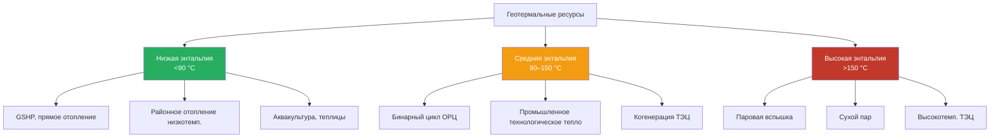

Геотермальные ресурсы — тепловая энергия, хранящаяся в земной коре. Их классификация по температуре, энтальпии и геологическим характеристикам определяет применимые технологии извлечения и экономическую целесообразность. По данным IRENA (2023), суммарный установленный потенциал геотермальной энергии превышает 170 ГВт_т тепла прямого использования и 15,9 ГВт_э электрогенерации. Для инженера ОВИК (HVAC) понимание типов ресурсов — основа выбора между грунтовым тепловым насосом, прямым теплоснабжением и покупкой геотермальной электроэнергии.

## Геотермальный градиент температуры

Нормальный континентальный градиент составляет 25–30 °C/км. Линейное приближение температуры по глубине:


T(z) = T_s + \Gamma \cdot z


Где $T(z)$ — температура на глубине $z$ (°C), $T_s$ — температура поверхности (°C), $\Gamma$ — геотермальный градиент (°C/км), $z$ — глубина (км).

В аномальных регионах (вулканические дуги, рифты) $\Gamma$ достигает 40–80 °C/км. Тепловой поток из недр:


q = -k \cdot \frac{dT}{dz}


Где $q$ — тепловой поток (Вт/м²), $k$ — теплопроводность породы (Вт/(м·К)). Средний глобальный тепловой поток — 65–80 мВт/м²; в вулканических провинциях — 200–500 мВт/м² (IPCC AR6, 2022).

## Классификация по энтальпии

## Ресурсы низкой энтальпии (<90 °C)

Наиболее распространённая категория, доступная на глубинах 50–400 м в большинстве континентальных регионов. Ключевые применения:

- грунтовые тепловые насосы (GSHP)
- прямое теплоснабжение зданий и теплиц
- системы таяния снега и антиоблединения
- аквакультура
- низкотемпературные сети районного теплоснабжения (Δ$T$ = 30–70 °C)

Идеальный COP при использовании ресурса низкой энтальпии:


\text{COP}_{\text{heat}} = \frac{T_{\text{подача}}}{T_{\text{подача}} - T_{\text{источник}}}


Температуры — в кельвинах. При $T_{\text{источн}} = 10$ °C (283 К) и $T_{\text{подача}} = 40$ °C (313 К):


\text{COP}_{\text{Carnot}} = \frac{313}{313 - 283} = 10{,}4


Реальный COP GSHP составляет 3,5–5,0 (34–48 % от теоретического) с учётом потерь компрессора, теплообменников и трубопроводов. Эти значения нормируются по ASHRAE 90.1-2022 и EN 14825.

## Ресурсы средней энтальпии (90–150 °C)

Встречаются на глубинах 400–2 000 м в регионах с выше среднего геотермальными градиентами. КПД бинарного цикла ОРЦ:


\eta_{\text{ORC}} = \eta_{\text{Carnot}} \cdot \eta_{\text{cycle}} = \frac{T_H - T_C}{T_H} \cdot \eta_{\text{cycle}}


Где $\eta_{\text{cycle}} = 0{,}45{-}0{,}60$ учитывает необратимости реального цикла. При $T_H = 130$ °C (403 К), $T_C = 30$ °C (303 К): $\eta_{\text{Carnot}} = 24{,}8\,\%$, $\eta_{\text{ORC}} \approx 11{-}15\,\%$.

## Ресурсы высокой энтальпии (>150 °C)

Концентрируются вдоль границ тектонических плит и вулканических дуг. Характеристики:
- температуры резервуара: 150–350 °C (до 400 °C вблизи магматических интрузий)
- глубины залегания: 1 000–3 000 м
- поддерживают паровую вспышку и сухой пар с КПД 15–20 %

## Сводная таблица классификации


| Тип ресурса | Диапазон температур | Глубина залегания | Основные применения |
|---|---|---|---|
| Низкая энтальпия | <90 °C | 50–400 м | GSHP, прямое отопление, районная сеть |
| Средняя энтальпия | 90–150 °C | 400–2 000 м | Бинарный ОРЦ, ТЭЦ, промтепло |
| Высокая энтальпия | 150–240 °C | 1 000–3 000 м | Паровая вспышка, промышленные процессы |
| Очень высокая энтальпия | >240 °C | 2 000–4 000 м | Сухой пар, сверхкритические системы |


## Геологические типы ресурсов

### Гидротермальные конвективные ресурсы

Содержат природную горячую воду или пар в проницаемых горных формациях. Ключевые параметры:
- проницаемость резервуара: >10⁻¹⁴ м² (>10 мД)
- самоподдерживающийся конвективный теплообмен
- восполнение за счёт метеорной инфильтрации

Это наиболее экономически освоенный тип; глобальная добыча — Исландия, США, Филиппины, Кения, Индонезия, Япония.

### Геопрессированные ресурсы

Находятся в глубоких осадочных бассейнах под аномально высоким давлением (>гидростатического). Характеристики:
- глубины: 3 000–6 000 м
- давление: 70–140 МПа
- температуры: 90–200 °C
- содержание растворённого метана: 0,5–1,5 м³/м³ рассола

Извлечение энергии включает три компоненты: тепловую (горячий рассол), механическую (высокое давление) и химическую (природный газ).

### Горячие сухие породы — EGS

HDR/EGS-технологии нацелены на горячие кристаллические породы фундамента с низкой проницаемостью. Скорость теплоотдачи:


\dot{Q} = \dot{m} \cdot c_p \cdot (T_{\text{доб}} - T_{\text{нагн}})


Где $\dot{m}$ — массовый расход жидкости (кг/с), $c_p = 4{,}18$ кДж/(кг·К), $T_{\text{доб}}$ и $T_{\text{нагн}}$ — температуры добычи и нагнетания (°C).

### Числовой пример — GSHP в Москве

**Условия:** офисное здание площадью 1 200 м², тепловая нагрузка 72 кВт; $T_g = 6$ °C, вертикальные скважины 100 м, суглинок ($k = 1{,}5$ Вт/(м·К)), теплоноситель: 25 % пропиленгликоль, COP = 4,2.

**Потребление электроэнергии тепловым насосом:**


W_{\text{TH}} = \frac{Q_{\text{отопл}}}{\text{COP}} = \frac{72}{4{,}2} = 17{,}1\,\text{кВт}


**Сравнение с газовым котлом** при цене газа 6 200 руб./тыс. м³, теплота сгорания 9,5 кВт·ч/м³, КПД 92 %:

Удельная стоимость тепла от газового котла: 6 200 / (9,5 × 0,92 × 1 000) ≈ **0,71 руб./кВт·ч**

При тарифе на электроэнергию 7,5 руб./кВт·ч (тариф для юридических лиц Москвы, 2025 г.):

Удельная стоимость тепла от GSHP: 7,5 / 4,2 ≈ **1,79 руб./кВт·ч**

При тарифе ночной зоны 3,8 руб./кВт·ч или субсидированном тарифе для теплоснабжения: 3,8 / 4,2 ≈ **0,90 руб./кВт·ч** — уже близко к газовому котлу. Срок окупаемости допнвестиций в контур — 7–12 лет.

### Магматические ресурсы

Магматические тела (600–1 200 °C) — предельный геотермальный ресурс. Сверхкритические системы работают при $T > 374$ °C и $P > 22{,}1$ МПа; плотность энергии в 5–10 раз выше обычных ресурсов. В настоящее время находятся на экспериментальной стадии (проекты IDDP-1 в Исландии, DEEPEGS в ЕС).

## Оценка ресурсной базы

По данным USGS и Геологической службы России (ФГБУ «ВСЕГЕИ»):
- выявленные гидротермальные ресурсы Дальнего Востока России: >2 000 МВт потенциальной мощности (Камчатка, Курилы, Сахалин)
- ресурсы EGS России при глубинах до 6 км: не оценены систематически, но сопоставимы с европейскими (>100 ГВт по аналогии)

**Приоритеты развития:**
1. Низкотемпературное прямое использование для теплоснабжения зданий (краткосрочная перспектива)
2. Бинарный цикл ОРЦ для умеренно-температурных ресурсов (актуальный этап)
3. EGS для широкого развёртывания (долгосрочная перспектива — 2035–2045 гг.)
4. Сверхкритические системы для сверхвысокой плотности энергии (исследовательская фаза)

Выбор типа геотермального ресурса для HVAC-проекта определяется местоположением объекта, требуемой температурой теплоносителя, масштабом нагрузки и экономическими ограничениями. Расчёт по EN 16247 (энергетический аудит) и ФЗ-261 обязателен при проектировании систем с геотермальными источниками в России.

## Разделы

- [Гидротермальные ресурсы](hydrothermal-resources)
- [Улучшенные геотермальные системы EGS](enhanced-geothermal-systems)
- [Грунтовые тепловые насосы](ground-source-heat-pumps)
- [Прямое использование геотермальной энергии](direct-use-applications)
