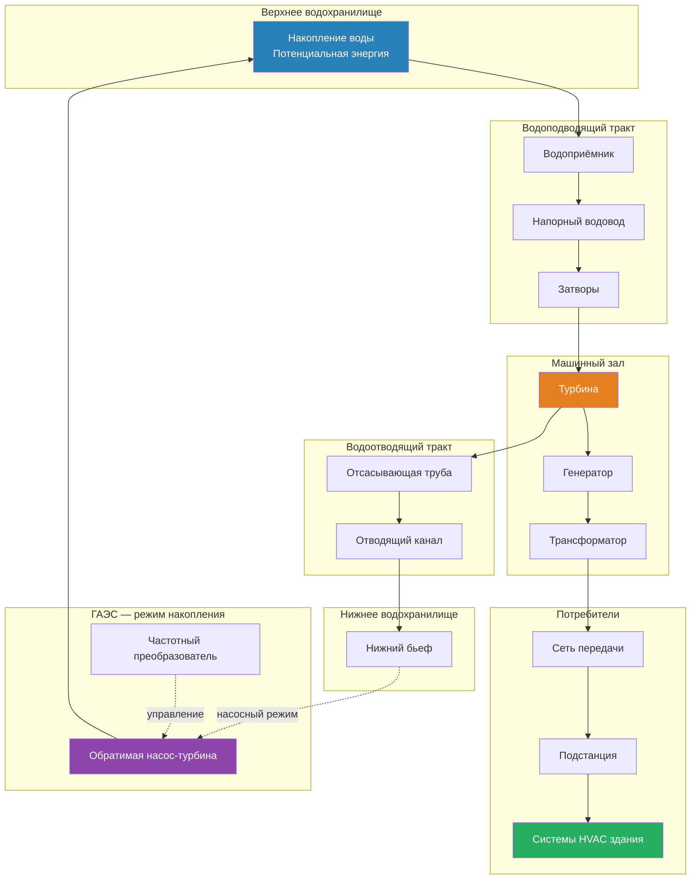

Гидроэлектроэнергия — один из наиболее зрелых и надёжных источников возобновляемой энергии. По данным IEA (World Energy Statistics, 2023), мировая установленная мощность гидроэлектростанций превысила 1 400 ГВт, обеспечивая около 16 % мирового электропотребления. В России гидроэнергетика даёт около 19 % выработки электроэнергии (Россети/СО ЕЭС, 2023), что делает её важнейшим «зелёным» ресурсом для питания крупных систем HVAC.

Хотя ГЭС не интегрируются непосредственно в отдельные здания, как солнечные ФЭ-системы, они обеспечивают стабильную, диспетчеризуемую возобновляемую электроэнергию в сеть — основной ресурс питания коммерческих чиллеров, тепловых насосов и систем кондиционирования.

## Принципы производства гидроэлектроэнергии

Гидроэлектроэнергия преобразует потенциальную энергию воды в электрическую через турбо-генераторный агрегат. Базовая формула мощности:


P = \eta \cdot \rho \cdot g \cdot Q \cdot H


Где:
- $P$ — электрическая мощность на зажимах генератора, Вт
- $\eta$ — общий КПД системы (турбина × генератор × трансформатор), обычно 0,85–0,90
- $\rho$ — плотность воды, 1 000 кг/м³
- $g$ — ускорение свободного падения, 9,81 м/с²
- $Q$ — объёмный расход, м³/с
- $H$ — чистый расчётный напор (hydraulic head), м

Гидравлическая мощность до потерь в агрегате:


P_{\text{гидр}} = \rho \cdot g \cdot Q \cdot H


Чистый напор с учётом потерь в водоводе и отсасывающей трубе:


H_{\text{чист}} = H_{\text{брутто}} - h_f - h_t


Где $h_f$ — потери на трение в напорном водоводе, $h_t$ — потери на турбулентность.

### Числовой пример — расчёт мощности ГЭС

**Дано:** брутто-напор 85 м, расход $Q = 120$ м³/с, $h_f + h_t = 4$ м, $\eta = 0{,}88$.


P = 0{,}88 \times 1\,000 \times 9{,}81 \times 120 \times (85 - 4) = 0{,}88 \times 1\,000 \times 9{,}81 \times 120 \times 81



P \approx 83{,}8\,\text{МВт}


Годовая выработка при коэффициенте использования (КИУМ) 55 %:


E_{\text{год}} = 83{,}8 \times 8\,760 \times 0{,}55 \approx 404\,\text{ГВт·ч/год}


## Типы гидроэнергетических объектов

### Традиционные ГЭС

**Водохранилищные ГЭС** — создают крупные резервуары водохранилищ за плотинами. Обеспечивают диспетчеризуемое производство электроэнергии. КИУМ: 40–60 %. Возможность сезонного накопления.

**Русловые ГЭС** — минимальное аккумулирование; выработка следует естественному стоку. КИУМ: 30–50 %. Меньшее экологическое воздействие.

**Деривационные ГЭС** — отводят часть стока через турбины с сохранением экологического расхода в исходном русле. Характерны для горных районов с высоким напором и малым расходом.

### Гидроаккумулирующие электростанции (ГАЭС)

ГАЭС (pumped storage hydropower, PSH) выполняют двойную функцию: генерации и аккумулирования энергии в масштабе сети.

**Принцип работы:**
- в часы низкого спроса: насосный режим — вода перекачивается из нижнего водохранилища в верхнее, потребляя электроэнергию
- в часы пикового спроса: генераторный режим — вода сбрасывается из верхнего водохранилища через турбины

КПД полного цикла (round-trip efficiency): 70–85 %; современные агрегаты с регулируемой частотой вращения — 80–82 %.

**Запасённая энергия:**


E_{\text{акк}} = \eta_{\text{RT}} \cdot \rho \cdot g \cdot V \cdot H


Где $\eta_{\text{RT}}$ — КПД полного цикла, $V$ — объём водохранилища (м³), $H$ — разность уровней (м).

**Роль в сети:**
- выравнивание нагрузки базовых АЭС и ГЭС
- интеграция нестабильных ВИЭ (накопление излишков ветра и солнца)
- регулирование частоты (время выхода на полную мощность — 1–3 мин)
- возможность «чёрного запуска» после системных аварий

## Принципиальная схема ГЭС и ГАЭС

## Ресурсная база и генерация России

По данным СО ЕЭС (2023), установленная мощность ГЭС России составляет около 51 ГВт, выработка — около 200 ТВт·ч/год. Ведущие объекты: Саяно-Шушенская ГЭС (6 400 МВт), Красноярская ГЭС (6 000 МВт), Братская ГЭС (4 516 МВт).


| Регион | Мощность ГВт | Доля | Основной ресурс |
|---|---|---|---|
| Сибирь | ~23 | 45 % | Ангаро-Енисейский каскад |
| Поволжье | ~11 | 22 % | Волжско-Камский каскад |
| Северо-Запад | ~5 | 10 % | Бассейны Невы, Вуоксы |
| Дальний Восток | ~5 | 10 % | Амур, Колыма, Зея |
| Прочие | ~7 | 13 % | Распределённые объекты |


## Применение в энергоснабжении зданий

### Прямое питание от сети

В регионах с высокой долей гидроэнергии (Сибирь, Северо-Запад) потребители HVAC де-факто используют низкоуглеродный источник. Удельные выбросы CO₂-экв. гидроэлектроэнергии по жизненному циклу — 4–24 г/кВт·ч (IPCC AR6, медиана 13 г/кВт·ч) — на порядок ниже угольной генерации.

Крупные владельцы коммерческой недвижимости могут закреплять долю ГЭС через:
- прямые договоры купли-продажи электроэнергии (PPA) с ГЭС
- сертификаты происхождения электроэнергии (ГО/РЭС) по ГОСТ Р 71231-2024

### Координация ГАЭС с тепловым аккумулированием в зданиях

- ГАЭС создают тарифные «окна» с низкой ценой (часы перекачки) → зарядка системы теплового аккумулирования (ледяные аккумуляторы, PCM-панели)
- Снижение пика нагрузки HVAC в часы дорогой электроэнергии
- Участие в программах управления спросом (DSM) на оптовом рынке

## Технические характеристики турбин


| Диапазон напора | Тип турбины | КПД пиковый | Область применения |
|---|---|---|---|
| 2–40 м | Каплан/Пропеллер | 90–94 % | Низконапорные речные ГЭС |
| 10–350 м | Фрэнсис | 90–95 % | Средне- и высоконапорные ГЭС |
| 50–2 000+ м | Пелтон | 88–92 % | Деривационные ГЭС, ГАЭС |
| 2–30 м | Винт Архимеда | 80–90 % | Малые ГЭС, рыбопропуск |


## Коэффициент использования установленной мощности (КИУМ)


\text{КИУМ} = \frac{E_{\text{факт}}}{P_{\text{уст}} \times 8\,760}


Типичные значения:
- традиционные водохранилищные ГЭС: 40–60 %
- русловые ГЭС: 30–50 %
- ГАЭС (нетто): 15–30 %

КИУМ ГЭС России в 2022 г. — около 45 % (СО ЕЭС). Сезонная гидрологическая изменчивость — основной фактор отклонения от номинала.

## LCOE гидроэнергии и инвестиционные ориентиры


\text{LCOE} = \frac{\text{CapEx} + \sum_{t=1}^{n} \frac{\text{OpEx}_t}{(1+r)^t}}{\sum_{t=1}^{n} \frac{E_t}{(1+r)^t}}


По IRENA (2023), медианный LCOE крупных гидроэлектростанций — 48 USD/МВт·ч (диапазон 26–137 USD/МВт·ч). CapEx в России: 1 500–3 000 USD/кВт для новых крупных объектов; для ГАЭС — 800–1 500 USD/кВт (без учёта стоимости земли и разрешений).

Согласно Taxonomy of Sustainable Finance ЕС (2021) и российской таксономии зелёного финансирования (ВЭБ.РФ, 2022), крупные ГЭС квалифицируются как «зелёные» при удельных выбросах жизненного цикла <100 г CO₂-экв./кВт·ч; большинство гидроэлектростанций соответствует этому критерию.

## Перспективы развития

- **Модернизация существующего парка** — цифровые регуляторы турбин, антиизносные покрытия, рыбозащитные конструкции
- **Расширение ГАЭС** — замкнутые (внерусловые) системы, подземные ГАЭС в отработанных шахтах
- **Малые ГЭС** — модульное оборудование для отдалённых посёлков и промышленных объектов; в России потенциал малой гидроэнергетики оценивается в 357 ТВт·ч/год (ФГБУ «РусГидро», 2022)
- **ГЭС на бесплотинных плотинах** — использование кинетической энергии потока (РЭС, hydrokinetic)

Гидроэнергия обеспечивает критически важную инфраструктуру возобновляемого электроснабжения, поддерживающую электрификацию систем HVAC и переход к низкоуглеродной энергетике. Понимание принципов гидрогенерации, региональной ресурсной базы и возможностей интеграции с сетью позволяет проектировщикам HVAC создавать системы, рационально использующие этот диспетчеризуемый возобновляемый ресурс.
