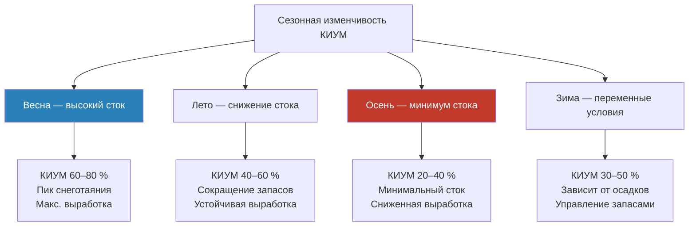

Коэффициент использования установленной мощности (КИУМ, capacity factor — CF) гидроэлектростанции — отношение фактически выработанной электроэнергии за период к максимально возможной выработке при работе на номинальной мощности в течение всего того же периода. Этот параметр является ключевым для оценки производительности объекта, расчёта LCOE и планирования энергосистемы.

Для систем HVAC, питающихся от сетей с высокой долей гидроэнергии (Сибирь, Поволжье, Северо-Запад России), понимание КИУМ и его сезонной изменчивости необходимо при анализе надёжности электроснабжения и расчёте углеродного следа.

## Расчёт КИУМ

Базовая формула:


\text{КИУМ} = \frac{E_{\text{факт}}}{P_{\text{уст}} \times t} \times 100\,\%


Где $E_{\text{факт}}$ — фактически выработанная энергия (кВт·ч), $P_{\text{уст}}$ — номинальная установленная мощность (кВт), $t$ — период (часы).

Для годовой оценки с почасовым разрешением:


\text{КИУМ}_{\text{год}} = \frac{\sum_{i=1}^{8\,760} P_i}{P_{\text{уст}} \times 8\,760} \times 100\,\%


Где $P_i$ — мощность в $i$-й час года.

### Числовой пример — проверка КИУМ Красноярской ГЭС

По данным СО ЕЭС (2022): $P_{\text{уст}} = 6\,000$ МВт, $E_{\text{год}} \approx 20\,520$ ГВт·ч.


\text{КИУМ} = \frac{20\,520 \times 10^3}{6\,000 \times 8\,760} \approx 39{,}0\,\%


Значение типично для крупных российских ГЭС с многолетним регулированием. Ограничение — обязательный экологический сброс и навигационные расходы.

## КИУМ по типам гидроэнергетических объектов


| Тип объекта | Типичный КИУМ | Диапазон | Основные ограничивающие факторы |
|---|---|---|---|
| Русловая (бесплотинная) | 35–45 % | 30–50 % | Сезонные колебания стока |
| Водохранилищная | 50–60 % | 40–70 % | Управление водохранилищем, приток |
| ГАЭС | 15–30 % | 10–40 % | Пиковый режим, цикличность |
| Крупная многоцелевая | 55–65 % | 45–75 % | Многоцелевые ограничения |
| Малая ГЭС (<10 МВт) | 30–40 % | 25–55 % | Ограниченное регулирование |
| Пиковая ГЭС | 25–35 % | 20–45 % | Спрос по графику нагрузки |


Среднее КИУМ российских ГЭС по итогам 2022 г. — около 38–42 % (СО ЕЭС). Существенный региональный разброс: сибирские каскады — до 50–55 %, южные ГЭС — 35–45 %.

## Русловые ГЭС — зависимость от гидрографа

Русловые (run-of-river, ROR) станции генерируют электроэнергию, используя мгновенный речной сток без накопления. КИУМ непосредственно определяется гидрологией:


\text{КИУМ}_{\text{ROR}} = \frac{\int_0^T Q(t) \cdot H \cdot \eta \, dt}{P_{\text{уст}} \times T}


**Характеристики:**
- суточные колебания КИУМ незначительны
- сезонный пик — в период весеннего паводка или осенних дождей
- базовый режим с переменной мощностью
- расчётный расход обычно выбирается на уровне $Q_{30}$–$Q_{50}$ (30–50 % обеспеченности)

В регионах с устойчивыми круглогодичными осадками ROR-ГЭС достигают КИУМ 45–50 %; в бассейнах со снегово-ледниковым питанием — 30–35 % с чётко выраженным весенним максимумом.

## Водохранилищные ГЭС — влияние аккумулирования

Водохранилищные ГЭС регулируют выработку за счёт хранения воды, достигая более высокого КИУМ через временное перераспределение нагрузки:


\text{КИУМ}_{\text{рез}} = f(V_{\text{акк}},\, Q_{\text{приток}},\, H_{\text{перем}},\, \eta,\, \text{ограничения})


**Полезный объём водохранилища:**


V_{\text{пол}} = V_{\text{полн}} - V_{\text{мёртв}} - V_{\text{противоп}}


Где $V_{\text{мёртв}}$ — минимальный объём для нормальной работы водозаборника, $V_{\text{противоп}}$ — противопаводковая ёмкость.

**Типы регулирования и КИУМ:**
1. **Многолетнее** — сглаживает многолетние гидрологические циклы: КИУМ 55–65 %
2. **Сезонное (годовое)** — накопление летом, выработка зимой: КИУМ 45–55 %
3. **Недельно-суточное** — ограниченное регулирование: КИУМ 40–50 %
4. **Обязательные сбросы** — паводковые и экологические расходы снижают КИУМ в периоды высокого притока

## Сезонные закономерности КИУМ


| Регион | Пиковый сезон | КИУМ пик | Минимальный сезон | КИУМ мин. | Среднегодовой |
|---|---|---|---|---|---|
| Сибирь (Ангара–Енисей) | апр–июн | 65–85 % | авг–окт | 25–40 % | 50–55 % |
| Северо-Запад (Нева, Вуокса) | мар–май | 55–70 % | июл–сен | 30–45 % | 45–50 % |
| Поволжье (Волга–Кама) | апр–май | 60–75 % | янв–фев | 30–40 % | 42–50 % |
| Дальний Восток (Амур, Зея) | авг–сен | 60–80 % | фев–апр | 15–30 % | 38–45 % |


## Влияние засух и климатических изменений

Продолжительные засухи нелинейно снижают КИУМ:


\text{КИУМ}_{\text{засуха}} = \text{КИУМ}_{\text{норм}} \times \left(\frac{Q_{\text{засуха}}}{Q_{\text{норм}}}\right)^{1{,}2 \div 1{,}5}


Показатель степени >1,0 объясняется нелинейностью: при падении расхода ниже минимально рабочего КИУМ снижается резко (работа вне диапазона регулирования турбины).

Документированные примеры:
- Засуха в бассейне Зеи (2021–2022): выработка Зейской ГЭС снизилась на 28–35 %
- Маловодный цикл Ангарского каскада (2014–2016): КИУМ снизился с 52 % до 36 %

По IPCC AR6 (WG2, 2022), изменение климата к 2050 г. уменьшит речной сток в ряде регионов России на 10–25 %, что снизит КИУМ ГЭС на 5–15 процентных пунктов при отсутствии мер адаптации.

## ГАЭС — особенности расчёта КИУМ

КПД полного цикла:


\eta_{\text{RT}} = \eta_{\text{ген}} \times \eta_{\text{нас}}


Типичные значения: 70–85 %; современные агрегаты с регулируемой частотой — 80–82 %.

**КИУМ ГАЭС:**


\text{КИУМ}_{\text{ГАЭС}} = \frac{E_{\text{выраб}} - E_{\text{накач}}}{P_{\text{уст}} \times 8\,760}


КИУМ ГАЭС 15–30 % отражает пиковый характер работы и не является показателем «эффективности» в том же смысле, что для базовых ГЭС — ГАЭС обеспечивают системную ценность через управление нагрузкой и частотное регулирование.

## Стратегии оптимизации КИУМ

1. **Прогностическое управление притоком** — оптимизация распределения воды на основе гидрологических прогнозов на 7–30 суток
2. **Координация каскадов** — согласованная работа нескольких ГЭС на речной системе повышает системный КИУМ на 3–8 %
3. **Технология переменной скорости** — расширение диапазона высококпд работы турбины при переменных расходах
4. **Управление заносением** — сохранение полезного объёма водохранилища предотвращает долгосрочное снижение КИУМ
5. **Интеллектуальные системы управления** — оптимизация в реальном времени с учётом ценовых сигналов рынка электроэнергии

Современные АСУ ТП ГЭС с прогностическим управлением обеспечивают повышение КИУМ на 5–10 процентных пунктов по сравнению с расписанием фиксированных режимов.

## Нормализованный КИУМ — сравнительная оценка

Для корректного межгодового сравнения производительности необходима нормализация по гидрологическим условиям:


\text{КИУМ}_{\text{норм}} = \text{КИУМ}_{\text{факт}} \times \frac{Q_{\text{многол}}}{Q_{\text{текущ}}}


Хорошо управляемые станции поддерживают нормализованный КИУМ в пределах ±3 % на протяжении нескольких лет. Отклонение >5 % указывает на необходимость технического обслуживания или операционных улучшений.

## Экономические последствия КИУМ для LCOE

КИУМ напрямую влияет на LCOE:


\text{LCOE} = \frac{\text{CapEx} + \sum_{t=1}^{n} \frac{\text{OpEx}_t}{(1+r)^t}}{\sum_{t=1}^{n} \frac{E_t}{(1+r)^t}}


При прочих равных условиях повышение КИУМ на 10 процентных пунктов снижает LCOE на 8–12 %. Это подчёркивает экономическую ценность аккумулирующих возможностей и оперативной гибкости.

**Практический вывод для HVAC-проектировщика:** при оценке углеродного следа и надёжности электроснабжения от сети с высокой долей гидроэнергии следует учитывать сезонную изменчивость КИУМ. В период летнего минимума стока (25–40 %) резервная мощность может привлекаться из тепловой генерации, что временно повышает углеродоёмкость кВт·ч в регионе. Системы теплового аккумулирования и управления нагрузкой в зданиях позволяют сместить потребление на периоды высокого гидрологического КИУМ.
