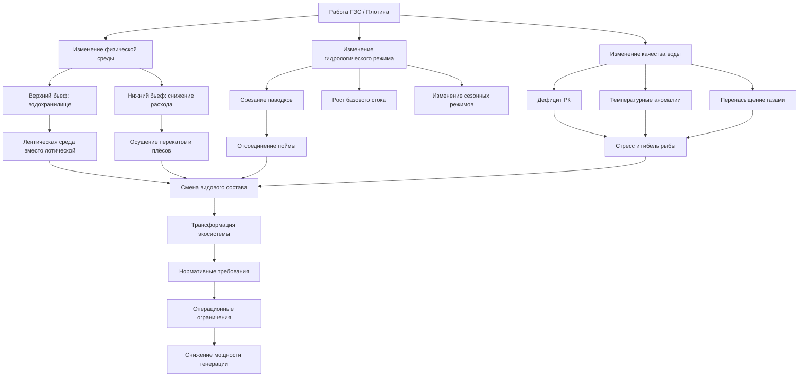

Гидроэлектроэнергия является возобновляемым и низкоуглеродным источником энергии, однако создаёт значительные экологические воздействия, требующие надлежащего проектирования, эксплуатации и нормативного соответствия. Для инженеров HVAC, оценивающих гидроэлектрические ресурсы как источник питания объектов, понимание этих ограничений критически важно для оценки реализуемости проекта и его долгосрочной устойчивости. Игнорирование экологических требований на стадии разработки ведёт к многолетним задержкам согласований и существенному росту LCOE.

## Рыбопропускные сооружения

Плотины и деривационные сооружения блокируют пути миграции анадромных рыб (лосось, горбуша, нерка) и жилых популяций, нарушая воспроизводство и динамику популяций. Рыбопропуск — одно из наиболее затратных природоохранных требований к гидроэнергетическим объектам.

### Рыбоходы (верховая миграция)

**Рыбные лестницы (pool-and-weir)** — ступенчатые бассейны с низкой скоростью потока и диссипацией энергии на каждом уровне. Критерии проектирования:
- размер бассейна: 1,8–3,0 м × 1,8–3,0 м, перепад высот между бассейнами 0,3 м
- скорость в проёме: не более 1,2–2,4 м/с
- привлекающий расход у плотины: 5–10 % общего сброса

**Рыбные лифты (fish lifts)** — механические подъёмники, улавливающие рыбу в сборной камере и транспортирующие выше плотины. Эффективность: 40–95 % в зависимости от вида.

**Шлюзы для рыбы (fish locks)** — камерные системы, аналогичные судоходным шлюзам, для напоров >15 м.

### Пропуск молоди (вниз по течению)

Смертность покатников (smolts) при прохождении через турбины:


| Тип турбины | Смертность | Основные причины |
|---|---|---|
| Фрэнсис | 10–30 % | Удар лопастью, перепады давления, сдвиговые нагрузки |
| Каплан | 5–15 % | Меньший удар благодаря меньшему числу крупных лопастей |
| Кроссток | 0–5 % | Мягкий проход, низкий перепад давления |
| Винт Архимеда | 0–2 % | Минимальный контакт, естественный путь потока |


Меры защиты молоди: решётки с пролётом 1,9–2,5 см, поведенческие барьеры (свет, звук), поверхностные байпасные коллекторы.

## Требования по минимальному экологическому стоку

Минимальный экологический сток (МЭС, minimum instream flow — MIF) поддерживает водные местообитания и экологические функции в обходных участках рек. В России требования к санитарному попуску устанавливаются в условиях водопользования и правилах эксплуатации водохранилищ (РД 33-3.2-07-2001).

### Методы определения МЭС

**Метод Tennant (штатный)** — выделяет долю среднегодового расхода (СГР) по качеству местообитания:
- 10 % СГР: плохое местообитание (краткосрочное выживание)
- 30 % СГР: удовлетворительное и хорошее
- 60–100 % СГР: отличное

**Метод смачиваемого периметра** — определяет критические расходы, при которых площадь местообитания резко сокращается. Анализирует точки перегиба кривых смачиваемого периметра от расхода.

**Методология пошагового расхода (IFIM)** — количественно определяет взвешенную пригодную площадь местообитания (WUA) в диапазоне расходов по критериям глубины, скорости, субстрата и укрытий для конкретных видов.

### Сезонная дифференциация МЭС

- **Весна:** повышенные расходы для поддержки нерестовой миграции и промывочных паводков
- **Лето:** базовые расходы для поддержания температуры и содержания растворённого кислорода
- **Осень:** нерестовые расходы для видов осеннего хода
- **Зима:** расходы инкубации для защиты нерестовых гнёзд (редды)

## Воздействие на качество воды

### Истощение растворённого кислорода

Сброс воды из гиполимниона (придонный слой) стратифицированных водохранилищ нередко содержит пониженное содержание растворённого кислорода (РК) вследствие разложения органики. Норматив: РК ≥ 5–6 мг/л для рыбохозяйственных водоёмов первой категории (СанПиН 1.2.3685-21, ГН 2.1.5.1315-03).


| Технология | Повышение РК | Энергетические потери | Капвложения |
|---|---|---|---|
| Аэрация турбины (вентиляция) | 1–3 мг/л | 0–2 % | Низкие |
| Поверхностный водозабор | 2–5 мг/л | 0 % | Средние |
| Турбины с авто-аэрацией | 2–4 мг/л | 0–1 % | Средние |
| Механические аэраторы | 4–8 мг/л | 2–5 % | Высокие |


### Перенасыщение растворёнными газами (TDG)

Перелив воды через водосброс захватывает воздух, создавая перенасыщение >110 % нормы насыщения — это вызывает газопузырьковую болезнь у рыб. Меры снижения: откидные носки (flip buckets), дефлекторы потока, предпочтительный пропуск через турбины.

### Тепловая стратификация

Водохранилища расслаиваются: поверхностный (эпилимнион) нагревается, глубинный (гиполимнион) остаётся холодным. Глубина водозаборного сооружения определяет температурный режим ниже плотины:
- **Гиполимнионный сброс:** холодная вода — благоприятна для холодноводных видов, но подавляет речную продуктивность
- **Эпилимнионный сброс:** тёплая вода — поддерживает тепловодное рыболовство

Многоярусные водоприёмники позволяют выборочный отбор воды для достижения целевых температур ниже плотины.

## Воздействие на транспорт наносов

Плотины задерживают взвешенные наносы, изменяя морфологию русла и состав местообитаний ниже по течению. Ежегодная аккумуляция наносов снижает полезный объём водохранилища на 0,5–2 % в год (в зависимости от бассейна).

**Последствия:**
- врезание русла и береговая эрозия ниже плотины
- огрубление поверхности дна (образование бронирующего слоя)
- потеря нерестового гравия
- заиливание водохранилища с уменьшением мощности генерации

**Управление:**
- сплавные (flushing) паводки в период высокой транспортирующей способности
- механическая расчистка и перемещение наносов ниже плотины
- шлюзовые затворы для пропуска наносов
- ловушки наносов в верхнем бьефе

## Принципиальная схема экологических воздействий

## Нормативно-правовая база России

В России экологические требования к ГЭС регулируются:
- **Водный кодекс РФ (ФЗ-74, 2006)** — права водопользования, нормативы санитарных попусков
- **ФЗ-7 «Об охране окружающей среды» (2002)** — экологическая экспертиза проекта
- **ФЗ-52 «О животном мире» (1995)** — требования рыбохозяйственной экспертизы
- **ФЗ-33 «Об особо охраняемых природных территориях» (1995)** — ограничения в зонах ООПТ
- **ГОСТ Р 59070-2020** — экологические требования к гидроэлектростанциям

Для международных инвесторов: по критериям Taxonomy of Sustainable Finance ЕС (2021), гидроэлектростанции квалифицируются как «зелёные» только при наличии системы рыбопропуска, управления МЭС и мониторинга качества воды.

## Затраты на природоохранные мероприятия


| Мероприятие | Капитальные затраты | Влияние на мощность |
|---|---|---|
| Рыбопропускные сооружения | 200–1 500 млн руб. | 0–3 % потеря выработки |
| Многоярусный водоприёмник | 100–600 млн руб. | 0 % |
| Системы аэрации | 50–500 млн руб. | 2–5 % потребление |
| Экологические попуски | 0 доп. капвложений | 10–40 % снижение выработки в маловодные периоды |
| Мониторинг биоты и воды | 5–20 млн руб./год | — |
| ОВОС / экологическая экспертиза | 30–200 млн руб. | — |


Экологические требования должны быть интегрированы в ТЭО и финансовую модель с самого начала. Обязательные попуски на МЭС нередко снижают выработку на 10–40 % в маловодные периоды — это критически влияет на LCOE и IRR проекта.

## Изменение местообитаний

Гидростроительство трансформирует речные экосистемы из лотических (текущих) в лентические (стоячие) выше плотины:

**До строительства:** реофильные макробеспозвоночные (веснянки, поденки, ручейники), рыбы-реофилы (форель, хариус, таймень).

**После строительства:** зоопланктонные сообщества, тепловодные рыбы (окунь, щука, лещ), нежелательные вселенцы (карась, ротан).

Ниже плотины — стабилизация расходов исключает формирующие паводки, которые поддерживают сложность русла и пойменную растительность. Восстановление прибрежных ивово-тополевых сообществ требует периодического затопления уреза воды, часто исключаемого регулированием стока.

Рекреационные конфликты (белая вода, рыболовство, судоходство) также регулируются условиями водопользования и могут ограничивать оперативную гибкость диспетчеризации ГЭС.

Все эти экологические и нормативные факторы должны быть учтены при принятии инвестиционных решений о строительстве или модернизации ГЭС в качестве источника питания промышленных и коммерческих HVAC-систем.
