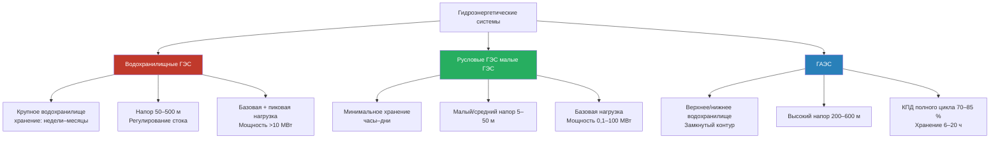

Системы гидроэнергетики преобразуют потенциальную и кинетическую энергию воды в электрическую мощность. Классификация определяется гидравлическим напором, характеристиками расхода, наличием аккумулирования и режимом работы. Каждый тип обеспечивает особые функции сети: от базовой генерации и управления пиковым спросом до долгосрочного накопления энергии для интеграции нестабильных ВИЭ.

По данным IEA (2023), мировая установленная мощность ГЭС всех типов превышает 1 400 ГВт, из них ГАЭС — около 180 ГВт (около 95 % всей установленной мощности хранения энергии в мире).

## Фундаментальные уравнения мощности

Теоретическая мощность при падении воды:


P = \rho \cdot g \cdot Q \cdot H \cdot \eta


Где:
- $P$ — мощность на выходе, Вт
- $\rho$ — плотность воды, 1 000 кг/м³
- $g$ — ускорение свободного падения, 9,81 м/с²
- $Q$ — расход воды, м³/с
- $H$ — чистый напор, м
- $\eta$ — общий КПД, 0,70–0,90

Упрощённая рабочая формула:


P_{\text{кВт}} = 9{,}81 \cdot Q \cdot H \cdot \eta


Чистый напор с учётом потерь:


H_{\text{чист}} = H_{\text{брутто}} - h_{\text{трение}} - h_{\text{вход}} - h_{\text{реш}} - h_{\text{выход}}


Потери напора обычно составляют 5–15 % от брутто-напора. Потери на трение в напорном водоводе по Дарси–Вейсбаху:


h_{\text{трение}} = f \cdot \frac{L}{D} \cdot \frac{v^2}{2g}


## Классификация типов гидроэнергетических систем

## Водохранилищные ГЭС

Установки с водохранилищами используют плотины для создания крупных резервуаров, обеспечивающих аккумулирование и развитие напора.

**Запасённая энергия водохранилища:**


E_{\text{вдхр}} = \rho \cdot g \cdot V_{\text{пол}} \cdot H_{\text{ср}} \cdot \eta


Где $V_{\text{пол}}$ — полезный объём водохранилища (м³), $H_{\text{ср}}$ — средний рабочий напор (м).

### Числовой пример — Саяно-Шушенская ГЭС

$P_{\text{уст}} = 6\,400$ МВт, напор брутто ≈ 220 м, расчётный расход через турбины при полной нагрузке:


Q = \frac{P}{\rho \cdot g \cdot H \cdot \eta} = \frac{6\,400 \times 10^6}{1\,000 \times 9{,}81 \times 210 \times 0{,}90} \approx 3\,436\,\text{м}^3/\text{с}


При КИУМ 42 % годовая выработка: $6\,400 \times 8\,760 \times 0{,}42 \approx 23{,}5$ ТВт·ч/год.

### Характеристики работы

Водохранилищные ГЭС обеспечивают многосуточное и сезонное регулирование. Напор 50–700 м позволяет высокую плотность мощности. Возможна работа в диапазоне 30–100 % нагрузки при высоком КПД.

## Русловые и малые ГЭС

Русловые (run-of-river, ROR) установки генерируют электроэнергию из естественного стока с минимальным аккумулированием. Небольшое водоприёмное сооружение отводит воду через турбины с сохранением экологического расхода в основном русле.

**Переменная мощность по гидрографу:**


P(t) = \rho \cdot g \cdot Q(t) \cdot H \cdot \eta


Где $Q(t)$ — мгновенный расход в русле. Сезонные колебания непосредственно влияют на выработку.

**Более высокая экологическая совместимость** — отсутствие крупного водохранилища устраняет нарушение местообитаний, сохраняет транспорт наносов и режим температуры.

Выбор типа турбины по условиям:
- низкий напор + высокий расход → **Каплан** (КПД 90–94 %)
- средний напор → **Фрэнсис** (КПД 90–95 %)
- высокий напор + малый расход → **Пелтон** (КПД 88–92 %)
- очень малые объекты, рыбоходы → **Винт Архимеда** (КПД 80–90 %)

## ГАЭС — гидроаккумулирующие электростанции

ГАЭС обеспечивают аккумулирование энергии в масштабе сети путём циклирования воды между верхним и нижним водохранилищами.

**В часы профицита электроэнергии (ночью, в солнечный/ветреный день):** насосный режим — вода перекачивается наверх, потребляя дешёвую/избыточную электроэнергию.

**В часы дефицита (пиковая нагрузка):** генераторный режим — вода через турбины генерирует дорогую электроэнергию.

**Ёмкость хранения:**


E_{\text{ГАЭС}} = \rho \cdot g \cdot \Delta V \cdot H \cdot \eta_{\text{турб}}


Где $\Delta V$ — диапазон полезного объёма водохранилища (м³).

**КПД полного цикла:**


\eta_{\text{RT}} = \eta_{\text{турб}} \cdot \eta_{\text{нас}} \cdot \eta_{\text{гидр}}


Типичные значения 70–85 %; агрегаты с регулируемой частотой вращения — 80–82 % (IEA, 2022).

**Режимы работы ГАЭС:**
- **Генераторный** — вода от верхнего к нижнему водохранилищу через турбины
- **Насосный** — закачка воды наверх с использованием мощности сети
- **Синхронный конденсатор** — вращение без потока воды для поддержания стабильности напряжения

Агрегаты с переменной частотой вращения обеспечивают непрерывное регулирование мощности как в насосном, так и в генераторном режиме.

## Сравнительная таблица типов


| Параметр | Водохранилищная ГЭС | Русловая ГЭС | ГАЭС |
|---|---|---|---|
| Длительность хранения | Недели–месяцы | Часы–дни | 6–20 часов |
| Типичный напор | 50–500 м | 5–50 м | 200–600 м |
| Диапазон мощности | 10–22 500 МВт | 0,1–100 МВт | 100–3 000 МВт |
| Регулирование стока | Высокое | Минимальное | Н/П (замкнутый) |
| Режим работы | Базовая + пиковая | Базовая | Пиковая + хранение |
| Экол. воздействие | Высокое | Низкое | Среднее |
| CapEx | 2 000–5 000 USD/кВт | 1 500–4 000 USD/кВт | 800–1 500 USD/кВт |
| Время строительства | 5–10 лет | 2–5 лет | 6–12 лет |
| КПД | 85–90 % | 80–90 % | 70–85 % (RT) |


## Классификация по мощности


| Класс | Диапазон мощности | Типичное применение | Диапазон напора |
|---|---|---|---|
| Микро-ГЭС | <100 кВт | Удалённые объекты, фермы, резервное питание | 5–100 м |
| Мини-ГЭС | 100 кВт – 1 МВт | Посёлки, промышленные объекты | 10–150 м |
| Малая ГЭС | 1–10 МВт | Региональное распределение | 15–200 м |
| Средняя ГЭС | 10–100 МВт | Базовая нагрузка сети | 30–300 м |
| Крупная ГЭС | >100 МВт | Базовая нагрузка и регулирование | 50–500 м |


## Критерии выбора технологии

**Напорные условия площадки** определяют тип турбины и плотность мощности. Высоконапорные площадки обеспечивают компактные установки с меньшими требованиями по расходу.

**Гидрологические характеристики** влияют на требования к аккумулированию. Устойчивые круглогодичные потоки подходят для ROR-конфигурации; резко сезонные — требуют водохранилища.

**Системные требования сети** определяют нужный режим гибкости. Сети с дефицитом мощности в пиковые часы выигрывают от водохранилищных ГЭС или ГАЭС.

**Экологические ограничения** влияют на реализуемость. Площадки с жёсткими природоохранными требованиями тяготеют к ROR-конфигурации; районы с существующей инфраструктурой или нарушенными землями — к ГАЭС.

## Интеграция ГАЭС с нестабильными ВИЭ

ГАЭС обеспечивают критические системные услуги:

- **Перенос энергии во времени** — накопление излишков солнечной/ветровой генерации в часы пика выработки; сброс в часы дефицита
- **Частотное регулирование** — агрегаты переменной скорости обеспечивают первичное регулирование за секунды
- **Поддержка напряжения** — режим синхронного конденсатора без потока воды
- **Чёрный запуск** — восстановление сети после системных аварий без внешнего питания

Совокупность функций делает ГАЭС наиболее зрелой технологией крупномасштабного хранения энергии. Глобальная установленная мощность ГАЭС — свыше 180 ГВт (IEA, 2023). В России единственная действующая ГАЭС — Загорская (1 200 МВт в Московской области); Ленинградская ГАЭС (1 560 МВт) находится в стадии строительства.

## Оптимизация производительности

КПД гидроустановки максимален при номинальных напоре и расходе. Отклонения от расчётного режима снижают КПД через гидравлические потери и работу за пределами оптимального числа оборотов.

Агрегаты с регулируемой частотой вращения (variable-speed) расширяют диапазон высококпд работы, особенно для ГАЭС в насосном режиме. Сезонное изменение уровня водохранилища меняет напор — при низком уровне доступная мощность снижается, что необходимо учитывать в управлении режимами.

Гидроэнергетика в сочетании с интеллектуальным управлением и ГАЭС остаётся ключевым элементом балансирования энергосистем с высокой долей возобновляемых источников, обеспечивая надёжную и экономичную базу для электрификации нагрузок HVAC.
