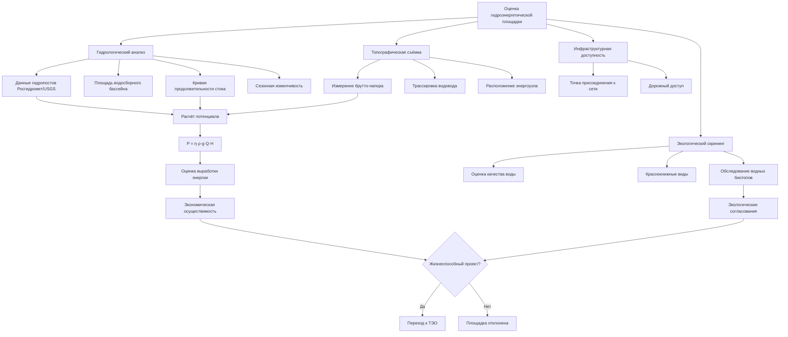

Оценка гидроэнергетических ресурсов (hydropower resource assessment) количественно определяет технический и экономический потенциал водного ресурса для производства электроэнергии. Методология интегрирует гидрологические данные, топографический анализ и энергетические расчёты для установления технической осуществимости площадки. Для инженеров HVAC этот анализ актуален при рассмотрении малых ГЭС как источника питания автономных промышленных комплексов, а также при оценке устойчивости сетевого электроснабжения от региональных ГЭС.

## Фундаментальное уравнение мощности

Теоретическая гидроэнергетическая мощность на площадке:


P = \eta \cdot \rho \cdot g \cdot Q \cdot H


Где:
- $P$ — выходная мощность, Вт
- $\eta$ — общий КПД, 0,60–0,85 (типичный)
- $\rho$ — плотность воды, 1 000 кг/м³
- $g$ — ускорение свободного падения, 9,81 м/с²
- $Q$ — расход, м³/с
- $H$ — чистый напор, м

## Методология оценки стока

### Источники данных о стоке

В России сеть гидрологических постов Росгидромета насчитывает более 3 700 стационарных пунктов. Банк данных доступен через ФГБУ «Гидрометцентр России» и региональные УГМС. Аналогичную функцию в США выполняет USGS (10 000+ постов). Минимальные требования к данным:

- не менее 10 лет ежедневных измерений расхода
- данные пиковых расходов для расчёта защитных сооружений
- статистика меженного стока для оценки минимальной мощности
- среднемесячные расходы для анализа сезонной изменчивости

### Кривая продолжительности стока

Кривая продолжительности стока (КПС, flow duration curve — FDC) показывает, какой процент времени расход равен или превышает заданное значение. Вероятность превышения:


P_{\text{превышения}} = \frac{m}{n+1} \times 100\,\%


Где $m$ — ранг значения расхода (1 = наибольший), $n$ — общее число наблюдений.


| Процент превышения | Обозначение | Применение |
|---|---|---|
| Q10 | Высокий расход | Проектирование водосброса, максимальная генерация |
| Q30 | Верхний проектный расход | Планирование пиковой мощности |
| Q50 | Медианный расход | Оценка среднего выхода |
| Q90 | Низкий расход | Минимальная надёжная мощность |
| Q95 | Очень низкий расход | Экологический сброс |


### Расчёт годового производства энергии

Годовое производство электроэнергии интегрируется по кривой продолжительности стока:


E_{\text{год}} = \int_0^{8\,760} P(t)\, dt


Для дискретных интервалов:


E_{\text{год}} = \sum_{i=1}^{n} P_i \cdot \Delta t_i


Где $P_i$ — мощность в интервале расхода $i$, $\Delta t_i$ — продолжительность (ч).

## Определение напора

### Брутто-напор

Вертикальная разность отметок верхнего и нижнего бьефов:


H_{\text{бр}} = Z_{\text{ВБ}} - Z_{\text{НБ}}


Методы измерения по точности:
- нивелирование: ±0,01 м (проектирование)
- дифференциальный GNSS: ±0,05 м (рекогносцировка)
- топографические карты М 1:10 000: ±0,5–2 м (предварительная оценка)
- барометрическое нивелирование: ±2–5 м (первичный отбор)

### Чистый напор


H_{\text{чист}} = H_{\text{бр}} - h_{\text{тр}} - h_{\text{вход}} - h_{\text{реш}} - h_{\text{выход}}


Потери на трение в напорном водоводе (формула Дарси–Вейсбаха):


h_{\text{тр}} = f \cdot \frac{L}{D} \cdot \frac{v^2}{2g}


Где $f$ — коэффициент сопротивления Дарси (0,015–0,025 для стальной трубы), $L$ — длина водовода (м), $D$ — диаметр (м), $v$ — скорость потока (м/с).

## Принципиальная схема оценки площадки

## Числовой пример — оценка потенциала малой ГЭС

**Дано:** горная река в Карелии; данные гидропоста — медианный расход $Q_{50} = 4{,}8$ м³/с, $Q_{90} = 1{,}2$ м³/с; брутто-напор 42 м, длина водовода 350 м, диаметр 1,2 м; $\eta = 0{,}82$.

**Потери на трение** при $Q_{50} = 4{,}8$ м³/с:

$$v = \frac{Q}{\pi D^2/4} = \frac{4{,}8}{1{,}13} = 4{,}25\,\text{м/с}, \quad f = 0{,}018$$


h_{\text{тр}} = 0{,}018 \times \frac{350}{1{,}2} \times \frac{4{,}25^2}{2 \times 9{,}81} = 0{,}018 \times 291{,}7 \times 0{,}920 \approx 4{,}8\,\text{м}


**Чистый напор:** $H_{\text{чист}} = 42 - 4{,}8 - 1{,}2 = 36{,}0$ м.

**Мощность при медианном расходе:**


P_{Q50} = 0{,}82 \times 1\,000 \times 9{,}81 \times 4{,}8 \times 36{,}0 \approx 1\,389\,\text{кВт} \approx 1{,}39\,\text{МВт}


**При $Q_{90} = 1{,}2$ м³/с** (минимальная гарантированная мощность):


P_{Q90} \approx 0{,}82 \times 1\,000 \times 9{,}81 \times 1{,}2 \times 38{,}5 \approx 373\,\text{кВт}


(При $Q_{90}$ потери в водоводе минимальны, чистый напор ≈ 38,5 м.)

**Годовая выработка** (упрощённо, с допущением 50 % времени на $Q_{50}$, 20 % — на $Q_{90}$, 30 % — на промежуточных расходах):

$$E_{\text{год}} \approx 1\,390 \times 0{,}50 \times 8\,760 + 373 \times 0{,}20 \times 8\,760 + 900 \times 0{,}30 \times 8\,760 \approx 8\,800\,\text{ГВт·ч}$$

Нет, пересчитаем корректно: $E \approx (1\,390 \times 0{,}50 + 373 \times 0{,}20 + 900 \times 0{,}30) \times 8\,760 = (695 + 74{,}6 + 270) \times 8\,760 \approx 9\,059\,\text{МВт·ч} \approx 9{,}1\,\text{ГВт·ч/год}$.

КИУМ: $9\,059 / (1\,390 \times 8\,760) \approx 74\,\%$ — высокое значение типично для горных рек с устойчивым стоком.

## Характеристики водосборного бассейна

Площадь бассейна коррелирует с расходом для неизмеренных площадок:


Q_{\text{ср}} = C \times A \times P_{\text{ос}}


Где $Q_{\text{ср}}$ — средний годовой расход (м³/с), $C$ — коэффициент поверхностного стока (0,2–0,5), $A$ — площадь бассейна (км²), $P_{\text{ос}}$ — среднегодовые осадки (м/год).

## Методы измерения расхода

### Прямые методы

**Скоростной зонд с вертушкой** — интеграция скорости по живому сечению:


Q = \sum_{i=1}^{n} v_i \cdot A_i


**Водослив с тонкой стенкой** (прямоугольный):


Q = \frac{2}{3} C_d \cdot b \cdot \sqrt{2g} \cdot h^{3/2}


Где $C_d = 0{,}60{-}0{,}62$, $b$ — ширина водослива (м), $h$ — напор над гребнем (м).

**Разбавляющий метод (salt-dilution)** — добавление раствора с известной концентрацией; пересчёт по разбавлению. Эффективен на горных реках с турбулентным течением.

### Косвенные методы

Для неизмеренных площадок — региональные регрессионные уравнения, связывающие статистику стока с характеристиками бассейна:


Q_{50} = a \times A^b \times S^c \times P_{\text{ос}}^d


Где $A$ — площадь водосборного бассейна, $S$ — уклон канала, $P_{\text{ос}}$ — среднегодовые осадки, $a, b, c, d$ — региональные коэффициенты регрессии. В России такие уравнения публикуются в региональных справочниках по гидрологии (ВНИИ ВОДГЕО, СП 33-101-2003).

## Классификация ресурсного потенциала площадки


| Класс | Напор, м | Расход, м³/с | Мощность, кВт | Применение в HVAC |
|---|---|---|---|---|
| Микро | 2–20 | 0,01–0,10 | 0,2–20 | Резервное питание малого объекта |
| Мини | 10–50 | 0,10–1,0 | 10–200 | Автономное здание или посёлок |
| Малая | 20–100 | 1,0–10 | 200–2 000 | Промышленная площадка |
| Средняя | 30–150 | 10–50 | 2 000–15 000 | Промышленный HVAC-комплекс |


## Содержание отчёта об оценке ресурса

Комплексная оценка включает:
1. **Гидрологическое резюме** — статистика стока, КПС, сезонные закономерности
2. **Анализ напора** — брутто-напор, потери, чистый напор
3. **Расчёты мощности** — выбор типа турбины, кривые КПД, годовая энергия
4. **Планировка площадки** — водоприёмник, трасса водовода, машинный зал
5. **Экологический базис** — биотопы, качество воды, МЭС
6. **Экономический анализ** — CapEx, OpEx, LCOE, NPV, IRR при ставке дисконтирования по методологии ФЗ-261 и РД ЕЭС


\text{NPV} = -\text{CapEx} + \sum_{t=1}^{n} \frac{R_t - \text{OpEx}_t}{(1+r)^t}


Где $R_t$ — выручка от продажи электроэнергии в год $t$.

Для малых ГЭС мощностью менее 25 МВт в России действует механизм ДПМ ВИЭ (договор о предоставлении мощности), обеспечивающий гарантированную выручку на 15 лет. Это кардинально улучшает финансовую модель при CapEx 2 000–4 000 руб./кВт·ч установленной мощности.

Тщательная оценка гидроэнергетических ресурсов — обязательный первый шаг при рассмотрении малых ГЭС как источника питания изолированных промышленных объектов или включении гидроэнергии в стратегию декарбонизации корпоративного энергопотребления (в соответствии с EN 16247-1 «Энергетические аудиты» и ФЗ-261).
