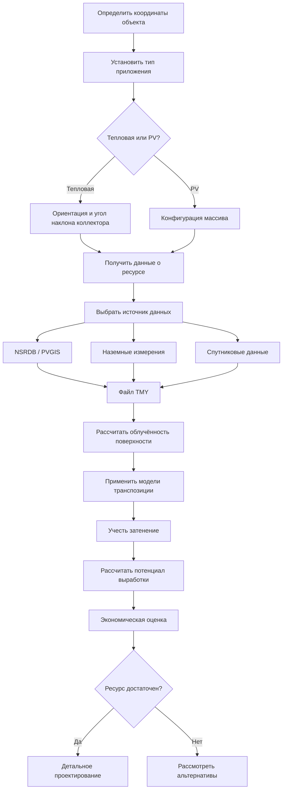

Оценка солнечного ресурса количественно определяет доступную солнечную энергию в конкретной точке для обоснования выбора, расчёта размеров и прогноза производительности солнечных тепловых и фотоэлектрических (PV) систем, интегрированных в инженерные комплексы зданий. Согласно требованиям ASHRAE 90.1-2022 и СП 60.13330.2020, корректная оценка ресурса является обязательным этапом проектирования систем с долей возобновляемых источников.

## Компоненты солнечного излучения

Солнечное излучение, достигающее поверхности, характеризуется тремя независимо измеряемыми компонентами, необходимыми для полноценной оценки ресурса.

**Прямая нормальная облучённость** (DNI, Direct Normal Irradiance) — излучение, поступающее непосредственно от солнечного диска на поверхность, перпендикулярную солнечным лучам. DNI определяет эффективность концентрирующих коллекторов и следящих PV-систем. При ясном небе на уровне моря DNI достигает 900–1000 Вт/м²; при сплошной облачности — обращается в нуль.

**Рассеянная горизонтальная облучённость** (DHI, Diffuse Horizontal Irradiance) — излучение, рассеянное атмосферой и достигающее горизонтальной поверхности со всей небосводной полусферы, исключая прямой пучок. При ясном небе DHI составляет 10–20 % от глобального значения; при сплошной облачности становится единственным источником.

**Глобальная горизонтальная облучённость** (GHI, Global Horizontal Irradiance) объединяет прямой и рассеянный компоненты:


GHI = DNI \cdot \cos\theta_z + DHI


где $\theta_z$ — зенитный угол солнца (угол между направлением на солнце и вертикалью).

Для наклонной поверхности суммарная облучённость включает дополнительно отражённую составляющую:


I_T = DNI \cdot \cos\theta + DHI \cdot \frac{1 + \cos\beta}{2} + GHI \cdot \rho \cdot \frac{1 - \cos\beta}{2}


где:
- $\theta$ — угол падения на наклонную поверхность;
- $\beta$ — угол наклона поверхности от горизонтали;
- $\rho$ — альбедо подстилающей поверхности (0,2 для большинства поверхностей; 0,6–0,8 для свежего снега).

## Расчёт потенциала солнечной энергии

Суточная выработка энергии от коллектора площадью $A_c$ с системным КПД $\eta_s$:


E_{day} = A_c \cdot \eta_s \cdot \sum_{i=1}^{n} I_{T,i} \cdot \Delta t


где $I_{T,i}$ — суммарная облучённость в $i$-м временном интервале (Вт/м²), $\Delta t$ — длительность интервала (ч).

**Часы пиковой инсоляции** (PSH, Peak Sun Hours) — эквивалентное число часов при 1000 Вт/м², обеспечивающих ту же суточную энергию:


PSH = \frac{E_{day,GHI}}{1000 \ \text{Вт/м}^2}


### Пример расчёта

Определить годовую выработку солнечной тепловой системы для здания в Краснодаре.

**Исходные данные:**
- Площадь коллекторов: $A_c = 30$ м²
- Годовая GHI для Краснодара: $H_{year} = 1650$ кВт·ч/(м²·год) (по данным PVGIS и ФЗ-261)
- Средний КПД тепловой системы: $\eta_s = 0{,}52$

**Расчёт:**


E_{year} = 30 \times 0{,}52 \times 1650 = 25\,740 \ \text{кВт·ч/год}


При тарифе 6 руб./кВт·ч годовая экономия составляет около 154 440 руб. Срок окупаемости при стоимости системы 1 350 000 руб. — примерно 8,8 года, что укладывается в нормативный срок по ФЗ-261.

## Процесс оценки ресурса

## Региональные солнечные ресурсы России


| Регион | Город-пример | GHI, кВт·ч/(м²·год) | PSH, ч/день | Климатическая зона |
|--------|-------------|---------------------|-------------|-------------------|
| Юг европейской части | Краснодар | 1600–1700 | 4,4–4,7 | II Б |
| Центральный регион | Москва | 1100–1200 | 3,0–3,3 | II В |
| Поволжье | Саратов | 1250–1350 | 3,4–3,7 | II Б |
| Урал | Екатеринбург | 1100–1200 | 3,0–3,3 | I Г |
| Западная Сибирь | Новосибирск | 1150–1250 | 3,2–3,4 | I В |
| Восточная Сибирь | Иркутск | 1300–1450 | 3,6–4,0 | I В |
| Дальний Восток | Владивосток | 1250–1350 | 3,4–3,7 | II А |
| Северо-Запад | Санкт-Петербург | 950–1050 | 2,6–2,9 | II Г |


## Источники данных и инструменты

**NSRDB (National Solar Radiation Database, NREL)** — наиболее полная база данных по США и смежным территориям. Пространственное разрешение 4 км, временно́й шаг 30 мин, период с 1998 г. по настоящее время.

**PVGIS (Photovoltaic Geographical Information System, JRC)** — европейский инструмент Еврокомиссии, охватывающий Россию и страны СНГ. Поддерживает расчёт выработки для фиксированных и следящих систем с учётом данных ERA5.

**Типичный метеорологический год (TMY, Typical Meteorological Year)** — синтетический годовой ряд данных, формируемый из многолетних наблюдений по методу Финкельштейна-Шафера. Файлы TMY3 NREL и EPW-файлы EnergyPlus используются в инструментах динамического моделирования (EnergyPlus, TRNSYS, IDA ICE).

**Наземные измерения** с откалиброванными пиранометрами класса 1 по ISO 9060 (для GHI) и пиргелиометрами (для DNI) обеспечивают наивысшую точность. Минимальный период — 12 месяцев для выявления сезонных закономерностей; 24–36 месяцев — для снижения межгодовой неопределённости до ±5–8 %.

## Специфика применений HVAC

**Солнечное горячее водоснабжение** требует оценки облучённости при оптимальном угле наклона. Для круглогодичных систем оптимальный угол ≈ широте места; для зимнего приоритета — широта + 15°; для летнего — широта − 15°.

**Солнечно-ассистированное отопление** оценивается прежде всего по зимней доступности ресурса. Сниженные углы высоты солнца и укороченный световой день делают декабрьско-февральские значения GHI решающими при определении солнечной доли.

**Солнечное охлаждение** (абсорбционные чиллеры) характеризуется благоприятным совпадением пиковых нагрузок охлаждения с максимальной инсоляцией. Для концентрирующих коллекторов определяющим является летний DNI; для плоских коллекторов — летний GHI.

**BIPV** (Building-Integrated Photovoltaics, фотоэлектрика, интегрированная в ограждающие конструкции) для покрытия электрических нагрузок HVAC требует анализа облучённости на всех доступных поверхностях (фасады, кровли, козырьки) с детальным учётом затенения.

## Неопределённость и вариабельность

Оценка солнечного ресурса содержит систематические и случайные составляющие неопределённости:

- Спутниковые данные: погрешность 5–15 % по годовым суммам, выше для DNI;
- Межгодовая вариабельность: ±5–10 % от многолетнего среднего;
- Детальный анализ затенения городскими объектами обязателен для PV-систем из-за нелинейного характера потерь при частичном затенении (эффект несовпадения, mismatch).

Комбинация верифицированных источников данных, апробированных моделей транспозиции (Перез, Хей-Дэвис) и явного учёта неопределённости обеспечивает надёжность инженерных расчётов в соответствии с требованиями EN 15316 и СП 60.13330.
