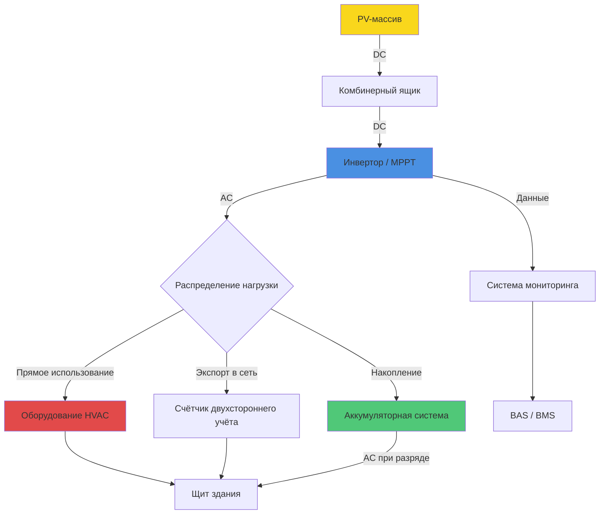

Фотоэлектрические (PV) системы преобразуют солнечное излучение непосредственно в электрическую энергию посредством полупроводникового фотоэффекта. Интеграция PV с системами HVAC (Heating, Ventilation, Air Conditioning — отопление, вентиляция, кондиционирование) позволяет снизить потребление электроэнергии из сети, управлять пиковой нагрузкой и обеспечить частичную энергетическую независимость здания согласно требованиям ФЗ-261 «Об энергосбережении» и ASHRAE 90.1-2022.

## Технологии PV-модулей


| Технология | КПД, % | Темп. коэффициент, %/°C | Относит. стоимость | Оптимальное применение |
|-----------|--------|------------------------|--------------------|------------------------|
| Монокристаллический Si | 20–24 | −0,35…−0,45 | Высокая | Ограниченная площадь крыши |
| Поликристаллический Si | 16–20 | −0,40…−0,50 | Средняя | Стандартные установки |
| Тонкоплёночный CdTe/CIGS | 11–16 | −0,20…−0,30 | Низкая | Большие площади, рассеянный свет |
| Бифациальный монокристалл | 21–25 эфф. | −0,35…−0,45 | Высокая | Плоские кровли, высокое альбедо |


Монокристаллический кремний доминирует в коммерческих применениях HVAC благодаря высокому КПД. Бифациальные модули, устанавливаемые на плоских кровлях с белыми мембранами (альбедо 0,6–0,8), обеспечивают дополнительную выработку с тыльной стороны 5–30 % в зависимости от конфигурации монтажа.

## Методология расчёта мощности PV-системы

Мощность постоянного тока от PV-массива в точке максимальной мощности (MPP, Maximum Power Point):


P_{DC} = G_T \cdot A \cdot \eta_{mod} \cdot PR


где:
- $G_T$ — суммарная облучённость в плоскости массива (Вт/м²);
- $A$ — полная площадь массива (м²);
- $\eta_{mod}$ — КПД модуля при рабочих условиях;
- $PR$ — коэффициент производительности, учитывающий системные потери.

КПД модуля зависит от температуры ячейки:


\eta_{mod} = \eta_{STC} \left[1 + \gamma(T_{cell} - 25)\right]


где $\eta_{STC}$ — КПД при стандартных условиях испытаний (STC: 1000 Вт/м², 25 °C, спектр AM 1,5); $\gamma$ — температурный коэффициент мощности (обычно −0,0035…−0,0050 °C⁻¹).

Температура ячейки оценивается по условиям NOCT (Nominal Operating Cell Temperature):


T_{cell} = T_{amb} + \frac{G_T}{800} \cdot (NOCT - 20)


где $NOCT$ — номинальная рабочая температура ячейки (обычно 42–46 °C), $T_{amb}$ — температура окружающего воздуха (°C).

Коэффициент производительности системы:


PR = (1 - L_{soil})(1 - L_{shade})(1 - L_{mm})(1 - L_{wire})(1 - L_{inv})


Типичные диапазоны потерь: загрязнение $L_{soil}$ 1–3 %, затенение $L_{shade}$ 0–5 %, несоответствие $L_{mm}$ 1–2 %, проводка $L_{wire}$ 1–2 %, инвертор $L_{inv}$ 2–4 %. Хорошо спроектированная система достигает $PR = 0{,}78{-}0{,}85$.

Годовая выработка электроэнергии:


E_{year} = \sum_{t=1}^{8760} P_{AC}(t) \cdot \Delta t


где $P_{AC}(t)$ — мощность на выходе инвертора в момент $t$.

### Пример расчёта

Рассчитать годовую выработку PV-системы для торгового центра в Москве.

**Исходные данные:**
- Площадь массива: $A = 500$ м² (монокристаллические модули, $\eta_{STC} = 0{,}21$)
- Среднегодовая облучённость в плоскости 30° южной ориентации: $G_{T,year} = 1250$ кВт·ч/(м²·год)
- Коэффициент производительности: $PR = 0{,}80$

**Расчёт:**


E_{year} = 1250 \times 500 \times 0{,}21 \times 0{,}80 = 105\,000 \ \text{кВт·ч/год}


При удельном электропотреблении системы HVAC 80 кВт·ч/м² в год для торгового объекта площадью 3000 м² ($E_{HVAC} = 240\,000$ кВт·ч/год) PV-система покрывает около **44 %** нагрузки HVAC.

## Архитектура PV-системы

## Встроенные в здание PV-системы (BIPV)

BIPV (Building-Integrated Photovoltaics) выполняют двойную функцию: служат элементами ограждающей конструкции и одновременно генерируют электроэнергию. Типичные применения:

- Фасадные панели вместо традиционного остекления или навесных панелей;
- Кровельные ламинаты вместо гидроизоляционной мембраны;
- Козырьки и солнцезащитные устройства над фасадными проёмами;
- Полупрозрачные PV-элементы в фонарях и зенитных фонарях.

Ограниченный воздухообмен за интегрированными модулями повышает рабочую температуру ячеек на 10–20 °C по сравнению со стандартным монтажом, снижая КПД. Вентилируемые конструкции BIPV с воздушным зазором 50–100 мм частично нейтрализуют этот эффект и позволяют рекуперировать отводимое тепло для отопления в зимний период.

## Стратегии интеграции PV-HVAC

**Прямая связь по постоянному току.** Системы VRF (Variable Refrigerant Flow) с инверторными компрессорами и насосы с частотными преобразователями могут работать непосредственно от PV-шины DC, исключая потери инвертора (2–4 %). Требуется специализированный MPPT-контроллер согласования нагрузки.

**Буферизация аккумулятором.** Литий-ионные накопители (LFP-химия для промышленного применения) отделяют генерацию PV от мгновенных пиков нагрузки HVAC, обеспечивают снижение пика (peak shaving) и автономию при отключении сети. Удельная стоимость хранения: 150–250 USD/кВт·ч (2024 г., IEA World Energy Outlook 2023).

**Двунаправленный учёт (net metering).** Избыток генерации в периоды низкой нагрузки (весна, осень) экспортируется в сеть в счёт потреблённой летом электроэнергии на охлаждение. Согласно Постановлению Правительства РФ № 299 (2021 г.), микрогенерация мощностью до 15 кВт допускает продажу в сеть по розничным тарифам.

## Аналитические инструменты

**PVWatts Calculator (NREL)** — веб-инструмент с почасовым моделированием на основе данных TMY3/NSRDB. Подходит для предварительного анализа за 5–10 мин.

**System Advisor Model (SAM, NREL)** — детальное часовое моделирование: продвинутые модели потерь, финансовый анализ (NPV, IRR, LCOE), чувствительность к изменению тарифов. Необходим для обоснования проектного финансирования.

**PVGIS (JRC, Еврокомиссия)** — охватывает Россию и страны СНГ, поддерживает данные ERA5 и SARAH-2.

## Мониторинг производительности

Непрерывный мониторинг PV-системы обеспечивает соответствие проектным показателям и раннее выявление деградации. Ключевые KPI:

- **Удельная выработка** (кВт·ч/кВт_пик/год) — нормирует выработку к установленной мощности;
- **Коэффициент производительности PR** — сравнивает фактическую и расчётную выработку при STC;
- **Коэффициент использования установленной мощности CF** — отношение фактической к максимально возможной выработке;
- **Скорость деградации** — обычно 0,5–0,7 %/год по данным NREL (Jordan et al., 2022).

Интеграция мониторинга PV с системой автоматизации здания (BAS/BMS) позволяет координировать режимы работы HVAC с прогнозом солнечной генерации, оптимизируя суммарный энергобаланс.
