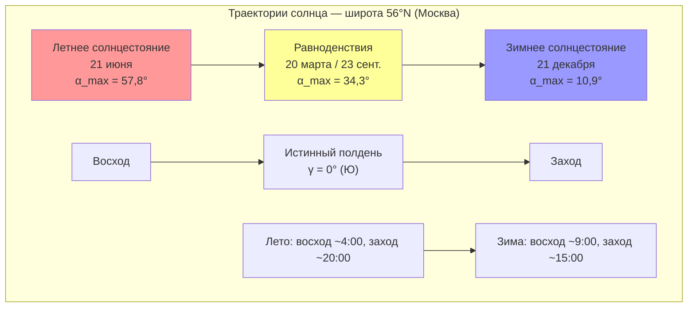

Солнечная геометрия устанавливает математические соотношения между положением солнца и конкретной точкой на Земле в любой момент времени. Эти расчёты фундаментальны для точного определения солнечного теплопоступления через ограждающие конструкции по СП 50.13330.2017, расчёта нагрузок охлаждения по ASHRAE Fundamentals, а также проектирования коллекторов и PV-систем.

## Угол склонения солнца

Угол склонения (declinaton angle) $\delta$ — угловое положение солнца в истинный полдень относительно экваториальной плоскости. Он изменяется в течение года вследствие наклона оси вращения Земли (23,45°) к плоскости орбиты.

Приближение ASHRAE:


\delta = 23{,}45° \cdot \sin\!\left[\frac{360(284 + n)}{365}\right]


где $n$ — порядковый номер дня года (1–365).


| Дата | $n$ | $\delta$, ° | Событие |
|------|-----|-------------|---------|
| 21 июня | 172 | +23,45 | Летнее солнцестояние |
| 23 сентября | 266 | 0 | Осеннее равноденствие |
| 21 декабря | 355 | −23,45 | Зимнее солнцестояние |
| 20 марта | 79 | 0 | Весеннее равноденствие |


## Часовой угол

Часовой угол (hour angle) $H$ измеряет угловое смещение солнца от местного меридиана вследствие суточного вращения Земли:


H = 15° \cdot (t_{sol} - 12)


где $t_{sol}$ — истинное солнечное время в часах. До полудня $H < 0$ (утро), после полудня $H > 0$ (вечер). Множитель 15°/ч соответствует угловой скорости вращения Земли (360° за 24 ч).

## Угол высоты солнца

Угол высоты (solar altitude angle) $\alpha$ — вертикальный угол между направлением на солнце и горизонтальной плоскостью:


\sin\alpha = \sin L \cdot \sin\delta + \cos L \cdot \cos\delta \cdot \cos H


где $L$ — географическая широта (положительная к северу).

Максимальная высота в истинный полдень ($H = 0$):


\alpha_{max} = 90° - L + \delta


Зенитный угол (zenith angle): $\theta_z = 90° - \alpha$.

{{< table title="Высота солнца в полдень в летнее солнцестояние ($\delta = 23{,}45°$)" >}}
| Широта | Город | $\alpha_{max}$, ° | $\theta_z$, ° |
|--------|-------|-------------------|---------------|
| 43,9° | Краснодар | 69,6 | 20,4 |
| 55,7° | Москва | 57,8 | 32,2 |
| 56,8° | Екатеринбург | 56,7 | 33,3 |
| 59,9° | Санкт-Петербург | 53,6 | 36,4 |
| 51,2° | Саратов | 62,3 | 27,7 |
| 66,5° | Полярный круг | 46,9 | 43,1 |


## Азимут солнца

Угол азимута (solar azimuth) $\gamma$ — горизонтальный угол между направлением на юг и проекцией направления на солнце. По соглашению ASHRAE: юг = 0°, запад — положительные значения.


\cos\gamma = \frac{\sin\alpha \cdot \sin L - \sin\delta}{\cos\alpha \cdot \cos L}


Альтернативная форма через часовой угол:


\sin\gamma = \frac{\cos\delta \cdot \sin H}{\cos\alpha}


### Дневной ход положения солнца


| Солнечное время | $H$, ° | $\alpha$, ° | $\gamma$, ° | Направление |
|----------------|--------|-------------|-------------|-------------|
| 05:00 | −105 | 2,1 | −120 | ВСВ |
| 07:00 | −75 | 18,5 | −95 | В |
| 09:00 | −45 | 35,4 | −65 | ВЮВ |
| 12:00 | 0 | 57,8 | 0 | Ю |
| 15:00 | +45 | 35,4 | +65 | ЗЮЗ |
| 17:00 | +75 | 18,5 | +95 | З |
| 19:00 | +105 | 2,1 | +120 | ЗСЗ |


## Диаграмма пути солнца

## Коррекция уравнением времени

Истинное солнечное время отличается от стандартного поясного из-за эллиптичности орбиты и наклона оси Земли. Уравнение времени (ET, Equation of Time) вводит поправку:


t_{sol} = t_{zone} + \frac{ET}{60} + \frac{4(L_{zone} - L_{local})}{60}


ET варьирует от −14 до +16 мин в течение года; нулевые значения — около 15 апреля, 14 июня, 1 сентября и 25 декабря.

## Угол падения на наклонную поверхность

Для поверхности с углом наклона $\beta$ и азимутом $\psi$ (от юга):


\cos\theta = \sin L \cdot \sin\delta \cdot \cos\beta
           - \cos L \cdot \sin\delta \cdot \sin\beta \cdot \cos\psi
           + \cos L \cdot \cos\delta \cdot \cos H \cdot \cos\beta
           + \sin L \cdot \cos\delta \cdot \cos H \cdot \sin\beta \cdot \cos\psi
           + \cos\delta \cdot \sin H \cdot \sin\beta \cdot \sin\psi


### Пример расчёта

Определить угол падения солнечных лучей на южный наклонный коллектор в Москве (широта $L = 55{,}7°$) 21 июня в 10:00 солнечного времени.

**Исходные данные:**
- $n = 172$, $\delta = 23{,}45°$;
- $H = 15° \cdot (10 - 12) = -30°$;
- $\beta = 55°$ (оптимальный угол ≈ широте), $\psi = 0°$ (южная ориентация).

**Шаг 1 — высота солнца:**


\sin\alpha = \sin 55{,}7° \cdot \sin 23{,}45° + \cos 55{,}7° \cdot \cos 23{,}45° \cdot \cos(-30°)



\sin\alpha = 0{,}8241 \cdot 0{,}3979 + 0{,}5664 \cdot 0{,}9174 \cdot 0{,}8660 = 0{,}3279 + 0{,}4500 = 0{,}7779


$\alpha = 51{,}0°$, $\theta_z = 39{,}0°$.

**Шаг 2 — угол падения** (для $\psi = 0$, $\beta = 55°$):


\cos\theta = \sin 55{,}7° \cdot \sin 23{,}45° \cdot \cos 55°
           + \cos 55{,}7° \cdot \cos 23{,}45° \cdot \cos(-30°) \cdot \cos 55°



\cos\theta = 0{,}8241 \cdot 0{,}3979 \cdot 0{,}5736 + 0{,}5664 \cdot 0{,}9174 \cdot 0{,}8660 \cdot 0{,}5736
           = 0{,}1881 + 0{,}2581 = 0{,}4462


$\theta = 63{,}5°$ — угол падения лучей на коллектор в указанный момент.

## Практические применения в HVAC

**Расчёт тепловых нагрузок зданий.** Пиковые нагрузки охлаждения возникают при совпадении высокого азимута с большими площадями остекления. Восточные фасады испытывают пиковое теплопоступление в 8–9 ч, западные — в 15–16 ч, южные — в полдень зимой. Расчёт ведётся по методике ASHRAE CLTD/SCL/CLF или TDM (Transfer Function Method).

**Проектирование солнечных коллекторов.** Оптимальный угол наклона коллектора для максимизации годовой выработки ≈ широте места. Для приоритета зимнего теплоснабжения: широта + 15°; для летнего охлаждения: широта − 15°. Азимут должен находиться в пределах ±15° от истинного юга.

**Оптимизация PV-массивов.** Системы с фиксированным наклоном ориентируются по широте. Системы с одноосным слежением (по азимуту) увеличивают выработку на 20–30 %; двухосным — на 30–40 % по сравнению с фиксированными.

**Затенение и естественное освещение.** Геометрия солнца определяет требуемый вынос горизонтального козырька для блокировки летнего солнца при пропуске зимнего. Для широты Москвы нависающий козырёк при высоте окна $h$ требует выноса $l \approx h / \tan(57{,}8°) \approx 0{,}64h$ — для полного затенения в полдень летнего солнцестояния.
