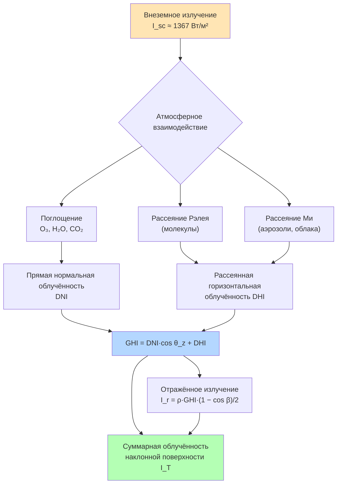

Понимание физических основ солнечного излучения необходимо для корректного расчёта солнечного теплопоступления через ограждающие конструкции, выбора размеров солнечных коллекторов и PV-систем, а также для энергетического моделирования зданий в соответствии с ASHRAE 90.1 и СП 50.13330.2017.

## Внеземное солнечное излучение

Солнце излучает энергию в результате термоядерных реакций синтеза в ядре. Поток энергии, достигающий Земли, характеризуется **солнечной постоянной** $I_{sc}$:


I_{sc} = 1361{-}1367 \ \text{Вт/м}^2


Значение варьируется в пределах ±3,3 % в течение года из-за эллиптичности орбиты Земли (перигелий около 3 января, афелий около 4 июля). Внеземная облучённость на горизонтальной поверхности:


I_0 = I_{sc} \left(1 + 0{,}033\cos\frac{360n}{365}\right)\cos\theta_z


где $n$ — порядковый номер дня года, $\theta_z$ — зенитный угол солнца.

## Механизмы атмосферного ослабления

Проходя через атмосферу толщиной ~100 км, солнечное излучение ослабляется в результате нескольких физических процессов.

### Поглощение

- **Озон ($\text{O}_3$)** поглощает УФ-излучение (длины волн < 0,3 мкм), защищая биосферу.
- **Водяной пар ($\text{H}_2\text{O}$)** и **углекислый газ ($\text{CO}_2$)** интенсивно поглощают в ближнем инфракрасном диапазоне (0,9–3,5 мкм).
- **Кислород ($\text{O}_2$)** создаёт узкие полосы поглощения в видимом диапазоне.

### Рассеяние Рэлея

Рассеяние на молекулах атмосферы (размер << $\lambda$):


I_{scatter} \propto \lambda^{-4}


Коротковолновое (синее) излучение рассеивается значительно эффективнее длинноволнового (красного). Этим объясняется синий цвет небосвода и красноватый оттенок зари.

### Рассеяние Ми

Рассеяние на аэрозолях и каплях воды (размер ~ $\lambda$). Слабо зависит от длины волны, создавая белесоватое небо при высокой аэрозольной нагрузке или влажности.

## Воздушная масса

Воздушная масса (AM, Air Mass) — отношение длины пути излучения через атмосферу к вертикальному пути на уровне моря:


AM = \frac{1}{\cos\theta_z}


При $\theta_z > 70°$ необходима поправка на кривизну атмосферы (формула Каэстена):


AM = \frac{1}{\cos\theta_z + 0{,}50572\,(96{,}07995 - \theta_z)^{-1{,}6364}}


Стандартные условия испытаний PV-модулей используют AM 1,5 ($\theta_z = 48{,}2°$) — типичное значение для умеренных широт в полдень.

## Компоненты солнечного излучения

### Прямая нормальная облучённость (DNI)

DNI (Direct Normal Irradiance) — излучение, поступающее от солнечного диска на перпендикулярную поверхность. Измеряется пиргелиометром с угловым полем зрения 5°. Является определяющей характеристикой для концентрирующих коллекторов (CPC, параболических желобчатых) и следящих PV-систем.

### Рассеянная горизонтальная облучённость (DHI)

DHI (Diffuse Horizontal Irradiance) — суммарное рассеянное излучение небосвода на горизонтальной поверхности, без прямого пучка. Измеряется пиранометром с затенённой полосой или теневым диском. При сплошной облачности DHI — единственная составляющая GHI.

### Глобальная горизонтальная облучённость (GHI)


GHI = DNI \cdot \cos\theta_z + DHI


Соотношение позволяет рассчитать любой из трёх компонентов, если два других известны. Измеряется стандартным пиранометром с полусферическим полем зрения.

### Отражённое излучение

Для наклонной поверхности с углом наклона $\beta$:


I_r = \rho \cdot GHI \cdot \frac{1 - \cos\beta}{2}


где $\rho$ — альбедо подстилающей поверхности. Типичные значения: трава — 0,20–0,25; бетон — 0,30–0,40; белая кровельная мембрана — 0,60–0,75; свежий снег — 0,75–0,85.

## Атмосферное пропускание и индекс прозрачности


| Фактор | Тип воздействия | Диапазон потерь, % |
|--------|----------------|--------------------|
| Чистый сухой воздух | Рэлеевское рассеяние | 10–20 |
| Водяной пар | ИК-поглощение | 5–15 |
| Городские аэрозоли | Ми-рассеяние | 15–30 |
| Тонкая облачность | Рассеяние | 30–60 |
| Плотная облачность | Полное ослабление | 60–95 |
| Пыльные бури | Поглощение + рассеяние | 40–80 |


Индекс прозрачности (clearness index) $K_T$:


K_T = \frac{GHI}{I_0}


**Классификация:** ясное небо — $K_T > 0{,}65$; переменная облачность — $0{,}35 < K_T < 0{,}65$; пасмурно — $K_T < 0{,}35$.

## Облучённость наклонной поверхности

Суммарная облучённость коллектора или PV-модуля:


I_T = I_b + I_d + I_r


**Прямой компонент:**


I_b = DNI \cdot \cos\theta


**Рассеянный компонент (изотропная модель Лю-Джордана):**


I_d = DHI \cdot \frac{1 + \cos\beta}{2}


Анизотропная модель Переза (Perez et al., 1990) повышает точность, учитывая яркость приземного ореола и горизонтальной полосы неба. Рекомендуется для расчётов по данным ASHRAE Handbook — Fundamentals.

### Пример расчёта

Определить суммарную облучённость плоского коллектора ($\beta = 45°$, $\psi = 0°$) в Саратове (широта $L = 51{,}2°$) 21 июня в 12:00 истинного солнечного времени.

**Исходные данные:**
- $\delta = +23{,}45°$, $H = 0°$, $n = 172$;
- $\sin\alpha = \sin 51{,}2° \cdot \sin 23{,}45° + \cos 51{,}2° \cdot \cos 23{,}45° \cdot \cos 0° = 0{,}6252$ → $\alpha = 38{,}7°$ (для полудня $\alpha_{max} = 90° - 51{,}2° + 23{,}45° = 62{,}25°$, пересчёт: $\sin\alpha = 0{,}7793 + 0 = 0{,}8854$ → $\alpha = 62{,}2°$);

Упрощённо используем $\alpha = 62{,}2°$, $\theta_z = 27{,}8°$.

- Данные TMY для Саратова: $GHI = 820$ Вт/м², $DHI = 130$ Вт/м²;
- $DNI = (820 - 130) / \cos 27{,}8° = 690 / 0{,}885 = 779$ Вт/м²;
- $\rho = 0{,}20$ (трава).

**Угол падения на коллектор** ($\beta = 45°$, южная ориентация, $H = 0°$):


\cos\theta = \sin(51{,}2° - 45°) \cdot ... \approx \cos(27{,}8° - 45°) = \cos(-17{,}2°) = 0{,}956


(упрощённо для $H = 0$, $\psi = 0$: $\theta = |\theta_z - \beta|$)

**Суммарная облучённость:**


I_b = 779 \cdot 0{,}956 = 745 \ \text{Вт/м}^2



I_d = 130 \cdot \frac{1 + \cos 45°}{2} = 130 \cdot 0{,}854 = 111 \ \text{Вт/м}^2



I_r = 0{,}20 \cdot 820 \cdot \frac{1 - \cos 45°}{2} = 164 \cdot 0{,}146 = 24 \ \text{Вт/м}^2



I_T = 745 + 111 + 24 = 880 \ \text{Вт/м}^2


Коллектор под углом 45° на юг получает в полдень **880 Вт/м²** при горизонтальном GHI 820 Вт/м² — прирост 7,3 % за счёт лучшей геометрии падения.

## Инженерные приложения

Точная характеризация компонентов солнечного излучения лежит в основе:

- Расчёта кондуктивно-конвективного и лучистого теплопоступления через ограждающие конструкции по методике ASHRAE CLTD/SCL/CLF и по СП 50.13330;
- Определения размеров солнечных тепловых коллекторов с учётом угловых потерь (IAM, Incident Angle Modifier);
- Выбора оптимального угла наклона и ориентации PV-массивов по данным NSRDB и PVGIS;
- Корректного ввода граничных условий в инструменты динамического моделирования EnergyPlus, IDA ICE, TRNSYS согласно требованиям ISO 52016 и EN 15316.
