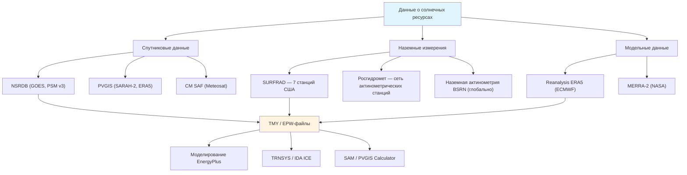

Качественные данные о солнечном излучении — необходимое условие для обоснованного выбора оборудования, корректного прогноза выработки и достоверного энергетического моделирования солнечных тепловых и PV-систем, интегрированных в комплексы HVAC. Требования к источникам и качеству исходных данных установлены ASHRAE 90.1-2022, EN 15316-4-3 и ФЗ-261.

## Компоненты солнечной облучённости

Три базовых измеряемых компонента:

**GHI (Global Horizontal Irradiance)** — суммарная облучённость горизонтальной поверхности:


GHI = DNI \cdot \cos\theta_z + DHI


**DNI (Direct Normal Irradiance)** — прямая нормальная облучённость (перпендикулярная к солнечным лучам):


DNI = \frac{GHI - DHI}{\cos\theta_z}


**DHI (Diffuse Horizontal Irradiance)** — рассеянная горизонтальная облучённость. Используется для неконцентрирующих систем и является единственным доступным ресурсом при сплошной облачности.

## Типичный метеорологический год (TMY)

TMY (Typical Meteorological Year) — синтетический годовой ряд почасовых данных, формируемый путём выборки 12 репрезентативных месяцев из многолетней базы наблюдений (обычно 20–30 лет) методом Финкельштейна-Шафера. TMY отражает статистически типичные условия, но не экстремальные.


| Параметр | Единицы | Применение в HVAC |
|----------|---------|-------------------|
| GHI | Вт/м² | Горизонтальные и слабонаклонные коллекторы |
| DNI | Вт/м² | Концентрирующие и следящие системы |
| DHI | Вт/м² | Оценка рассеянной составляющей |
| Температура сухого термометра | °C | Тепловые нагрузки, тепловые насосы |
| Температура точки росы | °C | Скрытая нагрузка, осушение |
| Скорость ветра | м/с | Конвективные потери коллекторов |
| Атмосферное давление | Па | Коррекция плотности воздуха |
| Облачность | балл | Расчёт DHI, дневное освещение |


Форматы TMY-файлов: **EPW** (EnergyPlus Weather, используется в IDA ICE, OpenStudio, DesignBuilder), **TMY3** (NREL, США), **CSV/XML** (PVGIS, Европа/Россия).

## Базы данных и инструменты

### NSRDB (National Solar Radiation Database, NREL, США)

Наиболее подробная база данных для США, Мексики, Центральной Америки и части мирового океана. Ключевые характеристики:

- Период: 1998 г. — настоящее время;
- Пространственное разрешение: 4 км;
- Временно́й шаг: 30 мин;
- Компоненты: GHI, DNI, DHI + полный метеорологический набор;
- Физическая модель DISC / PSM v3.

### PVGIS (Photovoltaic Geographical Information System, JRC EC)

Европейский инструмент, охватывающий Европу, Африку, Азию и Россию:

- Климатические данные: SARAH-2 (Европа/западная Россия), ERA5 (глобально);
- Пространственное разрешение: 3–5 км;
- Инструмент расчёта выработки: фиксированные, одноосные и двухосные следящие системы;
- Экспорт TMY в формате EPW.

### Наземные сети измерений

## Региональные ресурсы России


| Регион | Город | GHI, кВт·ч/(м²·год) | DNI, кВт·ч/(м²·год) | PSH, ч/день |
|--------|-------|---------------------|---------------------|-------------|
| Краснодарский край | Краснодар | 1600–1700 | 1450–1550 | 4,4–4,7 |
| Поволжье | Астрахань | 1450–1550 | 1400–1500 | 4,0–4,2 |
| Центральный регион | Москва | 1100–1200 | 950–1050 | 3,0–3,3 |
| Поволжье | Саратов | 1250–1350 | 1150–1250 | 3,4–3,7 |
| Западная Сибирь | Новосибирск | 1150–1250 | 1100–1200 | 3,2–3,4 |
| Восточная Сибирь | Иркутск | 1300–1450 | 1300–1450 | 3,6–4,0 |
| Дальний Восток | Владивосток | 1250–1350 | 1100–1200 | 3,4–3,7 |
| Северо-Запад | Санкт-Петербург | 950–1050 | 750–850 | 2,6–2,9 |


Иркутская область и Забайкалье имеют наилучший DNI в России из-за редкой облачности и высокой прозрачности атмосферы — исторически там сформировались первые советские актинометрические станции (источник: ИЭА «Атлас солнечного излучения»).

### Сезонная изменчивость

Сезонное изменение длины светового дня:


D = \frac{2}{15} \arccos\!\left(-\tan\phi \cdot \tan\delta\right)


где $\phi$ — широта, $\delta$ — склонение. Для Москвы ($\phi = 55{,}7°$): летом $D \approx 17$ ч, зимой $D \approx 7$ ч — разница более чем вдвое, что определяет резкую сезонную неравномерность ресурса.

Коэффициент помесячной неравномерности для Москвы ($GHI_{июнь} / GHI_{декабрь} \approx 6$) существенно ограничивает солнечную долю зимнего теплоснабжения без крупного теплового аккумулятора.

## Неопределённость данных


| Источник | Погрешность GHI | Погрешность DNI | Примечание |
|----------|----------------|----------------|------------|
| Наземное измерение (класс 1) | ±2–3 % | ±1–2 % | По ISO 9060:2018 |
| NSRDB (PSM v3) | ±3–5 % | ±4–7 % | Проверено по SURFRAD |
| PVGIS (SARAH-2) | ±4–6 % | ±5–8 % | Европа, верификация CM SAF |
| ERA5 Reanalysis | ±5–10 % | ±8–15 % | Снижается после 2016 г. |
| TMY vs. конкретный год | ±5–10 % | ±5–12 % | Межгодовая вариабельность |


Межгодовая вариабельность (±5–10 %) требует введения консервативных коэффициентов при финансовом моделировании инвестиций в солнечную энергетику. IRENA (Renewable Power Generation Costs 2023) рекомендует использовать P90-сценарий (90-процентиль вероятности невыработки) для банковского финансирования.

### Пример оценки

Оценить годовую выработку тепла от солнечной системы ГВС в Москве с учётом неопределённости.

**Исходные данные:**
- $A_c = 20$ м², $\eta_s = 0{,}50$;
- Базовый GHI: 1150 кВт·ч/(м²·год) (TMY);
- Неопределённость: ±8 % (σ).

**Базовая выработка:**


E_{base} = 20 \times 0{,}50 \times 1150 = 11\,500 \ \text{кВт·ч/год}


**Сценарий P90** (вычитается 1,28σ для 90-процентиля):


E_{P90} = 11\,500 \times (1 - 1{,}28 \times 0{,}08) = 11\,500 \times 0{,}898 = 10\,327 \ \text{кВт·ч/год}


Разница между базовым и P90 сценарием составляет 1173 кВт·ч/год (~10 %), что необходимо учитывать при финансовом планировании согласно рекомендациям IRENA и IEA (Solar Energy Perspectives, 2022).

## Применение данных при проектировании HVAC

1. **Выбор размера солнешных тепловых коллекторов:** годовой GHI определяет потребную площадь для заданной солнечной доли покрытия нагрузки ГВС или отопления.
2. **PV-системы:** отношение DNI/GHI указывает на целесообразность следящих систем ($DNI/GHI > 0{,}7$ — высокая целесообразность трекеров).
3. **Динамическое моделирование:** TMY-файлы в формате EPW используются как входные данные для EnergyPlus, TRNSYS, IDA ICE при оценке годового энергопотребления.
4. **Экономический анализ:** многолетние данные облучённости (не менее 10 лет) необходимы для расчёта NPV и IRR согласно IRENA Project Finance Guidance (2018).
5. **Естественное освещение:** DHI определяет доступность рассеянного дневного света для расчёта площади световых проёмов и управления системами освещения.
