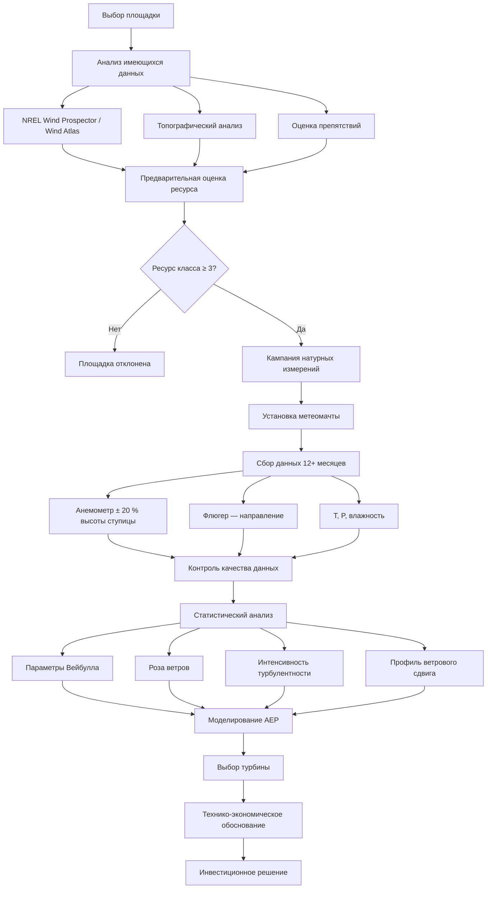

Оценка ветрового ресурса количественно определяет энергетический потенциал ветра на конкретной площадке для обоснования технической и экономической целесообразности ветровых генераторов, питающих системы HVAC здания. Согласно ФЗ-261 и ASHRAE 90.1-2022, применение ветровой генерации может засчитываться в выполнение требований по возобновляемым источникам энергии для зданий.

## Основное уравнение ветровой мощности

Кинетическая мощность, содержащаяся в потоке воздуха через площадь $A$:


P_{wind} = \frac{1}{2}\rho A V^3


где:
- $\rho$ — плотность воздуха (кг/м³), на уровне моря при 15 °C: $\rho = 1{,}225$ кг/м³;
- $A$ — площадь ометания ротора (м²);
- $V$ — скорость ветра (м/с).

Кубическая зависимость от скорости означает: удвоение скорости ветра увеличивает мощность в 8 раз. Ошибка в 10 % при измерении скорости даёт ошибку ~33 % в оценке выработки энергии.

Мощность турбины с учётом предела Бетца и механических потерь:


P_{turb} = \frac{1}{2}\rho A V^3 \cdot C_p \cdot \eta


где $C_p$ — коэффициент мощности (максимум $C_{p,max} = 16/27 \approx 0{,}593$ по теореме Бетца); $\eta$ — механический и электрический КПД.

## Теорема Бетца и реальные коэффициенты мощности

В 1919 г. Альберт Бетц доказал, что максимальная доля кинетической энергии ветра, извлекаемая любой турбиной, ограничена:


C_{p,max} = \frac{16}{27} \approx 0{,}593


Это фундаментальный физический предел, не зависящий от конструкции турбины. Современные коммерческие турбины достигают $C_p = 0{,}45{-}0{,}50$ при оптимальных условиях (60–84 % от предела Бетца).

Коэффициент быстроходности (TSR, Tip Speed Ratio):


TSR = \frac{\omega \cdot r}{V}


где $\omega$ — угловая скорость ротора (рад/с), $r$ — радиус ротора. Оптимальный TSR для многолопастных турбин с горизонтальной осью: 6–9.

## Вертикальный профиль скорости ветра

Скорость ветра возрастает с высотой вследствие снижения поверхностного трения. Степенной закон:


V_2 = V_1 \left(\frac{z_2}{z_1}\right)^\alpha


где $\alpha$ — показатель степени (зависит от шероховатости подстилающей поверхности):
- Открытая водная поверхность: $\alpha = 0{,}10{-}0{,}12$;
- Сельскохозяйственные угодья: $\alpha = 0{,}14{-}0{,}16$;
- Пригород: $\alpha = 0{,}20{-}0{,}25$;
- Плотная городская застройка: $\alpha = 0{,}30{-}0{,}40$.

## Распределение скоростей ветра

Частотное распределение скоростей ветра в большинстве локаций подчиняется двухпараметрическому распределению Вейбулла:


f(V) = \frac{k}{c}\left(\frac{V}{c}\right)^{k-1}\exp\!\left[-\left(\frac{V}{c}\right)^k\right]


где $k$ — параметр формы (1,5–3,0; меньше → бо́льшая изменчивость), $c$ — масштабный параметр (м/с).

Средняя скорость ветра через параметры Вейбулла:


\bar{V} = c\,\Gamma\!\left(1 + \frac{1}{k}\right)


Средняя плотность ветровой мощности:


\bar{P}_w = \frac{1}{2}\rho c^3\,\Gamma\!\left(1 + \frac{3}{k}\right)


## Классификация ветровых ресурсов


| Класс | Плотность мощности, Вт/м² | Средняя скорость, м/с | Потенциал |
|-------|--------------------------|----------------------|-----------|
| 1 | 0–200 | < 5,6 | Слабый |
| 2 | 200–300 | 5,6–6,4 | Маргинальный |
| 3 | 300–400 | 6,4–7,0 | Удовлетворительный |
| 4 | 400–500 | 7,0–7,5 | Хороший |
| 5 | 500–600 | 7,5–8,0 | Отличный |
| 6 | 600–800 | 8,0–8,8 | Выдающийся |
| 7 | > 800 | > 8,8 | Превосходный |


Ресурс класса 3 и выше (≥ 300 Вт/м² при 50 м) экономически жизнеспособен для объектов коммунального масштаба; для ветровых генераторов зданий допустимы ресурсы класса 2 в сочетании с другими мерами энергоэффективности.

## Методология оценки площадки

## Расчёт годового производства энергии

Годовая выработка электроэнергии (AEP, Annual Energy Production):


AEP = 8760 \cdot \sum_{i=1}^{n} f(V_i) \cdot P(V_i)


где $f(V_i)$ — относительная частота $i$-го интервала скоростей ветра; $P(V_i)$ — мощность турбины при скорости $V_i$.

Валовой AEP корректируется на системные потери:
- Готовность (availability): 97–98 %;
- Потери в массиве (wake losses): 2–5 %;
- Электрические потери: 2–3 %;
- Обледенение и загрязнение: 1–3 %;
- Итоговые потери: 10–15 % от валовой выработки.

### Пример расчёта

Ветровой генератор 100 кВт установлен на крыше промышленного здания на высоте ступицы 30 м. Средняя скорость ветра на 10 м — 5,5 м/с (метеостанция), $\alpha = 0{,}20$ (пригород).

**Скорость на высоте 30 м:**


V_{30} = 5{,}5 \cdot \left(\frac{30}{10}\right)^{0{,}20} = 5{,}5 \cdot 1{,}246 = 6{,}85 \ \text{м/с}


**Плотность ветровой мощности:**


\frac{P}{A} = \frac{1}{2} \times 1{,}225 \times 6{,}85^3 = 0{,}6125 \times 321{,}4 = 197 \ \text{Вт/м}^2


Ресурс класса 1–2 на этой высоте. При диаметре ротора $D = 25$ м ($A = 490{,}9$ м²), $C_p = 0{,}38$, $\eta = 0{,}95$:


P = 0{,}6125 \times 490{,}9 \times 6{,}85^3 \times 0{,}38 \times 0{,}95 = 197 \times 490{,}9 \times 0{,}361 = 34\,900 \ \text{Вт}



AEP \approx 34{,}9 \times 0{,}25 \times 8760 = 76\,500 \ \text{кВт·ч/год}


(при коэффициенте использования мощности CF = 0,25). Для номинала 100 кВт и полных потерь 12 %: $AEP_{net} \approx 67\,000$ кВт·ч/год — покрывает ~15–20 % годового потребления электроэнергии типичным промышленным зданием площадью 5000 м².

## Интеграция с системами HVAC

Ветровые генераторы компенсируют электрические нагрузки:
- Компрессоры чиллеров и тепловых насосов;
- Насосы и вентиляторы с частотными преобразователями;
- Системы управления и автоматизации (BAS/BMS).

**Управление нагрузкой:** при переменной ветровой генерации сигнал прогноза выработки интегрируется с контроллером BAS для адаптации режима работы HVAC: предварительное охлаждение при пиковой генерации, снижение нагрузки при штиле. Такой подход снижает потребность в накопителе энергии.

**Гибридные системы:** сочетание ветрового и солнечного ресурсов (ветер — сильнее ночью и зимой, солнце — днём и летом) повышает суммарный коэффициент использования до 40–55 % против 25–35 % для отдельных систем.

Площадки с ресурсом класса 3 и выше заслуживают полного технико-экономического обоснования; класса 2 — при наличии налоговых льгот или ускоренной амортизации по ФЗ-261.
