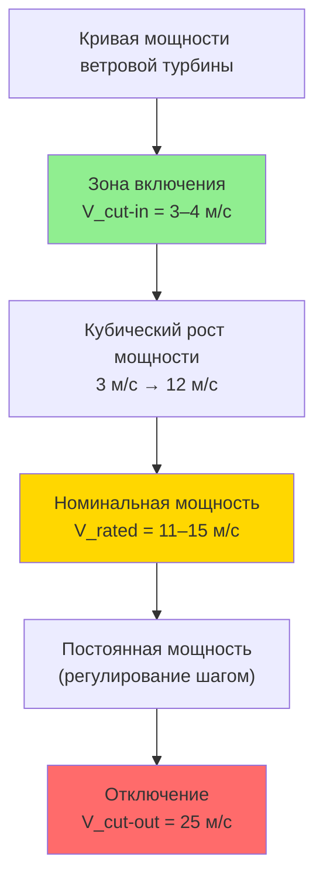

Расчёты ветровой мощности позволяют количественно оценить потенциал ветровых ресурсов площадки и предсказать производительность турбин для систем HVAC (Heating, Ventilation, Air Conditioning). Точные расчёты необходимы для обоснованного выбора оборудования и реалистичных прогнозов экономики инвестиций в соответствии с ASHRAE 90.1-2022 и ФЗ-261.

## Уравнение ветровой мощности

Кинетическая мощность воздушного потока через площадь $A$:


P = \frac{1}{2}\rho A V^3


где:
- $P$ — мощность воздушного потока (Вт);
- $\rho$ — плотность воздуха (кг/м³);
- $A$ — площадь ометания (м²);
- $V$ — скорость ветра (м/с).

Кубическая зависимость от скорости фундаментально влияет на экономику проекта: удвоение скорости увеличивает мощность в 8 раз. Это делает даже небольшой прирост средней скорости (например, за счёт большей высоты башни) высокорентабельным решением.

## Влияние плотности воздуха

Плотность воздуха снижается с высотой и ростом температуры по уравнению состояния идеального газа:


\rho = \frac{P_{atm}}{R \cdot T}


где $R = 287$ Дж/(кг·К) — удельная газовая постоянная воздуха; $T$ — абсолютная температура (К).


| Высота над уровнем моря, м | $\rho$, кг/м³ | Коэффициент мощности |
|---------------------------|--------------|----------------------|
| 0 | 1,225 | 1,000 |
| 500 | 1,167 | 0,953 |
| 1000 | 1,112 | 0,908 |
| 1500 | 1,058 | 0,864 |
| 2000 | 1,007 | 0,822 |
| 3000 | 0,909 | 0,742 |


Для высокогорных объектов (Алтай, Кавказ, Средняя Азия) снижение плотности воздуха снижает выработку на 15–25 % по сравнению с уровнем моря при одинаковой скорости ветра — это необходимо учитывать при выборе мощности турбины.

На 1 °C повышения температуры плотность воздуха при постоянном давлении снижается примерно на 0,34 % с соответствующим уменьшением доступной мощности.

## Площадь ометания и диаметр ротора

Площадь ометания ротора с горизонтальной осью:


A = \pi r^2 = \frac{\pi D^2}{4}



| Диаметр $D$, м | $A$, м² | Отношение мощности ($D_1 = 10$ м) |
|---------------|---------|-----------------------------------|
| 10 | 78,5 | 1,00 |
| 15 | 176,7 | 2,25 |
| 20 | 314,2 | 4,00 |
| 25 | 490,9 | 6,25 |
| 30 | 706,9 | 9,00 |
| 40 | 1256,6 | 16,00 |


Удвоение диаметра ротора увеличивает площадь ометания и потенциал мощности в 4 раза. Для ветровых генераторов зданий типичные диаметры: 3–10 м; для коммунальных — 80–160 м.

## Предел Бетца и коэффициент мощности

В 1919 г. Альберт Бетц (Albert Betz) доказал, что максимально извлекаемая доля кинетической энергии ветра не может превышать:


C_{p,max} = \frac{16}{27} \approx 0{,}593


Физический смысл: ротор должен «отпустить» часть энергии потоку — иначе воздух остановится и обтечет ротор, не совершив работы.

Реальная выработка турбины:


P_{turb} = \frac{1}{2}\rho A V^3 \cdot C_p


Коэффициент быстроходности (TSR, Tip Speed Ratio) определяет оптимальный $C_p$:


TSR = \frac{\omega \cdot r}{V}


Современные трёхлопастные турбины с горизонтальной осью достигают $C_p = 0{,}45{-}0{,}50$ при оптимальном TSR = 6–9. Учитывая механический и электрический КПД ($\eta = 0{,}90{-}0{,}95$), итоговый электрический КПД системы: 40–47 % от теоретически доступной ветровой мощности.

## Коэффициент использования мощности

Коэффициент использования мощности (CF, Capacity Factor):


CF = \frac{E_{actual}}{P_{rated} \times 8760}



| Класс ветрового ресурса | $\bar{V}$ на 50 м, м/с | CF, % | Эквивалентных часов/год |
|------------------------|----------------------|-------|------------------------|
| Класс 1 (слабый) | < 5,6 | 10–18 | 876–1575 |
| Класс 2 (маргинальный) | 5,6–6,4 | 18–25 | 1575–2190 |
| Класс 3 (удовлетворительный) | 6,4–7,0 | 25–30 | 2190–2628 |
| Класс 4 (хороший) | 7,0–7,5 | 30–35 | 2628–3066 |
| Класс 5 (отличный) | 7,5–8,0 | 35–40 | 3066–3504 |
| Класс 6–7 (выдающийся) | > 8,0 | 40–50 | 3504–4380 |


Офшорные установки достигают CF = 40–55 % благодаря более высоким и стабильным скоростям ветра. Наземные площадки умеренных широт: CF = 25–40 %.

## Расчёт годовой выработки энергии (AEP)

Точный AEP вычисляется интегрированием кривой мощности турбины по частотному распределению Вейбулла:


AEP = 8760 \sum_{i=1}^{n} P(V_i) \cdot f(V_i)


Упрощённая формула через CF:


AEP = P_{rated} \cdot CF \cdot 8760


Удельная плотность ветровой мощности — быстрая оценка потенциала:


\frac{P}{A} = \frac{1}{2}\rho V^3



| $V$, м/с | $P/A$, Вт/м² | Класс ресурса |
|----------|-------------|--------------|
| 5,0 | 77 | Слабый |
| 6,0 | 133 | Маргинальный |
| 7,0 | 210 | Удовлетворительный |
| 8,0 | 314 | Хороший |
| 9,0 | 447 | Отличный |
| 10,0 | 613 | Выдающийся |


### Пример расчёта

Рассчитать годовую выработку ветрового генератора для офисного центра в Ростове-на-Дону.

**Исходные данные:**
- Номинальная мощность: $P_{rated} = 50$ кВт;
- Высота ступицы: 30 м; диаметр ротора: $D = 18$ м ($A = 254{,}5$ м²);
- Средняя скорость ветра на высоте 10 м: $V_{10} = 5{,}2$ м/с (метеостанция Ростов-на-Дону);
- Тип местности: пригородная застройка, $\alpha = 0{,}22$.

**Скорость на высоте ступицы:**


V_{30} = 5{,}2 \cdot \left(\frac{30}{10}\right)^{0{,}22} = 5{,}2 \cdot 1{,}278 = 6{,}65 \ \text{м/с}


**Плотность ветровой мощности:**


\frac{P}{A} = \frac{1}{2} \times 1{,}225 \times 6{,}65^3 = 0{,}6125 \times 294{,}1 = 180 \ \text{Вт/м}^2


Ресурс между классами 1 и 2. **Коэффициент использования** CF = 0,22 (класс 2, наземная установка).

**AEP до потерь:**


AEP_{gross} = 50 \times 0{,}22 \times 8760 = 96\,360 \ \text{кВт·ч/год}


**Чистый AEP** (потери 13 %):


AEP_{net} = 96\,360 \times 0{,}87 = 83\,833 \ \text{кВт·ч/год} \approx 84\,000 \ \text{кВт·ч/год}


При годовом потреблении офиса 150 кВт·ч/м² × 2000 м² = 300 000 кВт·ч, турбина покрывает около **28 %** нагрузки. Рост высоты башни до 50 м даст $V_{50} = 6{,}65 \times (50/30)^{0{,}22} = 7{,}08$ м/с — прирост мощности ~28 %, AEP вырастет примерно до 107 000 кВт·ч.

## Деградация и учёт жизненного цикла

Ежегодная деградация CF составляет 1–2 % из-за эрозии лопастей, износа подшипников и дрейфа системы управления. За 20-летний срок службы средняя CF снижается примерно на 10–20 % от начального значения, что необходимо учитывать при расчёте NPV проекта по методологии IRENA (Renewable Power Generation Costs 2023).

**Аккумуляторное хранение:** при CF < 30 % ветрогенератор требует буферного накопителя для обеспечения стабильной работы HVAC. Ёмкость накопителя рассчитывается из условия обеспечения 3–5 суток нагрузки при минимальной ветровой генерации.

**Гибридные системы ветер + солнце:** сезонная и суточная взаимодополняемость ресурсов повышает суммарный CF гибридной системы до 40–55 % по сравнению с 20–35 % для отдельных источников, снижая требуемую ёмкость накопителя вдвое.
