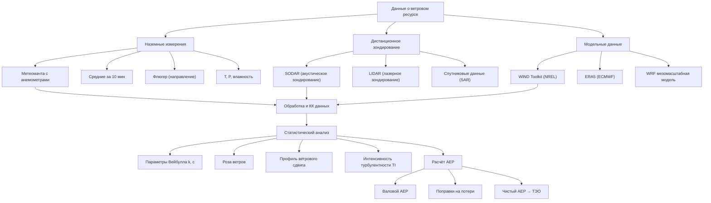

Качество данных о ветровом ресурсе непосредственно определяет достоверность прогноза выработки и финансовой модели ветровых систем, интегрированных в здания. Требования к сбору и анализу данных установлены IEC 61400-12-1 (измерения производительности турбин) и IEC 61400-15-1 (оценка энергетических ресурсов).

## Классификация ветрового ресурса NREL

Национальная лаборатория возобновляемых источников энергии (NREL) классифицирует ветровые ресурсы США по плотности мощности на нескольких стандартных высотах (30, 50, 80, 100, 110, 140, 200 м):


| Класс | Плотность мощности, Вт/м² | Средняя скорость, м/с | Потенциал ресурса |
|-------|--------------------------|----------------------|-------------------|
| 1 | 0–200 | < 5,6 | Слабый — непригоден |
| 2 | 200–300 | 5,6–6,4 | Маргинальный |
| 3 | 300–400 | 6,4–7,0 | Удовлетворительный |
| 4 | 400–500 | 7,0–7,5 | Хороший |
| 5 | 500–600 | 7,5–8,0 | Отличный |
| 6 | 600–800 | 8,0–8,8 | Выдающийся |
| 7 | > 800 | > 8,8 | Превосходный |


Для коммунальных ветропарков экономически привлекателен ресурс класса ≥ 3. Для ветровых генераторов зданий (BIWT, Building-Integrated Wind Turbines) — класс ≥ 2 при наличии дополнительных мер энергоэффективности.

## Источники данных о ветровом ресурсе

### NREL Wind Integration National Dataset (WIND) Toolkit

Высокоразрешённый набор данных за 7 лет (2007–2013):
- Пространственное разрешение: 2 км;
- Временно́й шаг: 5 мин;
- Параметры: скорость и направление ветра, T, P, влажность, TKE;
- Высоты: 10, 40, 60, 80, 100, 120, 140, 160, 200 м.

### MERRA-2 (NASA)

Глобальный реанализ ERA с 1980 г. по настоящее время:
- Пространственное разрешение: 0,5° × 0,625° (~55 × 70 км);
- Временно́й шаг: 1 ч;
- Преимущество: долгосрочные ряды для межгодового анализа;
- Ограничение: недостаточное пространственное разрешение для оценки специфики площадки.

### ERA5 (ECMWF)

Глобальный реанализ с 1940 г. по настоящее время:
- Разрешение: 0,25° (~31 км), на уровнях давления и модельных уровнях;
- Временно́й шаг: 1 ч;
- Точность превышает MERRA-2 в большинстве регионов мира (включая Россию).

### Global Wind Atlas (DTU / World Bank)

Глобальный ветровой атлас: охват — весь земной шар, разрешение 250 м; используется для первичного отбора площадок и международных сравнений.

## Анализ распределения Вейбулла

Функция плотности вероятности Вейбулла (Weibull distribution):


f(v) = \frac{k}{c}\left(\frac{v}{c}\right)^{k-1}\exp\!\left[-\left(\frac{v}{c}\right)^k\right]


Функция распределения (вероятность $V \leq v$):


F(v) = 1 - \exp\!\left[-\left(\frac{v}{c}\right)^k\right]


**Параметры:**
- $k$ — параметр формы: чем меньше, тем выше изменчивость ($k < 2$ — высокая; $k = 2$ — распределение Рэлея; $k > 2$ — устойчивый ветер);
- $c$ — масштабный параметр, связанный со средней скоростью через гамма-функцию:


\bar{v} = c\,\Gamma\!\left(1 + \frac{1}{k}\right)


Средняя плотность ветровой мощности через параметры Вейбулла:


\bar{P}_w = \frac{1}{2}\rho c^3\,\Gamma\!\left(1 + \frac{3}{k}\right)


Оценка параметров Вейбулла по выборке данных: метод максимального правдоподобия (MLE) или метод моментов. Для технических расчётов достаточно метода моментов при объёме выборки ≥ 1000 почасовых значений.

## Схема сбора и анализа данных

## Стандарты натурных измерений

**Продолжительность:** минимум 12 месяцев для захвата сезонных вариаций; 24–36 месяцев снижают неопределённость межгодовой вариабельности до ±5–8 % (IEC 61400-15-1).

**Высоты измерения:** несколько уровней (обычно 3–4) для определения профиля ветрового сдвига. Минимум один датчик на высоте ступицы ± 20 %.

**Требования к точности (IEC 61400-12-1):**
- Анемометр: ±0,1 м/с или ±1 % показания (калибровка MEASNET);
- Флюгер: ±3°;
- Восстановление данных: ≥ 90 % за период кампании.

**Форматы данных:** 10-минутные средние скорость и направление ветра; выборки 1 с для анализа турбулентности (TI, порывы, спектральная плотность).

## Метод мера-корреляция-прогноз (MCP)

При наличии краткосрочных данных на площадке (6–12 месяцев) и долгосрочных данных на ближайшей референтной станции (≥ 10 лет) метод MCP (Measure-Correlate-Predict) экстраполирует долгосрочные условия площадки:

1. Измерить скорость и направление ветра на площадке;
2. Коррелировать с одновременными данными референтной станции;
3. Применить регрессионную модель к многолетнему ряду референтной станции;
4. Получить репрезентативный долгосрочный ряд площадки.

Точность MCP зависит от корреляции $R^2$ между площадкой и референтом: при $R^2 > 0{,}80$ — приемлемая неопределённость ±5–8 %; при $R^2 < 0{,}60$ — метод ненадёжен.

## Анализ неопределённости


| Источник | Неопределённость, % | Снижение |
|----------|---------------------|----------|
| Межгодовая вариабельность | ±5–10 | Длинный ряд измерений, MCP |
| Погрешность измерений | ±2–4 | Калибровка MEASNET |
| Пространственная экстраполяция | ±5–15 | CFD-моделирование |
| Неопределённость модели | ±5–15 | Верификация по данным |
| Суммарная (RSS) | ±10–25 | Комбинация мер |


Для банковского финансирования используется P90 (90-й процентиль невыполнения): AEP, достигаемый с вероятностью 90 %. Для суммарной неопределённости ±15 % (σ):


AEP_{P90} = AEP_{P50} \times (1 - 1{,}28 \times 0{,}15) = AEP_{P50} \times 0{,}808


### Пример расчёта

Ветровой генератор 250 кВт на побережье Балтийского моря. Параметры Вейбулла для площадки: $k = 2{,}1$, $c = 8{,}5$ м/с ($\bar{v} \approx 7{,}6$ м/с — ресурс класса 5).

**Средняя плотность мощности:**


\bar{P}_w = \frac{1}{2} \times 1{,}225 \times 8{,}5^3 \times \Gamma\!\left(1 + \frac{3}{2{,}1}\right)


$\Gamma(2{,}429) \approx 1{,}402$


\bar{P}_w = 0{,}6125 \times 614 \times 1{,}402 = 527 \ \text{Вт/м}^2


Класс 5 — отличный ресурс. **Валовой AEP** при CF = 0,38:


AEP_{gross} = 250 \times 0{,}38 \times 8760 = 832\,200 \ \text{кВт·ч/год}


**Чистый AEP** (потери 12 %): $AEP_{net} = 732\,336 \approx 732\,000$ кВт·ч/год.

**P90:** $AEP_{P90} = 732\,000 \times 0{,}808 = 591\,456 \approx 591\,000$ кВт·ч/год.

Разница P50–P90 = 141 000 кВт·ч/год — критическая величина для расчёта долгового обслуживания при проектном финансировании.

## Применение в проектировании HVAC

Высококачественные данные о ветровом ресурсе обеспечивают:

1. **Обоснование выбора турбины:** соответствие класса ветровой нагрузки (IEC 61400-1) и класса турбулентности конкретным условиям площадки;
2. **Расчёт нагрузок HVAC:** корреляция ветровой генерации с профилем нагрузки здания для оптимизации управления;
3. **Проектирование систем накопления:** ёмкость накопителя определяется дисперсией ветровой генерации, рассчитанной из параметров Вейбулла;
4. **Финансовая модель:** P50/P90 AEP — основа расчёта срока окупаемости и NPV согласно методологии IRENA Project Finance Guidance (2018).
