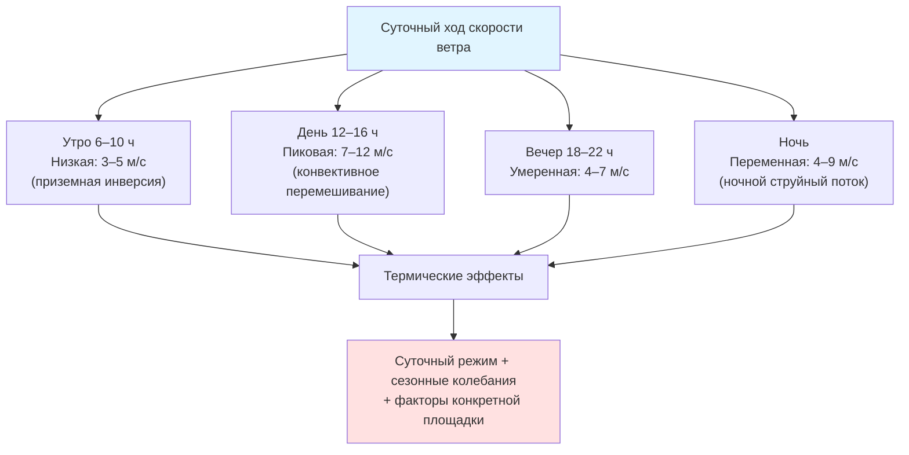

Детальная характеризация скорости ветра на потенциальной площадке — обязательный первый шаг перед выбором ветрового генератора для систем HVAC (Heating, Ventilation, Air Conditioning). Точное знание статистики скоростей, вертикального профиля и турбулентности позволяет оптимально выбрать высоту башни, диаметр ротора и класс нагрузки турбины по IEC 61400-1.

## Средняя скорость ветра

Среднее арифметическое скорости ветра за период измерений:


\bar{V} = \frac{1}{n}\sum_{i=1}^{n} V_i


Однако для оценки энергетического потенциала более информативна **среднекубическая (взвешенная по мощности) скорость**:


\bar{V}_p = \left(\frac{1}{n}\sum_{i=1}^{n} V_i^3\right)^{1/3}


Соотношение $\bar{V}_p > \bar{V}$ всегда выполняется (из-за кубической зависимости). Разница характеризует «энергетическое богатство» ветрового режима: на площадках с высокой долей штормовых скоростей $\bar{V}_p / \bar{V}$ значительно превышает 1.

## Распределение скорости ветра по Вейбуллу

Вейбулловское (Weibull) двухпараметрическое распределение описывает частотный спектр скоростей ветра в большинстве климатических зон:


f(V) = \frac{k}{c}\left(\frac{V}{c}\right)^{k-1}\exp\!\left[-\left(\frac{V}{c}\right)^k\right]


Интегральная функция распределения (вероятность $V \leq v$):


F(V) = 1 - \exp\!\left[-\left(\frac{V}{c}\right)^k\right]


**Параметр формы $k$:**
- $k = 1$ — экспоненциальное распределение (очень изменчивый ветер);
- $k = 2$ — распределение Рэлея (хорошее приближение для большинства берегов);
- $k = 3{-}4$ — ветровой режим с устойчивыми преобладающими направлениями.

**Параметр масштаба $c$** связан со средней скоростью через гамма-функцию:


c = \frac{\bar{V}}{\Gamma(1 + 1/k)}


## Классы скорости ветра


| Класс | Плотность мощности, Вт/м² | Средняя скорость, м/с | Потенциал |
|-------|--------------------------|----------------------|-----------|
| 1 | 0–200 | < 5,6 | Слабый |
| 2 | 200–300 | 5,6–6,4 | Маргинальный |
| 3 | 300–400 | 6,4–7,0 | Удовлетворительный |
| 4 | 400–500 | 7,0–7,5 | Хороший |
| 5 | 500–600 | 7,5–8,0 | Отличный |
| 6 | 600–800 | 8,0–8,8 | Выдающийся |
| 7 | > 800 | > 8,8 | Превосходный |


Плотность ветровой мощности обеспечивает более точный критерий, чем одна лишь средняя скорость, поскольку учитывает изменчивость и плотность воздуха.

## Вертикальный профиль скорости ветра

### Степенной закон

Наиболее распространённое инженерное приближение для переноса данных с измерительной высоты на высоту ступицы турбины:


\frac{V_2}{V_1} = \left(\frac{z_2}{z_1}\right)^\alpha



| Тип поверхности | Длина шероховатости $z_0$, м | Показатель $\alpha$ |
|----------------|------------------------------|---------------------|
| Открытое море | 0,0001–0,001 | 0,10–0,12 |
| Ровная степь | 0,01–0,03 | 0,13–0,15 |
| Сельскохозяйственные угодья | 0,05–0,10 | 0,15–0,18 |
| Рощи, перелески | 0,10–0,25 | 0,18–0,22 |
| Пригородная застройка | 0,25–0,50 | 0,22–0,28 |
| Городские центры | 0,50–1,50 | 0,30–0,40 |


### Логарифмический профиль ветра

Теоретически более обоснован для нейтральной атмосферной стратификации:


V(z) = \frac{u_*}{\kappa}\ln\!\left(\frac{z - d}{z_0}\right)


где:
- $u_*$ — динамическая скорость (скорость трения), м/с;
- $\kappa = 0{,}40$ — постоянная Кармана;
- $d$ — высота смещения нулевого уровня (для городской застройки $d \approx 0{,}7 H_{bld}$, где $H_{bld}$ — средняя высота зданий);
- $z_0$ — параметр шероховатости (длина шероховатости), м.

Логарифмический профиль используется в мезомасштабных моделях (WRF) и CFD-расчётах для детализации ресурса площадки. Степенной закон предпочтителен для простых инженерных оценок без CFD.

## Интенсивность турбулентности

Интенсивность турбулентности (TI, Turbulence Intensity) — отношение стандартного отклонения скорости к её среднему значению:


TI = \frac{\sigma_V}{\bar{V}}


где $\sigma_V$ рассчитывается по 10-минутным выборкам (стандарт IEC 61400-12-1).


| Категория | TI | Типичные площадки | Эффект на турбину |
|----------|----|-------------------|------------------|
| Низкая | < 0,10 | Открытое море, ровная степь | Минимальные усталостные нагрузки |
| Умеренная | 0,10–0,15 | Сельская местность, пологие склоны | Стандартный ресурс конструкции |
| Высокая | 0,15–0,20 | Городские районы, сложный рельеф | Повышенные усталостные нагрузки |
| Очень высокая | > 0,20 | Горная местность, плотный город | Сокращение ресурса, спец. конструкция |


По IEC 61400-1:2019 класс турбулентности турбины (A, B, C) должен соответствовать условиям площадки. При TI > 0,18 применяются турбины класса A (наивысшая стойкость). Высокая турбулентность снижает выработку на 5–20 % и ускоряет износ.

## Ветровой сдвиг и его практическое значение

Ветровой сдвиг (wind shear) — изменение скорости ветра по вертикали — непосредственно влияет на выбор высоты ступицы. Для площадок с $\alpha = 0{,}25$ прирост мощности при переходе от высоты 40 м к 80 м:


\frac{P_{80}}{P_{40}} = \left(\frac{V_{80}}{V_{40}}\right)^3 = \left(\frac{80}{40}\right)^{3\alpha} = 2^{3 \times 0{,}25} = 2^{0{,}75} = 1{,}68


Удвоение высоты башни даёт прирост мощности **68 %** — существенно перекрывает удорожание стальной конструкции (~30–40 % стоимости), что делает высокие башни экономически оправданными в условиях умеренного и сильного сдвига.

### Пример расчёта вертикальной экстраполяции

Метеостанция Краснодара фиксирует среднюю скорость 5,8 м/с на стандартной высоте 10 м. Тип местности — пригород с огородами и небольшими строениями: $\alpha = 0{,}20$.

**Скорость на высоте 50 м:**


V_{50} = 5{,}8 \cdot \left(\frac{50}{10}\right)^{0{,}20} = 5{,}8 \cdot 5^{0{,}20} = 5{,}8 \times 1{,}380 = 8{,}00 \ \text{м/с}


**Плотность ветровой мощности на высоте 50 м:**


\frac{P}{A} = \frac{1}{2} \times 1{,}225 \times 8{,}00^3 = 0{,}6125 \times 512 = 314 \ \text{Вт/м}^2


Ресурс класса 4 (хороший) — экономически целесообразен для малых ветровых генераторов, питающих систему HVAC.

**Скорость на высоте 80 м:**


V_{80} = 5{,}8 \cdot \left(\frac{80}{10}\right)^{0{,}20} = 5{,}8 \times 1{,}516 = 8{,}79 \ \text{м/с}


Прирост плотности мощности при подъёме с 50 м до 80 м: $(8{,}79/8{,}00)^3 = 1{,}33$, то есть **+33 %** дополнительной энергии.

## Применение в проектировании ветровых систем HVAC

1. **Выбор высоты башни:** оптимизация по критерию максимальной приведённой стоимости выработки (LCOE); при $\alpha \geq 0{,}20$ увеличение высоты с 40 до 80 м, как правило, рентабельно.

2. **Выбор диаметра ротора:** для площадок с низкой средней скоростью ($\bar{V} < 7$ м/с) — бо́льший ротор при меньшей номинальной мощности; для высоких скоростей ($\bar{V} > 8$ м/с) — меньший ротор с более высокой номинальной скоростью.

3. **Системы накопления энергии:** дисперсия скорости ветра ($\sigma_V^2 = k, c$) определяет потребную ёмкость буферного аккумулятора. Для $k = 2$ (Рэлей) межсуточная вариабельность выше, чем для $k = 3$, — аккумулятор должен быть крупнее.

4. **Гибридные системы:** характеристики суточного хода ветра (ночной пик для многих умеренных климатов) хорошо дополняют PV-профиль (дневной пик), снижая требования к накопителю вдвое по сравнению с раздельными системами (IRENA, Renewable Energy Statistics 2023).

5. **Координация с BAS/BMS:** прогнозирование скорости ветра на 6–24 ч вперёд позволяет адаптировать режимы HVAC (предварительное охлаждение/нагрев при ожидаемой пиковой генерации), оптимизируя потребление электроэнергии и снижая пиковый спрос.
