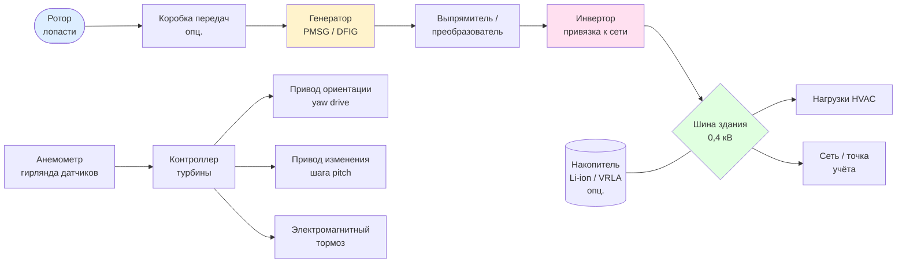

Ветротурбинные системы преобразуют кинетическую энергию движущегося воздуха в электрическую мощность, которая может покрывать нагрузки систем отопления, вентиляции и кондиционирования (HVAC — Heating, Ventilation and Air Conditioning). В отличие от солнечной генерации ветровые установки способны работать круглосуточно и в зимний период при достаточной ветровой обеспеченности площадки. Настоящий раздел охватывает физические основы извлечения мощности, классификацию конструкций турбин, методологию подбора оборудования и требования к электрической интеграции согласно ASHRAE 90.1, IEC 61400, ГОСТ Р 51330 и СП 60.13330.

## Физические основы мощности ветрового потока

### Уравнение кинетической мощности

Полная кинетическая мощность, заключённая в ветровом потоке, проходящем через площадь $A$ со скоростью $V$:


P_{\text{wind}} = \frac{1}{2}\,\rho\,A\,V^3


где:
- $\rho$ — плотность воздуха, кг/м³ (на уровне моря при 15 °C: $\rho = 1{,}225$ кг/м³; убывает ~1,2 % на каждые 100 м высоты)
- $A$ — площадь ометания ротора (swept area), м²
- $V$ — скорость ветра, м/с

Зависимость мощности от третьей степени скорости означает, что удвоение скорости ветра увеличивает доступную мощность в восемь раз. Это делает точность оценки ветрового ресурса площадки критически важной.

### Предел Бетца и коэффициент мощности

Теорема Бетца (1919) устанавливает максимальную долю кинетической мощности, которую идеальная турбина может извлечь из потока:


C_{p,\max} = \frac{16}{27} \approx 0{,}593


Реальная выходная мощность турбины с учётом коэффициента мощности $C_p$ и к.п.д. механической и электрической цепи $\eta_{\text{sys}}$:


P_{\text{turbine}} = \frac{1}{2}\,\rho\,A\,V^3\,C_p\,\eta_{\text{sys}}


Типичные значения: $C_p = 0{,}35\text{–}0{,}50$ для современных горизонтальных турбин (HAWT — Horizontal Axis Wind Turbine); $\eta_{\text{sys}} = 0{,}85\text{–}0{,}92$ с учётом коробки передач, генератора и преобразователя.

### Распределение Вейбулла

Скорость ветра описывается двухпараметрическим распределением Вейбулла (Weibull) с функцией плотности вероятности:


f(V) = \frac{k}{c}\left(\frac{V}{c}\right)^{k-1}\exp\!\left[-\left(\frac{V}{c}\right)^k\right]


где $k$ — параметр формы (обычно 1,5–2,5 для умеренных широт), $c$ — параметр масштаба (м/с), связанный со средней скоростью $\bar{V}$ через гамма-функцию: $\bar{V} = c\,\Gamma(1+1/k)$.

Среднегодовое производство энергии (AEP — Annual Energy Production):


E_{\text{AEP}} = 8760\int_0^\infty P(V)\,f(V)\,dV \approx 8760\sum_{i} P(V_i)\,f(V_i)\,\Delta V


где $P(V_i)$ — выходная мощность по кривой мощности турбины при скорости $V_i$.

## Горизонтальные ветротурбины (HAWT)

Конфигурации HAWT доминируют в практических приложениях благодаря наибольшему коэффициенту мощности. Ось ротора параллельна направлению ветра; лопасти вращаются в плоскости, перпендикулярной потоку.

### Площадь ометания ротора

Для трёхлопастной HAWT диаметром $D$ (радиус $R = D/2$):


A = \pi R^2


### Коэффициент тяги и осевая сила

Осевая нагрузка на конструкцию башни и фундамента:


F_{\text{thrust}} = \frac{1}{2}\,\rho\,A\,V^2\,C_T


где $C_T$ — коэффициент тяги (thrust coefficient); при номинальной скорости ветра $C_T \approx 0{,}7\text{–}0{,}9$.

### Соотношение быстроходности

Для поддержания максимального $C_p$ управление с переменной скоростью удерживает оптимальное соотношение быстроходности (tip speed ratio):


\lambda = \frac{\omega R}{V}


где $\omega$ — угловая скорость ротора, рад/с. Для трёхлопастных HAWT оптимум: $\lambda_{\text{opt}} = 6\text{–}8$.

### Схема компоновки HAWT





## Вертикальные ветротурбины (VAWT)

Конфигурации VAWT (Vertical Axis Wind Turbine) располагают ось ротора вертикально — перпендикулярно направлению ветра. Они уступают HAWT по $C_p$, но обладают эксплуатационными преимуществами в условиях городской застройки.

### Тип Дарье (Darrieus)

Аэродинамические лопасти создают подъёмную силу при любом направлении ветра. Конфигурации: яйцевидная (Troposkein), H-ротор, прямолопастная. Коэффициент мощности: $C_p = 0{,}25\text{–}0{,}35$. Требует внешнего пуска — в диапазоне малых $\lambda$ турбина не самозапускается.

### Тип Савониус (Savonius)

Использует силы лобового сопротивления (drag) на S-образных ковшах. Самозапускающийся, всенаправленный. Коэффициент мощности: $C_p = 0{,}15\text{–}0{,}20$. Применяется в вентиляционных дефлекторах и как стартовый каскад для гибридных VAWT.

### Преимущества VAWT для интеграции в здания

- Всенаправленная работа: не требует привода ориентации по ветру (yaw system)
- Генератор и электроника размещаются у основания конструкции — упрощение обслуживания
- Меньший уровень аэродинамического шума и вибраций, передаваемых в несущие конструкции
- Относительная нечувствительность к турбулентному городскому ветровому профилю
- Сниженное визуальное воздействие, меньшие ограничения по высоте в плотной застройке

## Сравнение конфигураций турбин


| Параметр | HAWT | Дарье VAWT | Савониус VAWT |
|---|---|---|---|
| Коэффициент мощности $C_p$ | 0,35–0,50 | 0,25–0,35 | 0,15–0,20 |
| Скорость запуска, м/с | 3–4 | 4–5 (внеш.) | 2–3 |
| Номинальная скорость, м/с | 12–17 | 10–12 | 8–10 |
| Скорость отключения, м/с | 25 | 20–25 | 20 |
| Скорость выживания, м/с | 50–60 | 40–50 | 40 |
| Уровень шума | Средний–высокий | Средний | Низкий |
| Устойчивость к турбулентности | Низкая | Средняя | Высокая |
| Управление ориентацией | Обязательно | Не нужно | Не нужно |
| Коэффициент использования (здание) | 10–25 % | 8–18 % | 5–12 % |
| Типичная мощность (здание) | 1–100 кВт | 1–50 кВт | 0,1–10 кВт |


## Малые ветровые системы для зданий (< 100 кВт)

Малые ветротурбины (small wind turbines, SWT) согласно IEC 61400-2 — установки с площадью ометания ротора до 200 м² и номинальной мощностью до 50 кВт (ряд производителей расширяет категорию до 100 кВт). Для объектов HVAC наиболее актуальны кровельные и фасадные установки.

### Аэродинамика кровельного размещения

Здание формирует сложную картину обтекания с зонами ускорения и торможения потока. Согласно результатам вычислительной гидродинамики (CFD — Computational Fluid Dynamics) и натурных измерений:

- Зоны ускорения у парапета и конька: $V_{\text{local}} / V_{\text{ref}} = 1{,}5\text{–}2{,}5$
- Зоны отрыва на наветренном краю крыши: интенсивность турбулентности $I_u > 20\,\%$
- Оптимальное положение для HAWT: на расстоянии не менее $D$ от края крыши и на высоте $\geq 0{,}5\,H_{\text{здания}}$ над кровлей

Локальная мощность ветра в зоне ускорения (параметр ускорения $\alpha > 1$):


P_{\text{local}} = \frac{1}{2}\,\rho\,A\,(α\,V_{\text{ref}})^3 = \alpha^3\,P_{\text{ref}}


При $\alpha = 1{,}6$ локальный ресурс возрастает в $1{,}6^3 = 4{,}1$ раза.

### Нагрузки на конструкцию

Осевая сила на башню при номинальном ветре (уравнение тяги):


F_{\text{thrust}} = \frac{1}{2}\,\rho\,A\,V_{\text{rated}}^2\,C_T


Изгибающий момент у основания башни высотой $H_{\text{m}}$:


M_{\text{base}} = F_{\text{thrust}}\,H_{\text{m}}


Конструкция крепления должна соответствовать требованиям СП 20.13330 (Нагрузки и воздействия) и IEC 61400-2 Annex G по динамической усталости.

### Годовое производство энергии: упрощённая оценка


E_{\text{annual}} = 8760\,P_{\text{rated}}\,CF


где $CF$ — коэффициент использования установленной мощности (capacity factor): 0,10–0,25 для кровельных установок; 0,25–0,45 для наземных открытых площадок; 0,35–0,50 для морских установок.

## Числовой пример: подбор турбины для здания

**Условие задачи.** Административное здание в г. Самара. Среднегодовая скорость ветра на высоте 30 м: $\bar{V} = 5{,}8$ м/с, параметры Вейбулла: $k = 2{,}0$, $c = 6{,}5$ м/с. Электрическая нагрузка HVAC: 18 000 кВт·ч/год (базовая, без пиков). Требуется: выбрать тип и диаметр HAWT, оценить годовое производство и долю покрытия нагрузки.

**Решение.**

Шаг 1. Целевое производство. Принимаем $CF = 0{,}20$ (кровельное размещение, городские условия):


P_{\text{rated}} = \frac{E_{\text{target}}}{8760 \times CF} = \frac{18\,000}{8760 \times 0{,}20} = 10{,}3 \text{ кВт} \Rightarrow \text{принимаем } P_{\text{rated}} = 11 \text{ кВт}


Шаг 2. Необходимая площадь ометания. При $V_{\text{rated}} = 14$ м/с, $C_p = 0{,}40$, $\eta_{\text{sys}} = 0{,}88$, $\rho = 1{,}225$ кг/м³:


A = \frac{2\,P_{\text{rated}}}{\rho\,V_{\text{rated}}^3\,C_p\,\eta_{\text{sys}}} = \frac{2 \times 11\,000}{1{,}225 \times 14^3 \times 0{,}40 \times 0{,}88} = \frac{22\,000}{1{,}225 \times 2744 \times 0{,}352} = \frac{22\,000}{1182{,}7} = 18{,}6 \text{ м}^2


Шаг 3. Диаметр ротора:


D = 2\sqrt{\frac{A}{\pi}} = 2\sqrt{\frac{18{,}6}{3{,}1416}} = 2 \times 2{,}43 = 4{,}87 \text{ м} \Rightarrow \text{принимаем } D = 5{,}0 \text{ м}


Уточнённая площадь: $A = \pi \times 2{,}5^2 = 19{,}6$ м².

Шаг 4. Проверка осевой силы при скорости отключения $V_{\text{cut-out}} = 25$ м/с, $C_T = 0{,}80$:


F_{\text{thrust}} = \frac{1}{2} \times 1{,}225 \times 19{,}6 \times 25^2 \times 0{,}80 = 0{,}5 \times 1{,}225 \times 19{,}6 \times 625 \times 0{,}80 = 5999 \text{ Н} \approx 6{,}0 \text{ кН}


При высоте мачты 6 м: $M_{\text{base}} = 6{,}0 \times 6 = 36{,}0$ кН·м — передаётся конструктору для расчёта фундаментного анкеража.

Шаг 5. Годовое производство с уточнённой площадью:


E_{\text{annual}} = 8760 \times 11{,}5 \times 0{,}20 = 20\,148 \text{ кВт·ч/год}


(номинальная мощность пересчитана для $A = 19{,}6$ м² при тех же параметрах: $P_{\text{rated}} \approx 11{,}5$ кВт)

Шаг 6. Доля покрытия нагрузки HVAC:


\xi = \frac{E_{\text{annual}}}{E_{\text{HVAC}}} = \frac{20\,148}{18\,000} = 112\,\%


Избыток (12 %) экспортируется в сеть (нетто-измерение) или накапливается. Результат: выбрана HAWT $D = 5$ м, $P_{\text{rated}} = 11{,}5$ кВт, расчётная экономия — замещение ~20 000 кВт·ч/год сетевой электроэнергии.

## Электрическая интеграция с сетью и системой здания

### Топологии подключения

**Инвертор, привязанный к сети (grid-tied inverter).** Генератор с постоянными магнитами (PMSG — Permanent Magnet Synchronous Generator) или двойного питания (DFIG — Doubly-Fed Induction Generator) через выпрямитель и PWM-инвертор подаёт энергию непосредственно на шину здания. Функции: согласование напряжения и частоты (50 Гц), защита от автономной работы (anti-islanding, ГОСТ Р 58753 / IEEE 1547).

**Гибридная система с накопителем.** Буферный накопитель (Li-ion или VRLA-АКБ) сглаживает пульсации ветрового производства и обеспечивает питание критических нагрузок HVAC при отключении сети. Размер накопителя определяется из требуемого времени автономности $t_{\text{auto}}$ и мощности приоритетных нагрузок $P_{\text{prio}}$:


E_{\text{storage}} = \frac{P_{\text{prio}}\,t_{\text{auto}}}{\eta_{\text{inv}}\,DoD}


где $DoD$ — допустимая глубина разряда (depth of discharge): 0,80 для Li-ion LFP, 0,50 для VRLA; $\eta_{\text{inv}} = 0{,}95\text{–}0{,}97$.

### Качество электроэнергии

Согласно ГОСТ 32144 (EN 50160) параметры качества у точки подключения:
- Коэффициент гармонических искажений напряжения (THD$_U$): $\leq 8\,\%$
- Коэффициент несимметрии обратной последовательности: $\leq 2\,\%$
- Отклонение частоты: $\pm 0{,}2$ Гц в установившемся режиме

Для соответствия нормам инверторный блок оснащается LCL-фильтром и активной компенсацией гармоник.

## Управление ветротурбиной

### Регулирование мощности

Выше номинальной скорости ветра мощность ограничивается одним из двух методов:

- **Управление шагом (pitch control):** электропривод поворачивает лопасти, уменьшая угол атаки. Точное поддержание $P_{\text{rated}}$, применяется в большинстве современных HAWT.
- **Пассивный срыв потока (stall control):** лопасти с фиксированным шагом аэродинамически срываются при превышении скорости. Простота, отсутствие привода, но менее плавное регулирование.

### Отслеживание точки максимальной мощности (MPPT)

При скоростях ниже номинальной контроллер поддерживает $\lambda_{\text{opt}}$ путём регулирования крутящего момента генератора:


M_{\text{gen}}^* = k_{\text{opt}}\,\omega^2, \quad k_{\text{opt}} = \frac{1}{2}\,\rho\,\pi R^5\,\frac{C_{p,\max}}{\lambda_{\text{opt}}^3}


### Системы безопасности

Согласно IEC 61400-1 (Design requirements for wind turbines) предусматриваются минимум два независимых канала остановки: аэродинамический (pitch-to-feather или stall), механический (дисковый тормоз) и электрический (short-circuit brake). Автоматическое отключение при превышении скорости ротора (overspeed), вибрации башни или потере связи с сетью.

## Нормативная и стандартная база


| Документ | Область применения |
|---|---|
| IEC 61400-1:2019 | Требования к проектированию ветротурбин (нагрузки, безопасность) |
| IEC 61400-2:2013 | Малые ветротурбины (до 200 м², до 50 кВт) |
| IEC 61400-11:2012 | Измерения акустического шума |
| IEC 61400-12:2017 | Испытания кривой мощности |
| ASHRAE 90.1-2022 | Нормирование энергопотребления зданий, ВИЭ |
| ISO 50001:2018 | Системы энергетического менеджмента |
| ГОСТ 32144 (EN 50160) | Качество электроэнергии в сети 0,4 кВ |
| ГОСТ Р 58753 (IEEE 1547) | Подключение распределённой генерации |
| СП 20.13330.2017 | Ветровые нагрузки на конструкции |
| СП 60.13330.2020 | Отопление, вентиляция и кондиционирование |
| ФЗ-261 (2009) | Об энергосбережении и энергоэффективности |
| VDI 4640 | Тепловые насосы; методология оценки ВИЭ |


## Характеристики эксплуатационного режима


| Параметр | Значение | Примечание |
|---|---|---|
| Скорость запуска (cut-in), м/с | 3–4 | Ниже — нет устойчивого вращения |
| Номинальная скорость (rated), м/с | 12–17 | Достигается $P_{\text{rated}}$ |
| Скорость отключения (cut-out), м/с | 25 | Безопасное торможение |
| Скорость выживания (survival), м/с | 50–60 | Конструктивный максимум |
| Срок службы, лет | 20–25 | По IEC 61400-1 |
| Коэффициент доступности | 0,95–0,98 | С плановым обслуживанием |
| Удельная стоимость кВт·ч (LCoE) | 0,06–0,14 $/кВт·ч | По данным IRENA 2023 |
| Удельные капитальные затраты | 1500–4000 $/кВт | Зависит от мощности и типа |


## Источники и литература

- IEA. *World Energy Outlook 2023*. International Energy Agency, Paris.
- IRENA. *Renewable Power Generation Costs in 2023*. Abu Dhabi: IRENA, 2024.
- IPCC AR6 WG III. *Mitigation of Climate Change*, Chapter 6: Energy Systems. Cambridge University Press, 2022.
- IEC 61400-1:2019. *Wind energy generation systems — Part 1: Design requirements*.
- IEC 61400-2:2013. *Wind turbines — Part 2: Small wind turbines*.
- ASHRAE Standard 90.1-2022. *Energy Standard for Sites and Buildings Except Low-Rise Residential Buildings*.
- ISO 50001:2018. *Energy management systems — Requirements with guidance for use*.
- Burton T. et al. *Wind Energy Handbook*, 3rd ed. Wiley, 2021.
- Manwell J.F., McGowan J.G., Rogers A.L. *Wind Energy Explained*, 2nd ed. Wiley, 2009.
- СП 20.13330.2017. Нагрузки и воздействия.
- СП 60.13330.2020. Отопление, вентиляция и кондиционирование воздуха.
- ФЗ-261 от 23.11.2009. Об энергосбережении и повышении энергетической эффективности.
