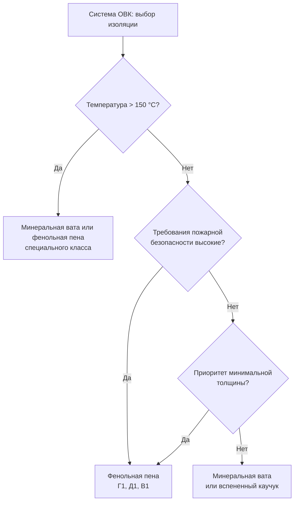

## Обзор

Фенольная пена (phenolic foam) — жёсткий синтетический теплоизоляционный материал, получаемый поликонденсацией фенола (C₆H₅OH) и формальдегида (CH₂O) в присутствии кислотного катализатора с образованием трёхмерной полимерной сетки. Замкнутые ячейки газа (азот или воздух) занимают 90–95 % объёма, что обусловливает низкую теплопроводность и высокое паросопротивление. По совокупности теплоизолирующей способности, огнестойкости и химической инертности фенольная пена занимает ведущее место среди жёстких пенополимеров, применяемых в системах отопления, вентиляции и кондиционирования (ОВК).

Коэффициент теплопроводности в сухом состоянии составляет 0,018–0,022 Вт/(м·К) при 10 °C, что примерно в 1,5–2 раза ниже, чем у минеральной ваты (mineral wool) типичной плотности, и позволяет достичь нормируемого теплового сопротивления при меньшей толщине изоляционного слоя. Согласно ASHRAE Handbook Fundamentals (гл. 33), расчётное долгосрочное тепловое сопротивление фенольной пены — одно из наиболее высоких среди доступных жёстких изоляций.

## Физические принципы и структура

### Полимерная матрица и ячеистая архитектура

Экзотермическая реакция поликонденсации формирует фенолформальдегидную (phenol-formaldehyde) смолу с поперечными связями. Долевое содержание замкнутых ячеек достигает 90–95 %; диаметр ячеек — 0,5–2 мм. Высокая степень замкнутости пор обеспечивает:

- малое водопоглощение (< 3 % по объёму за 24 ч, ISO 2896);
- высокий коэффициент паросопротивления μ = 40–100 (ISO 12572);
- механическую жёсткость достаточную для самонесущей изоляционной оболочки.

### Механизмы теплопередачи

Эффективная теплопроводность фенольной пены слагается из трёх составляющих:


\lambda_{\text{эфф}} = \lambda_{\text{тв}} + \lambda_{\text{газ}} + \lambda_{\text{рад}}


где:

- $\lambda_{\text{тв}}$ — кондуктивный перенос через твёрдый полимерный каркас; вклад 15–20 % от суммарной теплопроводности;
- $\lambda_{\text{газ}}$ — конвективно-кондуктивный перенос через газ в ячейках (азот, λ ≈ 0,026 Вт/(м·К)); вклад 60–70 %;
- $\lambda_{\text{рад}}$ — радиационный перенос, подавляемый тёмной окраской материала и поглощением инфракрасного излучения молекулами смолы; вклад 10–20 %.

При увлажнении теплопроводность возрастает по линейной аппроксимации (ASHRAE Handbook Fundamentals, гл. 33):


\lambda(w) = \lambda_0 + k_w \cdot w


где $\lambda_0 = 0{,}018{-}0{,}022$ Вт/(м·К) — теплопроводность в сухом состоянии; $w$ — влагосодержание, % масс.; $k_w \approx 0{,}0005{-}0{,}001$ Вт/(м·К·%).

## Свойства материала


| Параметр | Единица | Типовые значения | Стандарт |
|---|---|---|---|
| Коэффициент теплопроводности λ (сухой, 10 °C) | Вт/(м·К) | 0,018–0,022 | ISO 8301, ГОСТ 7076 |
| Тепловое сопротивление R на 25 мм | м²·К/Вт | 1,1–1,4 | ASTM C518 |
| Плотность ρ | кг/м³ | 25–50 | ISO 845 |
| Прочность на сжатие (10 % деформация) | кПа | 80–150 | ISO 844 |
| Максимальная рабочая температура | °C | 150–170 | ГОСТ 15588 |
| Группа горючести | — | Г1 (слабогорючий) | ГОСТ 30244 |
| Дымообразование при горении | — | Д1 (низкое) | ГОСТ 12.1.044 |
| Воспламеняемость | — | В1 (трудновоспламеняемый) | ГОСТ 30402 |
| Коэффициент паросопротивления μ | — | 40–100 | ISO 12572 |
| Водопоглощение за 24 ч | % объёма | < 3 | ISO 2896 |
| Рабочий диапазон температур | °C | −40 до +170 | — |


### Огнестойкость

Фенолформальдегидная смола при горении образует защитный углеродистый кокс, блокирующий дальнейшее распространение пламени. Это отличает фенольную пену от полиуретана и полистирола: последние при воспламенении выделяют значительно больше токсичных газов и горящих капель. По классификации EN 13501-1 материал соответствует классу B-s1,d0 (при наличии алюминиевой облицовки), что допускает его применение без дополнительного теплового барьера в скрытых конструкциях при соблюдении требований СП 60.13330 и ASHRAE 90.1.

## Расчёт теплоизоляции трубопровода

### Метод цилиндрических слоёв

Для изолированного трубопровода тепловой поток на единицу длины определяется:


q = \frac{2\pi\,(T_i - T_e)}{\dfrac{\ln(r_2/r_1)}{\lambda} + \dfrac{1}{h_e \cdot r_2}}


где:

- $T_i$ — температура теплоносителя, °C;
- $T_e$ — температура окружающей среды, °C;
- $r_1$ — наружный радиус трубы, м;
- $r_2 = r_1 + d$ — наружный радиус изоляции ($d$ — толщина слоя), м;
- $\lambda$ — теплопроводность фенольной пены, Вт/(м·К);
- $h_e$ — конвективный коэффициент теплоотдачи с наружной поверхности, Вт/(м²·К).

### Числовой пример

**Задача.** Трубопровод горячего водоснабжения: стальная труба DN 50 (наружный диаметр $D_1 = 60{,}3$ мм, $r_1 = 0{,}0302$ м), температура воды $T_i = 75$ °C, температура помещения $T_e = 20$ °C. Изоляция из фенольной пены $d = 30$ мм, $\lambda = 0{,}020$ Вт/(м·К), $h_e = 8$ Вт/(м²·К). Найти тепловой поток $q$ и сравнить с допускаемым значением по ASHRAE 90.1 (10 Вт/м).

**Решение:**

$$r_2 = 0{,}0302 + 0{,}030 = 0{,}0602 \text{ м}$$

$$\frac{\ln(r_2/r_1)}{\lambda} = \frac{\ln(0{,}0602/0{,}0302)}{0{,}020} = \frac{\ln(1{,}993)}{0{,}020} = \frac{0{,}690}{0{,}020} = 34{,}5 \text{ (м·К/Вт на м длины)}$$

$$\frac{1}{h_e \cdot r_2} = \frac{1}{8 \times 0{,}0602} = \frac{1}{0{,}482} = 2{,}07 \text{ (м·К/Вт на м длины)}$$

$$q = \frac{2\pi \times (75 - 20)}{34{,}5 + 2{,}07} = \frac{2\pi \times 55}{36{,}6} = \frac{345{,}6}{36{,}6} \approx 9{,}4 \text{ Вт/м}$$

Полученное значение 9,4 Вт/м не превышает допускаемого предела 10 Вт/м по ASHRAE 90.1 — толщина изоляции 30 мм является достаточной.

## Применение в системах ОВК

### Изоляция трубопроводов

Фенольная пена применяется в форме скорлуп (pipe shells) для изоляции:

- **трубопроводов горячего водоснабжения** (65–80 °C): толщина 25–40 мм; низкая теплопроводность обеспечивает выполнение требований ГОСТ 28547 и СП 60.13330 при минимальном диаметральном размере оболочки;
- **трубопроводов холодоснабжения** (4–12 °C): толщина 40–60 мм; высокое паросопротивление (μ = 40–100) практически исключает диффузию водяного пара к холодной поверхности;
- **паропроводов до 150 °C**: скорлупы с алюминиевой фольгой толщиной 50–100 мм; допускается кратковременный нагрев до 170 °C.

### Изоляция воздуховодов

Фенольные плиты (panels) наклеиваются на внешнюю поверхность прямоугольных и круглых воздуховодов систем переменного расхода (VAV) и постоянного расхода (CAV). Типовая толщина — 25–40 мм; наружный защитный слой — алюминиевая фольга (25–50 мкм) или армированная стеклоткань.

### Изоляция холодильного оборудования

В системах холодоснабжения с температурами теплоносителя от −10 °C до −40 °C фенольная пена конкурирует с полиизоциануратом (polyisocyanurate) и вспененным каучуком (elastomeric foam). Преимущества: более низкая теплопроводность и лучшая огнестойкость. Ограничение: необходима тщательная герметизация стыков для предотвращения диффузии пара.

## Стандарты и нормативные требования


| Область | Стандарт | Содержание |
|---|---|---|
| Теплопроводность | ISO 8301, ГОСТ 7076 | Метод защищённой горячей пластины |
| Механические свойства | ISO 844, ISO 845, ГОСТ 15588 | Прочность, плотность |
| Горючесть | ГОСТ 30244, ГОСТ 12.1.044, ГОСТ 30402, EN 13501-1 | Группа горючести, дымообразование, воспламеняемость |
| Влагостойкость | ISO 2896, ISO 12572 | Водопоглощение, паропроницаемость |
| Тепловая защита зданий | СП 50.13330.2017 (СНиП II-3-79) | Нормируемое сопротивление теплопередаче |
| Изоляция трубопроводов ОВК | СП 61.13330.2020, ASHRAE 90.1 | Минимальные толщины изоляции |
| Изоляция оборудования | ГОСТ 28547 | Тепловая изоляция оборудования и трубопроводов |


## Практические рекомендации

### Выбор толщины изоляции


| Назначение | Температура теплоносителя | Климат | Толщина, мм |
|---|---|---|---|
| Горячее водоснабжение | 65–80 °C | Умеренный (Москва) | 25–40 |
| Охлаждённая вода (чиллер) | 6–12 °C | Умеренный | 40–50 |
| Охлаждённая вода | 6–12 °C | Тёплый влажный | 50–60 |
| Холодоснабжение | −10…−30 °C | Любой | 60–80 |
| Паропровод | до 150 °C | Любой | 50–100 |


### Монтаж и защита

1. Стыки скорлуп и плит проклеивайте алюминиевой самоклеящейся лентой шириной не менее 50 мм; при температурах ниже 0 °C используйте ленту с акриловым клеем, сохраняющим адгезию до −20 °C.
2. На горизонтальных горячих трубопроводах предусматривайте компенсационные зазоры (не менее 5 мм на 10 м) для компенсации теплового расширения стальных труб.
3. Защищайте открытые участки от прямого воздействия ультрафиолетового излучения: УФ-излучение деградирует фенолформальдегидную смолу, снижая механическую прочность поверхностного слоя.
4. При монтаже в помещениях с влажностью выше 80 % обеспечивайте непрерывный паробарьер — любое нарушение облицовки фольги на холодных трубопроводах создаёт локальную точку конденсации.

### Типичные ошибки проектирования

- **Недооценка влияния влажности**: повышение влагосодержания на 5 % масс. увеличивает λ на 0,0025–0,005 Вт/(м·К), что снижает реальное тепловое сопротивление на 10–25 %. В расчётах следует принимать λ с коэффициентом запаса 1,1 при неконтролируемой влажности среды.
- **Отсутствие паробарьера на холодных поверхностях**: диффузия пара через стыки приводит к накоплению льда внутри изоляции в зимний период, необратимому разрушению ячеистой структуры и резкому росту теплопроводности.
- **Превышение температурного предела**: при температурах выше 170 °C фенольная смола начинает необратимо деструктировать; для паропроводов пара при давлении более 0,5 МПа (T > 151 °C) необходима верификация допускаемой температуры по техническим условиям производителя.

## Диаграмма применения





## Источники

- ASHRAE Handbook Fundamentals 2021, Chapter 33 — Thermal Insulation.
- ASHRAE 90.1-2022 — Energy Standard for Buildings.
- ISO 8301:1991 — Thermal insulation, determination of thermal resistance.
- ISO 2896:2001 — Rigid cellular plastics, water absorption.
- ISO 12572:2016 — Hygrothermal performance, water vapour transmission properties.
- ГОСТ 7076-99 — Теплопроводность строительных материалов.
- ГОСТ 30244-94 — Материалы строительные, методы испытания на горючесть.
- ГОСТ 15588-2014 — Плиты пенополистирольные (ссылка по аналогии для методологии испытаний жёстких пен).
- СП 50.13330.2017 — Тепловая защита зданий.
- СП 61.13330.2020 — Тепловая изоляция оборудования и трубопроводов.
- ГОСТ 28547-90 — Теплоизоляция трубопроводов промышленного оборудования.
