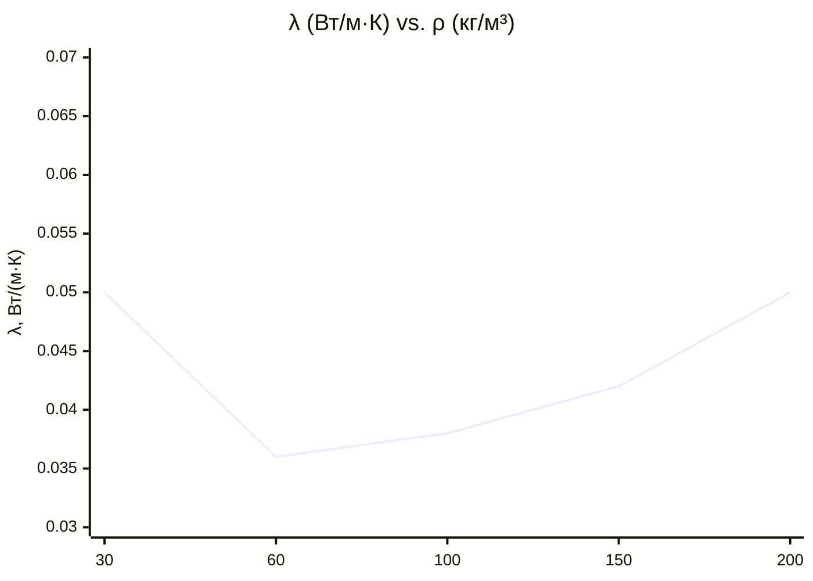

## Обзор

Минеральная вата (mineral wool) — волокнистый неорганический теплоизоляционный материал, получаемый расплавлением горных пород (базальт, диабаз, доломит) или промышленных шлаков при температурах 1 400–1 600 °C с последующим вытягиванием расплава в волокна диаметром 2–8 мкм. Различают два основных типа:

- **Каменная вата (rock wool, stone wool)** — из природного минерального сырья; максимальная рабочая температура до 700–750 °C; лучшая химическая стойкость;
- **Шлаковая вата (slag wool)** — из доменных или мартеновских шлаков; более вариабельный состав; несколько уступает каменной вате по температурной стойкости (до 600 °C).

Минеральная вата широко применяется в системах ОВК для изоляции воздуховодов, трубопроводов тепло- и холодоснабжения, оборудования холодильных установок. Ключевые достоинства: негорючесть (класс А1 или А2 по EN 13501-1), стойкость к биологическому разложению, хорошие акустические свойства и низкая стоимость. Недостаток — гигроскопичность: при увлажнении теплопроводность существенно возрастает, что требует защиты от влаги.

## Физические принципы

### Механизмы теплопередачи

Теплоизолирующий эффект минеральной ваты основан на захвате воздуха в сетке волокон. Эффективная теплопроводность λ определяется тремя составляющими:


\lambda_{\text{эфф}} = \lambda_{\text{тв}} + \lambda_{\text{конв}} + \lambda_{\text{рад}}


- $\lambda_{\text{тв}}$ — кондуктивный перенос через волокна минерала; доминирует при плотности ρ > 80–120 кг/м³;
- $\lambda_{\text{конв}}$ — конвективный перенос через поровый воздух; доминирует при ρ < 40 кг/м³; подавляется при увеличении плотности;
- $\lambda_{\text{рад}}$ — радиационный перенос; значим при температурах выше 200 °C.

Зависимость λ от температуры аппроксимируется линейным уравнением:


\lambda(T) = \lambda_{20} + \beta \cdot (T - 20)


где $\lambda_{20}$ — теплопроводность при 20 °C, Вт/(м·К); $\beta \approx 0{,}0003{-}0{,}0005$ Вт/(м·К²) — коэффициент температурной зависимости. При повышении температуры от 20 °C до 700 °C λ возрастает примерно в 2–3 раза за счёт радиационного вклада.

### Влияние плотности

При низкой плотности (ρ < 40 кг/м³) конвекция в крупных порах повышает λ. При оптимальной плотности (80–120 кг/м³) конвекция подавлена, а кондуктивный вклад через волокна относительно мал — λ достигает минимума. При ρ > 150 кг/м³ λ снова возрастает из-за увеличения объёмной доли твёрдой фазы.

## Свойства материала


| Параметр | Единица | Каменная вата | Шлаковая вата | Стандарт |
|---|---|---|---|---|
| Плотность ρ | кг/м³ | 30–200 | 30–150 | ISO 845 |
| Теплопроводность λ (при 10 °C, ρ = 60–100 кг/м³) | Вт/(м·К) | 0,033–0,042 | 0,040–0,050 | ISO 8301, ГОСТ 7076 |
| Теплопроводность λ (при 10 °C, ρ = 100–150 кг/м³) | Вт/(м·К) | 0,038–0,048 | 0,045–0,055 | ISO 8301 |
| Максимальная рабочая температура | °C | 700–750 | 550–600 | ГОСТ 9573 |
| Группа горючести | — | НГ (негорючий) | НГ | ГОСТ 30244 |
| Класс огнестойкости | — | A1 или A2-s1,d0 | A1 или A2 | EN 13501-1 |
| Водопоглощение за 24 ч | % объёма | 1–5 | 1–8 | ISO 29767 |
| Коэффициент звукопоглощения α (500–2000 Гц) | — | 0,70–0,95 | 0,65–0,90 | ISO 354 |
| Диаметр волокна | мкм | 3–8 | 4–10 | ГОСТ 9573 |
| Срок службы (при защите от влаги) | лет | 30–50 | 25–40 | — |


## Расчёт теплоизоляции

### Тепловое сопротивление плоской конструкции


R = \frac{\delta}{\lambda}


где δ — толщина слоя, м; λ — теплопроводность, Вт/(м·К).

Суммарное сопротивление многослойной конструкции с поверхностными плёнками:


R_{\text{total}} = \frac{1}{h_i} + \sum_k \frac{\delta_k}{\lambda_k} + \frac{1}{h_e}


где $h_i = 8$ Вт/(м²·К) и $h_e = 23$ Вт/(м²·К) — нормируемые поверхностные коэффициенты теплоотдачи для внутренней и наружной поверхностей ограждения (СП 50.13330.2017).

### Числовой пример

**Задача.** Воздуховод подачи охлаждённого воздуха ($T_i = 10$ °C) расположен в некондиционируемом техническом пространстве ($T_e = 28$ °C). Воздуховод — оцинкованная сталь толщиной 0,8 мм (теплопроводность 52 Вт/(м·К), термическим сопротивлением пренебрегаем). Требование ASHRAE 90.1 к тепловым потерям: $q \le 10$ Вт/м². Определить минимальную толщину δ изоляции из каменной ваты ρ = 80 кг/м³, λ = 0,038 Вт/(м·К).

**Решение:**

Предельное сопротивление изоляции при $h_i = 15$ Вт/(м²·К) (воздух в воздуховоде) и $h_e = 8$ Вт/(м²·К) (естественная конвекция снаружи):

$$R_{\text{total}} = \frac{T_e - T_i}{q} = \frac{28 - 10}{10} = 1{,}80 \text{ м}^2\text{·К/Вт}$$

$$R_{\text{изол}} = R_{\text{total}} - \frac{1}{h_i} - \frac{1}{h_e} = 1{,}80 - \frac{1}{15} - \frac{1}{8} = 1{,}80 - 0{,}067 - 0{,}125 = 1{,}608 \text{ м}^2\text{·К/Вт}$$

$$\delta = \lambda \cdot R_{\text{изол}} = 0{,}038 \times 1{,}608 = 0{,}061 \text{ м} = 61 \text{ мм}$$

Принимаем стандартную толщину δ = 63 мм (50 мм + 13 мм запас, стандартный типоразмер по ГОСТ 9573).

## Формы выпуска и применение

### Изоляция воздуховодов

Рулоны и маты наклеивают или закрепляют бандажами на наружной поверхности жёстких воздуховодов. Для прямоугольных воздуховодов систем VAV (Variable Air Volume) и CAV (Constant Air Volume) применяют плиты плотностью 40–60 кг/м³ толщиной 25–75 мм. Внешний защитный слой — алюминиевая фольга-стеклоткань (FSK, foil-scrim-kraft) предотвращает намокание и механические повреждения.

### Изоляция трубопроводов

Для трубопроводов тепло- и холодоснабжения применяют цилиндрические скорлупы (pipe sections) или маты. Трубопроводы хладагентов (R-134a, R-410A) изолируют ватой плотностью 100–150 кг/м³, толщиной 19–40 мм. При температурах поверхности ниже точки росы необходим сплошной паробарьер (алюминиевая фольга, полиэтиленовая плёнка 200 мкм).

### Высокотемпературные применения

Каменная вата плотностью 100–200 кг/м³ применяется для изоляции паропроводов (до 300–400 °C) и дымоходов котлов. При температурах выше 300 °C расчётное значение λ определяют с учётом температурной зависимости λ(T).

### Акустическая изоляция

Коэффициент звукопоглощения α = 0,75–0,95 в диапазоне 500–2 000 Гц при толщине 50–100 мм делает минеральную вату эффективным акустическим поглотителем в машинных отделениях и камерах смешивания. Согласно ASHRAE Handbook HVAC Applications, минеральная вата в воздуховодах снижает шум вентилятора на 2–5 дБА по сравнению с незащищёнными металлическими воздуховодами.





## Стандарты и нормативные требования


| Область | Стандарт | Содержание |
|---|---|---|
| Технические условия на изделия | ГОСТ 9573-2012 | Плиты и маты из минеральной ваты |
| Теплопроводность | ISO 8301, ГОСТ 7076 | Метод защищённой горячей пластины |
| Горючесть | ГОСТ 30244, EN 13501-1 | Классификация огнестойкости |
| Водопоглощение | ISO 29767 | Краткосрочное частичное погружение |
| Акустика | ISO 354 | Коэффициент звукопоглощения |
| Тепловая защита зданий | СП 50.13330.2017 | Нормируемое термическое сопротивление |
| Изоляция трубопроводов (ОВК) | СП 61.13330.2020, ASHRAE 90.1 | Минимальные толщины изоляции |
| Воздуховоды | SMACNA HVAC Duct Construction Standards | Требования к изоляции воздуховодов |


## Практические рекомендации

### Выбор плотности для систем ОВК


| Применение | Плотность, кг/м³ | Толщина, мм | Примечание |
|---|---|---|---|
| Воздуховоды вентиляции (ΔT < 10 К) | 40–60 | 25–40 | Внешнее оборачивание с FSK |
| Воздуховоды кондиционирования (ΔT 10–20 К) | 60–80 | 50–75 | Паробарьер обязателен |
| Трубопроводы горячей воды (65–80 °C) | 80–120 | 40–60 | Скорлупы + алюминиевый кожух |
| Трубопроводы хладагента | 100–150 | 19–40 | Паробарьер обязателен |
| Паропроводы (до 300 °C) | 100–200 | 50–100 | Матлаты с проволочной сеткой |
| Оборудование машинных залов (акустика) | 60–100 | 50–100 | Перфорированный металлический кожух |


### Защита от влаги

При относительной влажности воздуха выше 80 % поверхность минеральной ваты должна быть защищена:

- гидрофобизирующей пропиткой (кремнийорганический состав) на этапе производства — снижает водопоглощение до < 0,5 % по объёму;
- паропроницаемой ветрозащитной мембраной на вентилируемых участках;
- сплошным алюминиевым кожухом на трубопроводах вне помещений.

Увлажнение минеральной ваты на 5 % по объёму повышает λ на 0,005–0,010 Вт/(м·К), что снижает фактическое тепловое сопротивление 50-мм слоя каменной ваты (λ = 0,040 Вт/(м·К)) с 1,25 до 0,97 м²·К/Вт, то есть на 22 %. Поэтому сухость — критическое условие долгосрочной эффективности.

## Источники

- ASHRAE Handbook Fundamentals 2021, Chapter 33 — Thermal Insulation.
- ASHRAE Handbook HVAC Applications 2019, Chapter 49 — Noise and Vibration Control.
- ASHRAE 90.1-2022 — Energy Standard for Buildings.
- ГОСТ 9573-2012 — Плиты из минеральной ваты на синтетическом связующем.
- ГОСТ 7076-99 — Определение теплопроводности строительных материалов.
- ГОСТ 30244-94 — Методы испытания на горючесть.
- ISO 8301:1991 — Thermal insulation, determination of thermal resistance.
- ISO 354:2003 — Acoustics, measurement of sound absorption.
- ISO 29767:2009 — Rigid cellular plastics, short-term water absorption.
- EN 13501-1:2018 — Fire classification of construction products.
- СП 50.13330.2017 — Тепловая защита зданий.
- СП 61.13330.2020 — Тепловая изоляция оборудования и трубопроводов.
