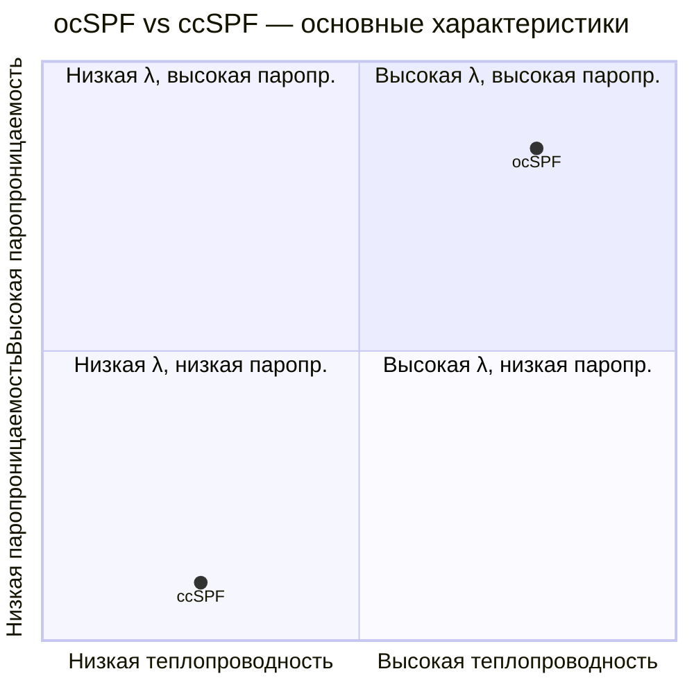

## Обзор

Открытоячеистая напыляемая полиуретановая пена (open-cell spray polyurethane foam, ocSPF) — вспененный эластичный полиуретановый материал с взаимосвязанными порами, наносимый методом напыления непосредственно на поверхность конструкции. В отличие от закрытоячеистой пены (ccSPF), поры взаимосвязаны, что обеспечивает высокую паропроницаемость и хорошее звукопоглощение при значительно меньшей плотности (6–12 кг/м³ против 30–55 кг/м³).

Основной вспениватель — вода, реагирующая с изоцианатом с выделением CO₂. Отсутствие газа-вспенивателя с низкой теплопроводностью определяет более высокую теплопроводность (λ = 0,036–0,040 Вт/(м·К)) по сравнению с ccSPF, но обеспечивает долгосрочную стабильность этого значения без эффекта старения.

В системах ОВК ocSPF применяется преимущественно для:

- герметизации воздухопроводных систем и устранения утечек в стыках;
- звукоизоляции в машинных отделениях и камерах смешивания;
- теплоизоляции строительных конструкций (мансарды, каркасные стены) при толщинах 100–200 мм;
- защиты от конденсации на поверхностях оборудования при умеренных температурах.

## Физические принципы

### Теплопроводность и её стабильность

Воздух в взаимосвязанных порах имеет теплопроводность λ ≈ 0,026 Вт/(м·К) при 20 °C (IAPWS-IF97 не применяется; теплопроводность сухого воздуха по ASHRAE Handbook Fundamentals, гл. 33). Тепловой поток через материал описывается законом Фурье:


q = \lambda \cdot \frac{\Delta T}{\delta}


где $q$ — тепловой поток, Вт/м²; $\lambda$ — теплопроводность, Вт/(м·К); $\Delta T$ — разность температур, К; $\delta$ — толщина слоя, м.

Поскольку поры заполнены воздухом, а не газом-вспенивателем, λ не изменяется с течением времени. Для проектирования допустимо использовать $\lambda_{\text{расч}} = 0{,}039$ Вт/(м·К) без поправки на старение — это принципиальное преимущество перед ccSPF.

### Паропроницаемость

Взаимосвязанная пористость допускает диффузию водяного пара; коэффициент паропроницаемости $\delta_v \approx 8{-}15$ нг/(м·с·Па) для слоя 25 мм. Согласно американской классификации, ocSPF толщиной 25 мм относится к классу III парового барьера (> 10 перм); при толщине 75 мм переходит в класс II (1–10 перм). Высокая паропроницаемость обеспечивает способность конструкции к диффузионному высыханию в тёплый сезон, что снижает риск накопления влаги в каркасных конструкциях.

Для климатических зон с преобладающим зимним направлением парового потока (Россия, Скандинавия) необходимо отдельно проверять режим конденсации методом Глазера (ГОСТ Р 56586, EN ISO 13788) или динамическими методами (WUFI, ASHRAE 160).

### Звукопоглощение

Взаимосвязанные поры создают механизм акустического поглощения за счёт вязкостных потерь при колебаниях воздуха в порах. Коэффициент звукопоглощения α = 0,50–0,80 в диапазоне 250–2 000 Гц при толщине 50–100 мм (ISO 354). Это делает ocSPF эффективным акустическим материалом для снижения шума в воздухопроводах и камерах смешивания ОВК.

## Свойства материала


| Параметр | Единица | Типовые значения | Стандарт |
|---|---|---|---|
| Плотность ρ | кг/м³ | 6–12 | ASTM D1622 |
| Теплопроводность λ (стабилизированная) | Вт/(м·К) | 0,036–0,040 | ASTM C518, ISO 8301 |
| Тепловое сопротивление R на 25 мм | м²·К/Вт | 0,63–0,67 | ASTM C518 |
| Паропроницаемость δ (25 мм) | нг/(м·с·Па) | 8–15 | ASTM E96 |
| Паропроницаемость δ (75 мм) | нг/(м·с·Па) | 3–5 | ASTM E96 |
| Воздухопроницаемость при 75 Па (d ≥ 90 мм) | л/(с·м²) | < 0,02 | ASTM E2178 |
| Прочность на сжатие (10 %) | кПа | 14–34 | ASTM D1621 |
| Прочность на растяжение | кПа | 34–69 | ASTM D1623 |
| Водопоглощение за 24 ч | % объёма | 10–20 | ASTM D2842 |
| Коэффициент звукопоглощения α (500–2000 Гц) | — | 0,50–0,80 | ISO 354 |
| Диапазон рабочих температур | °C | −40 до +80 | — |
| Эффект старения λ | — | Отсутствует | — |


## Расчёт теплоизоляции и паровых режимов

### Необходимая толщина изоляции

Требуемое тепловое сопротивление для ограждающей конструкции (СП 50.13330.2017):


R_{\text{total}} = R_{\text{нар}} + R_{\text{пена}} + R_{\text{вн}}


где $R_{\text{нар}} = 1/h_e$ и $R_{\text{вн}} = 1/h_i$ — сопротивления поверхностных плёнок.

Требуемая толщина пены:


\delta = \lambda \cdot (R_{\text{норм}} - R_{\text{нар}} - R_{\text{вн}})


### Числовой пример

**Задача.** Мансардное перекрытие жилого дома в Московской области (климатическая зона I, градусо-сутки отопления ГСОП = 4 943 °C·сут). Нормируемое сопротивление теплопередаче для перекрытий по СП 50.13330.2017: $R_{\text{норм}} = 6{,}0$ м²·К/Вт. Поверхностные сопротивления: $R_{\text{нар}} = 1/23 = 0{,}043$ м²·К/Вт (наружная), $R_{\text{вн}} = 1/8 = 0{,}125$ м²·К/Вт (внутренняя). Теплопроводность ocSPF: $\lambda = 0{,}039$ Вт/(м·К). Найти необходимую толщину.

**Решение:**

$$R_{\text{пена}} = R_{\text{норм}} - R_{\text{нар}} - R_{\text{вн}} = 6{,}0 - 0{,}043 - 0{,}125 = 5{,}832 \text{ м}^2\text{·К/Вт}$$

$$\delta = \lambda \cdot R_{\text{пена}} = 0{,}039 \times 5{,}832 = 0{,}227 \text{ м} \approx 230 \text{ мм}$$

Принимаем $\delta = 230$ мм (2 прохода по 115 мм или 3 прохода по 75 мм + 5 мм).

**Проверка паровых режимов.** При расположении ocSPF со стороны тёплого помещения (стандартная схема для мансарды) точка росы располагается вне материала при условии, что диффузионное высыхание в тёплый период компенсирует зимнее накопление. Верификацию по методу Глазера проводят согласно ГОСТ Р 56586 или EN ISO 13788.

## Применение в системах ОВК

### Герметизация воздухопроводов

ocSPF напыляется на стыки прямоугольных воздуховодов, фланцевые соединения и места прохода трубопроводов через перекрытия. Снижение утечек воздуха в системах приточно-вытяжной вентиляции достигает 30–50 % по сравнению с незапечатанными сборками при толщине 20–40 мм в местах соединений.

### Звукоизоляция машинных залов

В помещениях с чиллерами (chillers), вентиляторными агрегатами и компрессорами ocSPF наносится на стены и потолки для снижения шума в диапазоне 250–2 000 Гц. При толщине 75–100 мм обеспечивает снижение уровня звукового давления на 10–15 дБА по сравнению с необработанными бетонными поверхностями.

### Изоляция оборудования при умеренных температурах

ocSPF эффективна для защиты поверхностей оборудования ОВК (увлажнители, подогреватели, фильтрационные блоки) от конденсации при температурах поверхности от +4 °C до +15 °C в условиях высокой влажности (ОВ > 70 %). Толщина 50–75 мм обеспечивает достаточное тепловое сопротивление для подъёма температуры поверхности выше точки росы.

### Ограничения применения

- При температурах поверхности ниже 0 °C ocSPF не является надёжным паробарьером — необходима дополнительная пароизоляция или замена на ccSPF.
- Высокое водопоглощение (10–20 % по объёму) при прямом контакте с водой ухудшает тепловые свойства; материал не пригоден для наружных незащищённых участков.
- Пожарная безопасность: ocSPF требует теплового барьера (гипсокартон 12,7 мм) при открытом расположении в помещениях. Класс горючести по ГОСТ 30244: Г3–Г4 без специальных добавок; с антипиренами — Г2–Г3. Обязательно нанесение огнезащитного покрытия при скрытом монтаже в полостях конструкций.





## Стандарты и нормативные требования


| Область | Стандарт | Содержание |
|---|---|---|
| Технические условия | ASTM C1029, EN 14315 | Напыляемые жёсткие и полужёсткие пены |
| Плотность | ASTM D1622 | Кажущаяся плотность ячеистых пластмасс |
| Теплопроводность | ASTM C518, ISO 8301 | Метод защищённой горячей пластины |
| Паропроницаемость | ASTM E96, ISO 12572 | Чашечный метод |
| Воздухопроницаемость | ASTM E2178 | Лабораторный метод |
| Звукопоглощение | ISO 354 | Реверберационный метод |
| Горючесть | ASTM E84, ГОСТ 30244 | Распространение пламени, дымообразование |
| Тепловая защита зданий (РФ) | СП 50.13330.2017 | Нормируемое термическое сопротивление |
| Влажностный режим (РФ) | ГОСТ Р 56586, EN ISO 13788 | Метод Глазера, накопление конденсата |
| Изоляция трубопроводов (РФ) | СП 61.13330.2020 | Тепловая изоляция оборудования |


## Источники

- ASHRAE Handbook Fundamentals 2021, Chapter 33 — Thermal Insulation.
- ASHRAE 90.1-2022 — Energy Standard for Buildings.
- ASTM C1029 — Standard Specification for Spray-Applied Rigid Cellular Polyurethane Thermal Insulation.
- ASTM C518 — Standard Test Method for Steady-State Thermal Transmission Properties.
- ASTM D1622 — Standard Test Method for Apparent Density of Rigid Cellular Plastics.
- ASTM E96 — Standard Test Methods for Water Vapor Transmission of Materials.
- ASTM E2178 — Standard Test Method for Air Permeance of Building Materials.
- EN 14315:2013 — In-situ formed sprayed rigid polyurethane foam products.
- ISO 354:2003 — Acoustics, measurement of sound absorption.
- ISO 8301:1991 — Thermal insulation, determination of thermal resistance.
- ISO 12572:2016 — Hygrothermal performance, water vapour transmission properties.
- ГОСТ 30244-94 — Методы испытания на горючесть.
- ГОСТ Р 56586 — Тепловая защита зданий, влажностный режим.
- EN ISO 13788 — Hygrothermal performance of building components.
- СП 50.13330.2017 — Тепловая защита зданий.
- СП 61.13330.2020 — Тепловая изоляция оборудования и трубопроводов.
