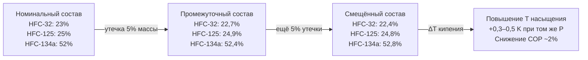

## Обзор

Смещение состава (composition shift) — изменение молярного и массового состава многокомпонентной холодильной смеси в ходе эксплуатации, обусловленное различием летучестей компонентов, утечками или нарушением технологии зарядки. Явление критично для зеотропных смесей — R-407C (HFC-32/125/134a = 23/25/52 % мас.), R-413A, R-417A — где давления насыщения и молекулярные массы компонентов существенно различаются.

Практическое следствие: изменение состава на 3–5 % мас. приводит к снижению холодопроизводительности на 5–10 % и отклонению фактического давления конденсации от проектного, что нарушает работу терморегулирующих вентилей (ТРВ) и электронных расширительных клапанов (EEV). Проблема актуальна для стационарных кондиционеров, тепловых насосов и промышленных холодильных установок.

## Физические принципы

### Равновесие пар–жидкость (Vapor-Liquid Equilibrium, VLE)

При наличии двухфазной зоны компоненты многокомпонентной смеси распределяются между паром и жидкостью согласно закону Рауля с поправками на неидеальность. Для компонента $i$ в бинарной системе:


p_i = x_i \, \gamma_i \, p_i^{\text{sat}}(T)


где $p_i$ — парциальное давление компонента $i$, Па; $x_i$ — мольная доля в жидкости; $\gamma_i$ — коэффициент активности (для HFC-смесей близок к 1); $p_i^{\text{sat}}(T)$ — давление насыщения чистого компонента при температуре $T$, Па.

Мольная доля компонента $i$ в паровой фазе:


y_i = \frac{p_i}{p_{\text{total}}}


Коэффициент распределения (K-factor), показывающий относительную летучесть:


K_i = \frac{y_i}{x_i} = \frac{\gamma_i \, p_i^{\text{sat}}(T)}{p_{\text{total}}}


Для R-407C при 30 °C: $K_{\text{HFC-32}} \approx 1{,}5$, $K_{\text{HFC-125}} \approx 1{,}0$, $K_{\text{HFC-134a}} \approx 0{,}6$. Компоненты с $K > 1$ предпочтительно концентрируются в паровой фазе.

### Механизм предпочтительного испарения

При утечке пара из системы теряется фаза, обогащённая более летучими компонентами (HFC-32 в R-407C, $T_{\text{кип}} = -51{,}7$ °C), тогда как менее летучая HFC-134a ($T_{\text{кип}} = -26{,}1$ °C) остаётся в жидкости. В результате состав оставшегося хладагента смещается в сторону тяжёлых компонентов, повышая температуру кипения смеси при неизменном давлении.

Типичное смещение за один цикл включения/отключения компрессора: мольная доля HFC-32 в жидкости снижается на 2–5 % относительно номинала.

## Расчётные методы

### Степень смещения при утечке

Если система содержит смесь массой $m$ (кг) с вектором массовых долей $\vec{w}$, и из неё уходит пар массой $\Delta m$ с составом $\vec{y}$, новый состав:


\vec{w}_{\text{new}} = \frac{m \, \vec{w}_{\text{old}} - \Delta m \, \vec{y}}{m - \Delta m}


Для малых утечек ($\Delta m \ll m$) изменение массовой доли компонента $i$:


\Delta w_i \approx -\frac{\Delta m}{m}(y_i - w_i)


### Расчёт теплофизических свойств смеси

Удельная теплоёмкость при постоянном давлении вычисляется как взвешенная сумма:


c_p^{\text{mix}} = \sum_i w_i \, c_{p,i}


где $w_i$ — массовая доля, $c_{p,i}$ — удельная теплоёмкость компонента $i$, кДж/(кг·К). Для типичных HFC-компонентов $c_{p,i} = 0{,}8\text{–}1{,}2$ кДж/(кг·К). Смещение состава на 1 % мас. сдвигает $c_p^{\text{mix}}$ на 5–10 Дж/(кг·К), что влияет на энтальпию и холодопроизводительность.

## Численный пример

**Задача.** Система содержит 5,0 кг R-407C номинального состава: $w_{\text{HFC-32}} = 0{,}23$, $w_{\text{HFC-125}} = 0{,}25$, $w_{\text{HFC-134a}} = 0{,}52$. Произошла утечка 50 г пара со стороны низкого давления. Состав паровой фазы при 30 °C из NIST REFPROP v10: $y_{\text{HFC-32}} = 0{,}28$, $y_{\text{HFC-125}} = 0{,}27$, $y_{\text{HFC-134a}} = 0{,}45$.

**Решение.** Новый состав жидкого хладагента:


w_{\text{HFC-32, new}} = \frac{5{,}0 \times 0{,}23 - 0{,}05 \times 0{,}28}{5{,}0 - 0{,}05} = \frac{1{,}150 - 0{,}014}{4{,}95} = \frac{1{,}136}{4{,}95} \approx 0{,}2295


Снижение доли HFC-32: $\Delta w \approx -0{,}0005$ (0,05 % мас.) — незначительно для одной утечки, но накапливается при хроническом негерметизме. При суммарной утечке 10 % массы (500 г из 5 кг) смещение достигает $\approx$ 0,5–1,0 % мас., что ощутимо влияет на температурный дрейф и COP системы.





## Методы зарядки и верификации


| Метод | Процедура | Преимущества | Ограничения |
|-------|-----------|--------------|-------------|
| Жидкостная зарядка | Баллон перевёрнут, жидкость через жидкостный клапан | Точный состав, быстро | Риск гидроудара без ограничителя расхода |
| Весовой метод | Электронные весы, ±10 г | Контроль количества | Не гарантирует состав при частичной зарядке |
| Паровая зарядка | Газообразный хладагент через всасывающий порт | Безопасно для компрессора | Медленно, неточность по составу смеси |
| Инструментальный контроль | Анализатор хладагента (ИК-спектроскопия) | Золотой стандарт | Требует специального оборудования |


Зарядка смесевых хладагентов производится только жидкой фазой из перевёрнутого баллона согласно ASHRAE 34-2022. Весовой метод с точностью ±10 г применяется для контроля количества; состав проверяется при стабилизированном режиме (27 °C ± 2 °C, не менее 2 часов работы) по характеристическому давлению конденсации.

## Применение в системах ОВК

**Системы переменного расхода воздуха (VAV).** Частое включение/отключение компрессора ускоряет предпочтительное испарение. При 6 и более включениях в час накопленное смещение за сезон может достичь 3–5 % мас.

**Тепловые насосы.** Реверсивный режим (отопление/охлаждение) усиливает VLE-эффекты. Смещение состава ведёт к снижению COP на 3–8 % за отопительный сезон без подзарядки (ASHRAE Handbook — Fundamentals, Ch. 30).

**Промышленные холодильные установки.** В системах с большим зарядом (100–500 кг) медленное смещение незаметно без периодического хроматографического анализа.

## Стандарты и нормативы

- **ASHRAE 34-2022** — обозначение и классификация хладагентов; допуски состава смесей ±0,5 % мас. на каждый компонент.
- **ASHRAE Handbook — Fundamentals (2021), Ch. 30** — термодинамические свойства хладагентов, методы расчёта VLE.
- **ISO 817:2014** — классификация и безопасность хладагентов; требования к паспортным данным смесей.
- **EN 378-2:2016+A1** — безопасность холодильных систем; контроль герметичности для смесей (утечка ≤ 10 г/год для стационарных систем класса A).
- **NIST REFPROP v10** — база уравнений состояния и VLE-расчётов для смесей HFC/HFO.
- **СП 60.13330.2020** — проектирование систем ОВК; требования к зарядке и обслуживанию.
- **ГОСТ 28547-2014** — хладагенты фторуглеродные; технические условия и допуски состава.

## Практические рекомендации


| Параметр | Норматив | Источник |
|----------|----------|----------|
| Допуск состава при зарядке | ±1 % мас./компонент | ASHRAE 34-2022 |
| Макс. допустимое смещение за сезон | ≤ 3–5 % мас. | Руководство производителя |
| Температурный дрейф R-407C при 30 °C | 5–6 К | NIST REFPROP v10 |
| Снижение COP на 1 % смещения состава | 2–3 % | ASHRAE Ch. 30 |
| Периодичность анализа состава | 1 раз/год (критичные объекты) | EN 378-2 |
| Предел герметичности (стационарные) | ≤ 10 г/год | EN 378-2 |


**Типичные ошибки:**

1. Зарядка системы только по давлению без весового контроля. Давление зависит от температуры и состава одновременно, поэтому без весового метода невозможно обеспечить номинальный заряд.

2. Восполнение утечки паровой фазой из баллона. Пар обогащён летучими компонентами, что немедленно смещает состав в неправильную сторону.

3. Недоучёт температурного дрейфа при проверке перегрева. На выходе испарителя R-407C показывает перегрев 8 °C вместо расчётных 12 °C — это сигнал о смещении состава к более лёгким компонентам, а не о нехватке заряда.

4. Долив хладагента без предварительного определения фактического состава и количества. Правильная процедура: взвесить систему (тарировочное взвешивание на стенде), сравнить с паспортным зарядом, при необходимости восстановить состав по результатам хроматографии.
