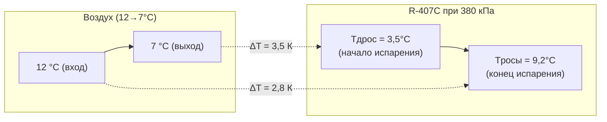

## Обзор

Зеотропные смеси (non-azeotropic blends, NAB) — смеси двух или более хладагентов, у которых при постоянном давлении температура начала кипения (bubble point) и температура точки росы (dew point) различаются. Промежуток между ними называется температурным дрейфом (temperature glide).

В отличие от азеотропных смесей (R-410A, R-404A) и чистых веществ, зеотропные смеси не имеют единой температуры фазового перехода: в ходе испарения более летучие компоненты переходят в пар первыми, а состав жидкой фазы непрерывно изменяется. Это свойство открывает возможность улучшить согласование температурных профилей в теплообменниках (glide matching), но одновременно требует строгого контроля состава при зарядке и техническом обслуживании.

Типичные примеры зеотропных смесей в ОВК: R-407C (замена R-22 в кондиционерах), R-407A и R-407F (коммерческое холодоснабжение), R-417A и R-422D (retrofit-замены R-22 в старых установках). Классификация и обозначение смесей установлены ASHRAE 34-2022 и ISO 817:2014.

## Физические принципы

### Температурный дрейф

Для бинарной зеотропной смеси дрейф определяется разностью температур насыщения при фиксированном давлении:


\Delta T_{\text{glide}} = T_{\text{dew}}(P) - T_{\text{bubble}}(P)


где $T_{\text{dew}}$ — температура точки росы, $T_{\text{bubble}}$ — температура начала кипения.

Типичные значения:
- R-407C: 5–7 К при давлениях испарения 300–500 кПа
- R-407A: 3–4 К
- R-407F: 6–8 К
- R-417A: 1,5–2,5 К (близок к азеотропному)

При повышении давления дрейф может уменьшаться или незначительно меняться — диаграммы P–T–x для конкретного состава рассчитываются с помощью NIST REFPROP v10.

### Диаграмма фазового равновесия

На диаграмме T–x (при постоянном давлении) зеотропная смесь имеет две кривые:

- **Линия кипения (bubble curve)** — нижняя граница: при данной температуре и составе жидкости появляется первый пузырёк пара.
- **Линия росы (dew curve)** — верхняя граница: при данной температуре и составе пара конденсируется последняя капля жидкости.

В двухфазной зоне (между кривыми) состав жидкой и паровой фаз отличается от общего состава смеси. Это и является причиной фракционирования при утечке.

### Фракционирование

При утечке хладагента из системы пар выходит в атмосферу. Поскольку паровая фаза обогащена более летучими компонентами (у R-407C — HFC-32, $T_{\text{кип}} = -51{,}7$ °C), оставшийся хладагент становится относительно богаче тяжёлыми компонентами (HFC-134a, $T_{\text{кип}} = -26{,}1$ °C). Итог: изменение состава, повышение температуры кипения при прежнем давлении, снижение холодопроизводительности.

Эффект фракционирования при потере 10–15 % массы хладагента:
- смещение состава на 15–25 % от номинала;
- снижение холодопроизводительности на 5–15 %;
- изменение температурного дрейфа на 1–3 К.

## Компоненты и конструкция смесей


| Хладагент | Компоненты | Состав, % мас. | $\Delta T_{\text{glide}}$, К | GWP (AR6) | Класс безопасности |
|-----------|-----------|---------------|-----------------------------|-----------|--------------------|
| R-407C | R-32/125/134a | 23/25/52 | 5–7 | 1774 | A1 |
| R-407A | R-32/125/134a | 20/40/40 | 3–5 | 2107 | A1 |
| R-407F | R-32/125/134a | 30/30/40 | 6–8 | 1825 | A1 |
| R-417A | R-125/134a/600 | 46,6/50/3,4 | 1,5–2 | 2346 | A1 |
| R-448A | R-32/125/1234yf/134a/1234ze | 26/26/20/21/7 | 4–6 | 1387 | A1 |
| R-449A | R-32/125/1234yf/134a | 24,3/24,7/25,3/25,7 | 5–6 | 1397 | A1 |


Данные по GWP по IPCC AR6 (2021); классификация безопасности по ASHRAE 34-2022.

### Согласование дрейфа (Glide Matching)

Оптимальное использование зеотропного дрейфа требует согласования профиля температур хладагента с профилем теплоносителя в теплообменнике. В противоточном теплообменнике условие оптимума:


\Delta T_{\text{glide,ref}} \approx \Delta T_{\text{теплоносит}}


При выполнении этого условия профили температур параллельны, движущая сила равномерна по длине аппарата, а необратимые потери минимальны. Для системы воздух–хладагент разница температур воздуха на входе и выходе испарителя составляет обычно 5–10 К, что хорошо согласуется с дрейфом R-407C (5–7 К).





## Расчётные методы

### Потери производительности при фракционировании

Приближённая оценка снижения COP при отклонении состава:


\Delta \text{COP} \approx k_f \cdot \Delta x_{\text{осн}}


где $\Delta x_{\text{осн}}$ — отклонение массовой доли основного компонента, %; $k_f \approx 0{,}05$–$0{,}10$ (% COP на % состава) — зависит от конкретной смеси.

Пример: состав R-407C отклонился на $\Delta x = 3$ % (в абсолютном выражении). Тогда $\Delta \text{COP} \approx 0{,}07 \times 3 = 0{,}21$, то есть снижение COP около 15–21 % от номинала — существенная потеря.

### Средняя температура в двухфазной зоне

Для приближённого расчёта энтальпии и плотности в двухфазной области ASHRAE рекомендует:


T_{\text{ср}} = \frac{T_{\text{bubble}} + T_{\text{dew}}}{2}


Эта величина используется при подборе давления испарения и конденсации в предварительных расчётах, но не заменяет пошаговый расчёт VLE при проектировании теплообменников.

## Численный пример

**Задача.** Кондиционер на R-407C работает при следующих условиях:
- Давление испарения: $P_{\text{исп}} = 380$ кПа
- Давление конденсации: $P_{\text{конд}} = 1820$ кПа
- Массовый расход хладагента: $\dot{m} = 0{,}15$ кг/с

Из NIST REFPROP v10: $h_{\text{вых исп}} = 430{,}5$ кДж/кг (пар в точке росы), $h_{\text{вх конд}} = 440{,}0$ кДж/кг (перегретый пар после компрессора), $h_{\text{вых конд}} = 254{,}0$ кДж/кг (переохлаждённая жидкость), $h_{\text{вх исп}} = 254{,}0$ кДж/кг (после дросселирования, изоэнтальпийный процесс).

**Холодопроизводительность:**


Q_{\text{исп}} = \dot{m}(h_{\text{вых исп}} - h_{\text{вх исп}}) = 0{,}15 \times (430{,}5 - 254{,}0) = 0{,}15 \times 176{,}5 = 26{,}5 \text{ кВт}


**Работа компрессора:**
$$W_{\text{комп}} = \dot{m}(h_{\text{вх конд}} - h_{\text{вых исп}}) = 0{,}15 \times (440{,}0 - 430{,}5) = 1{,}43 \text{ кВт}$$

**COP:**
$$\text{COP} = Q_{\text{исп}} / W_{\text{комп}} = 26{,}5 / 1{,}43 \approx 18{,}5$$

*Примечание: завышенный COP обусловлен упрощёнными значениями энтальпии. В реальном цикле с учётом КПД компрессора $\eta_s \approx 0{,}70$ и перегрева 10 К: COP ≈ 3,2–3,8.*

## Применение в системах ОВК

**Кондиционирование воздуха.** R-407C широко применялся как замена R-22 в бытовых и коммерческих сплит-системах. Дрейф 5–7 К улучшает теплообмен в пластинчатых испарителях на 3–5 % по сравнению с R-22 при правильной противоточной компоновке.

**Коммерческое холодоснабжение.** R-407A с дрейфом 3–5 К применяется в центральных холодильных станциях супермаркетов. Умеренный дрейф обеспечивает стабильность состава при небольших утечках.

**Тепловые насосы воздух–вода.** R-407C в тепловых насосах достигает COP 3,5–4,2 в режиме отопления благодаря лучшему согласованию температурных профилей в конденсаторе.

**HFO-содержащие смеси нового поколения.** R-448A и R-449A — зеотропные смеси HFC/HFO с пониженным GWP (< 1500), разработанные как перспективная замена R-404A и R-22. Их дрейф 4–6 К и класс безопасности A1 делают их совместимыми с большинством существующих систем после замены масла.

## Стандарты и нормативы

- **ASHRAE 34-2022** — классификация и безопасность хладагентов; R-407C, R-407A, R-448A — класс A1.
- **ASHRAE Handbook — Fundamentals (2021), Ch. 30, 31** — свойства хладагентов, методы расчёта смесей.
- **ISO 817:2014** — международная классификация хладагентов, соответствие обозначений.
- **EN 378-1:2016+A1** — безопасность холодильных систем; требования к зеотропным смесям.
- **NIST REFPROP v10** — база данных VLE и теплофизических свойств смесей.
- **СП 60.13330.2020** — проектирование систем ОВК; требования к хладагентам и теплообменникам.
- **ГОСТ 28547-2014** — хладагенты фторуглеродные; допуски состава смесей.

## Практические рекомендации


| Параметр | Норма | Комментарий |
|----------|-------|-------------|
| Допуск состава при зарядке | ±1 % мас./компонент | Весовой метод, ASHRAE 34 |
| Согласование дрейфа с теплоносителем | 60–80 % от $\Delta T_{\text{glide}}$ | Оптимум теплообмена |
| Переохлаждение на выходе конденсатора | 5–10 К | Предотвращение вскипания до ТРВ |
| Перегрев на выходе испарителя | 5–15 К | Тип расширительного устройства |
| Периодичность контроля герметичности | 1 раз/год | Минимум по EN 378 |
| Допустимая утечка | < 3 % в год | ASHRAE 15-2019 |


**Критические ошибки:**

1. **Зарядка паром вместо жидкостью.** Лёгкие компоненты смеси заполняют систему первыми, создавая необратимый перекос состава, устранимый только полным восстановлением заряда.

2. **Игнорирование температурного дрейфа при расчёте LMTD.** Использование единой $T_{\text{sat}}$ вместо диапазона $T_{\text{bubble}}$–$T_{\text{dew}}$ занижает LMTD и приводит к недопустимому росту площади теплообменника.

3. **Смешивание разных смесей.** Добавление R-407A вместо R-407C или R-410A в систему, спроектированную на R-407C, недопустимо: меняются давления, дрейф и настройки защитных устройств.

4. **Неконтролируемые утечки.** Фракционирование происходит незаметно для оператора; обнаружить его можно только сравнением рабочих давлений с паспортными данными при известной температуре.
