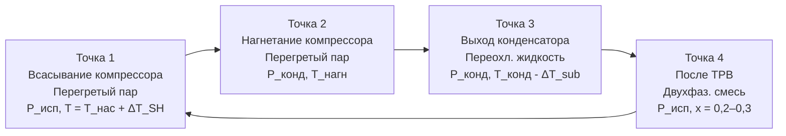

## Обзор

Свойства насыщения описывают термодинамическое состояние хладагента на кривой фазового равновесия жидкость–пар. При условиях насыщения температура и давление связаны однозначной зависимостью (кривая Клаузиуса-Клапейрона), а любой набор термодинамических свойств полностью определяется одной независимой переменной.

Понимание свойств насыщения является базовым для: анализа идеального и реального холодильного цикла, правильного выбора рабочих давлений испарителя и конденсатора, расчёта холодопроизводительности и работы компрессора, диагностики режима работы системы по соотношению давление/температура. Все свойства в этом разделе основаны на данных NIST REFPROP v10 и ASHRAE Handbook — Fundamentals (2021), Ch. 30–31.

## Термодинамическое определение состояния насыщения

Состояние насыщения — граница между однофазными областями на диаграмме термодинамических свойств. На этой границе:

- жидкая и паровая фазы сосуществуют в термодинамическом равновесии;
- температура и давление взаимозависимы: задание одного из них однозначно фиксирует другое;
- добавление теплоты при постоянном давлении вызывает фазовый переход без изменения температуры (для чистых веществ);
- свойства скачкообразно изменяются между насыщенной жидкостью ($f$) и насыщенным паром ($g$).

## Уравнение Клаузиуса-Клапейрона

Фундаментальное соотношение между температурой и давлением насыщения:


\frac{dP_{\text{sat}}}{dT} = \frac{h_{fg}}{T \cdot v_{fg}}


где $h_{fg} = h_g - h_f$ — удельная теплота испарения (скрытая теплота), кДж/кг; $v_{fg} = v_g - v_f$ — разность удельных объёмов, м³/кг; $T$ — абсолютная температура, К.

Следствия: давление насыщения растёт с температурой нелинейно (приблизительно экспоненциально), что объясняет высокую чувствительность рабочего давления к изменениям температуры. Для R-134a при 40 °C: $dP/dT \approx 60$ кПа/К; повышение температуры конденсации на 1 К увеличивает давление конденсации примерно на 60 кПа и дополнительно нагружает компрессор.

## Свойства насыщенной жидкости

Насыщенная жидкость (индекс $f$) — жидкость непосредственно перед началом кипения при данном давлении.

**Удельный объём $v_f$ (м³/кг).** Типичный диапазон для HFC-хладагентов: 0,00070–0,00135 м³/кг. Значительно меньше $v_g$; слабо зависит от температуры. Определяет расход жидкостных насосов и диаметр жидкостных магистралей.

**Энтальпия $h_f$ (кДж/кг).** Опорная точка (нулевое значение $h_f$) устанавливается конвенционально — для R-134a по ASHRAE: $h_f = 0$ кДж/кг при $T = -40$ °C. Значение $h_f$ на входе испарителя определяет начало рабочего хода в цикле.

**Энтропия $s_f$ (кДж/(кг·К)).** Нужна для расчёта идеального цикла. Возрастает с температурой.

**Плотность $\rho_f = 1/v_f$ (кг/м³).** Уменьшается с ростом температуры; для R-134a: от ~1390 кг/м³ при −40 °C до ~1066 кг/м³ при 40 °C.


| Хладагент | $T_{\text{исп}}$, °C | $P_{\text{исп}}$, кПа | $T_{\text{конд}}$, °C | $P_{\text{конд}}$, кПа | $\rho_f(T_{\text{исп}})$, кг/м³ |
|-----------|----------------------|----------------------|----------------------|----------------------|--------------------------------|
| R-410A | 4,4 | 814 | 37,8 | 2551 | 1059 |
| R-134a | 4,4 | 255 | 37,8 | 855 | 1255 |
| R-32 | 4,4 | 662 | 37,8 | 2069 | 990 |
| R-290 | 4,4 | 538 | 37,8 | 1586 | 494 |
| R-717 | 4,4 | 516 | 37,8 | 1460 | 616 |
| R-744 | 4,4 | 4969 | 37,8 | 10380 | 834 (надкрит.) |


Данные NIST REFPROP v10. Для R-744 при 37,8 °C — транскритический режим.

## Свойства насыщенного пара

Насыщенный пар (индекс $g$) — пар при завершении испарения, непосредственно перед перегревом.

**Удельный объём $v_g$ (м³/кг).** Намного больше $v_f$ (в 100–600 раз в типовых условиях испарителя). Определяет рабочий объём компрессора: $V_{\text{комп}} = \dot{m} \cdot v_g / \eta_v$. При снижении температуры испарения $v_g$ резко растёт, что ограничивает применимость компрессора данного типа.

**Энтальпия $h_g = h_f + h_{fg}$ (кДж/кг).** Начальная точка процесса сжатия. Вместе с $h_f$ на входе испарителя определяет холодопроизводительность на единицу массового расхода.

**Энтропия $s_g$ (кДж/(кг·К)).** Начальная точка пути изоэнтропного сжатия 1→2s. Значение $s_g$ при условиях всасывания однозначно определяет теоретическую температуру нагнетания.

## Скрытая теплота испарения


h_{fg}(T) = h_g(T) - h_f(T)


Скрытая теплота уменьшается с ростом температуры и обращается в ноль в критической точке. Высокое значение $h_{fg}$ означает большую холодопроизводительность на единицу массового расхода хладагента.


| Хладагент | $h_f$, кДж/кг | $h_{fg}$, кДж/кг | $h_g$, кДж/кг |
|-----------|--------------|----------------|--------------|
| R-410A | 170,5 | 385,5 | 556,0 |
| R-134a | 103,2 | 391,6 | 494,8 |
| R-32 | 210,9 | 594,6 | 805,5 |
| R-404A | 134,9 | 350,9 | 485,8 |
| R-717 | 347,5 | 1282,0 | 1629,5 |


Аммиак (R-717) имеет исключительно высокую $h_{fg}$ — примерно в 3,3 раза выше R-134a — что позволяет использовать значительно меньшие массовые расходы при равной холодопроизводительности, снижая диаметры трубопроводов и размеры компрессора.

## Качество двухфазной смеси

Качество (степень сухости) $x$ — массовая доля паровой фазы в двухфазной смеси:


x = \frac{m_g}{m_g + m_f}


Диапазон: $x = 0$ (насыщенная жидкость) до $x = 1$ (насыщенный пар). Свойства смеси в двухфазной зоне:


h = h_f + x \cdot h_{fg}, \quad v = v_f + x \cdot v_{fg}, \quad s = s_f + x \cdot s_{fg}


**Численный пример.** R-410A при $T = 4{,}4$ °C, $h = 350{,}0$ кДж/кг. Из таблицы: $h_f = 170{,}5$ кДж/кг, $h_{fg} = 385{,}5$ кДж/кг.


x = \frac{h - h_f}{h_{fg}} = \frac{350{,}0 - 170{,}5}{385{,}5} = \frac{179{,}5}{385{,}5} = 0{,}466


Смесь содержит 46,6 % пара и 53,4 % жидкости по массе. Такое значение качества характерно для входа в испаритель после дросселирования — жидкость обеспечивает теплообмен, пар занимает объём без полезного охлаждения (называется «вспышечный пар», flash gas).





## Методы интерполяции

### Линейная интерполяция


y = y_1 + \frac{T - T_1}{T_2 - T_1}(y_2 - y_1)


Точность: ±1–2 % при $|T - T_i| \leq 5$ К.

### Логарифмическая интерполяция давления


\ln P = \ln P_1 + \frac{T - T_1}{T_2 - T_1}(\ln P_2 - \ln P_1)


Точность: ±0,3–0,5 % в диапазоне 10–20 К. Предпочтительна для давлений, поскольку зависимость $P_{\text{sat}}(T)$ близка к экспоненциальной.

## Соотношения давлений при типовых условиях

Коэффициент давления $\pi = P_{\text{конд}} / P_{\text{исп}}$ характеризует нагрузку на компрессор. Чем ниже $\pi$ — тем выше КПД при прочих равных условиях.


| Хладагент | $P_{\text{исп}}$, кПа | $P_{\text{конд}}$, кПа | $\pi = P_{\text{к}}/P_{\text{и}}$ | $h_{fg}$ (исп.), кДж/кг |
|-----------|-----------------------|----------------------|----------------------------------|------------------------|
| R-410A | 814 | 2551 | 3,13 | 386 |
| R-134a | 255 | 855 | 3,35 | 392 |
| R-32 | 662 | 2069 | 3,13 | 595 |
| R-290 | 538 | 1586 | 2,95 | 407 |
| R-744 | 4969 | 10380 | 2,09 | — (надкрит.) |


## Применение в системах ОВК

**Диагностика по давлению–температуре.** Измеренные давление и температура на всасывании и нагнетании сравниваются с данными таблиц насыщения. Отклонение $P_{\text{факт}} > P_{\text{sat}}(T_{\text{конд}})$ указывает на загрязнение системы неконденсируемыми газами (воздух, азот). Отклонение $T_{\text{факт}} > T_{\text{sat}}(P_{\text{всас}})$ подтверждает наличие перегрева.

**Оценка заряда хладагента.** Нормальный перегрев всасывания (5–10 К) при нормальном переохлаждении конденсатора (5–8 К) с правильными давлениями является признаком номинального заряда. Нулевой перегрев при сниженном переохлаждении — признак избытка хладагента.

**Выбор компрессора.** Плотность всасывания $\rho_1 = 1/v_g(T_{\text{исп}})$ определяет объёмный расход при заданной холодопроизводительности: $\dot{V} = Q_0 / (h_{fg} \cdot \rho_1)$.

## Стандарты и нормативы

- **ASHRAE Handbook — Fundamentals (2021), Ch. 30, 31** — полные таблицы свойств насыщения для R-134a, R-410A, R-32, R-290, R-717, R-744 и смесей.
- **NIST REFPROP v10** — эталонная база уравнений состояния; обоснование данных в ASHRAE Ch. 30.
- **ISO 817:2014** — классификация и обозначение хладагентов.
- **ASHRAE 34-2022** — безопасность и чистота хладагентов; допуски на состав.
- **IAPWS-IF97** — свойства воды/пара для абсорбционных и паровых систем.
- **СП 60.13330.2020** — проектирование систем ОВК; расчётные значения параметров.
- **ГОСТ 28547-2014** — хладагенты фторуглеродные; идентификация и допуски.
