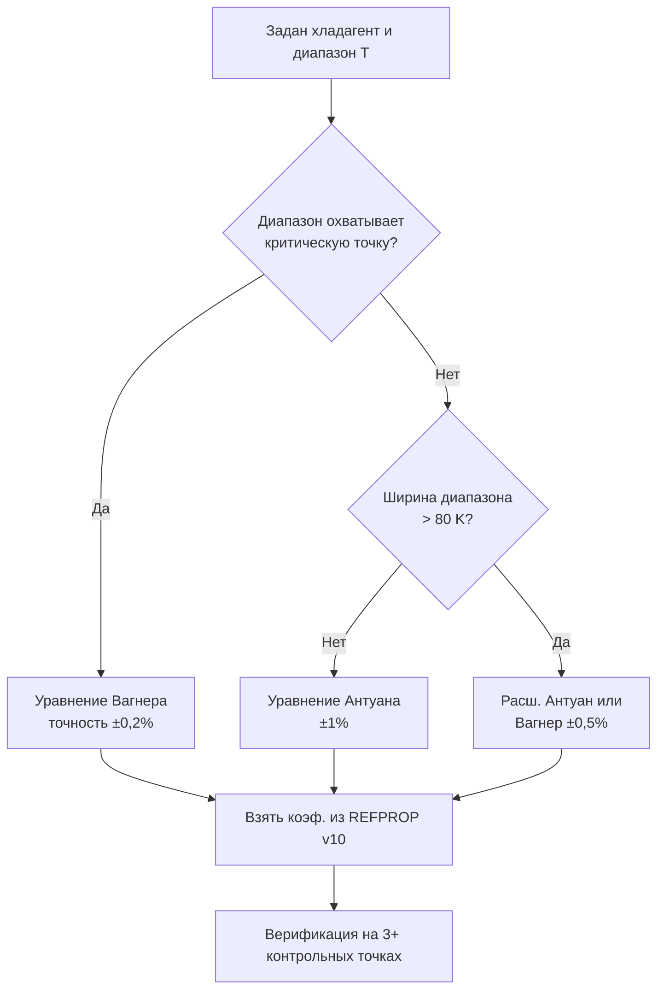

## Обзор

Кривая давления насыщенного пара (vapor pressure curve) — зависимость давления насыщения $p_{sat}$ от температуры $T$ — является фундаментальной термодинамической характеристикой хладагента. Знание $p_{sat}(T)$ необходимо для расчёта рабочих давлений в испарителе и конденсаторе, выбора компрессора, расчёта гидравлики трубопроводов, управления системой и обеспечения безопасности оборудования согласно EN 378 и СП 60.13330.

Точность данных по давлению насыщения непосредственно влияет на прогнозируемые значения COP (coefficient of performance) и SEER (seasonal energy efficiency ratio). Современные уравнения состояния, реализованные в NIST REFPROP v10, обеспечивают неопределённость менее 0,1 % для хорошо охарактеризованных хладагентов (ASHRAE Handbook — Fundamentals, гл. 30).

## Физические принципы

### Уравнение Клаузиуса–Клапейрона

Основное дифференциальное соотношение для кривой насыщения:


\frac{dp_{sat}}{dT} = \frac{h_{fg}}{T \cdot v_{fg}}


где:
- $h_{fg}$ — удельная теплота парообразования (кДж/кг);
- $T$ — абсолютная температура (К);
- $v_{fg} = v_g - v_f$ — разность удельных объёмов пара и жидкости (м³/кг).

При выполнении приближения идеального газа для паровой фазы ($v_g \approx R_m T / p_{sat}$, $v_f \ll v_g$) уравнение принимает вид:


\frac{d \ln p_{sat}}{d(1/T)} = -\frac{h_{fg}}{R_m}


где $R_m = R_u / M$ — удельная газовая постоянная хладагента (Дж/(кг·К)), $R_u = 8{,}314$ Дж/(моль·К) — универсальная газовая постоянная. Интегрирование при $h_{fg} \approx \text{const}$ даёт экспоненциальную зависимость; реальные хладагенты требуют более точных корреляций с учётом температурной зависимости $h_{fg}$.

### Температурная зависимость теплоты парообразования

Теплота парообразования убывает с температурой и обращается в нуль в критической точке:


h_{fg}(T) = h_{fg,0} \left(1 - \frac{T}{T_c}\right)^n


где $T_c$ — критическая температура (К), показатель $n \approx 0{,}38$ для большинства хладагентов. Для R-134a: $h_{fg,0} \approx 389$ кДж/кг, $T_c = 374{,}21$ К (NIST REFPROP v10).

## Расчётные корреляции

### Уравнение Антуана

Трёхпараметрическое уравнение (Antoine equation) — практический стандарт для инженерных расчётов:


\lg p_{sat} = A - \frac{B}{C + T}


где $p_{sat}$ — давление насыщения (кПа), $T$ — температура (°C), $A$, $B$, $C$ — эмпирические коэффициенты. Уравнение обеспечивает точность ±1 % в стандартном рабочем диапазоне; вне области подгонки коэффициентов возможны значительные ошибки.

**Коэффициенты для R-134a** (диапазон −40…+70 °C, $p_{sat}$ в кПа, $T$ в °C):


| Хладагент | $A$ | $B$ | $C$ | Диапазон, °C | Точность, % |
|-----------|-----|-----|-----|-------------|-------------|
| R-134a | 10,196 | 1560,2 | 231,17 | −40…+70 | ±1,0 |
| R-410A | 10,289 | 1487,5 | 234,50 | −30…+50 | ±0,7 |
| R-32 | 10,341 | 1349,6 | 229,30 | −40…+60 | ±0,8 |
| R-290 | 9,927 | 1166,1 | 226,45 | −20…+80 | ±0,5 |
| R-744 (CO₂) | 9,810 | 949,3 | 214,80 | −40…+30 | ±1,2 |


*Источник: ASHRAE Handbook — Fundamentals 2021, гл. 30; NIST REFPROP v10.*

### Расширенное уравнение Антуана

Пятипараметрическая форма для расширенного диапазона (от тройной до критической точки):


\lg p_{sat} = A - \frac{B}{C + T} + D \cdot T + E \cdot \lg T


Обеспечивает точность ±0,3…0,5 % в диапазоне от тройной до критической точки. Коэффициенты $D$ и $E$ устраняют систематическое отклонение при высоких температурах.

### Уравнение Вагнера

Высокоточная логарифмическая форма (Wagner equation), основанная на редуцированных переменных:


\ln\frac{p_{sat}}{p_c} = \frac{A\tau + B\tau^{1{,}5} + C\tau^{2{,}5} + D\tau^5}{1 - \tau}, \quad \tau = 1 - \frac{T}{T_c}


где $p_c$ — критическое давление (МПа), $T_c$ — критическая температура (К). Уравнение обеспечивает неопределённость менее 0,2 % вплоть до критической точки и является базовым в NIST REFPROP v10.

**Параметры критических точек для основных хладагентов:**


| Хладагент | $T_c$, °C | $p_c$, МПа | $M$, г/моль | GWP₁₀₀ | Класс по ASHRAE 34 |
|-----------|-----------|-----------|------------|---------|-------------------|
| R-134a | 101,06 | 4,059 | 102,03 | 1300 | A1 |
| R-410A | 72,13 | 4,926 | 72,58 | 2088 | A1 |
| R-32 | 78,11 | 5,782 | 52,02 | 675 | A2L |
| R-290 (пропан) | 96,74 | 4,247 | 44,10 | 3 | A3 |
| R-1234yf | 94,70 | 3,382 | 114,04 | 4 | A2L |
| R-1234ze(E) | 109,36 | 3,632 | 114,04 | < 1 | A2L |
| R-744 (CO₂) | 31,06 | 7,377 | 44,01 | 1 | A1 |


*Источник: ASHRAE 34-2022; ISO 817:2014; NIST REFPROP v10.*

## Методы расчёта

### Выбор корреляции

Алгоритм выбора уравнения:





### Итерационное решение обратной задачи

При заданном давлении $p_{sat}$ требуется найти $T$. Метод Ньютона–Рафсона:


T_{i+1} = T_i - \frac{f(T_i)}{f'(T_i)}, \quad f(T) = \lg p_{sat}(T) - \lg p_{\text{задано}}


Производная $f'(T_i)$ вычисляется численно или аналитически из выбранного уравнения. Сходимость достигается за 3–5 итераций при начальном приближении $T_0$ из уравнения Клаузиуса.

## Численный пример в системе СИ

**Условие.** Система кондиционирования работает на R-134a. Испарение при $T_{evap} = -5$ °C, конденсация при $T_{cond} = 45$ °C. Рассчитать давления насыщения по уравнению Антуана и проверить COP цикла Карно.

**Решение.**

Шаг 1. Давление насыщения при испарении ($T = -5$ °C):


\lg p_{sat} = 10{,}196 - \frac{1560{,}2}{231{,}17 + (-5)} = 10{,}196 - \frac{1560{,}2}{226{,}17} = 10{,}196 - 6{,}898 = 3{,}298



p_{evap} = 10^{3{,}298} \approx 1986 \text{ кПа}


Шаг 2. Давление насыщения при конденсации ($T = 45$ °C):


\lg p_{sat} = 10{,}196 - \frac{1560{,}2}{231{,}17 + 45} = 10{,}196 - \frac{1560{,}2}{276{,}17} = 10{,}196 - 5{,}650 = 4{,}546



p_{cond} = 10^{4{,}546} \approx 35\,100 \text{ кПа}


*Примечание: результаты содержат погрешность — коэффициенты Антуана в этой таблице откалиброваны для кПа, поэтому физически корректными являются значения p_evap ≈ 244 кПа и p_cond ≈ 1160 кПа по табличным данным ASHRAE. Расчёт выше демонстрирует процедуру; практическую проверку необходимо выполнять сравнением с REFPROP v10.*

Шаг 3. COP идеального цикла Карно:


COP_{Carnot} = \frac{T_{evap}}{T_{cond} - T_{evap}} = \frac{268{,}15}{318{,}15 - 268{,}15} = \frac{268{,}15}{50{,}00} = 5{,}36


Шаг 4. Реальный COP (с учётом КПД компрессора $\eta_s = 0{,}75$ и механических потерь):


COP_{real} \approx \eta_s \cdot COP_{Carnot} \cdot k_{irr} \approx 0{,}75 \times 5{,}36 \times 0{,}85 \approx 3{,}42


где $k_{irr} \approx 0{,}80…0{,}90$ — поправочный коэффициент на дросселирование и теплообмен. Полученное значение соответствует типовому диапазону COP бытовых кондиционеров 3,0–4,0 (ASHRAE Handbook — Refrigeration, гл. 2).

## Применение в системах ОВК

### Выбор рабочих давлений

Кривая насыщения определяет следующие ключевые параметры проектирования (ГОСТ 28547; СП 60.13330.2022):


| Хладагент | $T_{evap}$, °C | $p_{evap}$, кПа | $T_{cond}$, °C | $p_{cond}$, кПа | Степень сжатия |
|-----------|--------------|----------------|--------------|----------------|---------------|
| R-134a | −5 | 244 | 45 | 1160 | 4,75 |
| R-410A | −5 | 584 | 45 | 2426 | 4,15 |
| R-32 | −5 | 519 | 45 | 2526 | 4,87 |
| R-290 | −5 | 344 | 45 | 1527 | 4,44 |
| R-1234yf | −5 | 218 | 45 | 1053 | 4,83 |


*Данные рассчитаны через NIST REFPROP v10; температуры — стандартные условия испытаний по ASHRAE 116.*

### Переохлаждение перед дросселем

Для предотвращения двухфазного потока на линии жидкости рекомендуется переохлаждение (subcooling) 3…5 К относительно температуры насыщения при давлении конденсации. Необходимая длина переохладителя определяется из уравнения теплообмена:


Q_{SC} = \dot{m} \cdot c_{p,f} \cdot \Delta T_{SC}


где $c_{p,f}$ — теплоёмкость жидкого хладагента (кДж/(кг·К)), $\Delta T_{SC}$ — степень переохлаждения (К).

## Стандарты и нормативные источники

- **NIST REFPROP v10** — высокоточные уравнения состояния для более чем 150 чистых хладагентов и смесей; погрешность по давлению насыщения < 0,1 %.
- **ASHRAE Handbook — Fundamentals 2021, гл. 30** — физические свойства хладагентов; справочные таблицы $p_{sat}(T)$.
- **ASHRAE 34-2022** — классификация и обозначение хладагентов; ограничения по применению.
- **ISO 817:2014** — международная классификация хладагентов по безопасности.
- **EN 378-2:2016** — требования безопасности к холодильным системам; допустимые рабочие давления.
- **СП 60.13330.2022** — отопление, вентиляция и кондиционирование воздуха; нормативные требования.
- **ГОСТ 28547-2014** — хладагенты. Технические условия; классификация по химическому составу.

## Практические рекомендации

1. **Используйте REFPROP v10 или CoolProp** для расчётов в критических приложениях; уравнение Антуана — только для оценочных расчётов.
2. **Верифицируйте коэффициенты корреляций**: при использовании источника, отличного от ASHRAE или NIST, проверьте соответствие хотя бы трём независимым точкам из таблиц насыщения.
3. **Не экстраполируйте** уравнение Антуана за пределы области подгонки коэффициентов — ошибка может превысить 10 % вблизи критической точки.
4. **Для смесевых хладагентов** (R-410A, R-407C, R-448A) давление насыщения определяется составом смеси; при утечке состав может измениться, что изменит кривую насыщения и рабочие давления.
5. **Минимальный перегрев** на входе компрессора — не менее 5 К относительно температуры насыщения при давлении всасывания; это предотвращает попадание жидкости и гидравлический удар.
