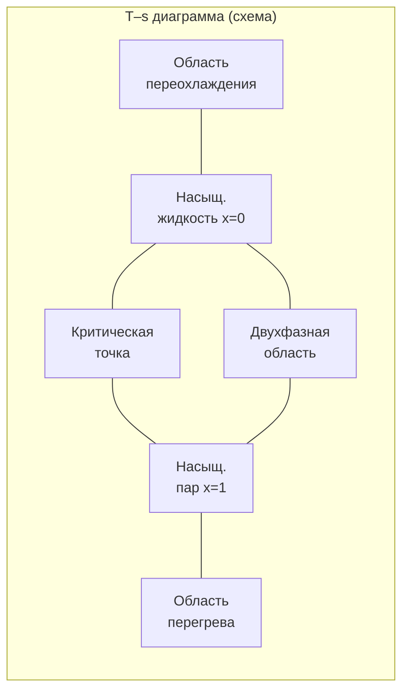

## Обзор

Диаграмма температура–энтропия (T–s diagram) — один из двух основных графических инструментов анализа термодинамических циклов в холодильной технике и HVAC (наряду с диаграммой давление–энтальпия, p–h). На T–s диаграмме площадь под кривым процессом равна теплоте, обменянной с внешней средой, что делает диаграмму особенно наглядной для оценки тепловых потоков, необратимости и эффективности.

T–s диаграммы применяются при:
- анализе идеальных и реальных холодильных циклов;
- количественной оценке необратимости (генерации энтропии);
- сравнении хладагентов по форме купола насыщения;
- определении изоэнтропного КПД компрессора.

Все данные основаны на ASHRAE Handbook — Fundamentals 2021, гл. 30; NIST REFPROP v10.

## Физические принципы

### Энтропия и теплота

Для обратимого процесса при температуре $T$:


dq_{rev} = T \, ds


Площадь под кривой на T–s диаграмме равна удельной теплоте:


q = \int_{1}^{2} T \, ds


Для необратимых процессов второе начало термодинамики требует:


s_{gen} = \Delta s_{system} + \Delta s_{surroundings} \geq 0


Знак равенства соответствует полностью обратимому (идеальному) процессу; $s_{gen} > 0$ — мера деградации энергии.

### Цикл Карно

Идеальный обратный цикл Карно (Carnot cycle) на T–s диаграмме — прямоугольник:
- два изотермных процесса (горизонтальные линии при $T_{cond}$ и $T_{evap}$);
- два адиабатных обратимых процесса (вертикальные линии, $s$ = const).

Коэффициент производительности (COP):


COP_{Carnot} = \frac{T_{evap}}{T_{cond} - T_{evap}}


где $T_{evap}$ и $T_{cond}$ — абсолютные температуры испарения и конденсации (К). Цикл Карно — теоретический предел эффективности; реальные циклы характеризуются $COP_{real} = 0{,}5…0{,}7 \cdot COP_{Carnot}$.

## Конструкция T–s диаграммы

### Купол насыщения

Граница двухфазной области образует «купол насыщения» (vapor dome):

- **Левая граница** ($x$ = 0) — кривая насыщённой жидкости (saturated liquid line); точки с качеством 0 %.
- **Правая граница** ($x$ = 1) — кривая насыщённого пара (saturated vapor line); точки с качеством 100 %.
- **Вершина купола** — критическая точка, где жидкость и пар неразличимы.





### Линии качества

Внутри купола кривые качества $x$ (dry fraction) равномерно делят двухфазную область. Энтропия при заданном качестве:


s(T, x) = s_f(T) + x \cdot s_{fg}(T) = s_f + x(s_g - s_f)


Аналогично для энтальпии: $h = h_f + x \cdot h_{fg}$.

### Изобары в области перегрева

В области перегрева изобары (lines of constant pressure) имеют положительный наклон — температура и энтропия растут с увеличением подводимой теплоты. В двухфазной области изобара совпадает с изотермой (горизонтальная линия), поскольку $T_{sat}$ однозначно связана с $p_{sat}$. Изобары с более высоким давлением располагаются левее и ниже (при меньших значениях $s_g$) внутри купола, что связано с уменьшением теплоты парообразования $h_{fg}$ с давлением.

### Особенности форм куполов для разных хладагентов


| Хладагент | $T_c$, °C | $s_c$, кДж/(кг·К) | $s_g$ при −20 °C | Наклон правой ветви |
|-----------|-----------|-------------------|-----------------|---------------------|
| R-134a | 101,1 | 1,562 | 1,738 | «мокрый» → небольшой перегрев нужен |
| R-32 | 78,1 | 1,660 | 1,782 | Умеренный наклон |
| R-410A | 72,1 | 1,538 | 1,726 | Аналогичен R-32 |
| R-1234yf | 94,7 | 1,510 | 1,717 | «Сухой» → малый перегрев |
| R-717 (NH₃) | 132,2 | 4,410 | 5,614 | Крутой вправо → большой перегрев |


«Сухие» хладагенты (правая ветвь купола наклонена вправо) требуют меньшего перегрева для защиты компрессора от жидкого удара; «мокрые» — правая ветвь наклонена влево — при адиабатном сжатии из области насыщения пар попадает в двухфазную зону.

## Анализ холодильного цикла на T–s диаграмме

### Идеальный цикл (стандартный одноступенчатый)

Четыре процесса цикла Ренкина (Rankine cycle):

**1 → 2s: изоэнтропное сжатие в компрессоре**


s_2 = s_1, \quad w_{comp,s} = h_{2s} - h_1


На T–s диаграмме — вертикальная линия вверх.

**2s → 3: охлаждение и конденсация при постоянном давлении**


p = const, \quad q_{cond} = h_2 - h_3


На T–s диаграмме — изобара, проходящая через двухфазную зону горизонтально и убывающая в области перегрева.

**3 → 4: изоэнтальпийное дросселирование**


h_3 = h_4, \quad s_4 > s_3 \text{ (необратимость)}


На T–s диаграмме — наклонная линия вправо (рост энтропии).

**4 → 1: испарение при постоянном давлении**


p = const, \quad q_{evap} = h_1 - h_4


На T–s диаграмме — горизонтальная линия в двухфазной зоне, переходящая в наклонную изобару при перегреве.

### Реальный цикл: изоэнтропный КПД компрессора

В реальном компрессоре из-за внутренней необратимости (trение, теплообмен) энтропия на выходе $s_{2} > s_{2s}$:


\eta_s = \frac{w_{comp,s}}{w_{comp,real}} = \frac{h_{2s} - h_1}{h_2 - h_1}


Для современных герметичных компрессоров $\eta_s$ = 0,70…0,85; для центробежных — 0,75…0,90.

### Энергетический баланс


q_{cond} = q_{evap} + w_{comp}



COP_{cooling} = \frac{q_{evap}}{w_{comp}} = \frac{h_1 - h_4}{h_2 - h_1}


## Численный пример в системе СИ

**Условие.** Система кондиционирования на R-134a. Условия испытания: $T_{evap}$ = 5 °C, $T_{cond}$ = 50 °C, перегрев на выходе испарителя 8 К, переохлаждение перед дросселем 5 К, $\eta_s$ = 0,78. Рассчитать COP реального цикла и сравнить с COP Карно.

**Решение. Данные NIST REFPROP v10 для R-134a:**

Точка 1 (вход компрессора): $T_1$ = 5 + 8 = 13 °C, $p_1$ = $p_{sat}$(5 °C) = 349,9 кПа:


h_1 = 420{,}3 \text{ кДж/кг}, \quad s_1 = 1{,}731 \text{ кДж/(кг·К)}


Точка 2s (изоэнтропный выход компрессора): $s_{2s}$ = $s_1$ = 1,731 кДж/(кг·К), $p_2$ = $p_{sat}$(50 °C) = 1318 кПа. Из таблиц перегрева R-134a при 1318 кПа и $s$ = 1,731:


h_{2s} \approx 457{,}8 \text{ кДж/кг}


Реальная энтальпия нагнетания:


h_2 = h_1 + \frac{h_{2s} - h_1}{\eta_s} = 420{,}3 + \frac{457{,}8 - 420{,}3}{0{,}78} = 420{,}3 + 48{,}1 = 468{,}4 \text{ кДж/кг}


Точка 3 (выход конденсатора с переохлаждением 5 К): $T_3$ = 50 − 5 = 45 °C, жидкость:


h_3 = 264{,}7 \text{ кДж/кг}


Точка 4 (вход испарителя после дросселя): $h_4 = h_3 = 264{,}7$ кДж/кг.

**Холодопроизводительность:**


q_{evap} = h_1 - h_4 = 420{,}3 - 264{,}7 = 155{,}6 \text{ кДж/кг}


**Работа компрессора:**


w_{comp} = h_2 - h_1 = 468{,}4 - 420{,}3 = 48{,}1 \text{ кДж/кг}


**COP реального цикла:**


COP_{real} = \frac{155{,}6}{48{,}1} = 3{,}23


**COP Карно:**


COP_{Carnot} = \frac{T_{evap}}{T_{cond} - T_{evap}} = \frac{278{,}15}{323{,}15 - 278{,}15} = \frac{278{,}15}{45{,}00} = 6{,}18


**Отношение реального COP к теоретическому:**


\eta_{cycle} = \frac{COP_{real}}{COP_{Carnot}} = \frac{3{,}23}{6{,}18} = 0{,}523 \approx 52\%


Потери обусловлены: необратимостью компрессора (12 %), дросселированием (18 %), конечным температурным напором в теплообменниках (~18 %).

## Применение в проектировании

### Сравнение хладагентов


| Хладагент | $COP$ | $w_{comp}$, кДж/кг | $q_{evap}$, кДж/кг | $T_{discharge}$, °C |
|-----------|-------|-------------------|-------------------|-------------------|
| R-134a | 3,11 | 49,7 | 154,6 | 78 |
| R-32 | 3,58 | 59,2 | 212,1 | 91 |
| R-410A | 3,28 | 55,1 | 180,6 | 84 |
| R-1234yf | 3,05 | 45,4 | 138,5 | 71 |
| R-1234ze(E) | 3,22 | 39,6 | 127,5 | 68 |


*Расчёт: NIST REFPROP v10; $\eta_s$ = 0,78; перегрев 5 К, переохлаждение 5 К.*

### Диагностика по T–s диаграмме

На T–s диаграмме реального цикла видны:
- **Избыточный перегрев**: точка 1 смещена вправо — рост $w_{comp}$ и $T_{discharge}$.
- **Недостаточное переохлаждение**: точка 3 смещена вправо — больше доля пара после дросселя, ниже $q_{evap}$.
- **Снижение КПД компрессора**: точка 2 смещена вправо от изоэнтропы — рост $s_{gen}$ в компрессоре.

## Стандарты и нормативные источники

- **NIST REFPROP v10** — эталонная база данных для построения T–s диаграмм.
- **ASHRAE Handbook — Fundamentals 2021, гл. 2** — анализ паровых компрессионных циклов; T–s и p–h диаграммы.
- **ASHRAE Handbook — Refrigeration 2022, гл. 2** — методология оценки эффективности.
- **ASHRAE 34-2022** — данные о критических точках хладагентов.
- **EN 378-1:2016** — термодинамические расчёты; допустимые рабочие условия.
- **СП 60.13330.2022** — нормирование параметров холодильных систем в строительстве.

## Практические рекомендации

1. **Для R-134a и R-1234yf** правая ветвь купола насыщения имеет малый наклон влево («почти сухой»); минимальный перегрев 5 К достаточен для защиты компрессора.
2. **Для аммиака (R-717)** правая ветвь резко наклонена вправо; без перегрева на входе компрессора сжатие из области насыщения уводит пар в двухфазную зону — это недопустимо.
3. **Потери от дросселирования** можно снизить, применяя двухступенчатое расширение с промежуточным охладителем (economizer) — площадь «треугольника потерь» на T–s диаграмме при этом уменьшается на 15…25 %.
4. **Определяйте изоэнтропный КПД компрессора** по T–s диаграмме: сравните горизонтальное смещение точки 2 относительно вертикальной изоэнтропы — визуальный индикатор необратимости.
5. **При анализе тепловых насосов** цикл отражается зеркально: работа компрессора и теплота конденсации становятся полезными эффектами; $COP_{HP} = COP_{cooling} + 1$.
