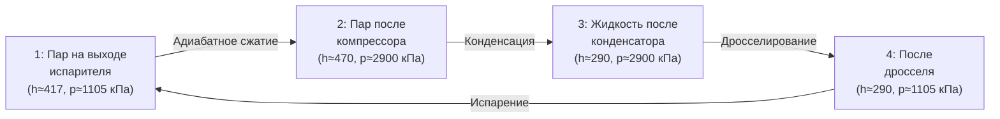

## Общие сведения

R452b — синтетический хладагент (refrigerant), представляющий собой зеотропную (zeotropic) смесь трёх компонентов: R32 (дифторметан, difluoromethane), R125 (пентафторэтан, pentafluoroethane) и R1234yf (2,3,3,3-тетрафторпроп-1-ен, tetrafluoropropene). Коммерческое обозначение по ASHRAE 34 — R452b. Разработан как замена R410A с существенно сниженным потенциалом глобального потепления (global warming potential, GWP).

Массовые доли компонентов: R32 — 20 %, R125 — 38 %, R1234yf — 42 %.

**Ключевые экологические параметры (IPCC AR5, 100-летний горизонт):**
- GWP R452b: около 698 — на 67 % ниже, чем у R410A (GWP ≈ 2 088)
- Озоноразрушающий потенциал (ODP): 0
- Охватывается Кигальской поправкой (Kigali Amendment) к Монреальскому протоколу

Класс безопасности по ASHRAE 34 и ISO 817: **A2L** (низкая токсичность, слабовоспламеняющийся).

---

## Состав и зеотропные характеристики

### Компонентный состав


| Компонент | Доля, % масс. | M, г/моль | T_кип, °C | GWP (AR5) | ODP |
|-----------|--------------|-----------|-----------|-----------|-----|
| R32       | 20           | 52,02     | −51,7     | 677       | 0   |
| R125      | 38           | 120,02    | −48,1     | 3 170     | 0   |
| R1234yf   | 42           | 114,04    | −29,4     | < 1       | 0   |


Среднее молярное значение для смеси: **M ≈ 103,5 г/моль** (расчёт через мольные доли).

### Температурный скользящий переход (temperature glide)

Зеотропная смесь не имеет единой температуры фазового перехода. В процессе кипения или конденсации при постоянном давлении температура изменяется в диапазоне:


\Delta T_{\text{glide}} = T_{\text{dew}} - T_{\text{bubble}} \approx 5{,}2\ \text{К при } p = 101{,}325\ \text{кПа}


Точка росы (dew point) — температура начала конденсации; точка пузырька (bubble point) — температура начала испарения. Значение 5,2 К — по данным NIST REFPROP v10. Для теплообменников (heat exchangers) глайд учитывается при подборе логарифмической разности температур (LMTD, logarithmic mean temperature difference).

---

## Критические и базовые термодинамические параметры


| Параметр | Обозначение | Значение | Единица |
|----------|-------------|---------|---------|
| Критическая температура | T_cr | 71,92 | °C |
| Критическое давление | p_cr | 4,57 | МПа |
| Критическая плотность | ρ_cr | 358 | кг/м³ |
| Нормальная точка кипения | T_нкп | −47,1 | °C |
| Молярная масса (средняя) | M | 103,5 | г/моль |
| Ацентрический фактор | ω | 0,353 | — |


---

## Таблицы насыщения по температуре

Данные — NIST REFPROP v10, жидкая и паровая фазы на линии насыщения.


| T, °C | p, кПа | ρ_ж, кг/м³ | ρ_п, кг/м³ | h_ж, кДж/кг | h_п, кДж/кг | r, кДж/кг | s_ж, кДж/(кг·К) | s_п, кДж/(кг·К) |
|-------|--------|------------|------------|------------|------------|---------|----------------|----------------|
| −40   | 283    | 1 189      | 14,2       | 147        | 383        | 236     | 0,793          | 1,761          |
| −30   | 415    | 1 148      | 20,4       | 170        | 392        | 222     | 0,870          | 1,728          |
| −20   | 591    | 1 104      | 28,6       | 194        | 401        | 207     | 0,945          | 1,698          |
| −10   | 818    | 1 059      | 39,3       | 218        | 409        | 191     | 1,019          | 1,670          |
|   0   | 1 105  | 1 011      | 53,0       | 244        | 417        | 173     | 1,093          | 1,643          |
|  10   | 1 462  | 959        | 70,8       | 271        | 423        | 152     | 1,167          | 1,616          |
|  20   | 1 899  | 903        | 93,9       | 299        | 428        | 129     | 1,241          | 1,589          |
|  30   | 2 426  | 841        | 124,0      | 330        | 431        | 101     | 1,318          | 1,561          |
|  40   | 3 052  | 770        | 163,0      | 363        | 432        |  69     | 1,397          | 1,531          |
|  50   | 3 788  | 686        | 217,0      | 402        | 428        |  26     | 1,484          | 1,495          |


Обозначения: p — давление насыщения; ρ_ж / ρ_п — плотность жидкости / пара; h_ж / h_п — удельная энтальпия (specific enthalpy) жидкости / пара; r — теплота фазового перехода (latent heat); s_ж / s_п — удельная энтропия (specific entropy).

---

## Таблица сжатого пара


| p, МПа | T = 20 °C | T = 40 °C | T = 60 °C | T = 80 °C | T = 100 °C |
|--------|----------|----------|----------|----------|-----------|
| 0,5    | 430      | 451      | 472      | 494      | 516       |
| 1,0    | 426      | 448      | 470      | 492      | 514       |
| 1,5    | 421      | 444      | 467      | 490      | 512       |
| 2,0    | 415      | 440      | 464      | 487      | 510       |
| 2,5    | 408      | 435      | 460      | 484      | 508       |
| 3,0    | 400      | 429      | 455      | 480      | 505       |


---

## Транспортные свойства


| T, °C | η_ж, мкПа·с | η_п, мкПа·с | λ_ж, мВт/(м·К) | λ_п, мВт/(м·К) |
|-------|------------|------------|--------------|--------------|
| −40   | 231        | 9,8        | 96,4         | 11,2         |
| −20   | 175        | 10,7       | 86,1         | 12,8         |
|   0   | 136        | 11,7       | 75,9         | 14,5         |
|  20   | 107        | 12,8       | 65,6         | 16,4         |
|  40   |  82        | 14,1       | 55,1         | 18,6         |


Источник: NIST REFPROP v10; ASHRAE Handbook Fundamentals, гл. 30.

---

## Диаграмма давление–энтальпия (p–h)





---

## Параметры безопасности


| Параметр | Значение | Стандарт |
|----------|---------|---------|
| Класс безопасности | A2L | ASHRAE 34, ISO 817 |
| Нижний предел воспламеняемости (LFL) | 9,0 % об. | ASHRAE 34 |
| Верхний предел воспламеняемости (UFL) | 17,4 % об. | ASHRAE 34 |
| Минимальная скорость зажигания | > 10 см/с | EN 378-1 |
| Максимально допустимая конц. (ASHRAE 15) | 0,31 кг/м³ | ASHRAE 15 |
| Предел профессионального воздействия (OEL) | 1 000 ppm | ASHRAE 34 |


Класс A2L означает: слабо воспламеняющийся (mildly flammable), допускается в большинстве коммерческих применений при соблюдении требований ASHRAE 15 и EN 378.

---

## Сравнение с R410A


| Параметр | R410A | R452b | Разница |
|----------|-------|-------|---------|
| p_исп (T = 0 °C), кПа | 796 | 1 105 | +39 % |
| p_конд (T = 40 °C), кПа | 2 420 | 3 052 | +26 % |
| h_fg при 0 °C, кДж/кг | 218 | 173 | −21 % |
| GWP (AR5) | 2 088 | 698 | −67 % |
| COP (типовой цикл) | 3,6 | 3,4 | −6 % |


Повышенное рабочее давление R452b требует проверки прочностных характеристик трубопроводов и компонентов при переоборудовании систем.

---

## Расчётный пример

**Задача.** Определить холодопроизводительность (cooling capacity) и коэффициент эффективности (COP) простого одноступенчатого парокомпрессионного цикла на R452b при следующих условиях:
- Температура кипения: T_0 = 0 °C (точка пузырька)
- Температура конденсации: T_к = 40 °C (точка росы)
- Степень перегрева пара на всасывании: ΔT_вс = 5 К
- Массовый расход: m = 0,050 кг/с

**Решение.**

По таблице насыщения:
- При T_0 = 0 °C: h_п = 417 кДж/кг, p_0 = 1 105 кПа
- При T_к = 40 °C: h_ж = 363 кДж/кг, p_к = 3 052 кПа

С учётом перегрева 5 К (точка 1 — вход в компрессор, T = 5 °C, p = 1 105 кПа):
- h_1 ≈ 421 кДж/кг (из таблицы сжатого пара, интерполяция)

Адиабатное сжатие до p_к = 3,052 МПа (η_изент ≈ 0,75):


h_{2s} \approx 464\ \text{кДж/кг} \quad \Rightarrow \quad h_2 = h_1 + \frac{h_{2s} - h_1}{\eta_{\text{изент}}} = 421 + \frac{464 - 421}{0{,}75} \approx 478\ \text{кДж/кг}


Холодопроизводительность:


Q_0 = \dot{m} \cdot (h_1 - h_4) = 0{,}050 \times (421 - 363) = 0{,}050 \times 58 = 2{,}90\ \text{кВт}


Работа компрессора:


W_{\text{к}} = \dot{m} \cdot (h_2 - h_1) = 0{,}050 \times (478 - 421) = 0{,}050 \times 57 = 2{,}85\ \text{кВт}



\text{COP} = \frac{Q_0}{W_{\text{к}}} = \frac{2{,}90}{2{,}85} \approx 1{,}02


Низкое значение COP объясняется большим перепадом давлений (степень сжатия ≈ 2,76) и невысоким КПД компрессора в данном примере. При реальном проектировании степень перегрева и конденсации оптимизируются.

---

## Применение и ограничения

R452b применяется в:
- кондиционерах воздуха (air conditioners) мощностью 5–150 кВт;
- тепловых насосах (heat pumps) воздух-воздух и воздух-вода;
- среднетемпературных холодильных контурах (+2…+10 °C).

Ограничения:
- Глайд 5,2 К требует применения противоточных теплообменников (counterflow heat exchangers) для максимальной эффективности.
- Рабочее давление выше, чем у R410A, — необходима проверка арматуры и трубопроводов.
- Класс A2L — обязательна оценка рисков по ASHRAE 15 и EN 378-1 для каждого объекта.

---

## Нормативные ссылки

- NIST REFPROP v10 — база термодинамических свойств хладагентов
- ASHRAE Handbook Fundamentals 2021, гл. 29, 30 — свойства хладагентов и хладоносителей
- ASHRAE 34-2022 — классификация и обозначение хладагентов
- ASHRAE 15-2019 — безопасность холодильных систем
- ISO 817:2014 — обозначения хладагентов
- EN 378-1:2016 — требования безопасности для систем охлаждения
- СП 60.13330.2020 — отопление, вентиляция и кондиционирование воздуха
- ГОСТ 28547-90 — хладагенты. Общие технические условия
