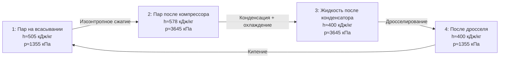

## Общие сведения

R454b — зеотропный (zeotropic) хладагент, смесь двух компонентов: R32 (дифторметан, difluoromethane) и R1234yf (2,3,3,3-тетрафторпроп-1-ен, tetrafluoropropene). Массовые доли по ASHRAE 34: R32 — 68,9 %, R1234yf — 31,1 %. Коммерческое обозначение по ISO 817: R454b.

Хладагент разработан как прямая замена R410A (GWP 2 088) в новых установках кондиционирования, тепловых насосах и VRF-системах (variable refrigerant flow). Регламент ЕС F-Gas (517/2014) ограничивает применение хладагентов с GWP > 750 в новых системах с 2025 года, что делает R454b одним из основных переходных хладагентов на европейском рынке.

**Экологические характеристики:**
- GWP (100 лет, IPCC AR5): 466 — на 78 % ниже R410A
- ODP (озоноразрушающий потенциал): 0
- Охватывается Кигальской поправкой (Kigali Amendment)

Класс безопасности по ASHRAE 34 и ISO 817: **A2L** (низкая токсичность, слабовоспламеняющийся).

---

## Состав и зеотропные характеристики

### Компонентный состав


| Компонент | Доля, % масс. | M, г/моль | T_кип, °C | GWP (AR5) | ODP |
|-----------|--------------|-----------|-----------|-----------|-----|
| R32       | 68,9         | 52,02     | −51,7     | 677       | 0   |
| R1234yf   | 31,1         | 114,04    | −29,4     | < 1       | 0   |


Среднее молярное значение для смеси: **M ≈ 67,5 г/моль**.

### Температурный скользящий переход (temperature glide)


\Delta T_{\text{glide}} = T_{\text{dew}} - T_{\text{bubble}} \approx 3{,}8\ \text{К при } p = 101{,}325\ \text{кПа}


Глайд (glide) умеренный: меньше, чем у R452b (5,2 К), что упрощает проектирование теплообменников. В противоточных теплообменниках (counterflow heat exchangers) глайд снижает эффективную LMTD менее чем на 4 %, что допустимо без коррекционного коэффициента при длинах до 15 м.

---

## Критические и базовые термодинамические параметры


| Параметр | Обозначение | Значение | Единица |
|----------|-------------|---------|---------|
| Критическая температура | T_cr | 75,12 | °C |
| Критическое давление | p_cr | 4,94 | МПа |
| Критическая плотность | ρ_cr | 388 | кг/м³ |
| Нормальная точка кипения | T_нкп | −51,7 | °C |
| Молярная масса (средняя) | M | 67,5 | г/моль |
| Ацентрический фактор | ω | 0,313 | — |


Высокое критическое давление (4,94 МПа) характерно для смесей с высокой долей R32. При работе в режиме теплового насоса с конденсационной температурой 60–70 °C давление конденсации достигает 3,5–4,0 МПа — это необходимо учитывать при выборе компрессора и арматуры.

---

## Таблицы насыщения по температуре


| T, °C | p, кПа | ρ_ж, кг/м³ | ρ_п, кг/м³ | h_ж, кДж/кг | h_п, кДж/кг | r, кДж/кг | s_ж, кДж/(кг·К) | s_п, кДж/(кг·К) |
|-------|--------|------------|------------|------------|------------|---------|----------------|----------------|
| −40   | 360    | 1 131      | 18,8       | 148        | 468        | 320     | 0,806          | 1,922          |
| −30   | 523    | 1 089      | 26,8       | 175        | 478        | 303     | 0,893          | 1,884          |
| −20   | 737    | 1 044      | 37,4       | 202        | 488        | 286     | 0,978          | 1,848          |
| −10   | 1 011  | 997        | 51,4       | 230        | 497        | 267     | 1,062          | 1,814          |
|   0   | 1 355  | 947        | 69,4       | 260        | 505        | 245     | 1,147          | 1,779          |
|  10   | 1 780  | 893        | 93,1       | 291        | 512        | 221     | 1,233          | 1,744          |
|  20   | 2 296  | 834        | 124,0      | 324        | 517        | 193     | 1,320          | 1,707          |
|  30   | 2 914  | 768        | 165,0      | 360        | 520        | 160     | 1,409          | 1,668          |
|  40   | 3 645  | 691        | 220,0      | 400        | 519        | 119     | 1,502          | 1,625          |
|  50   | 4 501  | 597        | 299,0      | 448        | 513        |  65     | 1,603          | 1,573          |


Обозначения: r — теплота фазового перехода (latent heat of vaporization).

---

## Таблица сжатого пара


| p, МПа | T = 20 °C | T = 40 °C | T = 60 °C | T = 80 °C | T = 100 °C |
|--------|----------|----------|----------|----------|-----------|
| 0,5    | 533      | 560      | 587      | 614      | 641       |
| 1,0    | 528      | 556      | 584      | 612      | 639       |
| 1,5    | 522      | 551      | 580      | 608      | 637       |
| 2,0    | 515      | 545      | 575      | 604      | 633       |
| 2,5    | 506      | 538      | 569      | 599      | 629       |
| 3,0    | 496      | 530      | 562      | 594      | 624       |


---

## Транспортные свойства


| T, °C | η_ж, мкПа·с | η_п, мкПа·с | λ_ж, мВт/(м·К) | λ_п, мВт/(м·К) | Pr_ж |
|-------|------------|------------|--------------|--------------|------|
| −40   | 245        | 9,6        | 112,0        | 12,3         | 2,18 |
| −20   | 182        | 10,6       | 98,6         | 14,1         | 1,93 |
|   0   | 141        | 11,7       | 85,4         | 16,1         | 1,72 |
|  20   | 110        | 13,0       | 72,2         | 18,3         | 1,52 |
|  40   |  83        | 14,5       | 58,9         | 20,9         | 1,30 |


Источник: NIST REFPROP v10; ASHRAE Handbook Fundamentals 2021, гл. 30.

---

## Диаграмма цикла (p–h)





---

## Сравнение с R410A и R32


| Параметр | R410A | R32 | R454b |
|----------|-------|-----|-------|
| p_исп, кПа | 796 | 802 | 1 355 |
| p_конд, кПа | 2 420 | 2 490 | 3 645 |
| h_fg при 0 °C, кДж/кг | 218 | 316 | 245 |
| GWP (AR5) | 2 088 | 677 | 466 |
| COP (расч.) | 3,6 | 3,7 | 3,5 |
| Класс A2L | нет | да | да |


R454b сочетает умеренный GWP с высокой холодопроизводительностью, близкой к R32, при более низком давлении, чем чистый R32.

---

## Параметры безопасности


| Параметр | Значение | Стандарт |
|----------|---------|---------|
| Класс безопасности | A2L | ASHRAE 34, ISO 817 |
| LFL (нижний предел воспламеняемости) | 9,5 % об. | ASHRAE 34 |
| UFL (верхний предел воспламеняемости) | 17,0 % об. | ASHRAE 34 |
| Минимальная скорость горения (MBV) | < 10 см/с | EN 378-1 |
| Максимально допустимая концентрация | 0,28 кг/м³ | ASHRAE 15 |
| OEL (предел профессионального воздействия) | 1 000 ppm | ASHRAE 34 |


---

## Расчётный пример

**Задача.** Определить объёмный расход хладагента и холодопроизводительность чиллера на R454b при следующих условиях:
- Температура кипения (bubble point): T_0 = 5 °C
- Температура конденсации (dew point): T_к = 45 °C
- Перегрев пара на всасывании: ΔT_вс = 5 К
- Компрессор: поршневой, рабочий объём V_г = 50 см³/об., n = 50 об/с, η_об = 0,82

**Шаг 1. Параметры рабочих точек.**

При T_0 = 5 °C (интерполяция между 0 и 10 °C):
- p_0 ≈ 1 568 кПа
- h_п ≈ 509 кДж/кг, ρ_п ≈ 80 кг/м³

С перегревом 5 К (T_1 = 10 °C, p = 1 568 кПа): h_1 ≈ 513 кДж/кг.

При T_к = 45 °C (интерполяция между 40 и 50 °C):
- p_к ≈ 4 073 кПа
- h_ж ≈ 424 кДж/кг

**Шаг 2. Объёмный расход компрессора.**


\dot{V} = V_{\text{г}} \cdot n \cdot \eta_{\text{об}} = 50 \times 10^{-6} \times 50 \times 0{,}82 = 2{,}05 \times 10^{-3}\ \text{м}^3/\text{с}


**Шаг 3. Массовый расход хладагента.**


\dot{m} = \dot{V} \cdot \rho_{\text{п}} = 2{,}05 \times 10^{-3} \times 80 = 0{,}164\ \text{кг/с}


**Шаг 4. Холодопроизводительность.**


Q_0 = \dot{m} \cdot (h_1 - h_4) = 0{,}164 \times (513 - 424) = 0{,}164 \times 89 \approx 14{,}6\ \text{кВт}


Степень сжатия: π = 4 073 / 1 568 ≈ 2,6 — характерное значение для климатической техники с R454b.

---

## Применение и рекомендации

R454b применяется в:
- новых VRF/VRV-системах (от 2023 года) ведущих производителей (Daikin Bluevolution, Mitsubishi, Carrier);
- чиллерах с воздушным и водяным охлаждением конденсатора;
- тепловых насосах воздух-вода с конденсационной температурой до 65 °C.

**Ограничения и требования:**
- Класс A2L: обязательна оценка рисков по ASHRAE 15-2019 и EN 378-1:2016 для каждого помещения.
- Глайд 3,8 К: при длинных трассах (> 15 м) рекомендуется применение электронных расширительных клапанов (EEV) с датчиком температуры на входе испарителя.
- Масла: POE ISO VG 32/46 или PVE; содержание влаги в масле не более 100 ppm перед заправкой.
- Давление конденсации до 4,5 МПа при высоких температурах: проверка PN-класса арматуры и трубопроводов.

---

## Нормативные ссылки

- NIST REFPROP v10 — база термодинамических свойств хладагентов
- ASHRAE Handbook Fundamentals 2021, гл. 29, 30 — свойства хладагентов
- ASHRAE 34-2022 — классификация хладагентов; R454b включён с 2019 г.
- ASHRAE 15-2019 — безопасность холодильных систем
- ISO 817:2014 — обозначения хладагентов
- EN 378-1:2016+A1:2021 — безопасность систем охлаждения
- Регламент ЕС 517/2014 (F-Gas Regulation) — ограничения по GWP
- СП 60.13330.2020 — отопление, вентиляция и кондиционирование воздуха
- ГОСТ 28547-90 — хладагенты. Общие технические условия
