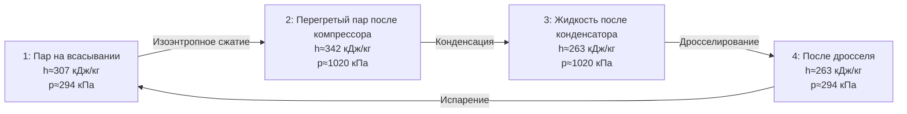

## Общие сведения

R513a — практически азеотропный (near-azeotropic) хладагент, смесь двух компонентов: R134a (1,1,1,2-тетрафторэтан, 1,1,1,2-tetrafluoroethane) и R1234yf (2,3,3,3-тетрафторпроп-1-ен, tetrafluoropropene). Массовые доли по ASHRAE 34: R134a — 44,0 %, R1234yf — 56,0 %. Коммерческое обозначение: R513a; торговое наименование — Opteon XP10 (Chemours), Solstice N13 (Honeywell).

Разработан как прямая замена R134a (GWP 1 430) в новых и переоборудуемых системах: автомобильном кондиционировании, стационарных чиллерах, бытовых холодильниках. Регламент ЕС 517/2014 запрещает применение хладагентов с GWP > 150 в новых автомобилях с 2017 года; R513a с GWP 631 используется в промышленных и коммерческих установках, где R1234yf нецелесообразен.

**Экологические характеристики:**
- GWP (100 лет, IPCC AR5): 631 — на 56 % ниже R134a (GWP 1 430)
- ODP: 0
- Класс безопасности по ASHRAE 34 и ISO 817: **A1** (невоспламеняющийся, низкая токсичность)

Класс A1 — наивысший уровень безопасности; специальных мер пожарной защиты при работе не требуется.

---

## Состав и азеотропные характеристики

### Компонентный состав


| Компонент | Доля, % масс. | M, г/моль | T_кип, °C | GWP (AR5) | ODP |
|-----------|--------------|-----------|-----------|-----------|-----|
| R134a     | 44,0         | 102,03    | −26,4     | 1 430     | 0   |
| R1234yf   | 56,0         | 114,04    | −29,4     | < 1       | 0   |


Среднее молярное значение для смеси: **M ≈ 108,4 г/моль**.

### Азеотропность

R513a является практически азеотропным (near-azeotrope): температурный глайд (temperature glide) составляет менее 0,5 К при стандартном давлении. Это означает:
- состав паровой и жидкой фаз практически одинаков — смесь не расслаивается при утечках;
- термодинамические расчёты выполняются по единым таблицам, без коррекции на глайд;
- заправка системы возможна как в жидком, так и в газообразном виде.

---

## Критические и базовые термодинамические параметры


| Параметр | Обозначение | Значение | Единица |
|----------|-------------|---------|---------|
| Критическая температура | T_cr | 94,75 | °C |
| Критическое давление | p_cr | 3,64 | МПа |
| Критическая плотность | ρ_cr | 489 | кг/м³ |
| Нормальная точка кипения | T_нкп | −29,7 | °C |
| Молярная масса (средняя) | M | 108,4 | г/моль |
| Ацентрический фактор | ω | 0,349 | — |
| Удельная газовая постоянная | R_s | 76,7 | Дж/(кг·К) |


---

## Таблицы насыщения по температуре


| T, °C | p, кПа | ρ_ж, кг/м³ | ρ_п, кг/м³ | h_ж, кДж/кг | h_п, кДж/кг | r, кДж/кг | s_ж, кДж/(кг·К) | s_п, кДж/(кг·К) |
|-------|--------|------------|------------|------------|------------|---------|----------------|----------------|
| −40   | 51     | 1 380      | 2,8        |  95        | 275        | 180     | 0,514          | 1,089          |
| −30   | 84     | 1 346      | 4,5        | 113        | 283        | 170     | 0,576          | 1,067          |
| −20   | 133    | 1 309      | 6,9        | 131        | 291        | 160     | 0,636          | 1,047          |
| −10   | 201    | 1 270      | 10,2       | 150        | 299        | 149     | 0,696          | 1,028          |
|   0   | 294    | 1 230      | 14,8       | 170        | 307        | 137     | 0,756          | 1,010          |
|  10   | 417    | 1 187      | 21,0       | 191        | 315        | 124     | 0,816          | 0,993          |
|  20   | 575    | 1 141      | 29,5       | 213        | 322        | 109     | 0,877          | 0,976          |
|  30   | 774    | 1 092      | 40,7       | 237        | 329        |  92     | 0,939          | 0,959          |
|  40   | 1 020  | 1 038      | 56,0       | 263        | 334        |  71     | 1,003          | 0,941          |
|  50   | 1 320  | 977        | 76,5       | 292        | 338        |  46     | 1,070          | 0,921          |


---

## Таблица перегретого пара


| p, кПа | T = 0 °C | T = 20 °C | T = 40 °C | T = 60 °C | T = 80 °C |
|--------|---------|---------|---------|---------|---------|
| 200    | 313     | 327     | 342     | 357     | 373     |
| 400    | 309     | 324     | 339     | 355     | 371     |
| 600    | 305     | 321     | 337     | 353     | 369     |
| 800    | 300     | 317     | 334     | 350     | 367     |
| 1 000  | 294     | 313     | 330     | 347     | 364     |
| 1 500  | 278     | 300     | 320     | 339     | 357     |


---

## Транспортные свойства


| T, °C | η_ж, мкПа·с | η_п, мкПа·с | λ_ж, мВт/(м·К) | λ_п, мВт/(м·К) | Pr_ж |
|-------|------------|------------|--------------|--------------|------|
| −30   | 390        | 9,5        | 92,1         | 10,4         | 4,22 |
| −10   | 278        | 10,2       | 82,6         | 11,5         | 3,46 |
|   0   | 239        | 10,7       | 77,8         | 12,1         | 3,10 |
|  20   | 186        | 11,7       | 68,1         | 13,4         | 2,56 |
|  40   | 145        | 12,9       | 58,2         | 14,9         | 2,08 |


Источник: NIST REFPROP v10; ASHRAE Handbook Fundamentals 2021, гл. 30.

---

## Диаграмма цикла





---

## Сравнение с R134a


| Параметр | R134a | R513a | Разница |
|----------|-------|-------|---------|
| p_исп (0 °C), кПа | 293 | 294 | +0,3 % |
| p_конд (40 °C), кПа | 1 017 | 1 020 | +0,3 % |
| h_fg при 0 °C, кДж/кг | 197 | 137 | −30 % |
| ρ_п при 0 °C, кг/м³ | 14,4 | 14,8 | +3 % |
| GWP (AR5) | 1 430 | 631 | −56 % |
| Класс безопасности | A1 | A1 | = |


Рабочие давления R513a практически идентичны R134a, что делает его drop-in заменой без перенастройки расходомеров и предохранительных клапанов. Уменьшенная теплота парообразования компенсируется более высокой объёмной холодопроизводительностью (volumetric cooling capacity) за счёт плотности пара.

---

## Параметры безопасности


| Параметр | Значение | Стандарт |
|----------|---------|---------|
| Класс безопасности | A1 | ASHRAE 34, ISO 817 |
| Воспламеняемость | не воспламеняется | ASHRAE 34 |
| OEL (предел профессионального воздействия) | 1 000 ppm | ASHRAE 34 |
| Максимально допустимая концентрация | 0,17 кг/м³ | ASHRAE 15 |
| Острая токсичность (LC50 крысы, 4 ч) | > 100 000 ppm | EN 378-1 |


---

## Расчётный пример

**Задача.** Определить COP и мощность компрессора для чиллера на R513a при следующих условиях:
- Температура испарения: T_0 = −10 °C
- Температура конденсации: T_к = 40 °C
- Перегрев на всасывании: ΔT_вс = 8 К (T_1 = −2 °C, p_0 = 201 кПа)
- Недоохлаждение жидкости: ΔT_нд = 5 К (T_3 = 35 °C)
- Изоэнтропный КПД компрессора: η_изент = 0,78
- Холодопроизводительность: Q_0 = 100 кВт

**Параметры рабочих точек** (по таблицам насыщения и перегретого пара):

- Точка 1 (всасывание): T = −2 °C, p = 201 кПа → h_1 ≈ 304 кДж/кг (интерполяция)
- Точка 3 (после конденсатора): T = 35 °C, h_3 ≈ 250 кДж/кг (интерполяция)
- Точка 4 (после дросселя): h_4 = h_3 = 250 кДж/кг

**Идеальное сжатие** до p_к = 1 020 кПа (из таблицы перегретого пара, s_1 ≈ 1,028 кДж/(кг·К)):
- h_2s ≈ 338 кДж/кг (при s = 1,028, p = 1 020 кПа — из таблицы)

**Действительная энтальпия после компрессора:**


h_2 = h_1 + \frac{h_{2s} - h_1}{\eta_{\text{изент}}} = 304 + \frac{338 - 304}{0{,}78} = 304 + 43{,}6 \approx 348\ \text{кДж/кг}


**Массовый расход хладагента:**


\dot{m} = \frac{Q_0}{h_1 - h_4} = \frac{100}{304 - 250} = \frac{100}{54} \approx 1{,}85\ \text{кг/с}


**Мощность компрессора:**


W_{\text{к}} = \dot{m} \cdot (h_2 - h_1) = 1{,}85 \times (348 - 304) = 1{,}85 \times 44 \approx 81{,}4\ \text{кВт}


**COP:**


\text{COP} = \frac{Q_0}{W_{\text{к}}} = \frac{100}{81{,}4} \approx 1{,}23


Малое значение COP обусловлено большим перепадом давлений (степень сжатия ≈ 5,1) при низкой температуре испарения −10 °C. В нормальных климатических условиях (T_0 = 5 °C, T_к = 35 °C) COP достигает 3,5–4,0.

---

## Применение и ограничения

R513a применяется в:
- стационарных чиллерах с воздушным и водяным охлаждением конденсатора;
- прецизионных системах кондиционирования (precision air conditioning) дата-центров;
- промышленных холодильниках и морозильниках (−30…+10 °C);
- переоборудовании систем с R134a (drop-in при совместимости масел).

**Ограничения:**
- GWP 631 превышает порог 150 для автомобильного кондиционирования по директиве ЕС — в этой области применяется R1234yf.
- Снижение GWP по сравнению с R134a на 56 % не соответствует целевым показателям F-Gas 2025 (GWP < 150 для новых установок) в ЕС.
- Масла: POE ISO VG 32/46 или PAG (для автомобильных применений); содержание влаги в масле не более 50 ppm.

---

## Нормативные ссылки

- NIST REFPROP v10 — база термодинамических свойств хладагентов
- ASHRAE Handbook Fundamentals 2021, гл. 29, 30
- ASHRAE 34-2022 — классификация хладагентов
- ASHRAE 15-2019 — безопасность холодильных систем
- ISO 817:2014 — обозначения хладагентов
- EN 378-1:2016+A1:2021 — безопасность систем охлаждения
- Регламент ЕС 517/2014 (F-Gas Regulation)
- СП 60.13330.2020 — отопление, вентиляция и кондиционирование воздуха
- ГОСТ 28547-90 — хладагенты. Общие технические условия
