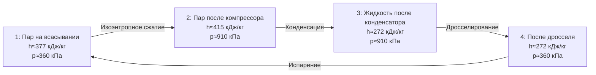

## Общие сведения

R515b — практически азеотропный (near-azeotropic) хладагент, бинарная смесь: R1234ze(E) (транс-1,3,3,3-тетрафторпроп-1-ен, trans-tetrafluoropropene) и R227ea (гептафторпропан, heptafluoropropane). Массовые доли по ASHRAE 34: R1234ze(E) — 91,1 %, R227ea — 8,9 %. Коммерческие наименования: Solstice N15 (Honeywell), Opteon XL15 (Chemours).

Разработан как долгосрочная (long-term) замена R134a и R410A в средне- и высокотемпературных применениях — чиллерах, тепловых насосах, коммерческой холодильной технике. Ключевое конкурентное преимущество: GWP ниже 150 при классе безопасности A1 (невоспламеняющийся), что соответствует целевым показателям ЕС F-Gas 2025 для нового оборудования мощностью выше 40 кВт.

**Экологические характеристики:**
- GWP (100 лет, IPCC AR5): 299 (по данным NIST REFPROP v10; диапазон 293–310 у разных источников)
- ODP: 0
- Класс безопасности по ASHRAE 34 и ISO 817: **A1** (невоспламеняющийся, низкая токсичность)

Примечание: ряд источников приводит GWP 299 (смешанный IPCC AR5/AR6), что превышает порог 150 из регламента ЕС 517/2014; для применения в конкретных категориях установок следует уточнять актуальную редакцию нормативов.

---

## Состав и азеотропные характеристики

### Компонентный состав


| Компонент | Доля, % масс. | M, г/моль | T_кип, °C | GWP (AR5) | ODP |
|-----------|--------------|-----------|-----------|-----------|-----|
| R1234ze(E) | 91,1        | 114,04    | −18,9     | < 1       | 0   |
| R227ea    | 8,9          | 170,03    | −16,4     | 3 220     | 0   |


Среднее молярное значение для смеси: **M ≈ 119,1 г/моль**.

### Азеотропность

Температурный глайд (temperature glide) R515b: менее 0,1 К при стандартном давлении — практически идеальный азеотроп. Следствия:
- Состав пара и жидкости при фазовых переходах практически идентичен — фракционирование (fractionation) при частичных утечках исключено.
- Заправка системы допускается как жидкой, так и газообразной фазой.
- Термодинамические расчёты выполняются по единым однофазным таблицам.

---

## Критические и базовые термодинамические параметры


| Параметр | Обозначение | Значение | Единица |
|----------|-------------|---------|---------|
| Критическая температура | T_cr | 103,7 | °C |
| Критическое давление | p_cr | 3,50 | МПа |
| Критическая плотность | ρ_cr | 515 | кг/м³ |
| Нормальная точка кипения | T_нкп | −19,0 | °C |
| Молярная масса (средняя) | M | 119,1 | г/моль |
| Ацентрический фактор | ω | 0,327 | — |


Нормальная точка кипения −19,0 °C значительно выше, чем у R410A (−51,4 °C) и R32 (−51,7 °C). Это определяет более низкие рабочие давления R515b, что снижает требования к прочности компонентов.

---

## Таблицы насыщения по температуре


| T, °C | p, кПа | ρ_ж, кг/м³ | ρ_п, кг/м³ | h_ж, кДж/кг | h_п, кДж/кг | r, кДж/кг | s_ж, кДж/(кг·К) | s_п, кДж/(кг·К) |
|-------|--------|------------|------------|------------|------------|---------|----------------|----------------|
| −20   | 101    | 1 336      | 5,5        | 148        | 359        | 211     | 0,796          | 1,426          |
| −10   | 153    | 1 299      | 8,2        | 165        | 366        | 201     | 0,857          | 1,407          |
|   0   | 224    | 1 261      | 11,8       | 183        | 373        | 190     | 0,916          | 1,389          |
|  10   | 320    | 1 221      | 16,7       | 201        | 380        | 179     | 0,976          | 1,371          |
|  20   | 443    | 1 178      | 23,2       | 220        | 387        | 167     | 1,036          | 1,354          |
|  30   | 600    | 1 133      | 31,9       | 240        | 393        | 153     | 1,096          | 1,337          |
|  40   | 793    | 1 083      | 43,5       | 261        | 399        | 138     | 1,157          | 1,319          |
|  50   | 1 028  | 1 029      | 58,8       | 284        | 403        | 119     | 1,221          | 1,301          |
|  60   | 1 313  | 968        | 79,5       | 309        | 406        |  97     | 1,288          | 1,281          |
|  70   | 1 652  | 897        | 107,0      | 338        | 406        |  68     | 1,360          | 1,259          |


---

## Таблица перегретого пара


| p, кПа | T = 10 °C | T = 30 °C | T = 50 °C | T = 70 °C | T = 90 °C |
|--------|---------|---------|---------|---------|---------|
| 150    | 372     | 386     | 400     | 415     | 430     |
| 300    | 369     | 384     | 399     | 414     | 429     |
| 500    | 365     | 381     | 397     | 412     | 427     |
| 800    | 359     | 377     | 393     | 409     | 425     |
| 1 000  | 354     | 373     | 390     | 407     | 423     |
| 1 500  | 342     | 363     | 382     | 400     | 417     |


---

## Транспортные свойства


| T, °C | η_ж, мкПа·с | η_п, мкПа·с | λ_ж, мВт/(м·К) | λ_п, мВт/(м·К) | Pr_ж |
|-------|------------|------------|--------------|--------------|------|
| −20   | 480        | 10,3       | 88,6         | 10,2         | 5,42 |
|   0   | 330        | 11,2       | 78,4         | 11,4         | 4,05 |
|  20   | 235        | 12,2       | 68,1         | 12,7         | 3,14 |
|  40   | 172        | 13,4       | 57,6         | 14,2         | 2,40 |
|  60   | 125        | 14,8       | 46,9         | 15,9         | 1,84 |


Источник: NIST REFPROP v10; ASHRAE Handbook Fundamentals 2021, гл. 30.

---

## Диаграмма цикла





---

## Сравнение с R134a и R1234ze(E)


| Параметр | R134a | R1234ze(E) | R515b |
|----------|-------|------------|-------|
| p_исп (0 °C), кПа | 293 | 183 | 224 |
| p_конд (40 °C), кПа | 1 017 | 636 | 793 |
| h_fg при 0 °C, кДж/кг | 197 | 196 | 190 |
| GWP (AR5) | 1 430 | < 1 | 299 |
| Класс безопасности | A1 | A2L | A1 |


R515b сочетает безопасность A1 (отсутствующую у чистого R1234ze(E) класса A2L) с существенно сниженным GWP по сравнению с R134a. Рабочие давления ниже, чем у R134a, — это снижает механические нагрузки на компоненты.

---

## Параметры безопасности


| Параметр | Значение | Стандарт |
|----------|---------|---------|
| Класс безопасности | A1 | ASHRAE 34, ISO 817 |
| Воспламеняемость | не воспламеняется | ASHRAE 34 |
| OEL (предел профессионального воздействия) | 800 ppm | ASHRAE 34 |
| Максимально допустимая концентрация | 0,19 кг/м³ | ASHRAE 15 |


---

## Расчётный пример

**Задача.** Определить COP и тепловую мощность конденсатора теплового насоса на R515b:
- Температура испарения: T_0 = 0 °C (источник тепла — грунт)
- Температура конденсации: T_к = 50 °C (нагрев воды)
- Перегрев на всасывании: ΔT_вс = 5 К → T_1 = 5 °C
- Недоохлаждение жидкости: ΔT_нд = 5 К → T_3 = 45 °C
- Изоэнтропный КПД компрессора: η_изент = 0,80
- Массовый расход хладагента: m = 0,10 кг/с

**Параметры точек цикла** (из таблиц насыщения и перегретого пара):

- Точка 1 (всасывание, T = 5 °C, p = 224 кПа): h_1 ≈ 379 кДж/кг, s_1 ≈ 1,394 кДж/(кг·К)
- Точка 3 (жидкость после конденсатора, T = 45 °C): h_3 ≈ 272 кДж/кг (интерполяция)
- Точка 4 = точка 3: h_4 = h_3 = 272 кДж/кг

**Идеальное сжатие** (s_2s = s_1 = 1,394 кДж/(кг·К), p_к = 1 028 кПа):
- По таблице перегретого пара при p = 1 000 кПа, s ≈ 1,394: h_2s ≈ 407 кДж/кг

**Действительная энтальпия после компрессора:**


h_2 = h_1 + \frac{h_{2s} - h_1}{\eta_{\text{изент}}} = 379 + \frac{407 - 379}{0{,}80} = 379 + 35 = 414\ \text{кДж/кг}


**Холодопроизводительность (испаритель):**


Q_0 = \dot{m} \cdot (h_1 - h_4) = 0{,}10 \times (379 - 272) = 10{,}7\ \text{кВт}


**Мощность компрессора:**


W_{\text{к}} = \dot{m} \cdot (h_2 - h_1) = 0{,}10 \times (414 - 379) = 3{,}5\ \text{кВт}


**Тепловая мощность конденсатора:**


Q_{\text{к}} = \dot{m} \cdot (h_2 - h_3) = 0{,}10 \times (414 - 272) = 14{,}2\ \text{кВт}


**COP теплового насоса (отопление):**


\text{COP}_{\text{нас}} = \frac{Q_{\text{к}}}{W_{\text{к}}} = \frac{14{,}2}{3{,}5} \approx 4{,}06


Проверка: Q_к = Q_0 + W_к = 10,7 + 3,5 = 14,2 кВт — баланс соблюдён.

---

## Применение и ограничения

R515b применяется в:
- центральных чиллерах (chillers) с воздушным и водяным охлаждением конденсатора при Q > 100 кВт;
- тепловых насосах (heat pumps) воздух-вода и вода-вода при температуре конденсации до 70 °C;
- коммерческих холодильных установках (−10…+10 °C);
- установках с R134a в качестве drop-in замены (при совместимости масел).

**Ограничения:**
- Рабочие давления ниже R134a — необходима проверка корректной работы реле давления и регуляторов при заниженных уставках.
- Масла: POE ISO VG 32/46; PAG — только для автомобильных применений; содержание влаги в масле не более 50 ppm.
- GWP 299 формально превышает порог 150 регламента ЕС 517/2014 для ряда категорий — уточняйте применимость для конкретного типа оборудования.
- Класс A1: никаких специальных требований пожарной безопасности сверх стандартных для помещений HVAC.

---

## Нормативные ссылки

- NIST REFPROP v10 — база термодинамических свойств хладагентов
- ASHRAE Handbook Fundamentals 2021, гл. 29, 30
- ASHRAE 34-2022 — классификация хладагентов
- ASHRAE 15-2019 — безопасность холодильных систем
- ISO 817:2014 — обозначения хладагентов
- EN 378-1:2016+A1:2021 — безопасность систем охлаждения
- Регламент ЕС 517/2014 (F-Gas Regulation) и делегированный регламент (ЕС) 2015/2067
- СП 60.13330.2020 — отопление, вентиляция и кондиционирование воздуха
- ГОСТ 28547-90 — хладагенты. Общие технические условия
