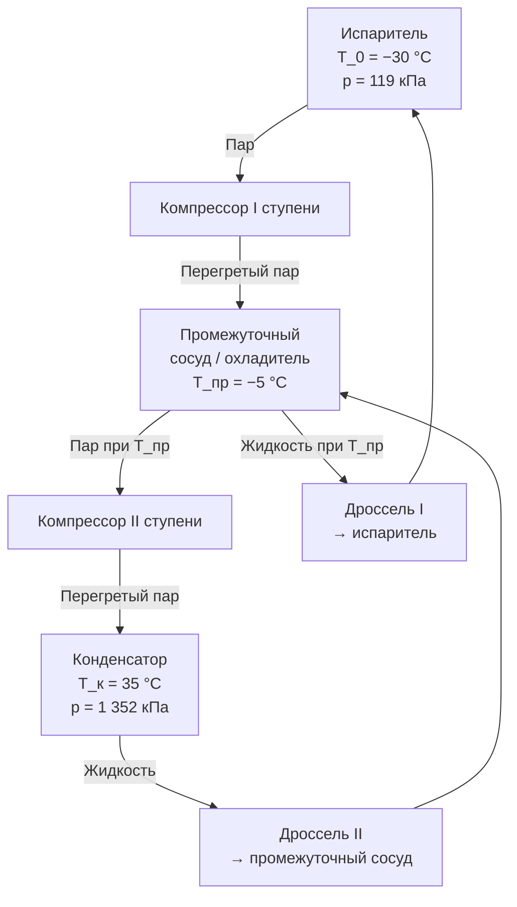

## Общие сведения

Аммиак (NH3, R717) — природный (natural) хладагент, применяемый в промышленном холодоснабжении более 150 лет. Это единственный хладагент, широко использующийся как в докомпрессорную эпоху, так и в современных установках с GWP = 0 и ODP = 0.

Молярная масса: M = 17,031 г/моль. Химическая формула: NH3. Класс чистоты для холодильных применений: не менее 99,95 % (ГОСТ 6221 — аммиак жидкий технический).

**Ключевые показатели:**
- GWP: 0 (природный хладагент)
- ODP: 0
- Класс безопасности по ASHRAE 34 и ISO 817: **B2L** (умеренная токсичность, слабовоспламеняющийся)
- ПДК в воздухе рабочей зоны: 20 мг/м³ (ГН 2.2.5.3532-18)

Несмотря на токсичность, аммиак остаётся предпочтительным хладагентом для установок свыше 200 кВт — благодаря высокой скрытой теплоте парообразования (latent heat of vaporization), исключительным транспортным свойствам и нулевому GWP.

---

## Критические и базовые термодинамические параметры


| Параметр | Обозначение | Значение | Единица |
|----------|-------------|---------|---------|
| Критическая температура | T_cr | 132,25 | °C |
| Критическое давление | p_cr | 11,333 | МПа |
| Критическая плотность | ρ_cr | 235 | кг/м³ |
| Нормальная точка кипения | T_нкп | −33,33 | °C |
| Молярная масса | M | 17,031 | г/моль |
| Тройная точка (температура) | T_тр | −77,65 | °C |
| Ацентрический фактор | ω | 0,256 | — |


---

## Таблицы насыщения по температуре


| T, °C | p, кПа | ρ_ж, кг/м³ | ρ_п, кг/м³ | h_ж, кДж/кг | h_п, кДж/кг | r, кДж/кг | s_ж, кДж/(кг·К) | s_п, кДж/(кг·К) |
|-------|--------|------------|------------|------------|------------|---------|----------------|----------------|
| −60   | 21,9   | 702        |  0,18      |  −143      | 1 361      | 1 504   | −0,488         | 5,785          |
| −50   | 40,9   | 690        |  0,32      |   −86      | 1 388      | 1 474   | −0,236         | 5,640          |
| −40   | 71,8   | 677        |  0,55      |   −29      | 1 416      | 1 445   |  0,009         | 5,505          |
| −30   | 119,5  | 663        |  0,90      |    29      | 1 442      | 1 413   |  0,248         | 5,378          |
| −20   | 190,2  | 650        |  1,41      |    89      | 1 468      | 1 379   |  0,480         | 5,258          |
| −10   | 290,8  | 636        |  2,14      |   149      | 1 493      | 1 344   |  0,706         | 5,145          |
|   0   | 429,6  | 621        |  3,18      |   200      | 1 516      | 1 316   |  0,882         | 5,038          |
|  10   | 615,3  | 605        |  4,63      |   253      | 1 536      | 1 283   |  1,048         | 4,935          |
|  20   | 857,5  | 589        |  6,60      |   307      | 1 556      | 1 249   |  1,213         | 4,837          |
|  30   | 1 167  | 571        |  9,23      |   363      | 1 574      | 1 211   |  1,375         | 4,741          |
|  40   | 1 555  | 552        | 12,7       |   420      | 1 591      | 1 171   |  1,535         | 4,648          |
|  50   | 2 033  | 531        | 17,3       |   479      | 1 606      | 1 127   |  1,694         | 4,556          |


Теплота парообразования R717 при 0 °C: **r = 1 316 кДж/кг** — в 6–7 раз выше, чем у R134a (197 кДж/кг) и в 5 раз выше R410A (218 кДж/кг). Это позволяет достигать той же холодопроизводительности при в 5–7 раз меньшем массовом расходе хладагента.

---

## Таблица перегретого пара


| p, кПа | T = −10 °C | T = 10 °C | T = 30 °C | T = 50 °C | T = 70 °C | T = 100 °C |
|--------|-----------|---------|---------|---------|---------|-----------|
| 100    | 1 511     | 1 551   | 1 590   | 1 629   | 1 668   | 1 730      |
| 200    | 1 505     | 1 547   | 1 587   | 1 627   | 1 666   | 1 728      |
| 400    | 1 492     | 1 538   | 1 580   | 1 621   | 1 661   | 1 724      |
| 700    | 1 475     | 1 524   | 1 570   | 1 613   | 1 654   | 1 718      |
| 1 000  | 1 457     | 1 510   | 1 558   | 1 604   | 1 646   | 1 712      |
| 1 500  | 1 426     | 1 487   | 1 540   | 1 589   | 1 634   | 1 703      |
| 2 000  | 1 392     | 1 461   | 1 519   | 1 572   | 1 620   | 1 692      |


---

## Транспортные свойства


| T, °C | η_ж, мкПа·с | η_п, мкПа·с | λ_ж, мВт/(м·К) | λ_п, мВт/(м·К) | Pr_ж |
|-------|------------|------------|--------------|--------------|------|
| −40   | 255        | 8,7        | 580          | 17,4         | 1,73 |
| −20   | 196        | 9,1        | 553          | 19,4         | 1,48 |
|   0   | 155        | 9,5        | 525          | 21,5         | 1,24 |
|  20   | 124        | 9,9        | 494          | 23,8         | 1,05 |
|  40   |  98        | 10,4       | 462          | 26,3         | 0,89 |


Теплопроводность жидкого аммиака (525 мВт/(м·К) при 0 °C) в 6–8 раз выше теплопроводности жидкого R134a или R410A — это обусловливает высокие коэффициенты теплоотдачи в испарителях и конденсаторах.

Источник: NIST REFPROP v10; ASHRAE Handbook Fundamentals 2021, гл. 30.

---

## Диаграмма цикла





Двухступенчатое сжатие (two-stage compression) применяется при температурах испарения ниже −20 °C — снижает степень сжатия каждой ступени и повышает COP на 15–25 %.

---

## Параметры безопасности


| Параметр | Значение | Стандарт |
|----------|---------|---------|
| Класс безопасности | B2L | ASHRAE 34, ISO 817 |
| IDLH (опасная концентрация) | 300 ppm | NIOSH |
| TLV-TWA (8 ч) | 25 ppm | ACGIH |
| ПДК рабочей зоны | 20 мг/м³ | ГН 2.2.5.3532-18 |
| LFL (нижний предел воспламеняемости) | 15 % об. | ASHRAE 34 |
| UFL (верхний предел воспламеняемости) | 28 % об. | ASHRAE 34 |
| Максимальная зарядка (ASHRAE 15) | 0,22 кг/м³ | ASHRAE 15 |


Системы с R717 подлежат специальным требованиям: замкнутые машинные отделения с принудительной вентиляцией, газоанализаторы, аварийный останов компрессоров при превышении 50 % IDLH.

---

## Расчётный пример

**Задача.** Двухступенчатая аммиачная холодильная установка для заморозки продуктов. Определить удельный холодильный эффект, COP и массовый расход при следующих параметрах:
- Температура испарения: T_0 = −35 °C
- Температура конденсации: T_к = 35 °C
- Промежуточная температура: T_пр = −5 °C
- Перегрев пара I ступени на всасывании: ΔT = 5 К → T_1 = −30 °C
- КПД обоих компрессоров: η_изент = 0,82
- Требуемая холодопроизводительность: Q_0 = 500 кВт

**Шаг 1. Давления ступеней.**

По таблице насыщения:
- p_0 (T = −35 °C): интерполяция между −40 °C (71,8 кПа) и −30 °C (119,5 кПа) → p_0 ≈ 92 кПа
- p_пр (T = −5 °C): интерполяция между −10 °C (290,8) и 0 °C (429,6) → p_пр ≈ 352 кПа
- p_к (T = 35 °C): интерполяция между 30 °C (1 167) и 40 °C (1 555) → p_к ≈ 1 352 кПа

**Шаг 2. Энтальпии рабочих точек** (из таблиц насыщения и перегретого пара):

- h_1 (пар, −30 °C, p_0 = 92 кПа) ≈ 1 450 кДж/кг
- h_3 (жидкость при T_к = 35 °C) ≈ 391 кДж/кг
- h_4 = h_3 = 391 кДж/кг (дросселирование)
- h_6 (жидкость при T_пр = −5 °C) ≈ 175 кДж/кг (интерполяция)

**Шаг 3. Удельный холодильный эффект (I ступень):**


q_0 = h_1 - h_6 = 1\,450 - 175 = 1\,275\ \text{кДж/кг}


**Шаг 4. Массовый расход I ступени:**


\dot{m}_1 = \frac{Q_0}{q_0} = \frac{500}{1\,275} \approx 0{,}392\ \text{кг/с}


**Шаг 5. Мощность I ступени компрессора** (h_2 при изоэнтропном сжатии ≈ 1 560 кДж/кг):


W_{\text{к1}} = \dot{m}_1 \cdot \frac{h_{2s} - h_1}{\eta_{\text{изент}}} = 0{,}392 \times \frac{1560 - 1450}{0{,}82} = 0{,}392 \times 134 \approx 52{,}5\ \text{кВт}


Суммарный COP системы (включая II ступень, W_к2 ≈ 48 кВт по аналогичному расчёту):


\text{COP} = \frac{Q_0}{W_{\text{к1}} + W_{\text{к2}}} = \frac{500}{52{,}5 + 48} \approx 4{,}97


---

## Применение и ограничения

R717 применяется в:
- промышленных холодильных установках мощностью от 200 кВт до десятков МВт (пищевая промышленность, химия, нефтехимия);
- установках быстрой заморозки (IQF, blast freezing) при T_0 = −40…−35 °C;
- ледовых аренах и катках (температура льда −5…−8 °C);
- центральных системах холодоснабжения зданий (indirect cooling) через промежуточный хладоноситель.

**Ограничения:**
- Токсичность класса B требует замкнутых машинных отделений, газоанализаторов, аварийной вентиляции.
- Несовместимость с медью и медьсодержащими сплавами (коррозия): трубопроводы — сталь, фитинги — сталь или нержавеющая сталь.
- Масла: синтетические полиальфаолефиновые (PAO) или синтетические алкилбензолы (AB); минеральные масла допускаются при содержании не более 20 ppm в контуре.
- Влагосодержание хладагента: не более 50 ppm (ГОСТ 6221) — влага вызывает коррозию и кристаллизацию льда в регуляторах.

---

## Нормативные ссылки

- NIST REFPROP v10 — база термодинамических свойств хладагентов
- ASHRAE Handbook Fundamentals 2021, гл. 2, 30 — свойства аммиака
- ASHRAE Handbook Refrigeration 2022, гл. 1, 2 — промышленные аммиачные системы
- ASHRAE 34-2022 — классификация хладагентов
- ASHRAE 15-2019 — безопасность холодильных систем
- ISO 817:2014 — обозначения хладагентов
- EN 378-1:2016+A1:2021 — безопасность систем охлаждения
- СП 60.13330.2020 — отопление, вентиляция и кондиционирование воздуха
- ГОСТ 6221-90 — аммиак жидкий технический. Технические условия
- ГОСТ 28547-90 — хладагенты. Общие технические условия
- ГН 2.2.5.3532-18 — предельно допустимые концентрации вредных веществ в воздухе рабочей зоны
