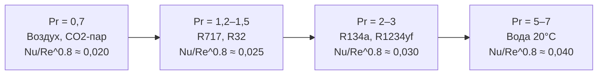

## Определение и физический смысл

Число Прандтля (Prandtl number, Pr) — безразмерный критерий подобия, характеризующий соотношение переноса импульса (momentum diffusion) и переноса теплоты (thermal diffusion) в жидкостях и газах:


Pr = \frac{\nu}{\chi} = \frac{\eta \cdot c_p}{\lambda}


где:
- ν = η/ρ — кинематическая вязкость (м²/с);
- χ = λ/(ρ·c_p) — температуропроводность (thermal diffusivity, м²/с);
- η — динамическая вязкость (Па·с);
- c_p — удельная теплоёмкость при постоянном давлении (Дж/(кг·К));
- λ — коэффициент теплопроводности (Вт/(м·К)).

**Физический смысл:** Pr показывает отношение толщины гидродинамического пограничного слоя δ_гд к толщине теплового пограничного слоя δ_т:


\frac{\delta_{\text{гд}}}{\delta_{\text{т}}} \approx Pr^{1/3}


При Pr > 1: гидродинамический слой толще теплового — вязкость «доминирует» над теплопроводностью. При Pr < 1: тепловой слой толще гидродинамического — типично для жидких металлов и CO2 вблизи критической точки. Для большинства жидких хладагентов Pr = 1,2–5,5.

---

## Компоненты и зависимость от состояния

### Динамическая вязкость η

Для жидких хладагентов η убывает с ростом температуры по закону, близкому к экспоненциальному. Диапазон: 50–500 мкПа·с. Для паров η слабо растёт с температурой: 8–18 мкПа·с.

### Удельная теплоёмкость c_p

Жидкие хладагенты: c_p_ж = 1,0–2,5 кДж/(кг·К) — существенно выше, чем у паров (c_p_п = 0,5–1,2 кДж/(кг·К)). Вблизи критической точки c_p резко возрастает.

### Коэффициент теплопроводности λ

Жидкие хладагенты: λ_ж = 60–150 мВт/(м·К), убывает с ростом температуры. Аммиак — исключение: λ_ж ≈ 500 мВт/(м·К). Паровая фаза: λ_п = 10–25 мВт/(м·К), растёт с температурой.

---

## Таблицы значений числа Прандтля


| Хладагент | T = −20 °C | T = 0 °C | T = 20 °C | T = 40 °C |
|-----------|-----------|---------|---------|---------|
| R134a     | 4,8       | 3,2     | 2,4     | 1,8     |
| R410A     | 2,4       | 1,8     | 1,4     | 1,0     |
| R32       | 2,1       | 1,6     | 1,2     | 0,9     |
| R1234yf   | 4,1       | 3,0     | 2,3     | 1,7     |
| R452b     | 2,8       | 1,9     | 1,5     | 1,2     |
| R717 (NH3)| 1,6       | 1,2     | 0,9     | 0,7     |
| R744 (CO2)| 2,2       | 1,4     | 0,9     | —       |



| Хладагент | T = −20 °C | T = 0 °C | T = 20 °C |
|-----------|-----------|---------|---------|
| R134a     | 0,77      | 0,79    | 0,82    |
| R410A     | 0,74      | 0,76    | 0,79    |
| R32       | 0,72      | 0,74    | 0,77    |
| R717 (NH3)| 0,85      | 0,86    | 0,88    |
| R744 (CO2)| 0,71      | 0,73    | 0,80    |


Источник: NIST REFPROP v10; ASHRAE Handbook Fundamentals 2021, гл. 30.

---

## Корреляции с числом Прандтля

### Турбулентное течение в трубах — корреляция Gnielinski

Наиболее точная для Re = 3 000–5×10⁶, Pr = 0,5–2 000:


Nu = \frac{(f/8)(Re - 1000) \cdot Pr}{1 + 12{,}7\sqrt{f/8}(Pr^{2/3} - 1)}


где коэффициент трения (Petukhov):


f = (0{,}790 \ln Re - 1{,}64)^{-2}


Коэффициент теплоотдачи:


\alpha = \frac{Nu \cdot \lambda}{D}


### Ламинарное течение в трубах — корреляция Sieder-Tate


Nu = 1{,}86 \left(\frac{Re \cdot Pr \cdot D}{L}\right)^{1/3} \left(\frac{\eta}{\eta_w}\right)^{0{,}14}


где η_w — вязкость у стенки, L — длина трубы.

### Пузырьковое кипение — корреляция Cooper


\alpha_{\text{нукл}} = 55 \cdot p_r^{0{,}12} \cdot (-\log p_r)^{-0{,}55} \cdot M^{-0{,}5} \cdot q^{0{,}67}


где p_r = p/p_cr — приведённое давление, M — молярная масса (г/моль), q — плотность теплового потока (Вт/м²). Число Прандтля входит неявно через зависимость p_r.

### Влияние Pr на конвективный теплообмен

Степень влияния Pr определяется показателем n в зависимости Nu ~ Pr^n:
- турбулентное течение: n ≈ 0,33–0,40;
- ламинарное течение: n ≈ 0,33.

При переходе с R410A (Pr ≈ 1,8) на R452b (Pr ≈ 1,9) при T = 0 °C изменение α составит:


\frac{\alpha_{R452b}}{\alpha_{R410A}} \approx \left(\frac{Pr_{R452b}}{Pr_{R410A}}\right)^{0{,}4} = \left(\frac{1{,}9}{1{,}8}\right)^{0{,}4} \approx 1{,}02


Изменение незначительно — 2 %; ключевым фактором остаётся теплопроводность λ.

---

## Двухфазные процессы и число Прандтля

### Испаритель

В испарителе хладагент частично кипит (двухфазная смесь). Число Прандтля входит в корреляции двухфазного кипения (Chen correlation, Kandlikar correlation):


\alpha_{\text{tp}} = h_{CB} \cdot F + h_{\text{нукл}} \cdot S


Конвективная составляющая h_CB пропорциональна λ_ж · Pr_ж^{0,4}, нуклеационная составляющая слабо зависит от Pr напрямую.

### Конденсатор

При плёночной конденсации (film condensation) — корреляция Nusselt для горизонтальных труб:


\alpha_{\text{конд}} = 0{,}725 \left(\frac{\rho_{\text{ж}}^2 \cdot g \cdot r \cdot \lambda_{\text{ж}}^3}{\eta_{\text{ж}} \cdot D \cdot \Delta T}\right)^{1/4}


Число Прандтля не входит явно, но λ_ж и η_ж через него связаны.

---

## Практический расчётный пример

**Задача.** Рассчитать коэффициент теплоотдачи R32 и R717 при турбулентном течении жидкой фазы в испарителе с горизонтальными трубами D = 10 мм, G = 200 кг/(м²·с), T = 0 °C.

**Свойства R32 при 0 °C** (жидкость, NIST REFPROP v10):
- η_ж = 1,60 × 10⁻⁴ Па·с
- λ_ж = 0,115 Вт/(м·К)
- c_p_ж = 1,74 кДж/(кг·К)
- Pr_ж = η · c_p / λ = (1,60 × 10⁻⁴ × 1 740) / 0,115 = 2,42

Re = G · D / η = 200 × 0,010 / (1,60 × 10⁻⁴) = 12 500.

f = (0,790 ln 12 500 − 1,64)^{−2} = (0,790 × 9,43 − 1,64)^{−2} = (7,45 − 1,64)^{−2} = (5,81)^{−2} ≈ 0,0296.


Nu_{R32} = \frac{(0{,}0296/8)(12500 - 1000) \times 2{,}42}{1 + 12{,}7\sqrt{0{,}0296/8}(2{,}42^{2/3} - 1)} = \frac{0{,}00370 \times 11500 \times 2{,}42}{1 + 12{,}7 \times 0{,}0608 \times 0{,}868} \approx \frac{103}{1{,}671} \approx 61{,}6



\alpha_{R32} = \frac{61{,}6 \times 0{,}115}{0{,}010} \approx 708\ \text{Вт/(м}^2\text{·К)}


**Свойства R717 при 0 °C** (жидкость):
- η_ж = 1,55 × 10⁻⁴ Па·с, λ_ж = 0,525 Вт/(м·К), Pr_ж = 1,2

Re = 200 × 0,010 / (1,55 × 10⁻⁴) = 12 900. f ≈ 0,0293.


Nu_{R717} \approx \frac{(0{,}0293/8)(11900)(1{,}2)}{1 + 12{,}7 \times 0{,}0605 \times (1{,}2^{2/3} - 1)} \approx \frac{65{,}6}{1{,}165} \approx 56{,}3



\alpha_{R717} = \frac{56{,}3 \times 0{,}525}{0{,}010} \approx 2\,956\ \text{Вт/(м}^2\text{·К)}


**Вывод:** несмотря на более низкое число Нуссельта (56 vs 62), теплоотдача аммиака в 4,2 раза выше за счёт значительно большей теплопроводности λ_ж. Это подтверждает: при выборе хладагента для интенсификации теплообмена λ_ж важнее Pr_ж.

---

## Диаграмма: влияние Pr на коэффициент теплоотдачи





---

## Особенности вблизи критической точки

Вблизи критической точки c_p резко возрастает, а λ проходит через максимум — число Прандтля аномально увеличивается. Для CO2 при p = 7,5 МПа и T ≈ 32–35 °C Pr достигает 5–8, тогда как при T = 50 °C Pr ≈ 1,5. Это явление (pseudo-phase transition) необходимо учитывать при расчёте газовых охладителей транскритических систем.

---

## Нормативные ссылки

- NIST REFPROP v10 — база термодинамических и транспортных свойств
- ASHRAE Handbook Fundamentals 2021, гл. 4 — теплоотдача; гл. 30 — свойства хладагентов
- ASHRAE Handbook Refrigeration 2022, гл. 1 — транспортные свойства хладагентов
- ISO 817:2014 — обозначения хладагентов
- EN 378-1:2016+A1:2021 — безопасность систем охлаждения
- СП 60.13330.2020 — отопление, вентиляция и кондиционирование воздуха
