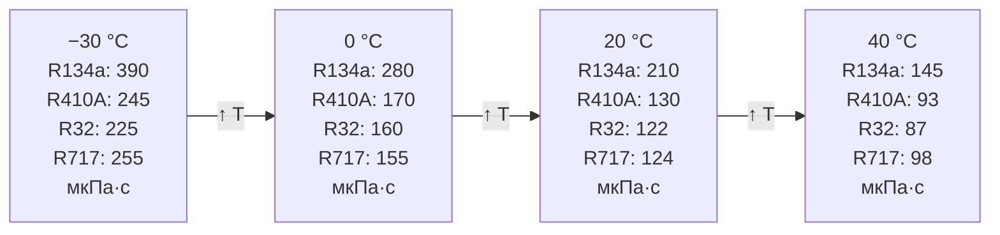

## Определение и физические основы

Вязкость (viscosity) — свойство вещества сопротивляться сдвиговым деформациям при течении. Для ньютоновских жидкостей выполняется закон Ньютона:


\tau = \eta \cdot \frac{du}{dy}


где τ — напряжение сдвига (Па), η — **динамическая вязкость** (Па·с), du/dy — градиент скорости (с⁻¹).

**Кинематическая вязкость** (kinematic viscosity):


\nu = \frac{\eta}{\rho}


Единицы: η в Па·с или мкПа·с (1 мкПа·с = 10⁻⁶ Па·с); ν в м²/с или сСт (1 сСт = 10⁻⁶ м²/с).

В инженерных расчётах HVAC вязкость определяет:
- гидравлические потери в трубопроводах, теплообменниках и дросселях;
- режим течения (ламинарный / турбулентный) через число Рейнольдса;
- интенсивность конвективного теплообмена через числа Re и Pr;
- возврат масла в компрессор в системах с прямым расширением (DX).

---

## Механизм и температурная зависимость

### Жидкая фаза

В жидкостях перенос импульса определяется межмолекулярными силами. С ростом температуры связи ослабевают, молекулы приобретают большую подвижность — вязкость убывает по закону, близкому к экспоненциальному:


\eta_{\text{ж}}(T) = A \cdot \exp\!\left(\frac{B}{T}\right)


Снижение η_ж при росте температуры на 10 К: 15–25 %.

### Паровая фаза

В газах перенос импульса осуществляется за счёт молекулярных столкновений. Вязкость растёт с температурой (уравнение Сазерленда, Sutherland equation):


\eta_{\text{п}}(T) = \eta_0 \left(\frac{T}{T_0}\right)^{3/2} \frac{T_0 + S}{T + S}


где S — постоянная Сазерленда (К): R134a — 167 К, R410A — 155 К, NH3 — 370 К.

### Влияние давления

- Жидкость: рост давления на 1 МПа увеличивает η_ж на 2–5 %;
- Пар при субкритических условиях: вязкость слабо зависит от давления (теория идеального газа);
- Вблизи критической точки: η резко возрастает у обеих фаз.

---

## Таблицы динамической вязкости


| Хладагент | T = −30 °C | T = 0 °C | T = 20 °C | T = 40 °C |
|-----------|-----------|---------|---------|---------|
| R134a     | 390       | 280     | 210     | 145     |
| R410A     | 245       | 170     | 130     | 93      |
| R32       | 225       | 160     | 122     | 87      |
| R1234yf   | 310       | 220     | 169     | 121     |
| R452b     | 231       | 136     | 107     | 82      |
| R454b     | 245       | 141     | 110     | 83      |
| R717 (NH3)| 255       | 155     | 124     | 98      |
| R744 (CO2)| 123       | 95      | 65      | —       |
| R290 (C3H8)| 155     | 110     | 87      | 66      |



| Хладагент | T = −20 °C | T = 0 °C | T = 20 °C | T = 50 °C |
|-----------|-----------|---------|---------|---------|
| R134a     | 10,0      | 10,8    | 11,7    | 13,0    |
| R410A     | 11,2      | 12,1    | 13,2    | 14,8    |
| R32       | 10,7      | 11,5    | 12,5    | 14,1    |
| R1234yf   |  9,5      | 10,2    | 11,1    | 12,4    |
| R452b     | 10,8      | 11,7    | 12,8    | 14,5    |
| R717 (NH3)|  8,8      |  9,5    | 10,2    | 11,3    |
| R744 (CO2)| 12,6      | 13,5    | 14,6    | 16,5    |


---

## Кинематическая вязкость


| Хладагент | ν_ж | ρ_ж, кг/м³ | η_ж, мкПа·с |
|-----------|-----|-----------|------------|
| R134a     | 2,2 | 1 295     | 280        |
| R410A     | 1,6 | 1 059     | 170        |
| R32       | 1,5 | 1 053     | 160        |
| R1234yf   | 2,0 | 1 121     | 220        |
| R717 (NH3)| 2,4 | 649       | 155        |
| R744 (CO2)| 1,2 | 795       | 95         |


---

## Практические расчёты

### Число Рейнольдса


Re = \frac{G \cdot D_h}{\eta} = \frac{\rho \cdot v \cdot D_h}{\eta}


где G = ρ·v — массовый поток (кг/(м²·с)), D_h — гидравлический диаметр (м).

Режимы течения:
- Re < 2 300: ламинарный
- 2 300 < Re < 10 000: переходный
- Re > 10 000: турбулентный

### Падение давления в трубопроводе

**Ламинарный режим** (точная формула Хагена–Пуазёйля):


\Delta p = \frac{128 \cdot \eta \cdot L \cdot \dot{V}}{\pi \cdot D^4}


**Турбулентный режим** (формула Дарси–Вейсбаха):


\Delta p = f \cdot \frac{L}{D} \cdot \frac{\rho v^2}{2}


Коэффициент трения f по Блазиусу (Blasius, Re < 100 000):


f = \frac{0{,}3164}{Re^{0{,}25}}


### Корреляция Черчилля (Churchill) — универсальная

Применяется для любого Re и шероховатости ε/D:


f = 8 \left[\left(\frac{8}{Re}\right)^{12} + (A + B)^{-3/2}\right]^{1/12}


---

## Расчётный пример

**Задача.** Трубопровод жидкого хладагента R32: внутренний диаметр D = 12 мм, длина L = 5 м, температура жидкости T = 10 °C, скорость v = 1,0 м/с. Определить режим течения и потерю давления.

**Свойства R32 при T = 10 °C** (интерполяция между 0 и 20 °C):
- ρ_ж ≈ 1 025 кг/м³
- η_ж ≈ 141 мкПа·с = 1,41 × 10⁻⁴ Па·с

**Число Рейнольдса:**


Re = \frac{\rho \cdot v \cdot D}{\eta} = \frac{1025 \times 1{,}0 \times 0{,}012}{1{,}41 \times 10^{-4}} = \frac{12{,}30}{1{,}41 \times 10^{-4}} = 87\,200


Режим: турбулентный (Re >> 10 000).

**Коэффициент трения (Blasius):**


f = \frac{0{,}3164}{87\,200^{0{,}25}} = \frac{0{,}3164}{17{,}18} = 0{,}01842


**Потеря давления:**


\Delta p = 0{,}01842 \times \frac{5}{0{,}012} \times \frac{1025 \times 1{,}0^2}{2} = 0{,}01842 \times 416{,}7 \times 512{,}5 \approx 3\,934\ \text{Па} \approx 3{,}93\ \text{кПа}


Для сравнения: если использовать R134a при той же температуре (η_ж ≈ 245 мкПа·с, ρ_ж ≈ 1 248 кг/м³):
- Re = 1 248 × 1,0 × 0,012 / (2,45 × 10⁻⁴) = 61 100
- f = 0,3164 / 61100^0,25 = 0,0197
- Δp = 0,0197 × 416,7 × 624 = 5 120 Па

R32 даёт на 23 % меньшие потери давления по сравнению с R134a при одинаковой скорости — следствие меньшей вязкости и плотности.

---

## Вязкость в двухфазной области

В двухфазном потоке (кипение в испарителе) применяется эффективная вязкость. Наиболее распространена модель Cicchitti:


\eta_{\text{tp}} = x \cdot \eta_{\text{п}} + (1 - x) \cdot \eta_{\text{ж}}


и модель McAdams (более точная для расчёта Re):


\frac{1}{\eta_{\text{tp}}} = \frac{x}{\eta_{\text{п}}} + \frac{1 - x}{\eta_{\text{ж}}}


При x = 0,5 и T = 0 °C для R410A: η_ж = 170 мкПа·с, η_п = 12,1 мкПа·с:


\eta_{\text{tp}} = \frac{1}{\frac{0{,}5}{12{,}1} + \frac{0{,}5}{170}} = \frac{1}{0{,}0413 + 0{,}00294} = \frac{1}{0{,}04424} \approx 22{,}6\ \text{мкПа·с}


---

## Влияние масла на вязкость

Растворённое POE-масло значительно изменяет вязкость жидкого хладагента:


| Концентрация масла, % масс. | η_ж, мкПа·с | Изменение vs чистый хладагент |
|---------------------------|------------|-------------------------------|
| 0 (чистый R410A)          | 170        | —                             |
| 1                         | 185        | +9 %                          |
| 3                         | 220        | +29 %                         |
| 5                         | 280        | +65 %                         |


Повышение вязкости жидкой смеси снижает число Re и может ухудшить возврат масла в компрессор. Рекомендуемая концентрация масла в циркулирующем хладагенте: не более 2 % масс. (ASHRAE Handbook Refrigeration 2022, гл. 12).

---

## Диаграмма: сравнение вязкости хладагентов





---

## Нормативные ссылки

- NIST REFPROP v10 — база термодинамических и транспортных свойств
- ASHRAE Handbook Fundamentals 2021, гл. 3, 4, 30 — вязкость, гидравлика, свойства хладагентов
- ASHRAE Handbook Refrigeration 2022, гл. 1, 12 — транспортные свойства, масло в контуре
- ASHRAE 34-2022 — классификация хладагентов
- ISO 817:2014 — обозначения хладагентов
- EN 378-1:2016+A1:2021 — безопасность систем охлаждения
- СП 60.13330.2020 — отопление, вентиляция и кондиционирование воздуха
- ГОСТ 28547-90 — хладагенты. Общие технические условия
