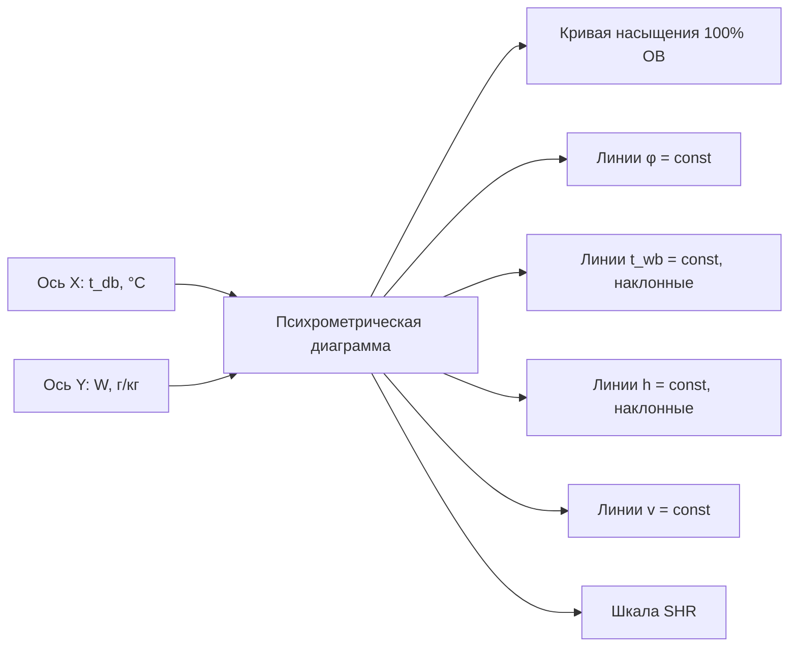

Психрометрия — раздел инженерной термодинамики, изучающий физические и химические свойства смесей сухого воздуха и водяного пара. Дисциплина является фундаментом проектирования систем кондиционирования воздуха: без владения психрометрическим анализом невозможно корректно рассчитать тепловые и влажностные нагрузки, выбрать оборудование или разработать стратегию управления системой.

## Физические основы

Атмосферный воздух представляет собой двоичную газовую смесь сухого воздуха и водяного пара. При диапазонах температур и давлений, типичных для HVAC-приложений (от −40 °C до +60 °C, давление 60–110 кПа), оба компонента с достаточной для инженерных расчётов точностью описываются уравнением состояния идеального газа. Согласно закону Дальтона, общее барометрическое давление равно сумме парциальных давлений:


p = p_a + p_v


где p_a — парциальное давление сухого воздуха, p_v — парциальное давление водяного пара. На уровне моря при стандартных условиях p = 101{,}325 кПа, а p_v обычно составляет 0,6–6,5 кПа.

Молекулярные массы компонентов: M_a = 28{,}966 г/моль (сухой воздух), M_v = 18{,}015 г/моль (водяной пар). Их отношение определяет фундаментальную психрометрическую константу:


\varepsilon = \frac{M_v}{M_a} = \frac{18{,}015}{28{,}966} = 0{,}6220


Эта константа фигурирует во всех базовых уравнениях психрометрии.

## Семь психрометрических свойств

Состояние влажного воздуха однозначно определяется двумя независимыми интенсивными переменными (при заданном барометрическом давлении). Стандартный набор описывающих свойств согласно ASHRAE Handbook — Fundamentals, Ch. 1:


| Свойство | Обозначение | Единица СИ | Физический смысл |
|---|---|---|---|
| Температура по сухому термометру | t_db | °C | Истинная термодинамическая температура смеси |
| Температура по влажному термометру | t_wb | °C | Температура адиабатического насыщения |
| Температура точки росы | t_dp | °C | Температура начала конденсации |
| Коэффициент влажности | W | кг/кг | Масса пара на 1 кг сухого воздуха |
| Относительная влажность | φ | — (или %) | Степень насыщения по давлению пара |
| Удельная энтальпия | h | кДж/кг | Тепловое содержание на 1 кг сухого воздуха |
| Удельный объём | v | м³/кг | Объём смеси на 1 кг сухого воздуха |


### Коэффициент влажности

Коэффициент влажности (humidity ratio, mixing ratio) — отношение массы водяного пара к массе сухого воздуха:


W = \frac{m_v}{m_a} = \frac{\varepsilon \cdot p_v}{p - p_v} = \frac{0{,}6220 \cdot p_v}{p - p_v}


При насыщении (100 % ОВ, p_v = p_{ws}):


W_s = \frac{0{,}6220 \cdot p_{ws}(t)}{p - p_{ws}(t)}


Значение W_s при 21 °C и стандартном давлении составляет 15,7 г/кг.

### Относительная влажность


\varphi = \frac{p_v}{p_{ws}(t_{db})}


Относительная влажность характеризует близость воздуха к насыщению, но **не** отражает абсолютное содержание влаги. Воздух при 30 °C и 50 % ОВ содержит значительно больше влаги, чем воздух при 15 °C и 80 % ОВ.

### Удельная энтальпия


h = c_{pa} \cdot t_{db} + W\,(h_{fg,0} + c_{pv} \cdot t_{db})


где c_{pa} = 1{,}006 кДж/(кг·К) — удельная теплоёмкость сухого воздуха, h_{fg,0} = 2501 кДж/кг — скрытая теплота испарения при 0 °C, c_{pv} = 1{,}86 кДж/(кг·К) — удельная теплоёмкость водяного пара. В численном виде:


h = 1{,}006\,t_{db} + W\,(2501 + 1{,}86\,t_{db})\quad[\text{кДж/кг}]


### Удельный объём


v = \frac{R_a \cdot T}{p - p_v} = \frac{0{,}287042 \cdot T \cdot (1 + 1{,}6078 \cdot W)}{p}


где T — абсолютная температура в К, p — в кПа.

## Давление насыщения: уравнения Хайланда–Вексера

Давление насыщенного пара p_{ws} является ключевой величиной, от которой зависят все остальные психрометрические свойства. ASHRAE Handbook — Fundamentals (Ch. 1) рекомендует уравнения Хайланда–Вексера (Hyland–Wexler, 1983), обеспечивающие погрешность менее 0,01 % в диапазоне −100 °C до +200 °C.

**Над жидкой водой (0 °C до 200 °C):**


\ln p_{ws} = \frac{C_1}{T} + C_2 + C_3 T + C_4 T^2 + C_5 T^3 + C_6 \ln T


**Коэффициенты SI (T в К, p в Па):**


| Коэффициент | Значение |
|---|---|
| C₁ | −5800,2206 |
| C₂ | 1,3914993 |
| C₃ | −0,048640239 |
| C₄ | 4,1764768 × 10⁻⁵ |
| C₅ | −1,4452093 × 10⁻⁸ |
| C₆ | 6,5459673 |


**Над льдом (−100 °C до 0 °C):**


\ln p_{ws} = \frac{C_7}{T} + C_8 + C_9 T + C_{10} T^2 + C_{11} T^3 + C_{12} \ln T


Для инженерных расчётов в диапазоне 0–60 °C допустимо приближение Магнуса–Тетенса:


p_{ws} = 0{,}61094 \cdot \exp\!\left(\frac{17{,}625 \cdot t}{t + 243{,}04}\right)\quad[\text{кПа}]


Погрешность — менее 0,3 % при температурах 5–50 °C.

## Психрометрическая диаграмма

Психрометрическая диаграмма (h–d-диаграмма, диаграмма Мольера в европейской традиции) — графическое представление уравнений состояния влажного воздуха при постоянном барометрическом давлении. По горизонтальной оси откладывается температура по сухому термометру t_db, по вертикальной (или в косоугольной системе) — коэффициент влажности W.





ASHRAE публикует диаграммы для различных высот над уровнем моря (Диаграммы 1–7), поскольку барометрическое давление существенно влияет на психрометрические соотношения.

## Основные психрометрические процессы


| Процесс | Направление на диаграмме | Что меняется | Типичное оборудование |
|---|---|---|---|
| Явное нагревание | → (вправо, W = const) | t_db↑, φ↓ | Нагревательная секция |
| Явное охлаждение | ← (влево, W = const) | t_db↓, φ↑ | Сухой охладитель |
| Охлаждение и осушение | ↙ (вниз-влево) | t_db↓, W↓ | Охлаждающая секция (t_s < t_dp) |
| Увлажнение паром | ↑ (вверх) | W↑, t_db↑ незначительно | Паровой увлажнитель |
| Адиабатическое насыщение | ↙ вдоль t_wb | t_db↓, W↑ | Испарительный охладитель |
| Хемосорбционное осушение | ↗ (вверх-вправо) | W↓, t_db↑ | Роторный осушитель |
| Смешивание потоков | Прямая между двумя точками | Все свойства | Смесительная камера |


## Характерные численные значения


| Состояние | t_db, °C | φ, % | W, г/кг | h, кДж/кг | t_dp, °C |
|---|---|---|---|---|---|
| Зимний наружный (Москва, расч.) | −26 | 82 | 0,5 | −24,7 | −28 |
| Зимний внутренний (комфорт) | 22 | 35 | 5,8 | 37,0 | 6 |
| Летний наружный (Москва, расч.) | 28 | 44 | 10,5 | 54,8 | 15 |
| Летний внутренний (комфорт) | 24 | 50 | 9,3 | 47,8 | 13 |
| Приточный воздух (типовой летний) | 13 | 90 | 8,4 | 34,6 | 12 |
| Тропические условия | 35 | 70 | 25,5 | 100,7 | 29 |


## Влияние высоты над уровнем моря

Барометрическое давление убывает с высотой по уравнению:


p = 101{,}325 \cdot \left(1 - 2{,}25577 \times 10^{-5} \cdot z\right)^{5{,}2559}\quad[\text{кПа},\; z\text{ в м}]


На высоте 2000 м давление составляет около 79,5 кПа. При неизменной температуре и парциальном давлении пара коэффициент влажности насыщения W_s возрастает, а удельный объём увеличивается пропорционально. Это требует применения диаграмм или расчётных алгоритмов, скорректированных для конкретной высоты.

## Зона комфорта по ASHRAE 55

Стандарт ASHRAE 55-2023 определяет допустимые границы параметров микроклимата через оперативную температуру (operative temperature) и влажность. Зона комфорта на психрометрической диаграмме:

- Летний период: t_db = 23–26 °C, φ ≤ 65 %, t_dp ≤ 17 °C
- Зимний период: t_db = 20–24 °C, φ ≥ 30 %

Нижний предел влажности t_dp ≥ 2 °C рекомендован для предотвращения пересушивания слизистых оболочек. Верхний предел t_dp ≤ 17 °C ограничивает риск теплового дискомфорта.

## Применение в инженерных расчётах

Психрометрия применяется в следующих задачах:

1. **Расчёт нагрузок** — определение явной и скрытой мощности охлаждения/нагревания по входным и выходным состояниям воздуха
2. **Выбор оборудования** — определение производительности охлаждающих и нагревательных секций, увлажнителей, осушителей
3. **Воздушный баланс** — расчёт расходов при смешивании наружного и рециркуляционного воздуха
4. **Анализ экономайзера** — оценка условий бесплатного охлаждения наружным воздухом
5. **Рекуперация энергии** — расчёт явной и скрытой эффективности теплообменников
6. **Управление влажностью** — настройка уставок увлажнителей и осушителей

## Нормативные документы

- ASHRAE Handbook — Fundamentals, Chapter 1 «Psychrometrics» (издание 2021 г.)
- ASHRAE Standard 55-2023 «Thermal Environmental Conditions for Human Occupancy»
- ASHRAE Standard 62.1-2022 «Ventilation and Acceptable Indoor Air Quality»
- ISO 7726:1998 «Ergonomics of the Thermal Environment»
- СП 60.13330.2020 «Отопление, вентиляция и кондиционирование воздуха»
