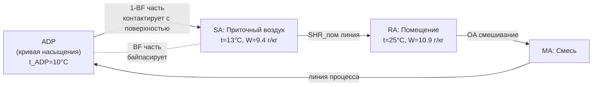

Метод коэффициента байпаса (bypass factor method) — инженерный подход к анализу производительности мокрых охлаждающих секций, позволяющий связать физическую конструкцию теплообменника с психрометрическими параметрами обрабатываемого воздуха. Метод разработан как альтернатива детальному моделированию теплообмена и широко применяется в практике проектирования HVAC.

## Концепция коэффициента байпаса

### Физическая интерпретация

В реальной охлаждающей секции не весь воздух одинаково контактирует с холодными поверхностями трубок и оребрения. Часть воздуха проходит через секцию практически не охладившись — «байпасирует» теплопередающую поверхность. Коэффициент байпаса BF количественно выражает эту долю воздуха:


\text{BF} = \frac{\dot{m}_{\text{байпас}}}{\dot{m}_{\text{total}}}


В рамках упрощённой модели: выходящий воздух рассматривается как смесь воздуха при состоянии ADP (доля 1−BF) и воздуха при входных условиях (доля BF).

### Определение BF через температуры


\text{BF} = \frac{t_{db,\text{вых}} - t_{ADP}}{t_{db,\text{вх}} - t_{ADP}}


Аналогично через коэффициенты влажности:


\text{BF} = \frac{W_{\text{вых}} - W_{ADP}}{W_{\text{вх}} - W_{ADP}}


Аналогично через энтальпии:


\text{BF} = \frac{h_{\text{вых}} - h_{ADP}}{h_{\text{вх}} - h_{ADP}}


Все три выражения дают одинаковый результат при условии, что процесс на диаграмме — прямая линия.

### Контактный коэффициент


\text{CF} = 1 - \text{BF} = \frac{t_{db,\text{вх}} - t_{db,\text{вых}}}{t_{db,\text{вх}} - t_{ADP}}


CF характеризует эффективность контакта воздуха с холодной поверхностью.

## Точка росы аппарата (ADP)

### Расчёт ADP из условий на входе и выходе

Если BF известен:


t_{ADP} = \frac{t_{db,\text{вых}} - \text{BF} \cdot t_{db,\text{вх}}}{1 - \text{BF}}


Если BF неизвестен, ADP находится графически: пересечение прямой через точки входа и выхода с кривой насыщения на психрометрической диаграмме.

### Связь ADP с конструкцией секции

ADP тесно связана с температурой хладоносителя:


t_{ADP} \approx t_{w,\text{вых}} + \Delta t_{\text{контакт}}


Типовые значения \Delta t_{\text{контакт}} для мокрых секций: 1,5–4 °C (зависит от числа рядов и скорости воды).

Для секции с охлаждённой водой 6/12 °C:


t_{ADP} \approx 6 + 2{,}5 = 8{,}5\;°\text{C}\quad(\text{ориентировочно})


Точное значение определяется по характеристикам производителя.

## Факторы, влияющие на BF

### Влияние глубины секции


| Рядов трубок | Шаг оребрения, мм | BF (ориент.) |
|---|---|---|
| 1 | 3,0 | 0,65–0,80 |
| 2 | 3,0 | 0,40–0,55 |
| 3 | 3,0 | 0,25–0,35 |
| 4 | 2,5 | 0,18–0,28 |
| 6 | 2,5 | 0,10–0,16 |
| 6 | 2,0 | 0,06–0,12 |
| 8 | 2,0 | 0,04–0,08 |
| 12 | 1,5 | 0,02–0,05 |


### Влияние скорости воздуха

При увеличении скорости лицевого сечения v_face:


\text{BF} \propto \exp(+\alpha \cdot v_{\text{face}})


Примерная зависимость: каждое увеличение скорости с 2,0 до 3,0 м/с увеличивает BF примерно на 20–40 % (относительно).

**Оптимальная скорость** для мокрых секций: 2,0–2,5 м/с (баланс между теплообменом и уносом капель конденсата).

### Влияние режима работы

- **Сухой режим** (t_surface > t_dp): BF выше (теплообмен хуже), чем в мокром
- **Мокрый режим**: конденсационная плёнка улучшает теплообмен (Lewis number effect)
- **Частичная нагрузка**: при снижении расхода воды BF снижается (секция приближается к ADP)

## Связь BF с SHR и ADP

### Уравнение ADP–SHR

Для заданного SHR помещения (линия процесса помещения через точку RA):


\text{SHR}_{\text{секции}} = \frac{t_{SA} - t_{ADP}}{h_{SA} - h_{ADP}} \cdot c_{pa}


Алгебраически: чем ниже SHR, тем ниже требуемый ADP (глубже осушение) → ниже температура хладоносителя.

### Диаграмма: треугольник ADP–SA–RA





## Практический пример: проектирование охлаждающей секции

**Задание:** спроектировать охлаждающую секцию для приточной установки.

**Входные данные:**
- Расход воздуха: 15 000 м³/ч
- Смешанный воздух: t_db = 28 °C, W = 13,5 г/кг, h = 62,8 кДж/кг
- Требуемый приточный воздух: t_SA = 13 °C, W_SA = 9,4 г/кг
- Температура хладоносителя: 6/12 °C

**Шаг 1. Определение BF из требуемых параметров (предположим ADP):**

Продлим прямую через MA (28°C, 13,5 г/кг) и SA (13°C, 9,4 г/кг) до кривой насыщения:

Наклон: ΔW/Δt = (9,4 − 13,5) / (13 − 28) = −4,1 / −15 = 0,273 (г/кг)/°C

Уравнение прямой: W = 13,5 + 0,273 × (t − 28) = 0,273t + 5,856

При φ = 100 %: W_s(t) = 0,273t + 5,856 (итерация):
- t = 10 °C: W_s(10°C) = 7,63; формула даёт 8,59 → t_ADP > 10
- t = 11 °C: W_s(11°C) = 8,22; формула даёт 8,86 → ≈ нет
- t ≈ 10,4 °C → W_ADP ≈ 8,7 г/кг

**Шаг 2. Расчёт BF:**


\text{BF} = \frac{13 - 10{,}4}{28 - 10{,}4} = \frac{2{,}6}{17{,}6} = \mathbf{0{,}148}


**Шаг 3. Выбор глубины секции:**

По таблице BF = 0,148 → рекомендуется 6 рядов, шаг оребрения 2,5 мм при скорости воздуха ≤ 2,5 м/с.

**Шаг 4. Мощность секции:**


\dot{m}_a = \frac{15\,000}{3600} \times 1{,}193 = 4{,}97\;\text{кг/с}



Q_{\text{total}} = 4{,}97 \times (62{,}8 - h_{SA}) = 4{,}97 \times (62{,}8 - 34{,}8) = 4{,}97 \times 28{,}0 = \mathbf{139{,}2\;\text{кВт}}


**Шаг 5. Проверка ADP относительно температуры воды:**

t_ADP = 10,4 °C; t_w,вход = 6 °C; t_w,выход = 12 °C. Средняя температура воды = 9 °C.  
Δt = t_ADP − t_w,вых = 10,4 − 12 = −1,6 °C < 0 — ADP ниже температуры обратной воды. **Реализуемость подтверждена** (t_ADP > t_w,подача = 6 °C).

## Ограничения метода BF

Метод коэффициента байпаса предполагает:
1. Линейный (прямолинейный) путь процесса на психрометрической диаграмме
2. Постоянный коэффициент Lewis Le = 1
3. Равномерное распределение воздуха по сечению секции

В реальности путь процесса изогнут (больше явного охлаждения в начале секции), Le ≈ 0,9, распределение воздуха неравномерно. Погрешность метода BF: 5–15 %. Для точных расчётов следует применять методы LMED (Logarithmic Mean Enthalpy Difference) или численное моделирование по AHRI 410.

## Нормативные документы

- ASHRAE Handbook — Fundamentals 2021, Chapter 1 «Psychrometrics»
- AHRI Standard 410-2001 «Forced Circulation Air-Cooling and Air-Heating Coils»
- ASHRAE Handbook — HVAC Systems and Equipment 2020, Chapter 22 «Air-Cooling and Dehumidifying Coils»
- СП 60.13330.2020 «Отопление, вентиляция и кондиционирование воздуха»
