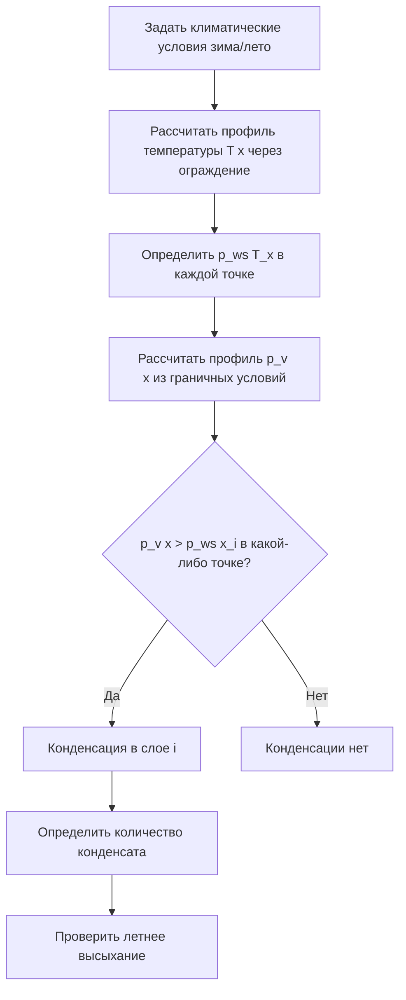

Влагосодержание является ключевым параметром как для расчёта систем HVAC, так и для строительной физики. Абсолютное содержание влаги в воздухе определяет скрытую нагрузку на охлаждающее оборудование, риск конденсации на поверхностях ограждений и долговечность строительных материалов. Точный количественный анализ требует понимания термодинамики влажного воздуха, механизмов переноса влаги и взаимодействия систем HVAC со строительной оболочкой.

## Коэффициент влажности: определение и расчёт

### Базовые соотношения

Коэффициент влажности W (humidity ratio, mixing ratio) — масса водяного пара m_v, приходящаяся на 1 кг сухого воздуха m_a:


W = \frac{m_v}{m_a} = \frac{0{,}6220 \cdot p_v}{p_{\text{бар}} - p_v}\quad[\text{кг/кг или г/кг}]


При известной относительной влажности φ и температуре t_db:


W = \frac{0{,}6220 \cdot \varphi \cdot p_{ws}(t_{db})}{p_{\text{бар}} - \varphi \cdot p_{ws}(t_{db})}


### Давление насыщенного пара

Для расчётов в диапазоне 0–60 °C используется приближение Магнуса–Тетенса:


p_{ws}(t) = 0{,}61094 \cdot \exp\!\left(\frac{17{,}625\,t}{t + 243{,}04}\right)\quad[\text{кПа}]


Для точных расчётов (лабораторные условия, компьютерные психрометры) применяются уравнения Хайланда–Вексера, принятые ASHRAE (погрешность < 0,01 %):


\ln p_{ws} = \frac{C_1}{T} + C_2 + C_3 T + C_4 T^2 + C_5 T^3 + C_6 \ln T


### Численный пример: расчёт W

**Дано:** t_db = 26 °C, φ = 60 %, p_бар = 101,325 кПа

1. p_{ws}(26°C) = 0{,}61094 \cdot \exp(17{,}625 \times 26 / 269{,}04) = 3{,}362 кПа
2. p_v = 0{,}60 \times 3{,}362 = 2{,}017 кПа
3. W = 0{,}6220 \times 2{,}017 / (101{,}325 - 2{,}017) = \mathbf{12{,}64} г/кг

Скрытая тепловая нагрузка системы при массовом расходе воздуха \dot{m}_a = 1{,}0 кг/с и снижении W до 9,0 г/кг:


q_{\text{lat}} = \dot{m}_a \cdot h_{fg} \cdot \Delta W = 1{,}0 \times 2465 \times (0{,}01264 - 0{,}0090) = \mathbf{8{,}8}\text{ кВт}


## Температура точки росы

### Определение

Точка росы t_dp — температура, до которой необходимо охладить воздух при неизменном давлении и неизменном влагосодержании, чтобы парциальное давление пара достигло давления насыщения:


p_v = p_{ws}(t_{dp})


Точка росы является абсолютной мерой влагосодержания: при t_dp = const абсолютная влажность не меняется независимо от нагрева или охлаждения воздуха.

### Расчёт t_dp из известного p_v


t_{dp} = \frac{243{,}04 \cdot \ln(p_v / 0{,}61094)}{17{,}625 - \ln(p_v / 0{,}61094)}\quad[°\text{C}]


### Практическое значение для HVAC

Точка росы определяет минимальную температуру поверхности теплообменника, при которой начинается конденсация. Охлаждающая секция переходит в режим осушения (wet coil) при:


t_{\text{surface}} < t_{dp,\text{вх}}



| Требование | Целевой t_dp, °C | Обоснование |
|---|---|---|
| Максимальный комфорт (ASHRAE 55) | ≤ 17 | Предотвращение теплового дискомфорта от высокой влажности |
| Рекомендуемый минимум (ASHRAE 55) | ≥ 2 | Предотвращение пересушивания |
| ЦОД (ASHRAE TC9.9 A1) | 5,5–15 | Исключение конденсации на оборудовании |
| Фармпроизводство (чистые комнаты) | ≤ −20 | Требования процесса сушки |
| Хранение произведений искусства | 4–12 | Сохранность материалов |


## Конденсация на поверхностях ограждений

### Условие образования конденсата

Конденсация на внутренней поверхности ограждающей конструкции начинается при:


T_{\text{surface}} \leq t_{dp,\text{помещение}}


Температура внутренней поверхности определяется через тепловое сопротивление:


T_{\text{surface}} = T_{\text{inside}} - \frac{R_{si}}{R_{\text{total}}} \cdot (T_{\text{inside}} - T_{\text{outside}})


где R_{si} — сопротивление внутренней воздушной прослойки (0,125 м²·К/Вт при конвекции), R_{\text{total}} — суммарное тепловое сопротивление ограждения.

### Коэффициент температуры f_Rsi

По EN ISO 13788, минимально допустимый коэффициент температуры:


f_{Rsi,\min} = \frac{t_{dp,\text{inside}} - T_{\text{outside}}}{T_{\text{inside}} - T_{\text{outside}}}



| Тип помещения | φ_inside, % | t_dp_inside, °C | f_Rsi,min |
|---|---|---|---|
| Жильё (лёгкое обогревание) | 50 | 13 | 0,70 |
| Кухня | 60 | 16 | 0,75 |
| Ванная | 70 | 20 | 0,85 |
| Бассейн | 80 | 24 | 0,92 |
| ЦОД | 50 | 13 | 0,70 |


### Численный пример: проверка угла стены

**Дано:** T_inside = 22 °C, φ_inside = 55 % → t_dp = 12,5 °C; T_outside = −20 °C; R_si = 0,125 м²·К/Вт; R_total = 3,5 м²·К/Вт


T_{\text{surface}} = 22 - \frac{0{,}125}{3{,}5} \times (22 - (-20)) = 22 - 1{,}5 = 20{,}5\,°\text{C}


Для типичного угла здания эффективное R_total снижается до ~1,5 м²·К/Вт:


T_{\text{corner}} = 22 - \frac{0{,}125}{1{,}5} \times 42 = 22 - 3{,}5 = 18{,}5\,°\text{C}


Риск конденсации отсутствует (18,5 °C > 12,5 °C = t_dp). Однако при φ_inside = 70 %: t_dp ≈ 16,4 °C → конденсация начнётся в углу.

## Перенос влаги через ограждающие конструкции

### Диффузия водяного пара (закон Фика)

Плотность потока водяного пара через ограждение:


g = -\delta_p \cdot \frac{dp_v}{dx}\quad[\text{кг/(м²·с)}]


где \delta_p — коэффициент паропроницаемости материала [кг/(м·с·Па)].

Для многослойного ограждения (по аналогии с тепловым сопротивлением):


g = \frac{p_{v,\text{inside}} - p_{v,\text{outside}}}{\sum_i Z_i},\quad Z_i = \frac{d_i}{\delta_{p,i}}


где Z_i — сопротивление паропроницанию слоя i [м²·с·Па/кг].

### Паропроницаемость материалов


| Материал | δ_p, кг/(м·с·Па) × 10⁻¹² | μ = δ_воздух/δ |
|---|---|---|
| Стационарный воздух | 190 | 1 |
| Минеральная вата | 150–190 | 1–1,3 |
| Газобетон D400 | 30–60 | 3–6 |
| Пенополистирол (EPS) | 4–6 | 30–50 |
| Экструдированный пенополистирол (XPS) | 1,5–3 | 60–130 |
| Пенополиуретан (PIR) | 1–2 | 95–190 |
| Гипсокартон | 40–80 | 2–5 |
| Полиэтиленовая плёнка 0,2 мм | — | ≥ 100 000 |


### Классификация пароизоляции (по ASHRAE 160 / EN ISO 10456)


| Класс | Паропроницаемость, нг/(м²·с·Па) | Примеры |
|---|---|---|
| Непроницаемый (Класс I) | ≤ 0,02 | Алюминиевая фольга, ПЭ плёнка > 0,1 мм |
| Слабопроницаемый (Класс II) | 0,02–0,2 | Крафт-бумага с битумом, алюминизированные мембраны |
| Полупроницаемый (Класс III) | 0,2–2,0 | Акриловые паропроницаемые краски, гипсокартон |
| Проницаемый | > 2,0 | Минеральная вата, древесноволокнистые плиты |


### Метод Глазера: анализ интерстициальной конденсации

Метод Глазера (установившееся состояние) позволяет определить наличие зон конденсации внутри многослойного ограждения:





**Ограничение метода:** Глазер не учитывает гигроскопичность материалов, капиллярный перенос и нестационарные условия. Для точного анализа применяются программы гигротермического моделирования (WUFI, Delphin).

## Транспорт влаги с инфильтрационным воздухом

Перенос влаги через неплотности ограждения превышает диффузионный перенос в 10–100 раз:


g_{\text{air}} = \dot{V}_{\text{inf}} \cdot \rho_a \cdot \Delta W


**Пример:** при расходе инфильтрации 0,1 м³/(м²·ч) через 100 м² ограждения и ΔW = 8 г/кг:


g_{\text{air}} = \frac{0{,}1 \times 100}{3600} \times 1{,}2 \times 0{,}008 = 26{,}7\;\text{г/ч} = 0{,}267\;\text{кг/сут}


Для сравнения: диффузионный поток через ту же стену (R_пар ≈ 5×10⁹ м²·с·Па/кг, Δp_v = 1 кПа) составит около 2 г/сут. Вывод: герметизация ограждения важнее паробарьера.

## Контроль влажности в помещениях

### Нормируемые уровни влажности


| Тип помещения | ОВ зима, % | ОВ лето, % | Нормативный документ |
|---|---|---|---|
| Жильё, офисы | 30–50 | 40–60 | ASHRAE 55-2023, СП 60 |
| Музеи и архивы | 45–55 | 45–55 | ASHRAE Ch. 23 |
| Операционные | 30–60 | 30–60 | ASHRAE 170-2021 |
| ЦОД | 30–60 (t_dp < 15 °C) | — | ASHRAE TC9.9 A1 |
| Фармпроизводство | по НД | по НД | GMP EU Annex 1 |
| Крытый бассейн | 50–70 | 50–70 | ASHRAE Ch. 4 |


### Расчёт мощности осушения


q_{\text{lat}} = \dot{m}_a \cdot h_{fg,\text{mean}} \cdot (W_1 - W_2)



\dot{m}_{\text{конд}} = \dot{m}_a \cdot (W_1 - W_2)\quad[\text{кг/с конденсата}]


При h_{fg,\text{mean}} \approx 2454 кДж/кг (среднее значение в диапазоне 10–15 °C), что соответствует типовой температуре конденсата на охлаждающей секции.

### Баланс влаги в помещении


\frac{dW_{\text{room}}}{dt} = \frac{\dot{m}_{\text{gain}} - \dot{m}_{\text{extract}}}{\rho_a V_{\text{room}}}


Источники влаговыделения в жилом здании:


| Источник | Количество влаги |
|---|---|
| Дыхание и потоотделение (1 чел.) | 40–60 г/ч |
| Приготовление пищи | 200–500 г/ч |
| Душ (на процедуру) | 100–200 г |
| Мытьё посуды вручную | 50–150 г/ч |
| Комнатные растения (5 шт.) | 50–100 г/сут |
| Сушка белья в помещении | 1000–2000 г/цикл |


## Измерительное оборудование

### Аспирационный психрометр

Аспирационный психрометр Асмана — рабочий эталон для измерения t_db и t_wb:

- Погрешность: ±0,2 °C по t_db, ±0,3 °C по t_wb
- Скорость всасывания: ≥ 3,5 м/с
- Требует периодической смены фитиля и дистиллированной воды

### Ёмкостный датчик ОВ

Наиболее распространён в HVAC. Требования по ASHRAE 41.6:
- Ежегодная калибровка по эталонам 11 %, 33 %, 75 % ОВ (насыщенные соли)
- Защита от перекрёстного загрязнения (летучие органические соединения влияют на показания)

### Гигрометр с охлаждаемым зеркалом

Первичный эталон. Погрешность ±0,1 °C по точке росы. Применяется для поверочных лабораторий и эталонирования датчиков ОВ.

### Анализатор влажности на основе лазерной спектроскопии

Метод TDLAS (tunable diode laser absorption spectroscopy) — прямое измерение концентрации молекул H₂O:
- Погрешность: ±0,1–0,5 % от показания
- Быстрый отклик (< 1 с)
- Применение: промышленные процессы, метрологические лаборатории

## Нормативные документы

- ASHRAE Handbook — Fundamentals 2021, Chapter 1 «Psychrometrics»
- ASHRAE Standard 160-2021 «Criteria for Moisture-Control Design Analysis in Buildings»
- EN ISO 13788:2012 «Hygrothermal performance of building components and elements»
- ASHRAE Standard 55-2023 «Thermal Environmental Conditions for Human Occupancy»
- СП 50.13330.2017 «Тепловая защита зданий»
- ГОСТ 30494-2011 «Здания жилые и общественные. Параметры микроклимата в помещениях»
