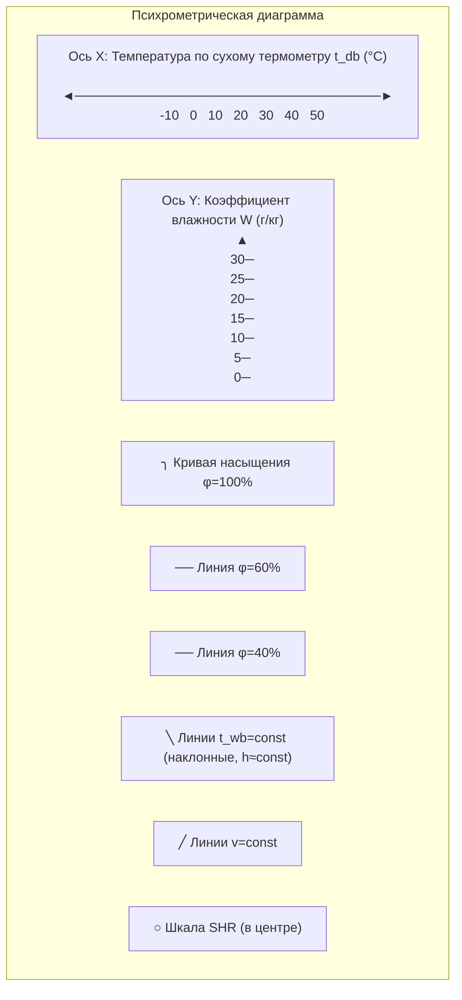
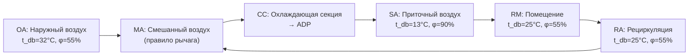
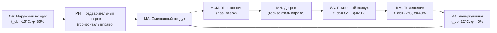

Психрометрическая диаграмма — главный инструмент инженера HVAC для визуализации и анализа процессов кондиционирования воздуха. Диаграмма графически решает систему психрометрических уравнений при постоянном барометрическом давлении, позволяя мгновенно определить состояние воздуха и проследить путь любого термодинамического процесса.

## Математические основы построения

Диаграмма строится на системе прямоугольных или косоугольных координат. В европейской традиции используется h–x-диаграмма Мольера (1923), в которой по горизонтали откладывается коэффициент влажности x (d), а по диагональной оси — энтальпия h. В диаграммах ASHRAE стандартным является косоугольный формат с горизонтальной осью t_db и вертикальной осью W.

### Кривая насыщения

Кривая насыщения (100 % ОВ) задаётся параметрически:


t = t_s,\quad W = W_s(t_s) = \frac{0{,}6220\,p_{ws}(t_s)}{p - p_{ws}(t_s)}


Уравнение Магнуса для построения:


p_{ws}(t_s) = 0{,}61094\,\exp\!\left(\frac{17{,}625\,t_s}{t_s + 243{,}04}\right)


Кривая насыщения образует левую границу диаграммы; правее неё — область ненасыщенного воздуха.

### Линии постоянной относительной влажности

Для каждого значения φ = const линия строится по уравнению:


W(t_{db},\,\varphi) = \frac{0{,}6220\,\varphi\,p_{ws}(t_{db})}{p - \varphi\,p_{ws}(t_{db})}


Линии φ = const — изогнутые кривые, приблизительно параллельные кривой насыщения.

### Линии постоянной температуры влажного термометра

Линии t_wb = const являются линиями постоянной энтальпии (при Le = 1). На диаграмме они наклонены вниз-вправо. Для каждой точки на линии:


h = W_s(t_{wb}) \cdot h_{fg}(t_{wb}) + c_{pa} \cdot t_{wb} + [c_{pv} \cdot t_{wb} + h_{fg}(t_{wb})] \cdot W_s(t_{wb})


Упрощённо, линии t_wb = const отклоняются от линий h = const менее чем на 1,5 % в диапазоне HVAC.

### Линии постоянной энтальпии


h = 1{,}006\,t_{db} + W\,(2501 + 1{,}86\,t_{db}) = \text{const}


Из этого уравнения при h = const:


W = \frac{h - 1{,}006\,t_{db}}{2501 + 1{,}86\,t_{db}}


Линии h = const — прямые с отрицательным наклоном (W уменьшается при росте t_db).

### Линии постоянного удельного объёма


v = \frac{0{,}287042\,(t_{db}+273{,}15)\,(1 + 1{,}6078\,W)}{p} = \text{const}


Линии v = const имеют положительный наклон (W растёт с t_db при постоянном v).

## Структура диаграммы






| Линия | Математическое условие | Направление | Физический смысл |
|---|---|---|---|
| Кривая насыщения | φ = 100 % | Изогнутая, возрастающая | Максимальное влагосодержание |
| φ = const | W·p/{p_ws(0,622+W)} = φ | Изогнутые, субпараллельные | Степень насыщения |
| t_db = const | t_db = const | Вертикальные | Процессы при постоянной температуре |
| W = const | W = const | Горизонтальные | Явное нагревание/охлаждение |
| h = const | 1,006·t + W·(2501+1,86·t) = h | Наклонные, −45° | Адиабатические процессы |
| t_wb = const | ≈ h = const (Le≈1) | Почти совпадают с h=const | Адиабатическое насыщение |
| v = const | v = 0,287(T)(1+1,608W)/p | Наклонные, +60° | Удельный объём |


## Чтение диаграммы: процедуры

### Определение состояния по двум измерениям

**Дано t_db и φ:**
1. Найти t_db на горизонтальной оси
2. Подняться по вертикали до пересечения с кривой φ = const
3. Из полученной точки прочесть W (по правой оси), h (по шкале на кривой насыщения), t_wb (по наклонной линии через точку), t_dp (горизонталь влево до кривой насыщения)

**Дано t_db и t_wb:**
1. Найти t_wb на кривой насыщения
2. Провести линию t_wb = const вправо-вниз
3. Найти пересечение с вертикалью t_db
4. Прочесть все остальные свойства

**Дано t_db и t_dp:**
1. Найти t_dp на кривой насыщения → получить W (точка росы лежит на той же горизонтали W = const)
2. Найти пересечение этой горизонтали с вертикалью t_db

### Числовой пример чтения диаграммы

**Дано:** t_db = 25 °C, φ = 55 %. **Определить:** все свойства.

1. p_ws(25°C) = 3,169 кПа
2. p_v = 0,55 × 3,169 = 1,743 кПа
3. W = 0,622 × 1,743 / (101,325 − 1,743) = **10,89 г/кг**
4. h = 1,006 × 25 + 0,01089 × (2501 + 1,86 × 25) = 25,15 + 27,82 = **52,97 кДж/кг**
5. t_dp: из p_v = 1,743 кПа → t_dp = 243,04 × ln(1,743/0,611) / (17,625 − ln(1,743/0,611)) ≈ **14,9 °C**
6. v = 0,287042 × 298,15 × (1 + 1,6078 × 0,01089) / 101,325 = **0,854 м³/кг**

## Шкала отношения явного тепла (SHR)

### Определение и построение

Отношение явного тепла (sensible heat ratio, SHR) — доля явного тепла в общем теплообмене:


\text{SHR} = \frac{Q_s}{Q_s + Q_l} = \frac{\Delta h_s}{\Delta h_{\text{total}}}


Линия процесса на диаграмме имеет наклон, определяемый SHR. На диаграммах ASHRAE шкала SHR располагается в виде полуокружности в левой части диаграммы с опорной точкой при t_db = 25 °C, φ = 50 %.

### Процедура построения линии процесса по SHR

1. Нанести на диаграмму расчётное состояние воздуха в помещении (точка R)
2. Провести прямую через опорную точку шкалы SHR под углом, соответствующим рассчитанному SHR
3. Параллельно перенести эту прямую через точку R — получим линию процесса
4. Пересечение линии процесса с температурой приточного воздуха t_supply даёт требуемое состояние приточного воздуха

### Типовые значения SHR


| Тип помещения | SHR | Характеристика нагрузки |
|---|---|---|
| Офис, низкая плотность | 0,90–0,95 | Преимущественно явная нагрузка |
| Офис, высокая плотность | 0,80–0,90 | Умеренная скрытая нагрузка |
| Ресторан | 0,65–0,75 | Высокая скрытая (люди, приготовление пищи) |
| Крытый бассейн | 0,40–0,55 | Доминирует скрытая нагрузка |
| Ледовый каток | 0,30–0,45 | Очень высокая скрытая нагрузка |
| Операционная | 0,70–0,85 | Зависит от вентиляции |
| Чистая комната | 0,60–0,80 | Оборудование + вентиляция |


## Точка росы аппарата (Apparatus Dew Point, ADP)

### Физический смысл

Точка росы аппарата — эффективная температура поверхности охлаждающей секции. Это не реальная физическая точка, а математическое понятие: точка на кривой насыщения, к которой стремится линия процесса охлаждения и осушения.

### Расчёт ADP через коэффициент байпаса


\text{BF} = \frac{t_{db,\text{вых}} - t_{ADP}}{t_{db,\text{вх}} - t_{ADP}}



t_{ADP} = \frac{t_{db,\text{вых}} - \text{BF} \cdot t_{db,\text{вх}}}{1 - \text{BF}}


Аналогично для коэффициента влажности:


W_{ADP} = W_{\text{вых}} - \text{BF} \cdot (W_{\text{вых}} - W_{\text{вх}}) / (1 - \text{BF})


### Типовые коэффициенты байпаса


| Конфигурация секции | Рядов | Оребрений на м | BF |
|---|---|---|---|
| Малопроизводительная | 2–3 | 200–300 | 0,30–0,50 |
| Стандартная | 4–6 | 300–400 | 0,10–0,25 |
| Высокопроизводительная | 6–8 | 400–500 | 0,05–0,12 |
| Пластинчатый осушитель | 8–12 | 500–600 | 0,02–0,05 |


### Графическое определение ADP





Продление прямой от точки входа через точку выхода до кривой насыщения даёт ADP.

## Диаграммы ASHRAE для различных высот

ASHRAE публикует психрометрические диаграммы (Psychrometric Charts) для следующих барометрических давлений:


| Диаграмма | Высота, м | Давление, кПа | Диапазон t_db, °C |
|---|---|---|---|
| № 1 (SI) | 0 (уровень моря) | 101,325 | −10 до +50 |
| № 2 (SI) | 0 | 101,325 | −40 до +10 (низкие температуры) |
| № 3 (SI) | 0 | 101,325 | +15 до +120 (высокие температуры) |
| № 5 (SI) | 750 | 92,63 | −10 до +50 |
| № 6 (SI) | 1500 | 84,54 | −10 до +50 |
| № 7 (SI) | 2250 | 76,84 | −10 до +50 |


При работе на высотах, не совпадающих со стандартными значениями, необходимо вычислять свойства по уравнениям с поправленным p.

## Отображение HVAC-процессов на диаграмме

### Цикл летнего кондиционирования





### Цикл зимнего кондиционирования





## Применение диаграммы в проектировании

### Расчёт нагрузки охлаждающей секции

Полная нагрузка определяется через энтальпийную разницу:


Q_{\text{total}} = \dot{m}_a \cdot (h_1 - h_2)


Разбивка на явную и скрытую составляющие:


Q_s = \dot{m}_a \cdot c_{pa} \cdot (t_{db,1} - t_{db,2})



Q_l = Q_{\text{total}} - Q_s = \dot{m}_a \cdot h_{fg} \cdot (W_1 - W_2)


### Расчёт смешивания

При адиабатическом смешивании двух потоков с массовыми расходами \dot{m}_1 и \dot{m}_2:


W_m = \frac{\dot{m}_1 W_1 + \dot{m}_2 W_2}{\dot{m}_1 + \dot{m}_2},\quad h_m = \frac{\dot{m}_1 h_1 + \dot{m}_2 h_2}{\dot{m}_1 + \dot{m}_2}


Точка смеси делит отрезок между состояниями 1 и 2 в обратном отношении расходов (правило рычага).

### Стратегия экономайзера


| Стратегия | Условие включения | Точность | Применение |
|---|---|---|---|
| По сухому термометру | t_OA < t_RA | Низкая (не учитывает влагу) | Сухой климат |
| По энтальпии | h_OA < h_RA | Высокая | Влажный климат |
| Дифференциальная по энтальпии | h_OA < h_RA − ΔΔh | Высокая с гистерезисом | Все климаты |
| По точке росы | t_dp,OA < 13 °C | Ограниченная | Дополнительное условие |


## Точность и ограничения диаграммы

Стандартные психрометрические диаграммы ASHRAE обеспечивают точность отсчёта:
- W: ±0,2 г/кг
- h: ±0,5 кДж/кг
- t_db, t_wb: ±0,1 °C

Эти погрешности неприемлемы для:
- Метрологических задач
- Установок с очень низкими SHR (< 0,3)
- Расчётов при значительных отклонениях давления от стандартного

Для указанных случаев применяются программные психрометрические библиотеки (CoolProp, REFPROP, PsychroLib).

## Нормативные документы

- ASHRAE Handbook — Fundamentals 2021, Chapter 1 «Psychrometrics»
- ASHRAE Psychrometric Chart (SI, No. 1–7, издание 2013 г.)
- ASHRAE Standard 41.6-2014 «Standard Method for Measurement of Moist Air Properties»
- СП 60.13330.2020 «Отопление, вентиляция и кондиционирование воздуха»
