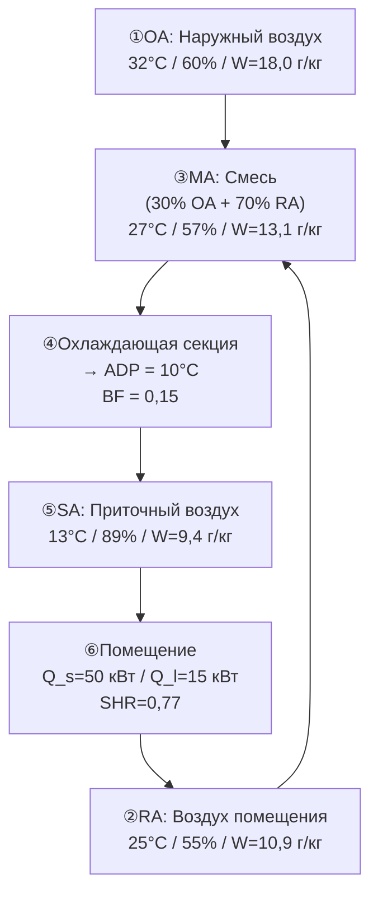

Психрометрический процесс — термодинамическое преобразование состояния влажного воздуха при его прохождении через элементы системы HVAC. Каждый процесс описывается траекторией на психрометрической диаграмме и уравнениями баланса массы и энергии. Понимание физики каждого процесса позволяет корректно выбрать оборудование, рассчитать нагрузки и разработать стратегию управления.

## Классификация процессов


| Процесс | W | t_db | h | Путь на диаграмме | Оборудование |
|---|---|---|---|---|---|
| Явное нагревание | const | ↑ | ↑ | → горизонталь вправо | Нагревательная секция |
| Явное охлаждение | const | ↓ | ↓ | ← горизонталь влево | Сухой охладитель |
| Охлаждение + осушение | ↓ | ↓ | ↓↓ | ↙ к ADP | Мокрая охл. секция |
| Паровое увлажнение | ↑ | ↑ незнач. | ↑ | ↑ почти вертик. | Паровой увлажнитель |
| Адиабатическое увлажнение | ↑ | ↓ | ≈const | ↙ по t_wb=const | Испарит. охладитель |
| Хемосорбционное осушение | ↓ | ↑ | ≈const | ↗ вверх-вправо | Роторный осушитель |
| Смешивание | — | — | — | Прямая линия | Смесительная камера |


## Явное нагревание

### Термодинамика процесса

При явном нагревании тепловая энергия передаётся воздуху без изменения содержания влаги. На диаграмме — горизонтальная линия вправо (W = const, t_db растёт).


Q_s = \dot{m}_a \cdot c_{pa} \cdot (t_2 - t_1) = \dot{m}_a \cdot (h_2 - h_1)\big|_{W=\text{const}}


В объёмных единицах (при стандартных условиях):


Q_s\,[\text{кВт}] = 1{,}2 \cdot \dot{V}\,[\text{м}^3/\text{с}] \cdot \Delta t\,[\text{K}]


**Изменение свойств:**
- t_db: растёт
- W: неизменно
- t_dp: неизменно
- φ: уменьшается (воздух сухой после нагрева)
- h: растёт пропорционально Δt

### Пример расчёта нагревательной секции

**Задание:** нагреть 5 000 м³/ч воздуха (t_db1 = 2 °C, φ1 = 80 %) до t_db2 = 20 °C.


Q_s = 1{,}2 \times \frac{5000}{3600} \times (20-2) = 1{,}2 \times 1{,}389 \times 18 = \mathbf{30{,}0\;\text{кВт}}


После нагрева: W = const = 4,3 г/кг; φ2 = W × p / [p_ws(20°C) × (0,622 + W)] ≈ **24 %** → необходимо увлажнение.

## Явное охлаждение

### Термодинамика процесса

Явное охлаждение — охлаждение без конденсации влаги. Реализуется при температуре поверхности теплообменника выше точки росы воздуха:


t_{\text{surface}} > t_{dp,\text{вх}}



Q_s = \dot{m}_a \cdot c_{pa} \cdot (t_1 - t_2)\big|_{W=\text{const}}


Путь на диаграмме — горизонталь влево. φ при этом растёт: воздух становится влажнее, но конденсации нет.

### Применение

- Предварительное охлаждение воздуха перед подачей в чистую комнату
- «Сухой» экономайзер (free cooling) при низкой точке росы наружного воздуха
- Охлаждение наружного воздуха через радиационный охладитель в ночное время

## Охлаждение с осушением

### Механизм

Когда охлаждающая секция (coil) работает в режиме осушения (мокрая секция, wet coil), температура её поверхности ниже точки росы поступающего воздуха. Конденсация пара происходит на оребрении, и воздух покидает секцию с меньшим W.


Q_{\text{total}} = Q_s + Q_l = \dot{m}_a \cdot (h_1 - h_2)



Q_s = \dot{m}_a \cdot c_{pa} \cdot (t_1 - t_2),\quad Q_l = \dot{m}_a \cdot h_{fg} \cdot (W_1 - W_2)


### Точка росы аппарата (ADP) и коэффициент байпаса

Реальная охлаждающая секция не обеспечивает 100 % контакта воздуха с холодной поверхностью. Часть воздуха «байпасирует» секцию:


\text{BF} = \frac{t_{db,\text{вых}} - t_{ADP}}{t_{db,\text{вх}} - t_{ADP}}



t_{ADP} = t_{db,\text{вых}} - \text{BF} \cdot (t_{db,\text{вых}} - t_{db,\text{вх}}) / (1 - \text{BF})


### Пример полного расчёта

**Входные условия:** t_db1 = 28 °C, φ1 = 65 %, W1 = 15,47 г/кг, h1 = 67,6 кДж/кг  
**Выходные условия:** t_db2 = 13 °C, φ2 = 92 %, W2 = 8,58 г/кг, h2 = 34,9 кДж/кг  
**BF = 0,15:** t_ADP = (13 − 0,15×28) / (1 − 0,15) = (13 − 4,2) / 0,85 = **10,4 °C**  
**SHR = Q_s/Q_total** = 1,006 × (28−13) / (67,6−34,9) = 15,09 / 32,7 = **0,46**

## Увлажнение

### Паровое увлажнение

Впрыск насыщенного или перегретого пара в воздушный поток добавляет влагу и незначительное количество явного тепла. Путь на диаграмме — почти вертикально вверх.

Массовый расход пара:


\dot{m}_{\text{пар}} = \dot{m}_a \cdot \Delta W = \dot{m}_a \cdot (W_2 - W_1)


Энергия пара (насыщенный пар при давлении p_пар):


Q_{\text{hum}} = \dot{m}_{\text{пар}} \cdot h_{\text{пар}}


**Изменение t_db** при паровом увлажнении (пар при 100 °C):


\Delta t_{db} = \frac{\Delta W \cdot (h_{\text{пар}} - c_{pv} \cdot t_{db})}{c_{pa} + W_2 \cdot c_{pv}} \approx \frac{\Delta W \times 2600}{1{,}006 + W \times 1{,}86} \times 0{,}001\;\text{°C/(г/кг)}


Для ΔW = 5 г/кг: Δt_db ≈ 0,8 °C — пренебрежимо мало.

### Адиабатическое увлажнение (испарительное)

При распыле воды при температуре влажного термометра входящего воздуха процесс является адиабатическим: h ≈ const, t_wb ≈ const. Путь — вниз-влево вдоль линии t_wb = const.


\Delta W = W_s(t_{wb}) - W_1 \quad(\text{теоретический максимум})



\eta_{\text{sat}} = \frac{W_2 - W_1}{W_s(t_{wb}) - W_1} = \frac{t_{db,1} - t_{db,2}}{t_{db,1} - t_{wb,1}}


## Хемосорбционное осушение

### Механизм роторного осушителя (desiccant wheel)

Роторный осушитель поглощает влагу из воздуха за счёт хемосорбции или адсорбции на силикагеле или молекулярных ситах. Теплота адсорбции (~2700–3200 кДж/кг) нагревает воздух, а влагосодержание снижается.

Путь на диаграмме — вниз-вправо (W↓, t_db↑).


\Delta h \approx 0\quad(\text{приближённо, если теплота адсорбции ≈ h}_{fg})



\text{Производительность осушителя:}\quad \dot{m}_{\text{вода}} = \dot{m}_a \cdot (W_1 - W_2)


**Типовые параметры:**


| Параметр | Силикагель | Молекулярные сита (тип 3А) |
|---|---|---|
| Рабочий диапазон φ | 10–80 % | 10–40 % |
| Снижение W | 4–12 г/кг | 10–25 г/кг |
| Повышение t_db | 6–15 °C | 15–30 °C |
| Температура регенерации | 70–90 °C | 120–180 °C |


## Смешивание воздушных потоков

### Баланс массы и энергии

При адиабатическом смешивании двух потоков сухого воздуха \dot{m}_1 и \dot{m}_2:


\dot{m}_m = \dot{m}_1 + \dot{m}_2



W_m = \frac{\dot{m}_1 W_1 + \dot{m}_2 W_2}{\dot{m}_1 + \dot{m}_2}



h_m = \frac{\dot{m}_1 h_1 + \dot{m}_2 h_2}{\dot{m}_1 + \dot{m}_2}


### Правило рычага

Точка смеси делит отрезок между состояниями 1 и 2 в обратном отношении расходов:


\frac{\overline{m_2 m}}{\overline{m_1 m}} = \frac{\dot{m}_1}{\dot{m}_2}


### Риск конденсации при смешивании

При смешивании тёплого влажного и холодного сухого воздуха точка смеси может попасть за кривую насыщения. Критическое условие:


W_m > W_s(t_{db,m})


В этом случае выпадает конденсат в количестве:


\Delta W_{\text{конд}} = W_m - W_s(t_{db,m})


**Пример:** смешивание тёплого влажного воздуха (40 °C, 90 %) и холодного сухого (5 °C, 30 %) в равных массовых долях. W_m = (47,5 + 1,6)/2 = 24,5 г/кг. Расчётный t_db,m = 22,5 °C → W_s(22,5°C) ≈ 17,0 г/кг. **Конденсат: 7,5 г/кг.** Это явление встречается при смешивании выхлопного воздуха с наружным в морозную погоду.

## Процесс в помещении: линия SHR

### Определение нагрузки помещения на диаграмме

Нагрузка помещения определяет, по какой линии на диаграмме воздух перемещается от состояния приточного воздуха SA к состоянию воздуха в помещении RA:


\text{SHR}_{\text{помещение}} = \frac{Q_{s,\text{пом}}}{Q_{s,\text{пом}} + Q_{l,\text{пом}}}


### Расчёт параметров приточного воздуха

**Из явной нагрузки:**


\dot{m}_a = \frac{Q_{s,\text{пом}}}{c_{pa}\,(t_{RA} - t_{SA})}


**Из скрытой нагрузки:**


W_{SA} = W_{RA} - \frac{Q_{l,\text{пом}}}{\dot{m}_a \cdot h_{fg}}


### Пример проектирования летнего кондиционирования

**Нагрузки помещения:** Q_s = 50 кВт, Q_l = 15 кВт → SHR = 50/65 = 0,77  
**Условия помещения:** t_RA = 25 °C, φ_RA = 55 %, W_RA = 10,89 г/кг  
**Температура приточного воздуха:** t_SA = 13 °C (стандарт)


\dot{m}_a = \frac{50}{1{,}006 \times (25-13)} = \frac{50}{12{,}07} = 4{,}14\;\text{кг/с} = 14\,900\;\text{м}^3/\text{ч}



W_{SA} = 10{,}89 - \frac{15}{4{,}14 \times 2454} \times 1000 = 10{,}89 - 1{,}48 = \mathbf{9{,}41\;\text{г/кг}}


Требуемые параметры приточного воздуха: t_SA = 13 °C, W_SA = 9,41 г/кг → t_dp,SA = 12,0 °C → φ_SA = 89 %.

## Визуализация последовательного цикла





## Нормативные документы

- ASHRAE Handbook — Fundamentals 2021, Chapter 1 «Psychrometrics»
- ASHRAE Standard 55-2023 «Thermal Environmental Conditions for Human Occupancy»
- ASHRAE Standard 62.1-2022 «Ventilation and Acceptable Indoor Air Quality»
- ASHRAE Standard 90.1-2022 «Energy Standard for Buildings»
- СП 60.13330.2020 «Отопление, вентиляция и кондиционирование воздуха»
