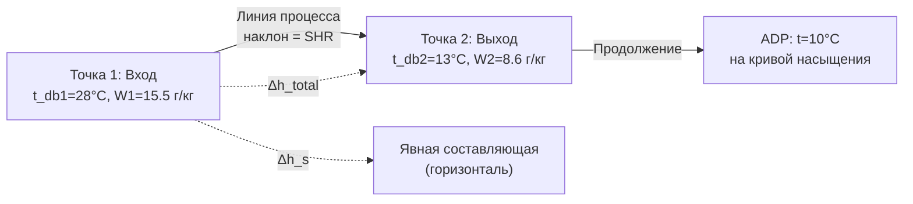

Охлаждение с осушением (cooling and dehumidification) — наиболее распространённый психрометрический процесс в системах кондиционирования воздуха. Он происходит, когда температура поверхности охлаждающей секции ниже точки росы поступающего воздуха, что вызывает одновременное снижение температуры и влагосодержания. Правильное понимание этого процесса критично для корректного выбора оборудования, расчёта конденсатоотвода и проектирования режимов управления.

## Механизм охлаждения с осушением

### Стадии процесса в охлаждающей секции

Воздух, проходя через мокрую охлаждающую секцию, претерпевает следующие изменения:





Реальная секция одновременно содержит зоны сухого и мокрого режима в зависимости от распределения температуры поверхности.

### Энергетический баланс

**Общее охлаждение = явное + скрытое:**


Q_{\text{total}} = Q_s + Q_l = \dot{m}_a \cdot (h_1 - h_2)


**Явное охлаждение (изменение температуры):**


Q_s = \dot{m}_a \cdot c_{pa} \cdot (t_1 - t_2)


**Скрытое охлаждение (конденсация влаги):**


Q_l = \dot{m}_a \cdot h_{fg,\text{ср}} \cdot (W_1 - W_2)


где h_{fg,\text{ср}} \approx 2454 кДж/кг (при средней температуре конденсата ~11 °C).

**Полная мощность через энтальпии:**


Q_{\text{total}} = \dot{m}_a (h_1 - h_2) - \dot{m}_{\text{конд}} \cdot h_w(t_{\text{конд}})


Для инженерных расчётов поправка на конденсат (последний член) составляет < 1 % и обычно игнорируется.

## Точка росы аппарата (Apparatus Dew Point)

### Определение и физический смысл

Точка росы аппарата (ADP) — условная температура поверхности охлаждающей секции, к которой стремится состояние выходящего воздуха при коэффициенте байпаса BF → 0. Это точка на кривой насыщения, лежащая на продолжении прямой, соединяющей входные и выходные состояния воздуха.


t_{ADP} = \frac{t_{db,\text{вых}} - \text{BF} \cdot t_{db,\text{вх}}}{1 - \text{BF}}


### Коэффициент байпаса (Bypass Factor, BF)


\text{BF} = \frac{t_{db,\text{вых}} - t_{ADP}}{t_{db,\text{вх}} - t_{ADP}}


Физический смысл: доля воздуха, «минующего» активную зону теплообменника без контакта с холодной поверхностью.

**Контактный коэффициент (Contact Factor):**


\text{CF} = 1 - \text{BF} = \frac{t_{db,\text{вх}} - t_{db,\text{вых}}}{t_{db,\text{вх}} - t_{ADP}}


### Типовые коэффициенты байпаса


| Глубина, рядов | Оребрение, мм | Скорость на входе, м/с | BF |
|---|---|---|---|
| 2 | 2,5 | 2,5 | 0,45–0,55 |
| 4 | 2,5 | 2,5 | 0,18–0,28 |
| 6 | 2,5 | 2,5 | 0,10–0,16 |
| 6 | 2,0 | 2,5 | 0,06–0,12 |
| 8 | 2,0 | 2,5 | 0,04–0,08 |
| 12 | 1,5 | 2,5 | 0,02–0,04 |


### Ограничения по температуре ADP

ADP должна быть достижимой для хладоносителя. Для водяной охлаждающей секции:


t_{ADP} \geq t_{w,\text{вх}} + \Delta t_{\text{min}}


где \Delta t_{\text{min}} = 2{-}4\;°\text{C} — минимальный температурный напор.

## Отношение явного тепла (SHR)

### Определение


\text{SHR} = \frac{Q_s}{Q_{\text{total}}} = \frac{h_s}{h_1 - h_2}


Где h_s — изменение энтальпии только за счёт явного охлаждения:


h_s = c_{pa}(t_1 - t_2) + W_1 \cdot c_{pv} \cdot (t_1 - t_2)


На диаграмме SHR определяет наклон линии процесса.

### Диаграммный метод определения SHR





## Полный расчётный пример

**Исходные данные:**
- Входящий воздух: t_db1 = 28 °C, φ1 = 65 %
- Расход: \dot{V} = 10\,000 м³/ч
- Требуемые условия на выходе: t_db2 = 13 °C, φ2 = 90 %
- BF = 0,15

**Шаг 1. Свойства входящего воздуха:**


p_{ws}(28°C) = 3{,}782\;\text{кПа},\quad p_v = 0{,}65 \times 3{,}782 = 2{,}458\;\text{кПа}



W_1 = \frac{0{,}622 \times 2{,}458}{101{,}325 - 2{,}458} = 15{,}47\;\text{г/кг}



h_1 = 1{,}006 \times 28 + 0{,}01547 \times (2501 + 1{,}86 \times 28) = 67{,}6\;\text{кДж/кг}


**Шаг 2. Свойства выходящего воздуха:**


p_{ws}(13°C) = 1{,}498\;\text{кПа},\quad p_v = 0{,}90 \times 1{,}498 = 1{,}348\;\text{кПа}



W_2 = \frac{0{,}622 \times 1{,}348}{99{,}977} = 8{,}39\;\text{г/кг}



h_2 = 1{,}006 \times 13 + 0{,}00839 \times (2501+1{,}86\times13) = 13{,}08 + 21{,}21 = 34{,}3\;\text{кДж/кг}


**Шаг 3. Массовый расход:**


v_1 = \frac{0{,}287042 \times 301{,}15 \times (1+1{,}6078\times0{,}01547)}{101{,}325} = 0{,}872\;\text{м}^3/\text{кг}



\dot{m}_a = \frac{10\,000 / 3600}{0{,}872} = 3{,}19\;\text{кг/с}


**Шаг 4. Нагрузки:**


Q_{\text{total}} = 3{,}19 \times (67{,}6 - 34{,}3) = 3{,}19 \times 33{,}3 = \mathbf{106{,}2\;\text{кВт}}



Q_s = 3{,}19 \times 1{,}006 \times (28-13) = \mathbf{48{,}1\;\text{кВт}}



Q_l = 106{,}2 - 48{,}1 = \mathbf{58{,}1\;\text{кВт}},\quad \text{SHR} = 48{,}1/106{,}2 = \mathbf{0{,}453}


**Шаг 5. Расчёт ADP:**


t_{ADP} = \frac{13 - 0{,}15 \times 28}{1 - 0{,}15} = \frac{13 - 4{,}2}{0{,}85} = \mathbf{10{,}4\;°\text{C}}


Аналогично: W_ADP = (8,39 − 0,15 × 15,47) / 0,85 = **7,14 г/кг** → φ_ADP ≈ 98 % (близко к насыщению).

**Шаг 6. Конденсатообразование:**


\dot{m}_{\text{конд}} = 3{,}19 \times (0{,}01547 - 0{,}00839) = 0{,}0226\;\text{кг/с} = \mathbf{81{,}3\;\text{кг/ч}}


## Выбор температуры хладоносителя

Температура хладоносителя определяет достижимость требуемого ADP. Для систем с чиллером:


t_{w,\text{вых}} = t_{ADP} - \Delta t_{\text{ADP-вода}} = 10{,}4 - 3 = 7{,}4\;\text{°C} \Rightarrow t_w = 7/12\;\text{°C}


Стандартный диапазон температуры холодной воды чиллера: **6–7 °C** (подача), **12–14 °C** (обратка) при стандартных условиях. Это обеспечивает ADP ≈ 9–11 °C.

## Конденсатоотвод

Расчёт системы дренажа должен обеспечить отвод:


\dot{m}_{\text{конд}} = \dot{m}_a \cdot (W_1 - W_2)\quad[\text{кг/с}]


**Требования к поддону конденсата:**

- Объём поддона: не менее 15-минутного запаса при максимальном режиме
- Уклон к сливному патрубку: ≥ 1,5 %
- Гидравлический затвор: высота = 25 мм + перепад статического давления на секции / (ρ_w × g)
- Материал: нержавеющая сталь или пластик с антибактериальным покрытием

**Дренажный трап согласно ASHRAE 62.1:**  
Конденсат должен отводиться напрямую в канализацию или испарительный поддон. Застой конденсата — источник роста биоплёнок и легионеллы.

## Нормативные документы

- ASHRAE Handbook — Fundamentals 2021, Chapter 1 «Psychrometrics»
- ASHRAE Handbook — HVAC Systems and Equipment 2020, Chapter 22 «Air-Cooling and Dehumidifying Coils»
- ASHRAE Standard 62.1-2022, Section 5.12 «Drain Pans»
- AHRI Standard 410-2001 «Forced Circulation Air-Cooling Coils»
- СП 60.13330.2020 «Отопление, вентиляция и кондиционирование воздуха»
