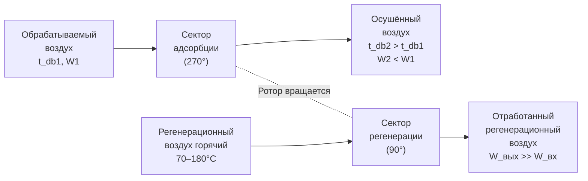

Осушение (dehumidification) — психрометрический процесс снижения коэффициента влажности воздуха. Необходимость осушения возникает в жилых зданиях с высокой влажностью, производственных процессах (фармацевтика, электроника, пищевые производства), плавательных бассейнах, хранилищах и при подаче значительных объёмов наружного воздуха во влажных климатических зонах. Метод осушения определяет психрометрический путь процесса, энергозатраты и диапазон достигаемых точек росы.

## Классификация методов осушения


| Метод | Диапазон точки росы, °C | Путь на диаграмме | Достоинства |
|---|---|---|---|
| Охлаждение (конденсация) | +5…+15 | ↙ к ADP (мокрая секция) | Универсальность, простота |
| Роторный осушитель (силикагель) | −20…+15 | ↗ (W↓, t↑) | Нет ограничения по точке росы 0 °C |
| Молекулярные сита (3А, 4А) | −60…−30 | ↗ (W↓, t↑↑) | Глубокое осушение |
| Жидкий абсорбент (CaCl₂, LiCl) | −10…+10 | ↗ (W↓, t↑) | Регенерация теплотой низкого потенциала |
| Мембранное осушение | −40…+10 | W↓ | Компактность, нет движущихся частей |


## Охлаждающее осушение

Наиболее распространённый метод. Рассмотрен подробно в разделе «Охлаждение с осушением». Ключевые ограничения:

- Минимальная достижимая точка росы: t_dp,min ≈ t_surface + 2 °C ≈ t_w,подача + 5 °C
- При t_w,подача = 6 °C: t_dp,min ≈ 11 °C; W_min ≈ 8–9 г/кг
- Для более глубокого осушения требуется охладитель с t_w ≤ 4 °C или дополнительный роторный осушитель

**Эффективность осушения (moisture removal rate):**


\dot{m}_{\text{конд}} = \dot{m}_a \cdot (W_1 - W_2)



\text{SMER} = \frac{\dot{m}_{\text{конд}}}{Q_{\text{total}}}\quad[\text{кг/(кВт·ч)}]


Типовое SMER для стандартного кондиционера: 0,5–1,0 кг/кВт·ч. Специализированные осушители-кондиционеры: 1,5–3,0 кг/кВт·ч.

## Роторный адсорбционный осушитель

### Конструкция и принцип действия





### Психрометрика осушения на роторе

Воздух, проходя через слой сорбента, отдаёт влагу за счёт адсорбции. Теплота адсорбции q_{\text{ads}} \approx 2700{-}3200 кДж/кг выше скрытой теплоты испарения воды (2454 кДж/кг), что вызывает нагрев воздуха:


\Delta t_{db} \approx \frac{q_{\text{ads}} \cdot \Delta W}{c_{pa}} \approx 2{,}8 \cdot \Delta W\,[\text{°C на 1 г/кг снижения W}]


Путь на психрометрической диаграмме: вниз-вправо (W снижается, t_db растёт).

### Уравнение баланса ротора

Для установившегося режима работы:


\dot{m}_{a,\text{проц}} \cdot (W_{1} - W_{2}) = \dot{m}_{a,\text{рег}} \cdot (W_{\text{рег,вых}} - W_{\text{рег,вх}})



Q_{\text{рег}} = \dot{m}_{a,\text{рег}} \cdot c_{pa} \cdot (t_{\text{рег}} - t_{\text{рег,вх}}) + \dot{m}_{a,\text{рег}} \cdot h_{fg} \cdot \Delta W_{\text{рег}}


### Параметры роторных осушителей


| Параметр | Силикагель | Силикат лития (LiCl) | Молекулярные сита |
|---|---|---|---|
| Рабочий диапазон φ | 10–80 % | 5–70 % | 1–40 % |
| Снижение W | 2–12 г/кг | 4–18 г/кг | 10–25 г/кг |
| Повышение t_db | 6–20 °C | 10–30 °C | 20–60 °C |
| T_регенерации | 60–90 °C | 55–80 °C | 120–200 °C |
| Соотношение потоков рег/проц | 0,3–0,5 | 0,25–0,45 | 0,3–0,5 |


### Расчётный пример роторного осушителя

**Задание:** снизить W с 12 г/кг до 5 г/кг при расходе 10 000 м³/ч. Тип сорбента — силикагель, T_рег = 80 °C.

**Массовый расход воздуха:**


\dot{m}_a = \frac{10\,000 \times 1{,}2}{3600} = 3{,}33\;\text{кг/с}


**Скорость осушения:**


\dot{m}_{\text{вода}} = 3{,}33 \times (0{,}012 - 0{,}005) = 0{,}0233\;\text{кг/с} = \mathbf{83{,}9\;\text{кг/ч}}


**Повышение температуры воздуха (при q_ads = 2800 кДж/кг):**


\Delta t_{db} = \frac{2800 \times 0{,}007}{1{,}006} = \mathbf{19{,}5\;°\text{C}}


Если вход при t_db = 25 °C → выход при t_db ≈ 44,5 °C (требуется охлаждение после ротора).

**Тепловая мощность регенерации** (при КПД 70 %):


Q_{\text{рег}} \approx \frac{\dot{m}_{\text{вода}} \times q_{\text{ads}}}{\eta_{\text{рег}}} = \frac{0{,}0233 \times 2800}{0{,}70} = \mathbf{93{,}2\;\text{кВт}}


## Осушение жидкими сорбентами

### Принцип

Хлорид лития (LiCl), хлорид кальция (CaCl₂) или бромид лития (LiBr) в водном растворе поглощают влагу из воздуха при контакте в орошаемом абсорбере. Концентрированный раствор регенерируется теплом низкого потенциала (60–90 °C), что позволяет использовать тепловые насосы, солнечные коллекторы или тепло от когенерации.

### Психрометрика процесса

Осушение жидким сорбентом: W снижается, t_db слегка растёт (адсорбционная теплота).  
Путь — близко к вертикали вниз на диаграмме.

Достижимая точка росы определяется равновесным давлением пара раствора:


p_{v,\text{равнов}} = a_w \cdot p_{ws}(t_{\text{раствора}})


где a_w — активность воды в растворе (зависит от концентрации).

## Мембранное осушение

Газоразделительные мембраны (полые волокна из полиимида, полисульфона) пропускают водяной пар, удерживая сухой воздух. КПД по осушению: 70–95 % при давлении 0,3–1,0 МПа.

Применение: инструментальный воздух, медицинский кислород, фармацевтические процессы.

## Сравнительный анализ методов осушения


| Критерий | Охлаждение | Роторный (силикагель) | Жидкий сорбент |
|---|---|---|---|
| Диапазон точки росы | +5…+15 °C | −20…+15 °C | −10…+10 °C |
| SMER, кг/кВт·ч | 1,0–2,5 | 0,5–1,5 | 1,5–3,0 |
| Источник энергии рег. | — | Тепло 60–180 °C | Тепло 55–90 °C |
| Потребность в постохлаждении | Нет | Да (t↑ после ротора) | Да |
| Начальная стоимость | Низкая | Средняя | Высокая |
| Применение | Комфорт, промышл. | Фарм., пищевое | Пром. масштаб |


## Требования влажности для специальных помещений


| Тип помещения | W, г/кг | t_dp, °C | Рекомендуемый метод |
|---|---|---|---|
| Операционная (класс ISO 5) | 4–7 | 2–8 | Охлаждающий + роторный |
| Фармацевтическое пр-во (ISO 7) | 2–5 | −5…+2 | Роторный (силикагель) |
| Хранение лиофилизатов | < 1 | < −20 | Молекулярные сита |
| Электроника (SMD-монтаж) | < 0,5 | < −40 | Молекулярные сита |
| Крытый каток | < 3 | < −10 | Роторный + охлаждение |


## Нормативные документы

- ASHRAE Handbook — HVAC Systems and Equipment 2020, Chapter 25 «Desiccant Dehumidification»
- ASHRAE Standard 62.1-2022 «Ventilation and Acceptable Indoor Air Quality»
- ASHRAE Standard 90.1-2022 (ограничения по осушению и reheat)
- ISO 13143:2019 «Industrial air filtration — Performance testing of dehumidification equipment»
- СП 60.13330.2020 «Отопление, вентиляция и кондиционирование воздуха»
