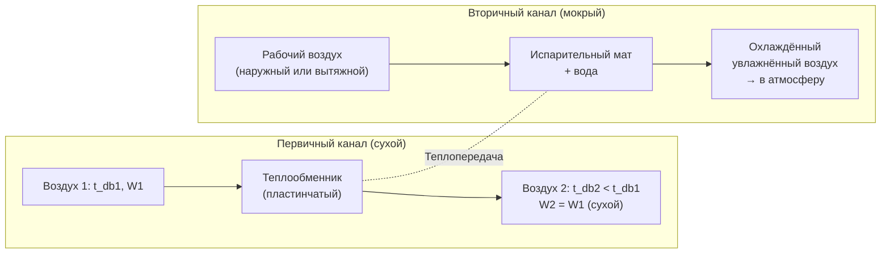
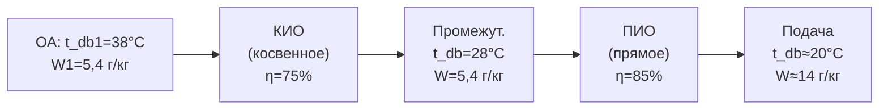

Испарительное охлаждение (evaporative cooling) использует скрытую теплоту испарения воды для снижения температуры воздуха. Процесс является адиабатическим: внешний теплообмен отсутствует, а явная теплота воздуха расходуется на испарение воды и переходит в скрытую. Испарительное охлаждение — наиболее энергоэффективный метод охлаждения при низкой влажности наружного воздуха.

## Термодинамика испарительного охлаждения

### Первый закон для адиабатического процесса

Для установившегося адиабатического процесса без подвода внешней теплоты:


h_1 + \frac{\dot{m}_w}{\dot{m}_a}\,c_{pw}\,t_w = h_2


При температуре воды t_w = t_wb (температура влажного термометра воздуха) и для идеального процесса:


h_2 = h_1\quad\text{(при }t_w = t_{wb,1}\text{)}


Это условие адиабатического насыщения. Путь на психрометрической диаграмме совпадает с линией t_wb = const.

### Предел испарительного охлаждения

Теоретический предел снижения температуры — температура влажного термометра входящего воздуха:


t_{db,2,\min} = t_{wb,1}



\Delta t_{db,\max} = t_{db,1} - t_{wb,1}


Эта разница (wet-bulb depression) определяет потенциал испарительного охлаждения. Чем суше воздух, тем больше потенциал.


| Климатическая зона | t_db летний °C | t_wb летний °C | Потенциал Δt, °C | Целесообразность |
|---|---|---|---|---|
| Пустынный (Ташкент, Алматы) | 40 | 22 | 18 | Отличная |
| Полусухой (Бишкек, Астана) | 36 | 18 | 18 | Хорошая |
| Степной (Астрахань) | 35 | 23 | 12 | Приемлемая |
| Умеренный (Москва) | 29 | 20 | 9 | Ограниченная |
| Влажный субтропический | 34 | 28 | 6 | Низкая |
| Тропический влажный | 35 | 32 | 3 | Не эффективно |


## Прямое испарительное охлаждение (ПИО)

### Принцип и конструкция

Воздух проходит через влажный испарительный мат или распылительную камеру, напрямую контактируя с водой. Водяной пар добавляется к воздуху, t_db снижается, W растёт.

### Эффективность прямого испарительного охладителя


\eta_{wb} = \frac{t_{db,1} - t_{db,2}}{t_{db,1} - t_{wb,1}}



t_{db,2} = t_{db,1} - \eta_{wb} \cdot (t_{db,1} - t_{wb,1})



W_2 = W_1 + \eta_{wb} \cdot (W_s(t_{wb,1}) - W_1)


### Расчётный пример (ПИО)

**Дано:** t_db1 = 38 °C, t_wb1 = 20 °C, φ1 = 13 %, расход 12 000 м³/ч, η_wb = 85 %.

1. W1 = 0,622 × (0,13 × 6,624) / (101,325 − 0,861) = **5,35 г/кг**
2. W_s(20°C) = 0,622 × 2,338 / (101,325 − 2,338) = **14,67 г/кг**
3. t_db2 = 38 − 0,85 × (38 − 20) = 38 − 15,3 = **22,7 °C**
4. W2 = 5,35 + 0,85 × (14,67 − 5,35) = 5,35 + 7,92 = **13,27 г/кг**
5. φ2: p_v2 = W2 × p / (0,622 + W2) = 0,01327 × 101,325 / 0,6353 = 2,118 кПа; φ2 = 2,118 / p_ws(22,7°C) = 2,118 / 2,747 = **77 %**

**Водопотребление:**


\dot{m}_{\text{вода}} = \frac{12\,000 \times 1{,}2}{3600} \times (13{,}27 - 5{,}35) \times 10^{-3} = 4{,}0 \times 0{,}00792 = \mathbf{31{,}7\;\text{г/с}} = \mathbf{114\;\text{л/ч}}


**Экономия энергии** по сравнению с компрессорным охлаждением:
- Компрессорное охлаждение: ~0,35 кВт/(кВт холода), потребление ~35 кВт
- ПИО (только насос): 0,5–2 кВт → **экономия > 94 %**

## Косвенное испарительное охлаждение (КИО)

### Принцип

В косвенном испарительном охладителе (indirect evaporative cooler, IEC) воздух охлаждается через теплообменник вторичным (рабочим) воздушным потоком, который сам проходит прямое испарительное охлаждение. Первичный (продуктовый) поток получает только явное охлаждение — без добавления влаги.





### Эффективность КИО

Эффективность по влажному термометру (wet-bulb efficiency):


\eta_{wb,\text{IEC}} = \frac{t_{db,1} - t_{db,2}}{t_{db,1} - t_{wb,\text{рабочий}}}


Типовые значения: 60–80 % для пластинчатых теплообменников, до 85 % для роторных.

**Ограничение:** t_db2 ≥ t_wb входящего воздуха (в отличие от ПИО, где ограничение — t_wb самого первичного воздуха, а для КИО — t_wb рабочего потока, который может быть меньше).

### Преимущества КИО перед ПИО

- Влажность первичного воздуха не растёт → возможно применение во влажном климате
- Нет риска легионеллёза в первичном потоке
- Может охладить ниже t_wb первичного воздуха (если рабочий воздух холоднее)

## Двухступенчатое испарительное охлаждение

Двухступенчатые системы (indirect + direct, IEC+DEC) обеспечивают более глубокое охлаждение:





**Суперадиабатическое охлаждение (sub-wet-bulb cooling):**

Некоторые конструкции КИО с применением вытяжного воздуха в качестве рабочего (при t_wb,вытяжного < t_wb,наружного) позволяют охлаждать первичный поток ниже его собственной температуры влажного термометра.


t_{db,2} < t_{wb,1}\quad(\text{при }t_{wb,\text{вытяжной}} < t_{wb,1})


Это известно как «sub-wet-bulb» или «Maisotsenko cycle» (M-cycle), достигающий эффективности по точке росы η_dp = 60–85 %.

## Ограничения и применимость

### Условия неэффективного применения ПИО


\text{ПИО нецелесообразно при:}\quad t_{wb,1} > 22\;°\text{C}\quad\text{или}\quad \varphi_1 > 60\;\%


При высокой точке росы добавленная влага создаёт дискомфорт (т_dp,вых > 17 °C = предел ASHRAE 55).

### Риск легионеллёза

Согласно ASHRAE 188-2018, прямые испарительные охладители являются потенциальным источником легионеллёза. Требования:
- Температура циркулирующей воды < 20 °C или > 60 °C
- Полное дренирование при остановке (drain-down)
- Дезинфекция водяного контура не реже 1 раза в год

### Качество воды


| Параметр | Требование | Обоснование |
|---|---|---|
| Жёсткость | < 100 мг-экв/л | Предотвращение накипи на матах |
| TDS | < 500 мг/л | Предотвращение солевых отложений |
| pH | 6–8 | Защита от коррозии и биообрастания |
| Продувка | 10–30 % от потребления | Контроль концентрации |


## Сравнение с компрессорным охлаждением


| Показатель | ПИО | КИО | Компрессорное |
|---|---|---|---|
| Потребление энергии, кВт/(кВт холода) | 0,01–0,03 | 0,05–0,10 | 0,25–0,45 |
| COP эффективный | 30–100 | 10–20 | 2,5–5 |
| Изменение φ выходящего воздуха | Значительное ↑ | Нет изменения | Снижение |
| Ограничение климата | Сухой | Любой | Любой |
| CAPEX | Низкий | Средний | Высокий |
| Потребление воды | Высокое | Среднее | Нет |


## Нормативные документы

- ASHRAE Handbook — HVAC Equipment 2020, Chapter 40 «Evaporative Air-Cooling Equipment»
- ASHRAE Standard 55-2023 «Thermal Environmental Conditions» (ограничения по комфорту)
- ASHRAE Standard 188-2018 «Legionellosis: Risk Management»
- СП 60.13330.2020 «Отопление, вентиляция и кондиционирование воздуха»
