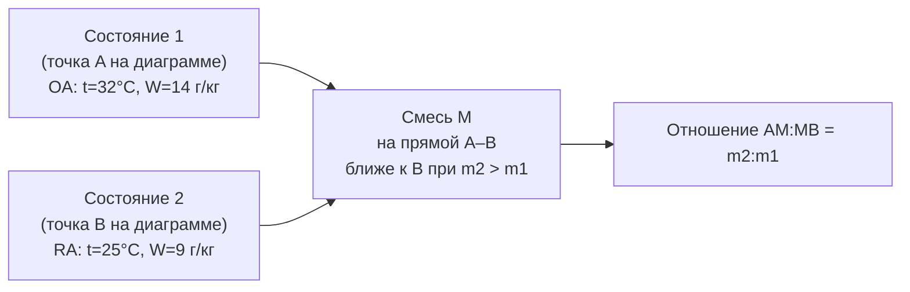
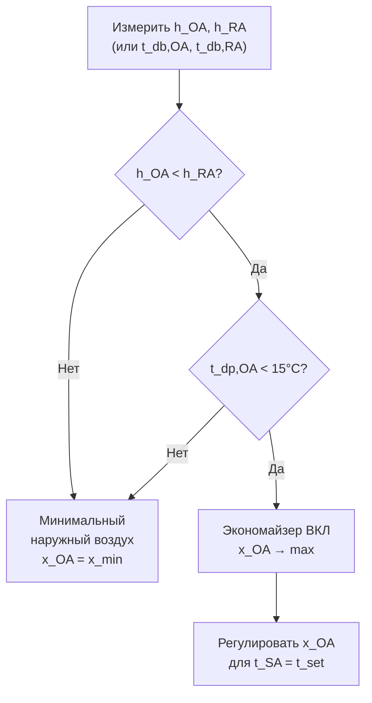

Смешивание воздушных потоков — один из наиболее часто встречающихся психрометрических процессов в HVAC. Он происходит при объединении наружного воздуха с рециркуляционным в смесительных камерах приточных установок, при работе экономайзера, при смешивании воздуха из различных зон и в системах рекуперации тепла. Точный психрометрический анализ смешивания необходим для расчёта нагрузок, настройки защиты от замерзания и определения потребления энергии.

## Фундаментальные уравнения смешивания

### Баланс массы и энергии

Для адиабатического смешивания двух потоков сухого воздуха \dot{m}_1 и \dot{m}_2:

**Сохранение массы сухого воздуха:**


\dot{m}_m = \dot{m}_1 + \dot{m}_2


**Сохранение массы водяного пара:**


\dot{m}_m W_m = \dot{m}_1 W_1 + \dot{m}_2 W_2


**Сохранение энергии (при пренебрежении теплообменом с окружающей средой):**


\dot{m}_m h_m = \dot{m}_1 h_1 + \dot{m}_2 h_2


Из этих уравнений:


W_m = \frac{\dot{m}_1 W_1 + \dot{m}_2 W_2}{\dot{m}_1 + \dot{m}_2},\quad h_m = \frac{\dot{m}_1 h_1 + \dot{m}_2 h_2}{\dot{m}_1 + \dot{m}_2}


Температура смеси (приближённо, через явные теплоты):


t_{db,m} \approx \frac{\dot{m}_1 t_1 + \dot{m}_2 t_2}{\dot{m}_1 + \dot{m}_2}


### Правило рычага

Точка смеси M лежит на прямой линии, соединяющей состояния 1 и 2 на психрометрической диаграмме, и делит этот отрезок в обратном отношении массовых расходов:


\frac{\overline{1M}}{\overline{M2}} = \frac{\dot{m}_2}{\dot{m}_1}


Это позволяет графически определить состояние смеси без вычислений.





### Расчёт через долю наружного воздуха (OA fraction)

В приточных установках часто задаётся доля наружного воздуха x_{OA} по массовому расходу:


x_{OA} = \frac{\dot{m}_{OA}}{\dot{m}_{OA} + \dot{m}_{RA}}


Тогда:


W_m = x_{OA} W_{OA} + (1-x_{OA}) W_{RA}



h_m = x_{OA} h_{OA} + (1-x_{OA}) h_{RA}


## Расчётный пример

**Задание:** смесь 30 % наружного воздуха (OA: t_db = 32 °C, φ = 60 %) и 70 % рециркуляционного воздуха (RA: t_db = 26 °C, φ = 55 %). Расход 12 000 м³/ч. Барометрическое давление: 101,325 кПа.

**Свойства OA:**
- p_ws(32°C) = 4,755 кПа; p_v,OA = 0,60 × 4,755 = 2,853 кПа
- W_OA = 0,622 × 2,853 / (101,325 − 2,853) = **18,02 г/кг**
- h_OA = 1,006 × 32 + 0,01802 × (2501 + 1,86 × 32) = 32,19 + 46,11 = **78,3 кДж/кг**

**Свойства RA:**
- p_ws(26°C) = 3,362 кПа; p_v,RA = 0,55 × 3,362 = 1,849 кПа
- W_RA = 0,622 × 1,849 / (101,325 − 1,849) = **11,57 г/кг**
- h_RA = 1,006 × 26 + 0,01157 × (2501 + 1,86 × 26) = 26,16 + 29,50 = **55,66 кДж/кг**

**Смесь (x_OA = 0,30):**


W_m = 0{,}30 \times 18{,}02 + 0{,}70 \times 11{,}57 = 5{,}406 + 8{,}099 = \mathbf{13{,}51\;\text{г/кг}}



h_m = 0{,}30 \times 78{,}3 + 0{,}70 \times 55{,}66 = 23{,}49 + 38{,}96 = \mathbf{62{,}45\;\text{кДж/кг}}



t_{db,m} \approx 0{,}30 \times 32 + 0{,}70 \times 26 = 9{,}6 + 18{,}2 = \mathbf{27{,}8\;°\text{C}}


**Точка росы смеси:**


p_v = W_m \cdot p / (0{,}622 + W_m) = 0{,}01351 \times 101{,}325 / 0{,}6355 = 2{,}153\;\text{кПа}



t_{dp,m} = \frac{243{,}04 \times \ln(2{,}153/0{,}611)}{17{,}625 - \ln(2{,}153/0{,}611)} = \mathbf{18{,}7\;°\text{C}}


## Риск конденсации при смешивании

При смешивании холодного и тёплого влажного воздуха точка смеси может выйти за кривую насыщения. Это особенно характерно:
- При смешивании выхлопного воздуха с морозным наружным в зимний период
- В рекуператорах с перекрёстным смешиванием при утечках

Условие конденсации:


W_m > W_s(t_{db,m})


Количество конденсата:


\Delta W_{\text{конд}} = W_m - W_s(t_{db,m})


При конденсации расчётная точка смеси смещается вдоль кривой насыщения.

### Пример: зимнее смешивание

**OA (зима):** t_db = −15 °C, φ = 80 %, W_OA = 0,85 г/кг, h_OA = −13,9 кДж/кг  
**RA:** t_db = 22 °C, φ = 45 %, W_RA = 7,38 г/кг, h_RA = 41,0 кДж/кг  
**x_OA = 30 %:**


W_m = 0{,}3 \times 0{,}85 + 0{,}7 \times 7{,}38 = 0{,}255 + 5{,}166 = 5{,}42\;\text{г/кг}



t_{db,m} = 0{,}3 \times (-15) + 0{,}7 \times 22 = -4{,}5 + 15{,}4 = 10{,}9\;°\text{C}


W_s(10,9°C) = 8,12 г/кг > W_m = 5,42 г/кг → конденсации нет. Но необходима проверка на защиту от замерзания: нагревательная секция должна поднять t_db,m > +5 °C до подачи на охлаждающую секцию.

## Требования ASHRAE 62.1 по наружному воздуху

Минимальная доля наружного воздуха определяется по ASHRAE 62.1-2022 методом Ventilation Rate Procedure:


V_{oz} = R_p \cdot P_z + R_a \cdot A_z


где R_p — удельный расход на человека [л/с/чел], P_z — число людей, R_a — удельный расход на площадь [л/с/м²], A_z — площадь.

Для систем с несколькими зонами:


V_{ot} = D \cdot V_{ou},\quad D = \frac{1}{1 - E_{v,\text{min}}}


где E_v — вентиляционная эффективность.

## Экономайзерное смешивание

### Управление долей наружного воздуха

При работе экономайзера доля наружного воздуха увеличивается сверх минимума. Алгоритм управления:





### Расчёт режима частичного экономайзера

При x_OA = 100 %:


h_m = h_{OA},\quad W_m = W_{OA}


При частичном экономайзере (x_OA = var) для достижения t_SA:


x_{OA} = \frac{t_{SA} - t_{RA}}{t_{OA} - t_{RA}}\quad(\text{только явное тепло, без осушения})


При x_OA > 1 наружного воздуха недостаточно холодного для обеспечения t_SA → требуется включить компрессорное охлаждение.

## Рекуперация тепла и психрометрика

Устройства рекуперации тепла модифицируют состояние наружного воздуха до смешивания с рециркуляционным. Эффективные параметры:

**Чувствительная эффективность:**


\varepsilon_s = \frac{t_{OA,\text{вых}} - t_{OA,\text{вх}}}{t_{RA,\text{вх}} - t_{OA,\text{вх}}}


**Скрытая эффективность:**


\varepsilon_l = \frac{W_{OA,\text{вых}} - W_{OA,\text{вх}}}{W_{RA,\text{вх}} - W_{OA,\text{вх}}}


**Полная эффективность:**


\varepsilon_t = \frac{h_{OA,\text{вых}} - h_{OA,\text{вх}}}{h_{RA,\text{вх}} - h_{OA,\text{вх}}}



| Тип рекуператора | ε_s | ε_l | ε_t |
|---|---|---|---|
| Пластинчатый (перекрёст. поток) | 55–70 % | 0 % | 30–50 % |
| Пластинчатый (противоток) | 75–85 % | 0 % | 50–70 % |
| Тепловое колесо (чувст.) | 70–80 % | 0–5 % | 50–70 % |
| Тепловое колесо (энтальп.) | 70–80 % | 50–70 % | 65–80 % |
| Тепловая трубка | 50–65 % | 0 % | 35–55 % |
| Контурный рекуператор | 50–65 % | 0 % | 35–55 % |


## Нормативные документы

- ASHRAE Handbook — Fundamentals 2021, Chapter 1 «Psychrometrics»
- ASHRAE Standard 62.1-2022 «Ventilation and Acceptable Indoor Air Quality»
- ASHRAE Standard 90.1-2022, Section 6.5.1 «Economizer Controls»
- ASHRAE Handbook — HVAC Systems 2020, Chapter 26 «Air-to-Air Energy Recovery»
- СП 60.13330.2020 «Отопление, вентиляция и кондиционирование воздуха»
