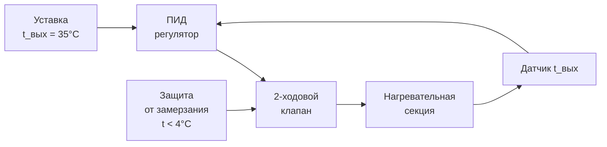

Явное нагревание (sensible heating) — психрометрический процесс, при котором температура по сухому термометру воздуха увеличивается при неизменном коэффициенте влажности. На психрометрической диаграмме процесс отображается горизонтальной линией, направленной вправо. Это фундаментальный процесс зимнего кондиционирования: предварительный нагрев наружного воздуха, нагрев рециркуляционного воздуха, подогрев после охлаждающей секции (reheat).

## Термодинамика явного нагревания

### Уравнение энергетического баланса

Для стационарного потока без изменения кинетической и потенциальной энергии:


Q_s = \dot{m}_a \cdot c_{pa} \cdot (t_2 - t_1)


где \dot{m}_a — массовый расход сухого воздуха [кг/с], c_{pa} = 1{,}006 кДж/(кг·К) — удельная теплоёмкость сухого воздуха.

В единицах объёмного расхода (при стандартных условиях ρ ≈ 1,2 кг/м³):


Q_s\,[\text{кВт}] = 1{,}2 \cdot \dot{V}\,[\text{м}^3/\text{с}] \cdot \Delta t = \frac{\dot{V}\,[\text{м}^3/\text{ч}] \cdot \Delta t}{3000}


### Изменение психрометрических свойств


| Свойство | Изменение | Пояснение |
|---|---|---|
| t_db | Увеличивается | Прямой результат процесса |
| W | Неизменно | Влага не добавляется и не удаляется |
| t_dp | Неизменно | t_dp зависит только от W |
| p_v | Неизменно | p_v определяется W и p |
| φ | Уменьшается | p_ws(t_db) растёт, p_v = const |
| h | Увеличивается | Δh ≈ c_pa × Δt ≈ 1,006 × Δt |
| v | Увеличивается | v ∝ T при p = const |
| t_wb | Увеличивается | Следует за ростом t_db |


### Снижение относительной влажности при нагреве


\frac{\varphi_2}{\varphi_1} = \frac{p_{ws}(t_1)}{p_{ws}(t_2)}


**Пример:** воздух при t1 = 0 °C, φ1 = 80 % нагревается до t2 = 20 °C.
- p_ws(0°C) = 0,611 кПа; p_ws(20°C) = 2,338 кПа
- φ2 = 80 % × 0,611 / 2,338 = **20,9 %**

Нагрев без увлажнения значительно снижает ОВ, что требует последующего увлажнения для комфортных условий.

## Конструкция нагревательных секций

### Секции с горячей водой (HWC — hot water coil)

**Уравнение теплопередачи:**


Q_s = U \cdot A \cdot \text{LMTD}



\text{LMTD} = \frac{(t_{w,\text{вх}} - t_{a,\text{вых}}) - (t_{w,\text{вых}} - t_{a,\text{вх}})}{\ln\!\left(\dfrac{t_{w,\text{вх}} - t_{a,\text{вых}}}{t_{w,\text{вых}} - t_{a,\text{вх}}}\right)}


**Требуемый расход воды:**


\dot{V}_w\,[\text{л/с}] = \frac{Q_s\,[\text{кВт}]}{4{,}19 \cdot \Delta T_w\,[\text{K}]}


**Параметры проектирования:**


| Параметр | Значение | Примечание |
|---|---|---|
| Скорость воздуха на входе | 2,0–3,5 м/с | Оптимум по Δp/Q |
| Число рядов | 2–6 | Определяет мощность и Δp воздуха |
| Шаг оребрения | 2,0–3,5 мм | Более плотное — выше A, но риск засорения |
| Температура воды, вход | 60–90 °C | Зависит от температурного графика |
| Перепад температуры воды | 10–20 °C | Δt = 10 °C — типовой |
| Скорость воды в трубках | 0,6–1,5 м/с | Ниже — риск воздушных пробок |
| Δp воздуха | 30–120 Па | При расчётном расходе |


### Паровые нагревательные секции

Пар обеспечивает высокую теплоёмкость при компактных размерах за счёт скрытой теплоты конденсации:


\dot{m}_{\text{пар}}\,[\text{кг/с}] = \frac{Q_s\,[\text{кВт}]}{h_{fg}(p_{\text{пар}})\,[\text{кДж/кг}]}



| Давление пара, кПа | T нас., °C | h_fg, кДж/кг |
|---|---|---|
| 30 | 68,7 | 2336 |
| 50 | 81,3 | 2305 |
| 101,3 | 100,0 | 2257 |
| 200 | 120,2 | 2201 |


Пар предпочтителен для секций предварительного нагрева при t_OA < −5 °C, так как не замерзает.

### Электрические нагревательные секции


Q_s\,[\text{кВт}] = \frac{\dot{V}\,[\text{м}^3/\text{ч}] \cdot \Delta t}{3000}\quad(\text{при КПД} = 100\,\%)


**Типы нагревательных элементов:**


| Тип | Плотность мощности, Вт/м² | Применение |
|---|---|---|
| Открытая спираль (NiCr) | 500–2000 | Малая мощность, зоны |
| Оребрённая трубка (finned) | 2000–6000 | Стандартные AHU |
| Трубчатый (tubular) | 1000–4000 | Равномерный нагрев |
| PTC-элемент | Авторегулируемый | Зоны, постоянная мощность |


## Защита от замерзания

### Риск замерзания при контакте с холодным воздухом

При температуре наружного воздуха ниже 0 °C существует риск замерзания воды в трубках нагревательной секции при отказе оборудования. Температура замерзания раствора гликоля:


t_{\text{зам}} = f(C_{\text{гликоль}})



| Метод | Применение | Ограничение |
|---|---|---|
| Паровая секция предварительного нагрева | Нагрев OA до +5 °C перед HWC | Требует пар |
| Гликольный раствор (30 % ПГ) | Защита до −15 °C | Снижение теплопередачи на 10 % |
| Электрообогрев трубопроводов | Защита от замерзания при остановке | Потребление электроэнергии |
| Минимальный расход воды (lock-open) | Постоянная циркуляция | Потери тепла при ненужном нагреве |
| Заслонки с блокировкой | Закрытие OA-заслонки при остановке | Нет подачи наружного воздуха при аварии |


**Уставка защиты от замерзания:** температура выходящего воздуха не ниже +4 °C при воде без гликоля, не ниже −5 °C при 30 % пропиленгликоле.

## Стратегии управления

### Управление двухходовым клапаном (2-way valve)

Наиболее энергоэффективный метод: изменение расхода воды в зависимости от нагрузки. Система управления с ПИД-регулятором:





**Авторитет (authority) клапана:**


N = \frac{\Delta p_{\text{клапан}}}{\Delta p_{\text{клапан}} + \Delta p_{\text{секция}}} \geq 0{,}5


При N < 0,3 качество регулирования неудовлетворительно.

### Управление трёхходовым клапаном (3-way valve)

Поддерживает постоянный расход в секции, смешивая подачу с обраткой. Предпочтителен при низких перепадах давления и чувствительных к расходу котлах.

## Расчётный пример

**Задание:** Предварительный нагрев наружного воздуха (Москва, расчётная t_OA = −26 °C, φ = 82 %). Расход воздуха: 10 000 м³/ч. Требуется нагреть до +5 °C (защита от замерзания охлаждающей секции). Теплоноситель — горячая вода 85/65 °C.

**Мощность нагревания:**


Q_s = \frac{10\,000 \times (5 - (-26))}{3000} = \frac{10\,000 \times 31}{3000} = \mathbf{103{,}3\;\text{кВт}}


**Расход воды:**


\dot{V}_w = \frac{103{,}3}{4{,}19 \times 20} = \frac{103{,}3}{83{,}8} = \mathbf{1{,}23\;\text{л/с}} = \mathbf{4{,}44\;\text{м}^3/\text{ч}}


**LMTD (противоток):**


\Delta T_1 = 85 - 5 = 80\;\text{K},\quad \Delta T_2 = 65 - (-26) = 91\;\text{K}



\text{LMTD} = \frac{91 - 80}{\ln(91/80)} = \frac{11}{0{,}129} = \mathbf{85{,}3\;\text{K}}


**Требуемая площадь поверхности** при U = 35 Вт/(м²·К) (оребрённая трубка, скорость воздуха 2,5 м/с):


A = \frac{Q_s}{U \cdot \text{LMTD}} = \frac{103\,300}{35 \times 85{,}3} = \mathbf{34{,}6\;\text{м}^2}


**Состояние воздуха на выходе:** t_db = +5 °C, W = W(-26°C, 82%) = 0,5 г/кг (W сохраняется), φ = 0,5/W_s(5°C) × 100 ≈ 7 % — очень сухой воздух → необходимо увлажнение.

## Применение в комплексных системах

### Повторный нагрев (reheat)

Используется после охлаждающей секции для поддержания заданной температуры приточного воздуха при переменных нагрузках:

- VAV-системы: reheat включается при минимальном расходе воздуха для поддержания t_supply
- Системы с осушением: reheat компенсирует снижение t_db при глубоком охлаждении
- ASHRAE 90.1-2022 ограничивает применение reheat (ограничение одновременного охлаждения и нагрева)

### Нагрев в зональных системах

В многозональных системах нагревательные секции терминальных устройств (CAV, VAV с reheat) работают независимо для каждой зоны, поддерживая температурный баланс при переменных тепловых нагрузках помещений.

## Устранение неисправностей


| Симптом | Вероятные причины | Диагностика |
|---|---|---|
| Недостаточная мощность нагрева | Загрязнение оребрения | Измерить Δp_воздух, осмотреть |
| — | Низкая температура теплоносителя | Контроль t_вх воды |
| — | Мал расход воды | Проверить клапан, балансировку |
| Неравномерный нагрев | Стратификация потока | Замер температурного профиля сечения |
| Повреждение от замерзания | Отказ системы защиты | Ревизия блокировок и уставок |
| Высокое потребление энергии | Одновременный reheat | Анализ режимов управления |


## Нормативные документы

- ASHRAE Handbook — HVAC Systems and Equipment 2020, Chapter 23 «Air-Heating Coils»
- ASHRAE Standard 90.1-2022, Section 6.5.2.2 «Simultaneous Heating and Cooling Limitation»
- AHRI Standard 410-2001 «Forced Circulation Air-Cooling and Air-Heating Coils»
- СП 60.13330.2020 «Отопление, вентиляция и кондиционирование воздуха»
