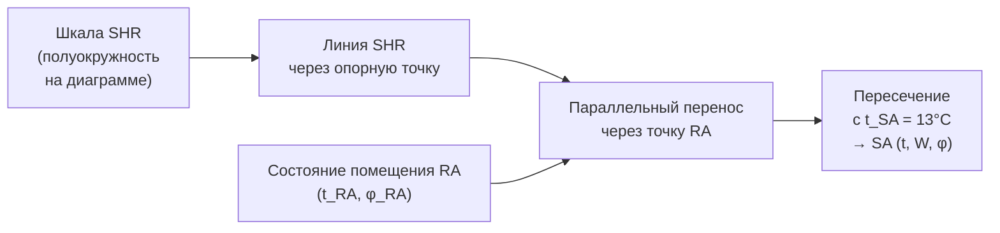

Отношение явного тепла (Sensible Heat Ratio, SHR) — безразмерная величина, характеризующая долю явного тепла в суммарной тепловой нагрузке на систему кондиционирования воздуха. SHR определяет наклон линии процесса на психрометрической диаграмме и является ключевым параметром при проектировании охлаждающих секций, выборе параметров приточного воздуха и расчёте производительности оборудования.

## Определение и физический смысл

### Базовое определение


\text{SHR} = \frac{Q_s}{Q_s + Q_l} = \frac{Q_s}{Q_{\text{total}}}


где:
- Q_s — мощность явного охлаждения/нагревания [кВт]
- Q_l — мощность скрытого охлаждения/нагревания [кВт]
- Q_total — суммарная тепловая нагрузка [кВт]

SHR изменяется в диапазоне от 0 (чисто скрытая нагрузка) до 1,0 (чисто явная нагрузка).

### SHR через психрометрические параметры

Для процесса охлаждения с осушением (состояния 1 → 2):


\text{SHR} = \frac{c_{pa}(t_1 - t_2) + W_1 \cdot c_{pv}(t_1 - t_2)}{h_1 - h_2} = \frac{(c_{pa} + W_1 c_{pv})(t_1-t_2)}{h_1-h_2}


Упрощённая форма (при пренебрежении W c_pv << c_pa):


\text{SHR} \approx \frac{1{,}006 \cdot (t_1 - t_2)}{h_1 - h_2}


### Связь SHR с наклоном линии процесса

На психрометрической диаграмме линия процесса, соответствующая заданному SHR, имеет наклон:


\frac{\Delta W}{\Delta t_{db}} = \frac{-(1 - \text{SHR}) \cdot h_{fg}}{[c_{pa} + (W_1+W_2)/2 \cdot c_{pv}] \cdot \text{SHR} \cdot h_{fg} + \ldots}


Для практических целей: при SHR = 0,8 наклон линии процесса составляет примерно −0,9 г/(кг·°C), при SHR = 0,6 — около −2,0 г/(кг·°C).

## Расчёт тепловых нагрузок помещения

### Явная нагрузка помещения

Явная нагрузка складывается из следующих составляющих:


Q_s = Q_{s,\text{люди}} + Q_{s,\text{осв.}} + Q_{s,\text{обор.}} + Q_{s,\text{ограж.}} + Q_{s,\text{OA}} + Q_{s,\text{инф.}}



| Источник | Явная нагрузка |
|---|---|
| Человек (офисная работа) | 75–90 Вт/чел |
| Человек (физический труд) | 150–300 Вт/чел |
| Компьютер с монитором | 100–200 Вт/место |
| Сервер 1U | 100–500 Вт/шт |
| Освещение (LED) | 8–15 Вт/м² |
| Солнечная радиация через стекло | 100–600 Вт/м² (зависит от ориентации) |
| Теплопередача через ограждение | q = U × A × ΔT |


### Скрытая нагрузка помещения


Q_l = Q_{l,\text{люди}} + Q_{l,\text{проц.}} + Q_{l,\text{OA}} + Q_{l,\text{инф.}}



| Вид деятельности | Явная, Вт/чел | Скрытая, Вт/чел | SHR_человек |
|---|---|---|---|
| Отдых (сидя) | 60 | 35 | 0,63 |
| Офисная работа | 75 | 55 | 0,58 |
| Лёгкая работа стоя | 90 | 75 | 0,55 |
| Физический труд (умеренный) | 170 | 255 | 0,40 |
| Тяжёлый труд | 290 | 465 | 0,38 |


### Нагрузка от вентиляции наружным воздухом

Явная составляющая:


Q_{s,OA} = \dot{m}_{OA} \cdot c_{pa} \cdot (t_{OA} - t_{\text{пом}})


Скрытая составляющая:


Q_{l,OA} = \dot{m}_{OA} \cdot h_{fg} \cdot (W_{OA} - W_{\text{пом}})


## Шкала SHR на психрометрической диаграмме

### Опорная точка и построение линии процесса

На психрометрических диаграммах ASHRAE шкала SHR расположена в виде полуокружности с опорной точкой:
- t_db = 25 °C (77 °F в системе I-P)
- W ≈ 10 г/кг (φ ≈ 50 %)

Процедура построения линии процесса помещения:

1. Рассчитать SHR_помещения = Q_s / Q_total
2. Найти соответствующую точку на шкале SHR диаграммы
3. Провести прямую из опорной точки к найденной отметке шкалы
4. Эту прямую параллельно перенести через точку состояния воздуха в помещении (RA)
5. Полученная параллельная прямая — линия процесса помещения

### Графическое определение параметров приточного воздуха

Пересечение линии процесса помещения с заданной температурой приточного воздуха t_SA даёт точку состояния приточного воздуха (SA), из которой читается W_SA.





## Типовые значения SHR


| Тип помещения | Типичный SHR | Характер нагрузки |
|---|---|---|
| Офис (низкая плотность, < 5 чел/100 м²) | 0,90–0,95 | Преимущественно явная (оборудование, освещение) |
| Офис (высокая плотность, > 10 чел/100 м²) | 0,80–0,90 | Умеренная скрытая нагрузка от людей |
| Конференц-зал (полная заполненность) | 0,65–0,75 | Высокая скрытая нагрузка от людей |
| Ресторан, столовая | 0,60–0,75 | Приготовление пищи + высокая плотность |
| Розничная торговля | 0,75–0,85 | Смешанная нагрузка |
| Крытый спортзал | 0,55–0,70 | Высокое потоотделение, интенсивное испарение |
| Крытый бассейн | 0,40–0,55 | Доминирует испарение воды |
| Ледовый каток | 0,30–0,45 | Очень высокая скрытая нагрузка |
| Операционная | 0,70–0,85 | Зависит от воздухообмена |
| Серверная (ЦОД) | 0,95–1,00 | Почти чисто явная нагрузка |
| Промышленное производство (влажное) | 0,40–0,65 | Зависит от процесса |


## Расчётный пример

**Задание:** офисное помещение S = 500 м², 50 человек, 60 компьютеров.

**Явная нагрузка:**
- Люди: 50 × 75 = 3 750 Вт
- Компьютеры: 60 × 150 = 9 000 Вт
- Освещение: 500 × 10 = 5 000 Вт
- Ограждения/остекление: 12 000 Вт (расчёт по теплопоступлениям)
- **Q_s = 29 750 Вт ≈ 30 кВт**

**Скрытая нагрузка:**
- Люди: 50 × 55 = 2 750 Вт
- Инфильтрация: 1 500 Вт
- **Q_l = 4 250 Вт ≈ 4,25 кВт**

**SHR:**


\text{SHR} = \frac{30}{30 + 4{,}25} = \frac{30}{34{,}25} = \mathbf{0{,}876}


**Параметры приточного воздуха** (RA: 25 °C, 55 %, W_RA = 10,89 г/кг; t_SA = 13 °C):


\dot{m}_a = \frac{Q_s}{c_{pa}(t_{RA} - t_{SA})} = \frac{30}{1{,}006 \times 12} = 2{,}487\;\text{кг/с} = 8\,950\;\text{м}^3/\text{ч}



W_{SA} = W_{RA} - \frac{Q_l}{\dot{m}_a \cdot h_{fg}} = 10{,}89 - \frac{4{,}25}{2{,}487 \times 2454} \times 1000 = 10{,}89 - 0{,}70 = \mathbf{10{,}19\;\text{г/кг}}


Приточный воздух: t_SA = 13 °C, W_SA = 10,19 г/кг → φ_SA = 10,19 / W_s(13°C) × ... = **85,5 %**

## Влияние SHR на выбор оборудования

### ADP и температура хладоносителя

Для заданных условий помещения и t_SA необходимый ADP:


t_{ADP} = t_{SA} - \frac{1-\text{BF}}{\text{BF}} \cdot (t_{RA} - t_{SA}) \cdot \text{SHR}


При низком SHR (высокая скрытая нагрузка) требуется более низкий ADP → ниже температура хладоносителя → ниже COP чиллера.

**Пример:** при SHR = 0,5 и t_SA = 13 °C, t_RA = 25 °C:


t_{ADP} \approx \frac{0{,}5 \times 13 \times (1-0{,}6)}{1 - 0{,}6 \times 0{,}5} \approx 8{,}7\;°\text{C}


При SHR = 0,9 и тех же условиях t_ADP ≈ 11,5 °C → возможна более высокая температура хладоносителя.

## Нормативные документы

- ASHRAE Handbook — Fundamentals 2021, Chapter 1 «Psychrometrics»
- ASHRAE Handbook — Fundamentals 2021, Chapter 18 «Nonresidential Cooling and Heating Load Calculations»
- ASHRAE Standard 55-2023 «Thermal Environmental Conditions for Human Occupancy»
- СП 60.13330.2020 «Отопление, вентиляция и кондиционирование воздуха»
