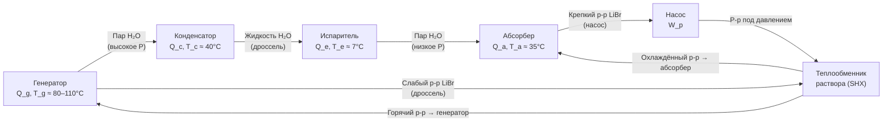

## Принцип «термического сжатия»

В паровой компрессионной машине механический компрессор повышает давление паров хладагента за счёт электрической работы. В абсорбционной машине «термический компрессор» выполняет ту же функцию за счёт теплоты: хладагент поглощается жидким абсорбентом при низком давлении (абсорбер) → раствор перекачивается насосом на высокое давление → теплота привода выделяет хладагент из раствора (генератор) → пары хладагента при высоком давлении поступают в конденсатор.

Работа насоса раствора мала (0,3–1,5 % от Q_генератора), поэтому основной затрат — тепловой.

---

## Рабочие пары и область применения

### LiBr–H₂O

Хладагент — **вода** (H₂O), абсорбент — **бромид лития** (LiBr). Вода испаряется при низких давлениях: при T_исп = 7 °C давление ≈ 1,0 кПа (0,01 бар).

**Ограничения:**
- Температура испарения > +3 °C (при ниже — опасность замерзания воды)
- Кристаллизация LiBr при высоких концентрациях и низких температурах (граница кристаллизации при x > 70 % мас.)
- Вакуумная работа (P < 10 кПа) — требует герметичного исполнения
- Коррозионная активность LiBr по отношению к стали (применяются ингибиторы)

**Область применения:** охлаждение воды до 6–7 °C в системах центральной вентиляции и кондиционирования.

### NH₃–H₂O

Хладагент — **аммиак** (NH₃, R-717), абсорбент — **вода** (H₂O).

**Преимущества перед LiBr–H₂O:**
- Температура испарения до −60 °C
- Работа при атмосферных и умеренно избыточных давлениях
- Широко применяется в промышленной холодильной технике

**Осложнения:**
- Аммиак частично растворим в воде → в генераторе необходима ректификационная колонна для отделения аммиака от водяного пара (иначе водяной пар попадёт в конденсатор и засорит испаритель)
- Токсичность и горючесть NH₃ (класс B2L по ISO 817): требования ГОСТ 31861, EN 378-3

---

## Одноступенчатая машина LiBr–H₂O: схема и баланс

### Шесть компонентов





### Баланс энергии

**Энергетический баланс системы** (при пренебрежении W_p):


Q_g + Q_e = Q_c + Q_a


**COP охлаждения:**


\text{COP} = \frac{Q_e}{Q_g + W_p} \approx \frac{Q_e}{Q_g}


**Теоретический максимум COP** (при обратимой работе):


\text{COP}_{rev} = \frac{T_e (T_g - T_a)}{T_g (T_a - T_e)} = \eta_{Carnot,engine} \times \text{COP}_{Carnot,R}


где T_g, T_a, T_e — температуры генератора, абсорбера, испарителя (К).

**Числовой пример.** T_g = 90 °C (363 К), T_a = 35 °C (308 К), T_e = 7 °C (280 К).


\text{COP}_{rev} = \frac{280 \times (363 - 308)}{363 \times (308 - 280)} = \frac{280 \times 55}{363 \times 28} = \frac{15400}{10164} = 1{,}52


Реальный одноступенчатый COP: 0,65–0,75 → η_II ≈ 0,43–0,49 от теоретического максимума.

---

## Диаграмма состояния LiBr–H₂O

Для анализа абсорбционного цикла используются специализированные диаграммы:

### Диаграмма Дюринга (Dühring chart)

Давление паров воды над раствором LiBr аппроксимируется правилом Дюринга:


T_{sat}(P) = a(x) + b(x) \cdot T_{sat,water}(P)


где a(x) и b(x) — коэффициенты, зависящие от массовой концентрации x (%) раствора LiBr.

На диаграмме Дюринга (ось X — температура насыщения воды, ось Y — температура раствора LiBr при том же давлении) циклу соответствует параллелограмм. Линия кристаллизации ограничивает рабочую область сверху по концентрации.

### Граница кристаллизации

При концентрации x > 65–67 % и температуре < 20–30 °C раствор LiBr кристаллизуется. Для защиты от кристаллизации:
- Ограничивают минимальную температуру охлаждающей воды (не ниже 20 °C)
- Устанавливают защиту по концентрации (датчики, клапаны)
- Применяют добавки LiBr-LiNO₃ или LiBr-LiBr₂

---

## Баланс массы и расчёт расходов

Обозначения: ṁ_r — расход хладагента (воды), ṁ_s — расход слабого раствора (из генератора), ṁ_c — расход крепкого раствора (в генератор); x_s — концентрация слабого раствора (г LiBr / г раствора), x_c — крепкого.

**Баланс массы хладагента (воды):**


\dot{m}_r = \dot{m}_c - \dot{m}_s


**Баланс массы LiBr:**


\dot{m}_c x_c = \dot{m}_s x_s


**Циркуляционное число** (circulation ratio):


f = \frac{\dot{m}_c}{\dot{m}_r} = \frac{x_s}{x_s - x_c}


**Числовой пример.** Одноступенчатая машина: x_c = 60 % (крепкий), x_s = 55 % (слабый).


f = \frac{55}{55 - 60}


Ошибка — крепкий раствор должен иметь **большую** концентрацию LiBr (меньше воды), поэтому x_c > x_s. Исправим обозначения: x_strong = 64 % (из генератора, мало воды), x_weak = 58 % (в генераторе, больше воды).


f = \frac{x_{strong}}{x_{strong} - x_{weak}} = \frac{64}{64 - 58} = \frac{64}{6} = 10{,}67


На каждый кг испарённой воды (хладагента) через цикл циркулирует ≈ 10,7 кг раствора LiBr.

---

## Двухступенчатая машина

Двухступенчатая (double-effect) машина использует конденсационную теплоту первого конденсатора (при высоком давлении) как источник для второго генератора (при низком давлении). Это повышает использование теплоты и COP.


\text{COP}_{2-effect} \approx 2 \times \text{COP}_{1-effect} \approx 1{,}0{-}1{,}35


Требуемая температура привода: 140–185 °C (по сравнению с 80–110 °C для одноступенчатой).

**Типичное применение:** когенерация от газовых турбин или паровых котлов высокого давления, где доступен пар 5–10 бар.

---

## Пара NH₃–H₂O: особенности расчёта

### Ректификация

Поскольку вода также летуча, из генератора выходит не чистый аммиак, а его смесь с водяным паром. Для очистки используется ректификационная колонна над генератором и дефлегматор (парциальный конденсатор).

Эффективность ректификации характеризуется коэффициентом разделения:


\xi = \frac{y_{NH_3,out} - y_{NH_3,feed}}{y_{NH_3,eq} - y_{NH_3,feed}}


Чем выше ξ, тем чище аммиак и тем ниже температура конца испарения в испарителе.

### Диаграмма P–T–x для NH₃–H₂O

На диаграмме отображаются:
- Линии конденсации (bubble curves) и кипения (dew curves) при разных давлениях
- Рабочие точки генератора и абсорбера
- Температурный скользящий эффект (temperature glide) при смешении

---

## Применение: отходящее тепло и когенерация

Абсорбционная машина особенно привлекательна в схемах:

**Когенерация (ТЭЦ + абсорбция).** Дымовые газы котла при 150–200 °C или сбросной пар при 4–10 бар приводят двухступенчатую машину. Экономия первичной энергии (Primary Energy Ratio, PER):


\text{PER} = \frac{Q_e + Q_{heat}}{Q_{fuel}} = \eta_{boiler} \cdot (\text{COP}_{abs} + 1)


При η_boiler = 0,90 и COP_abs = 1,2: PER = 0,90 × 2,2 = 1,98 — почти вдвое эффективнее, чем раздельная выработка тепла и холода.

**Тригенерация.** Одновременная выработка электроэнергии, теплоты и холода в едином комплексе (Combined Cooling, Heating and Power, CCHP) — особенно актуально для отелей, больниц, производственных предприятий.

---

## Сравнение LiBr–H₂O и NH₃–H₂O


| Параметр | LiBr–H₂O | NH₃–H₂O |
|---|---|---|
| Хладагент | H₂O | NH₃ |
| GWP хладагента | 0 | 0 |
| Мин. T испарения | +3 °C | −60 °C |
| Тип давления | Вакуум (< 10 кПа) | Избыточное (> 1 атм) |
| Ректификация | Не нужна | Необходима |
| COP (одноступ.) | 0,65–0,75 | 0,55–0,65 |
| Коррозионность | Высокая (LiBr + H₂O) | Умеренная |
| Токсичность | Нет | B2L по ISO 817 |
| Зона применения | Охлаждение воды, ≥ +5 °C | Промышленный холод, −60…+10 °C |


---

## Типичные ошибки проектирования

1. **Недооценка температуры охлаждающей воды.** Для нормальной работы LiBr-машины температура охлаждающей воды должна быть не ниже 20–24 °C. При более холодной воде концентрация LiBr в абсорбере становится опасно высокой (риск кристаллизации).
2. **Пренебрежение охладителем раствора (SHX).** Без теплообменника раствора эффективность машины снижается на 10–20 % — Q_g растёт, COP падает.
3. **Несоответствие температуры привода.** Одноступенчатая машина при T_g < 75 °C не может обеспечить полное выпаривание → снижение COP и нестабильность работы.
4. **Игнорирование отводимой теплоты абсорбера.** Абсорбер выделяет значительную теплоту (Q_a ≈ Q_c); его охлаждение — отдельная нагрузка на градирню или холодный контур.

## Литература

- ASHRAE Handbook — Refrigeration (2022), Chapter 2 (Absorption Refrigeration)
- Herold K. E., Radermacher R., Klein S. A. Absorption Chillers and Heat Pumps, 2nd ed. CRC Press, 2016
- Ziegler F. Recent developments and future prospects of sorption heat pump systems. Int. Journal of Thermal Sciences, 1999
- EN 378-3:2016 Refrigerating systems and heat pumps — Installation site and personal protection
- ASHRAE Handbook — Fundamentals (2021), Chapter 2
- ГОСТ Р 54540-2011 Холодильные машины абсорбционного типа
