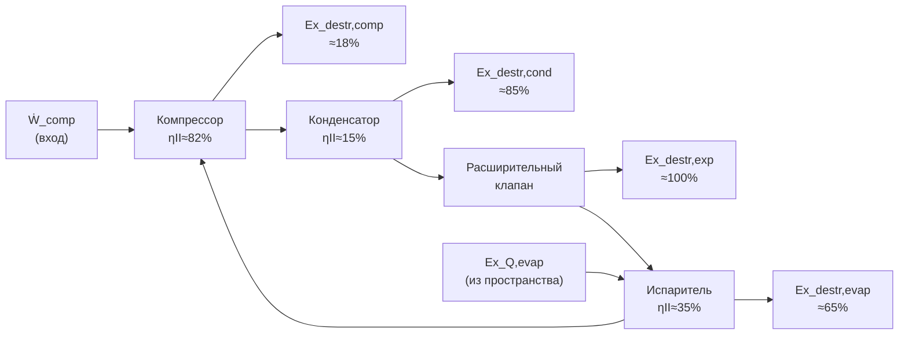

## Мотивация: почему недостаточно первого закона

Первый закон термодинамики даёт количественный учёт энергии, но не отражает качественные потери. Например, 1 кДж теплоты при 500 °C и 1 кДж теплоты при 30 °C «одинаковы» с точки зрения первого закона, хотя их потенциал для совершения работы совершенно различен. Эксергетический анализ (exergy analysis, также называемый анализом доступности — availability analysis) восполняет этот пробел, количественно оценивая качество энергетических потоков.

---

## Определение эксергии

**Эксергия** (exergy) — максимальная теоретически достижимая полезная работа при обратимом взаимодействии системы с окружающей средой (мёртвым состоянием) до достижения термодинамического равновесия.

### Мёртвое состояние (dead state)

Мёртвое состояние (dead state, T₀, P₀) — условия полного равновесия системы с окружающей средой: нет разности температур, давлений, скоростей, высот или химических потенциалов.


| Параметр | Стандартное значение | Примечание |
|---|---|---|
| T₀ | 25 °C (298,15 К) | Меняется по сезону; влияет на абсолютные значения Ex, но не на Ex_destr |
| P₀ | 101,325 кПа | Атмосферное давление |
| Относительная влажность | 60 % | Для расчётов с влажным воздухом |


### Эксергия закрытой системы (не потоковая)


Ex = (U - U_0) + P_0(V - V_0) - T_0(S - S_0)


### Удельная потоковая эксергия

Для движущихся потоков (компоненты HVAC — открытые системы):


ex = (h - h_0) - T_0(s - s_0) + \frac{V^2}{2} + gz


В большинстве задач HVAC члены кинетической и потенциальной энергии пренебрежимо малы:


ex \approx (h - h_0) - T_0(s - s_0) \qquad [\text{кДж/кг}]


### Эксергия тепловых потоков

Теплота \dot{Q}, передаваемая при температуре T, несёт эксергию:


\dot{Ex}_Q = \dot{Q} \left(1 - \frac{T_0}{T}\right)


Множитель (1 - T_0/T) — коэффициент Карно (Carnot factor). При T > T₀ — положительный; при T < T₀ (охлаждение) — отрицательный, что означает: извлечение теплоты из холодного тела требует затрат работы.

---

## Баланс эксергии

### Общее уравнение баланса для установившегося контрольного объёма


\sum_{in} \dot{m}_i ex_i + \sum_j \dot{Q}_j\left(1 - \frac{T_0}{T_j}\right) = \sum_{out} \dot{m}_e ex_e + \dot{W}_s + \dot{Ex}_{destr}


Или в форме «приход – расход = деструкция»:


\dot{Ex}_{destr} = \dot{Ex}_{in} - \dot{Ex}_{out} \ge 0


Связь с генерацией энтропии (теорема Гуи–Стодолы, Gouy–Stodola):


\dot{Ex}_{destr} = T_0 \cdot \dot{\sigma}_{gen} \ge 0


Это соотношение является ключевым: **каждый необратимый процесс уничтожает эксергию пропорционально генерации энтропии**. Деструкция эксергии неустранима в принципе — её можно лишь минимизировать инженерными методами.

---

## Деструкция эксергии в компонентах HVAC

### Компрессор


\dot{Ex}_{destr,comp} = \dot{W}_{comp} - \dot{m}_r(ex_2 - ex_1)



= \dot{W}_{comp} - \dot{m}_r\left[(h_2 - h_1) - T_0(s_2 - s_1)\right]


Или через генерацию энтропии:


\dot{Ex}_{destr,comp} = T_0 \dot{m}_r (s_2 - s_1) \quad (\text{адиабатный компрессор})


### Конденсатор

Хладагент охлаждается; охлаждающая среда нагревается. Деструкция эксергии из-за конечной разности температур:


\dot{Ex}_{destr,cond} = \dot{m}_r(ex_2 - ex_3) - \dot{m}_{air/water}(ex_{cw,out} - ex_{cw,in})



= T_0 \left[\dot{m}_r(s_3 - s_2) + \dot{m}_{cw}(s_{cw,out} - s_{cw,in})\right]


Типичная доля деструкции конденсатора в суммарной деструкции эксергии чиллера: 30–45 %.

### Испаритель


\dot{Ex}_{destr,evap} = \dot{m}_r(ex_4 - ex_1) + \dot{m}_{chw}(ex_{chw,in} - ex_{chw,out})


Обратите внимание: хладагент получает эксергию (изменение фазы при низкой температуре), а охлаждённая вода теряет эксергию. Типичная доля: 25–35 %.

### Расширительный клапан (дроссель)

Наиболее «концентрированный» источник деструкции эксергии в цикле:


\dot{Ex}_{destr,exp} = \dot{m}_r(ex_3 - ex_4) = T_0 \dot{m}_r (s_4 - s_3)


Потенциал улучшения: замена дросселя турбодетандером позволила бы частично возместить эту деструкцию, повысив COP на 5–15 % (см. [Циклы](../cycles/)).

---

## Числовой пример: полный эксергетический анализ чиллера

**Условие.** Чиллер на R-410A. T₀ = 30 °C (303 К). Параметры цикла из предыдущего примера ([Циклы](../cycles/)):

| Точка | h, кДж/кг | s, кДж/(кг·К) | P, МПа |
|---|---|---|---|
| 1 | 437,2 | 1,749 | 1,128 |
| 2 | 488,7 | 1,799 | 3,060 |
| 3 | 274,6 | 1,228 | 3,060 |
| 4 | 274,6 | 1,253 | 1,128 |

Мёртвое состояние: h₀ = 462,0 кДж/кг (R-410A при 30 °C, перегретый пар), s₀ = 1,812 кДж/(кг·К). Массовый расход: ṁ_r = 0,215 кг/с. Холодопроизводительность: 35 кВт. Мощность компрессора: 11,1 кВт.

**Удельная потоковая эксергия** в каждой точке (ex = (h − h₀) − T₀(s − s₀)):


ex_1 = (437{,}2 - 462{,}0) - 303(1{,}749 - 1{,}812) = -24{,}8 + 19{,}1 = -5{,}7 \text{ кДж/кг}



ex_2 = (488{,}7 - 462{,}0) - 303(1{,}799 - 1{,}812) = 26{,}7 + 3{,}9 = 30{,}6 \text{ кДж/кг}



ex_3 = (274{,}6 - 462{,}0) - 303(1{,}228 - 1{,}812) = -187{,}4 + 176{,}9 = -10{,}5 \text{ кДж/кг}



ex_4 = (274{,}6 - 462{,}0) - 303(1{,}253 - 1{,}812) = -187{,}4 + 169{,}4 = -18{,}0 \text{ кДж/кг}


**Деструкция эксергии в компонентах:**


\dot{Ex}_{destr,comp} = \dot{W}_c - \dot{m}_r(ex_2 - ex_1) = 11{,}1 - 0{,}215 \times (30{,}6 - (-5{,}7)) = 11{,}1 - 7{,}8 = 3{,}3 \text{ кВт}



\dot{Ex}_{destr,exp} = \dot{m}_r(ex_3 - ex_4) = 0{,}215 \times (-10{,}5 - (-18{,}0)) = 0{,}215 \times 7{,}5 = 1{,}6 \text{ кВт}


Суммарная деструкция (баланс всего цикла):


\dot{Ex}_{destr,total} = \dot{W}_c - \dot{Ex}_{cooling} = 11{,}1 - 35 \times \left(\frac{T_0}{T_L} - 1\right)
= 11{,}1 - 35 \times \left(\frac{303}{278} - 1\right) = 11{,}1 - 3{,}15 = 7{,}95 \text{ кВт}



| Компонент | Ėx_destr, кВт | Доля, % |
|---|---|---|
| Компрессор | 3,3 | 41,5 |
| Конденсатор | 2,0 | 25,2 |
| Расширительный клапан | 1,6 | 20,1 |
| Испаритель | 1,05 | 13,2 |
| Итого | 7,95 | 100 |


---

## Эффективность второго закона

### Определение для холодильной машины


\eta_{II,R} = \frac{\text{COP}_{actual}}{\text{COP}_{Carnot}} = \frac{Ex_{out}}{Ex_{in}}


Для рассмотренного примера:


\eta_{II} = \frac{3{,}15}{7{,}18} = 0{,}44 \quad (44\%)


### Определение для отдельного компонента

**Обобщённое определение** (задача-ориентированное):


\eta_{II,component} = \frac{\dot{Ex}_{product}}{\dot{Ex}_{fuel}} = 1 - \frac{\dot{Ex}_{destr}}{\dot{Ex}_{fuel}}


где «топливо» (fuel) — подводимая эксергия, «продукт» (product) — полезно использованная эксергия.


| Компонент | Ex_fuel | Ex_product | Типичный η_II |
|---|---|---|---|
| Компрессор | Ẇ_comp | ṁ(ex₂ − ex₁) | 75–88 % |
| Конденсатор | ṁ_r(ex₂ − ex₃) | ṁ_cw(ex_{out} − ex_{in}) | 5–25 % |
| Испаритель | ṁ_chw(ex_{in} − ex_{out}) | ṁ_r(ex₁ − ex₄) | 20–45 % |
| Расширительный клапан | ṁ(ex₃ − ex₄) | 0 (дроссель — нет полезного выхода) | 0–30 %* |
| Теплообменник | ṁ_hot(ex_{in} − ex_{out}) | ṁ_cold(ex_{out} − ex_{in}) | 40–80 % |


*При замене на турбодетандер η_II расширителя ≈ 60–80 %.

---

## Диаграмма Грассмана (Grassmann diagram)

Диаграмма Грассмана (Sankey-like diagram для эксергии) визуализирует потоки эксергии и места деструкции:





В реальной практике диаграмму Грассмана строят с масштабированием ширины стрелок пропорционально мощности потока эксергии. Наиболее широкие стрелки деструкции указывают приоритеты оптимизации.

---

## Оптимизация на основе эксергетического анализа

### Стратегия минимизации деструкции

1. Ранжировать компоненты по абсолютной деструкции \dot{Ex}_{destr,i}
2. Рассчитать **относительную деструкцию**: y_{D,i} = \dot{Ex}_{destr,i} / \dot{Ex}_{fuel,system}
3. Оценить **техническую достижимость** снижения деструкции (конструктивные ограничения)
4. Рассчитать **экономический потенциал** (стоимость сэкономленной эксергии × число часов работы)

### Пример: снижение деструкции конденсатора

Снижение температурного напора в конденсаторе с ΔT = 10 К до ΔT = 5 К:


\dot{Ex}_{destr,cond} = \dot{Q}_c \cdot T_0 \left(\frac{1}{T_{cw,m}} - \frac{1}{T_{cond}}\right)


Уменьшение ΔT вдвое → деструкция конденсатора снижается примерно вдвое (при линейном профиле температур). Для достижения этого необходимо увеличить площадь теплообменной поверхности — компромисс между операционными и капитальными затратами.

---

## Термоэкономика (экзергоэкономика)

Термоэкономика (thermoeconomics / exergoeconomics) объединяет эксергетический анализ с экономической оценкой. Цель — минимизировать суммарные затраты (капитальные + операционные), а не только деструкцию эксергии.

### Стоимость эксергии


c_{Ex} = \frac{\text{Стоимость энергоносителя (руб./ч)}}{\dot{Ex}_{fuel} \text{ (кВт)}} \quad [\text{руб./(кВт·ч)}]


### Затраты на деструкцию эксергии


\dot{C}_{D,i} = c_{F,i} \cdot \dot{Ex}_{destr,i}


### Структура суммарных затрат


\dot{C}_{total} = \sum_i (\dot{Z}_i + \dot{C}_{D,i})


где \dot{Z}_i — ежегодные капитальные затраты на компонент i (руб./ч). Оптимальное проектное решение минимизирует \dot{C}_{total}, что не всегда совпадает с минимизацией суммарной деструкции эксергии.

---

## Применение к системам с рекуперацией теплоты

Для систем с рекуперацией теплоты (теплоутилизаторы, геотермальные контуры, когенерация) эксергетический анализ позволяет:

1. **Оценить качество возвращаемой теплоты**: теплота при 80 °C (η_Carnot = 15 %) значительно ценнее теплоты при 30 °C (η_Carnot = 1,7 %)
2. **Сравнивать альтернативные схемы** независимо от абсолютных температурных уровней
3. **Определить оптимальную температуру рекуперации**: слишком низкая температура → малая эксергия; слишком высокая → большие потери в основном цикле


\eta_{II,HX} = \frac{\dot{m}_{cold}(ex_{out,cold} - ex_{in,cold})}{\dot{m}_{hot}(ex_{in,hot} - ex_{out,hot})}


---

## Ограничения эксергетического анализа

1. **Чувствительность к выбору мёртвого состояния**: абсолютные значения эксергии зависят от T₀ и P₀. Деструкция эксергии — инвариантна.
2. **Не учитывает экономику напрямую**: низкая деструкция не всегда означает низкие затраты (дорогой теплообменник может не окупаться).
3. **Сложность расчёта смесей**: для многокомпонентных рабочих тел требуется учёт химической эксергии и смешения.
4. **Статический анализ**: стандартный эксергетический анализ — для установившегося режима; для переходных режимов (пуск, оттайка) нужны методы динамической эксергии.

## Программные инструменты

- **EES (Engineering Equation Solver)**: встроенные функции эксергии для хладагентов и воздуха
- **CoolProp + Python**: расчёт h и s для вычисления ex по REFPROP-точности
- **Aspen HYSYS**: промышленный стандарт для нефтехимических систем, применим для крупных холодильных установок
- **ExerCom** (LENI, EPFL): специализированный пакет для эксергоэкономического анализа зданий

## Литература

- Bejan A., Tsatsaronis G., Moran M. Thermal Design and Optimization. Wiley, 1996
- Çengel Y. A., Boles M. A. Thermodynamics: An Engineering Approach, 9th ed. McGraw-Hill, 2019, Chapters 8, 14
- Lazzaretto A., Tsatsaronis G. SPECO: A systematic and general methodology for calculating efficiencies and costs in thermal systems. Energy, 2006, 31(8–9), 1257–1289
- ASHRAE Handbook — Fundamentals (2021), Chapter 2 (раздел экономии эксергии)
- Kotas T. J. The Exergy Method of Thermal Plant Analysis. Krieger Publishing, 1995
