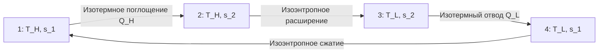

## Нулевой закон термодинамики

**Формулировка.** Если тело A находится в тепловом равновесии с телом C, и тело B также находится в тепловом равновесии с телом C, то тела A и B находятся в тепловом равновесии друг с другом.

Этот принцип обосновывает саму возможность измерения температуры и делегирует эталонную функцию термометру. В системах HVAC нулевой закон лежит в основе размещения датчиков: показания датчика в потоке теплоносителя отражают температуру самого теплоносителя только при условии установившегося теплового равновесия между чувствительным элементом и средой.

---

## Первый закон термодинамики

### Закрытая система (Control Mass)

Первый закон выражает принцип сохранения энергии:


\Delta U = Q - W


где \Delta U — изменение внутренней энергии системы (кДж), Q — теплота, подведённая к системе (кДж), W — работа, совершённая системой (кДж).

Знаковое соглашение (ASHRAE): теплота, входящая в систему, — положительная; работа, выходящая из системы, — положительная.

### Открытая система в установившемся режиме (Steady-State Control Volume)

Для элементов HVAC с непрерывным потоком вещества (компрессор, теплообменник, расширительный клапан) применяется уравнение энергетического баланса контрольного объёма:


\dot{Q} - \dot{W}_s = \dot{m}\left[\left(h_2 - h_1\right) + \frac{V_2^2 - V_1^2}{2} + g(z_2 - z_1)\right]


где \dot{Q} — тепловой поток (кВт), \dot{W}_s — мощность вала (кВт), \dot{m} — массовый расход (кг/с), h — удельная энтальпия (кДж/кг), V — скорость потока (м/с), z — геодезическая высота (м).

Для большинства компонентов HVAC члены кинетической и потенциальной энергии составляют менее 0,1 % от изменения энтальпии и пренебрегаются:


\dot{Q} - \dot{W}_s = \dot{m}(h_2 - h_1)


### Применение первого закона к компонентам HVAC


| Компонент | Уравнение | Примечание |
|---|---|---|
| Испаритель | \dot{Q}_e = \dot{m}_r(h_1 - h_4) | \dot{W}_s = 0 |
| Компрессор | \dot{W}_{comp} = \dot{m}_r(h_2 - h_1) | \dot{Q} \approx 0 (адиабатный) |
| Конденсатор | \dot{Q}_c = \dot{m}_r(h_2 - h_3) | \dot{W}_s = 0 |
| Расширительный клапан | h_3 = h_4 | \dot{Q} = 0,\ \dot{W}_s = 0 |
| Охлаждающий змеевик | \dot{Q} = \dot{m}_a(h_{a,1} - h_{a,2}) | Психрометрическая энтальпия |


### Числовой пример: расчёт компрессора

**Условие.** Компрессор холодильной машины на хладагенте R-410A работает при следующих параметрах: давление всасывания 0,832 МПа (температура испарения −5 °C), перегрев 6 К; давление нагнетания 2,928 МПа (температура конденсации 45 °C). Изоэнтропный КПД компрессора \eta_s = 0{,}78. Холодопроизводительность \dot{Q}_e = 50 кВт. Определить: мощность компрессора, массовый расход хладагента.

**Решение.**

По таблицам свойств R-410A (REFPROP 10 / ASHRAE Handbook Fundamentals 2021, Appendix):

- Точка 1 (вход компрессора, перегрев 6 К): h_1 = 430{,}2 кДж/кг, s_1 = 1{,}758 кДж/(кг·К)
- Точка 2s (выход при изоэнтропном сжатии, s_{2s} = s_1): h_{2s} = 468{,}9 кДж/кг
- Точка 3 (выход конденсатора, переохлаждение 3 К): h_3 = 270{,}4 кДж/кг
- Точка 4 (после дросселирования): h_4 = h_3 = 270{,}4 кДж/кг

Массовый расход:


\dot{m}_r = \frac{\dot{Q}_e}{h_1 - h_4} = \frac{50}{430{,}2 - 270{,}4} = \frac{50}{159{,}8} = 0{,}313 \text{ кг/с}


Реальная работа компрессора на кг:


w_{comp} = \frac{h_{2s} - h_1}{\eta_s} = \frac{468{,}9 - 430{,}2}{0{,}78} = \frac{38{,}7}{0{,}78} = 49{,}6 \text{ кДж/кг}


Мощность привода:


\dot{W}_{comp} = \dot{m}_r \cdot w_{comp} = 0{,}313 \times 49{,}6 = 15{,}5 \text{ кВт}



\text{COP} = \frac{\dot{Q}_e}{\dot{W}_{comp}} = \frac{50}{15{,}5} = 3{,}23


---

## Второй закон термодинамики

### Формулировка Кельвина–Планка

Невозможно создать циклически работающее устройство, единственным результатом которого было бы получение теплоты от одного теплового резервуара и совершение эквивалентного количества работы.

Следствие: КПД любого теплового двигателя, работающего между резервуарами с температурами T_H и T_L, не превышает КПД цикла Карно:


\eta_{th} \le 1 - \frac{T_L}{T_H}


### Формулировка Клаузиуса

Невозможно создать циклически работающее устройство, единственным результатом которого была бы передача теплоты от тела с более низкой температурой к телу с более высокой температурой.

Следствие: холодильные машины и тепловые насосы требуют подвода внешней работы. COP ограничен значением Карно:


\text{COP}_{R} \le \frac{T_L}{T_H - T_L}, \qquad \text{COP}_{HP} \le \frac{T_H}{T_H - T_L}


### Эквивалентность формулировок

Обе формулировки эквивалентны: нарушение одной влечёт нарушение другой. Доказательство проводится методом «от противного» с использованием обратимой машины Карно в качестве насоса тепла (см. ASHRAE Handbook — Fundamentals 2021, Chapter 2).

---

## Энтропия

### Определение и свойства

Неравенство Клаузиуса для любого цикла:


\oint \frac{\delta Q}{T} \le 0


Равенство справедливо для обратимого цикла, строгое неравенство — для необратимого. Отсюда следует существование функции состояния — **энтропии** S, такой что для обратимого процесса:


dS = \frac{\delta Q_{rev}}{T}


Для необратимого процесса:


dS > \frac{\delta Q}{T} \quad \Longrightarrow \quad \sigma_{gen} = \Delta S_{sys} - \int \frac{\delta Q}{T_b} \ge 0


где \sigma_{gen} — генерация энтропии (Вт/К), T_b — температура границы системы.

### Баланс энтропии для контрольного объёма


\frac{dS_{cv}}{dt} = \sum_j \frac{\dot{Q}_j}{T_j} + \sum_{in}\dot{m}_i s_i - \sum_{out}\dot{m}_e s_e + \dot{\sigma}_{gen}


В установившемся режиме \frac{dS_{cv}}{dt} = 0, поэтому:


\dot{\sigma}_{gen} = \sum_{out}\dot{m}_e s_e - \sum_{in}\dot{m}_i s_i - \sum_j \frac{\dot{Q}_j}{T_j} \ge 0


### Физический смысл

Энтропия — мера рассеяния энергии или «качественного обесценивания» энергетического потенциала. Рост энтропии в реальных процессах означает уменьшение доли энергии, способной совершать полезную работу. Минимизация генерации энтропии — инженерный критерий термодинамического совершенства.

---

## Цикл Карно и пределы эффективности

### Четыре процесса цикла Карно





На диаграмме T–s прямоугольник, ограниченный изотермами T_H и T_L и вертикалями s_1 и s_2, соответствует циклу Карно. Площадь прямоугольника — полезная работа цикла.

### Тепловой двигатель Карно


\eta_{Carnot} = 1 - \frac{T_L}{T_H}


### Холодильная машина Карно


\text{COP}_{R,Carnot} = \frac{T_L}{T_H - T_L}


### Тепловой насос Карно


\text{COP}_{HP,Carnot} = \frac{T_H}{T_H - T_L}


Важное тождество:


\text{COP}_{HP} = \text{COP}_{R} + 1


### Числовой пример: пределы COP

**Условие.** Тепловой насос обогревает помещение при температуре 20 °C (293 К) за счёт теплоты грунта при температуре 5 °C (278 К). Определить максимальный COP и сравнить с типичным реальным значением.


\text{COP}_{HP,Carnot} = \frac{293}{293 - 278} = \frac{293}{15} = 19{,}5


Реальный тепловой насос с \eta_{II} = 0{,}40 от Карно:


\text{COP}_{HP,real} = 0{,}40 \times 19{,}5 = 7{,}8


Такое значение достижимо только для систем «грунт–вода» с высокоэффективным компрессором; реальные воздушные тепловые насосы дают COP 3–5 при аналогичных условиях.

---

## Необратимость в системах HVAC

### Классификация источников


| Источник | Компонент | Механизм | Способ снижения |
|---|---|---|---|
| Теплообмен через конечный ΔT | Испаритель, конденсатор | Градиент температуры | Увеличение площади, снижение скорости |
| Дросселирование | Расширительный клапан | Падение давления без выработки работы | Замена турбодетандером |
| Трение в потоке | Воздуховоды, трубопроводы | Вязкостная диссипация | Оптимальные скорости, малые потери давления |
| Смешение потоков | Фанкойл, смеситель | Необратимое выравнивание составов и температур | Раздельные контуры |
| Неизоэнтропное сжатие | Компрессор | Трение, утечки, теплообмен | Высокий механический КПД |
| Сгорание | Котёл, газовая горелка | Химическая необратимость, смешение | Предварительный подогрев воздуха, рекуперация |


### Связь с деструкцией эксергии

Генерация энтропии и деструкция эксергии связаны соотношением:


\dot{E}x_{destr} = T_0 \cdot \dot{\sigma}_{gen}


где T_0 — температура окружающей среды (мёртвое состояние, К). Подробный эксергетический анализ — в разделе [Эксергетический анализ](../exergy-analysis/).

---

## Соотношения Максвелла

Соотношения Максвелла (Maxwell relations) вытекают из условия точности (exactness) полных дифференциалов четырёх термодинамических потенциалов: внутренней энергии U, энтальпии H, свободной энергии Гельмгольца A и энергии Гиббса G.

### Вывод

Полный дифференциал внутренней энергии (фундаментальное уравнение Гиббса):


dU = T\,dS - P\,dV


Поскольку dU — полный дифференциал, смешанные вторые частные производные равны:


\left(\frac{\partial T}{\partial V}\right)_S = -\left(\frac{\partial P}{\partial S}\right)_V


Аналогично для H = U + PV, A = U − TS, G = H − TS:


\left(\frac{\partial T}{\partial P}\right)_S = \left(\frac{\partial V}{\partial S}\right)_P



\left(\frac{\partial P}{\partial T}\right)_V = \left(\frac{\partial S}{\partial V}\right)_T



\left(\frac{\partial V}{\partial T}\right)_P = -\left(\frac{\partial S}{\partial P}\right)_T


Последнее соотношение наиболее важно в инженерной практике: оно позволяет вычислить \left(\partial S/\partial P\right)_T из объёмных данных — например, при построении таблиц свойств хладагентов.

### Применение к уравнению Клапейрона

Уравнение Клапейрона–Клаузиуса для границы фазового равновесия:


\frac{dP_{sat}}{dT} = \frac{h_{fg}}{T \cdot v_{fg}}


где h_{fg} — удельная теплота парообразования (кДж/кг), v_{fg} = v_g - v_f — изменение удельного объёма при испарении. Это уравнение используется для расчёта кривых давления насыщения всех хладагентов.

---

## Третий закон термодинамики

**Формулировка Планка.** Энтропия любого чистого вещества в состоянии совершенного кристаллического порядка при абсолютном нуле температуры равна нулю.

В инженерных расчётах HVAC третий закон определяет опорную точку для абсолютных значений энтропии в таблицах свойств хладагентов и используется при построении уравнений состояния типа Span–Wagner (применяется в REFPROP для CO₂, аммиака и других веществ).

---

## Практические выводы для проектирования

1. **Первый закон** определяет мощность и производительность: размер каждого компонента рассчитывается из энергетического баланса.
2. **Второй закон** устанавливает предел: при заданных температурах источника и потребителя теплоты COP не может превысить значение Карно.
3. **Энтропия** — инструмент выявления потерь: чем больше генерация энтропии в компоненте, тем выше потенциал его оптимизации.
4. **Соотношения Максвелла** — математический инструмент построения таблиц свойств и вывода расчётных уравнений для хладагентов.

## Литература

- ASHRAE Handbook — Fundamentals (2021), Chapter 2: Thermodynamics and Refrigeration Cycles
- Çengel Y. A., Boles M. A. Thermodynamics: An Engineering Approach, 9th ed. McGraw-Hill, 2019
- Moran M. J. et al. Fundamentals of Engineering Thermodynamics, 9th ed. Wiley, 2018
- ГОСТ 24721-81 Холодильная техника. Термины и определения
