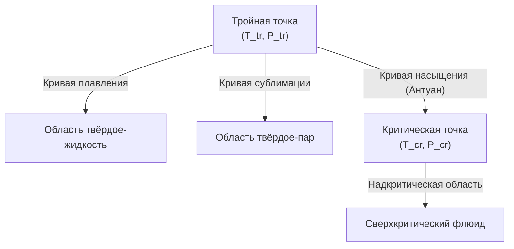
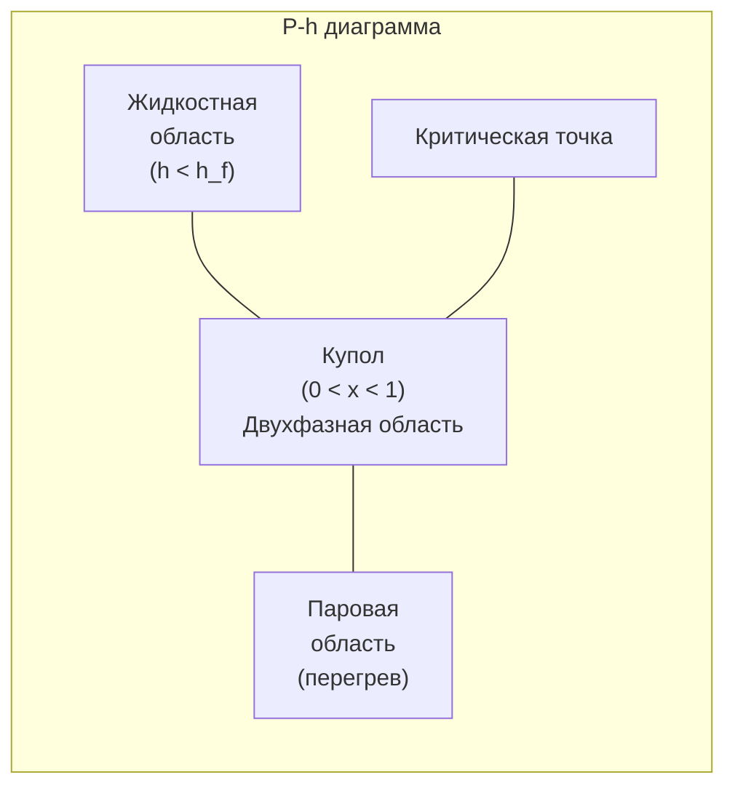

## Классификация термодинамических свойств

### Интенсивные и экстенсивные свойства

**Интенсивные свойства** (Intensive properties) не зависят от количества вещества в системе: температура T (К), давление P (кПа), удельный объём v (м³/кг), удельная энтальпия h (кДж/кг), удельная энтропия s (кДж/(кг·К)), плотность ρ (кг/м³), степень сухости (качество) x.

**Экстенсивные свойства** (Extensive properties) пропорциональны массе: объём V (м³), полная энтальпия H (кДж), полная энтропия S (кДж/К), масса m (кг).

Удельное значение = экстенсивное / масса: v = V/m, \; h = H/m, \; s = S/m.

### Постулат состояния

Состояние однокомпонентного однофазного вещества однозначно определяется **двумя** независимыми интенсивными свойствами. Следствие: все остальные свойства являются функциями двух выбранных:


h = h(P, T), \qquad s = s(P, T), \qquad v = v(P, T)


В двухфазной области давление и температура **не являются** независимыми — в качестве второго свойства используют степень сухости x или энтальпию h.

---

## Уравнения состояния

### Идеальный газ


Pv = RT, \qquad R = \frac{\bar{R}}{M}


где \bar{R} = 8{,}314 кДж/(кмоль·К) — универсальная газовая постоянная, M — молярная масса (кг/кмоль).


| Вещество | M, кг/кмоль | R, кДж/(кг·К) | cp, кДж/(кг·К) | cv, кДж/(кг·К) | k = cp/cv |
|---|---|---|---|---|---|
| Воздух (сухой) | 28,97 | 0,2870 | 1,005 | 0,718 | 1,400 |
| N₂ | 28,01 | 0,2968 | 1,039 | 0,743 | 1,399 |
| O₂ | 32,00 | 0,2598 | 0,918 | 0,658 | 1,395 |
| CO₂ | 44,01 | 0,1889 | 0,846 | 0,657 | 1,288 |
| H₂O (пар, 100 °C) | 18,02 | 0,4615 | 2,010 | 1,520 | 1,322 |
| NH₃ (R-717, пар) | 17,03 | 0,4882 | 2,060 | 1,560 | 1,318 |


Ограничения применимости: закон идеального газа справедлив при P \ll P_{cr} и T \gg T_{cr}. Для хладагентов при рабочих условиях HVAC (P \ge 0{,}1 P_{cr}) необходимы более точные модели.

### Фактор сжимаемости


Z = \frac{Pv}{RT}


При Z = 1 — идеальный газ. Диаграммы обобщённых коэффициентов сжимаемости строятся на основе приведённых свойств:


T_r = \frac{T}{T_{cr}}, \qquad P_r = \frac{P}{P_{cr}}


Принцип соответственных состояний: все вещества с одинаковыми T_r и P_r имеют приблизительно одинаковый Z (точность ±5–10 % для большинства рабочих тел HVAC).

### Уравнение Пенга–Робинсона (Peng–Robinson)

Наиболее широко применяемое кубическое уравнение состояния для инженерных расчётов:


P = \frac{RT}{v - b} - \frac{a(T)}{v(v+b) + b(v-b)}



a(T) = 0{,}45724 \frac{R^2 T_{cr}^2}{P_{cr}} \left[1 + \kappa\left(1 - \sqrt{T_r}\right)\right]^2



b = 0{,}07780 \frac{R T_{cr}}{P_{cr}}, \qquad \kappa = 0{,}37464 + 1{,}54226\,\omega - 0{,}26992\,\omega^2


где \omega — ацентрический фактор. Уравнение Пенга–Робинсона применяется в расчётных модулях для хладагентов R-32, R-134a, R-1234yf, однако для высокоточных расчётов (погрешность < 0,1 %) используют многопараметровые уравнения типа Span–Wagner (реализованы в REFPROP 10).

### Вириальное уравнение


Z = \frac{Pv}{RT} = 1 + \frac{B(T)}{v} + \frac{C(T)}{v^2} + \cdots


где B, C — вириальные коэффициенты (функции температуры). При умеренных давлениях достаточно второго вириального коэффициента. Применяется для точных расчётов смесей хладагентов.

---

## Области фазового состояния

### Фазовая диаграмма





### Двухфазная область и степень сухости

Степень сухости (quality) x — массовая доля паровой фазы:


x = \frac{m_g}{m_g + m_f}, \qquad 0 \le x \le 1


Любое удельное свойство θ в двухфазной области:


\theta = \theta_f + x \cdot \theta_{fg} = \theta_f + x(\theta_g - \theta_f)


Применение к расчёту состояния хладагента после дросселирования:


x_4 = \frac{h_4 - h_f(P_{low})}{h_{fg}(P_{low})} = \frac{h_3 - h_f(P_{low})}{h_{fg}(P_{low})}


---

## Свойства хладагентов

### Критические параметры и экологические характеристики


| Хладагент | T_cr, °C | P_cr, МПа | ρ_cr, кг/м³ | ODP | GWP-100 | Класс безопасности (ISO 817) |
|---|---|---|---|---|---|---|
| R-134a | 101,1 | 4,059 | 511,9 | 0 | 1430 | A1 |
| R-410A (смесь) | 71,3 | 4,901 | 459,0 | 0 | 2088 | A1 |
| R-32 | 78,1 | 5,782 | 427,2 | 0 | 675 | A2L |
| R-1234yf | 94,7 | 3,382 | 475,6 | 0 | 4 | A2L |
| R-1234ze(E) | 109,4 | 3,635 | 489,2 | 0 | 7 | A2L |
| R-454B (смесь) | 75,5 | 4,731 | 481,0 | 0 | 466 | A2L |
| R-290 (пропан) | 96,7 | 4,251 | 219,5 | 0 | 3 | A3 |
| R-717 (NH₃) | 132,3 | 11,33 | 225,0 | 0 | 0 | B2L |
| R-744 (CO₂) | 31,0 | 7,377 | 467,6 | 0 | 1 | A1 |


Источник: ASHRAE Handbook — Fundamentals (2021), Chapter 29; NIST REFPROP 10.

### Числовой пример: расчёт состояния после расширительного клапана

**Условие.** Хладагент R-32 подходит к расширительному клапану как переохлаждённая жидкость при P₃ = 2,56 МПа, t₃ = 40 °C. Определить состояние (x₄, T₄) после дросселирования до P₄ = 0,85 МПа.

По REFPROP для R-32:
- h₃(2,56 МПа, 40 °C) = 271,5 кДж/кг
- При P₄ = 0,85 МПа: T_sat = 0 °C, h_f = 200,0 кДж/кг, h_{fg} = 362,8 кДж/кг


x_4 = \frac{h_3 - h_f(P_4)}{h_{fg}(P_4)} = \frac{271{,}5 - 200{,}0}{362{,}8} = \frac{71{,}5}{362{,}8} = 0{,}197


Температура после дросселирования = температура насыщения при P₄: T₄ = 0 °C.
Доля пара 19,7 % — нормальная величина для R-32 в стандартных условиях кондиционирования.

---

## Диаграммы свойств

### Диаграмма давление–энтальпия (P–h)

Основная рабочая диаграмма для анализа холодильных циклов (диаграмма Моллье в холодильной технике). Координаты: ось абсцисс — h (кДж/кг), ось ординат — P (МПа, логарифмическая шкала).





На диаграмме P–h нанесены:
- **Купол насыщения**: левая ветвь — линия насыщенной жидкости (x = 0), правая ветвь — насыщенного пара (x = 1)
- **Изотермы**: почти вертикальны в жидкостной области, горизонтальны в двухфазной, полого наклонены в паровой
- **Изоэнтропы**: крутые линии в области перегретого пара — траектория идеального сжатия
- **Линии качества** x = const: расходятся от критической точки

### Диаграмма температура–энтропия (T–s)

Применяется для:
- Визуализации цикла Карно (прямоугольник)
- Расчёта теплоты обратимых процессов (площадь под кривой)
- Оценки необратимостей (горизонтальное смещение от вертикали при реальном сжатии)

### Диаграмма Моллье (h–s)

Применяется для анализа компрессоров и турбин. Линии постоянного давления расходятся в паровой области. Отклонение реального процесса сжатия от вертикали (изоэнтропы) характеризует изоэнтропный КПД.

---

## Свойства влажного воздуха

Влажный воздух — смесь сухого воздуха и водяного пара. Ключевые психрометрические свойства:

**Влагосодержание** (humidity ratio):

W = \frac{m_v}{m_a} = 0{,}622 \frac{P_v}{P - P_v} \quad [\text{кг}_v/\text{кг}_a]


**Удельная энтальпия влажного воздуха:**

h = h_a + W \cdot h_v \approx 1{,}006\,t + W(2501 + 1{,}86\,t) \quad [\text{кДж/кг}_a]


**Температура точки росы** — температура, при которой начинается конденсация:

t_{dp} = \frac{6{,}112\ln\left(\frac{P_v}{0{,}61078}\right)}{22{,}46 - \ln\left(\frac{P_v}{0{,}61078}\right)} \quad [\text{°C, уравнение Мэгнуса}]


Подробный психрометрический анализ — в разделе [Психрометрия](../../psychrometrics/).

---

## Таблицы свойств: структура и применение

### Насыщенное состояние

Таблицы насыщения организованы по температуре (для расчёта при известной T) и по давлению (для расчёта при известном P). Стандартные индексы: f — насыщенная жидкость, g — насыщенный пар, fg — разность (= g − f).


| T, °C | P_sat, МПа | v_f, л/кг | v_g, л/кг | h_f, кДж/кг | h_fg, кДж/кг | h_g, кДж/кг | s_f, кДж/(кг·К) | s_g, кДж/(кг·К) |
|---|---|---|---|---|---|---|---|---|
| −20 | 0,5002 | 0,9052 | 52,74 | 168,7 | 385,1 | 553,8 | 0,8937 | 2,296 |
| 0 | 0,8522 | 0,9474 | 32,20 | 200,0 | 362,8 | 562,8 | 0,9990 | 2,237 |
| 20 | 1,325 | 0,9982 | 19,95 | 232,2 | 336,5 | 568,7 | 1,102 | 2,174 |
| 40 | 1,924 | 1,067 | 12,29 | 266,2 | 304,7 | 570,9 | 1,204 | 2,105 |
| 60 | 2,674 | 1,162 | 7,294 | 303,6 | 263,2 | 566,8 | 1,311 | 2,025 |


Источник: NIST REFPROP 10 / ASHRAE Handbook — Fundamentals (2021).

### Перегретый пар

Таблицы перегретого пара задают свойства в виде h(P, T), s(P, T) при конкретных значениях давления и температуры. Интерполяция линейная по каждой переменной; при наличии доступного программного обеспечения (REFPROP, CoolProp) интерполяция не требуется.

---

## Ресурсы данных по свойствам

- **NIST REFPROP 10**: наиболее точная реализация многопараметровых уравнений состояния; погрешность < 0,1 % для большинства хладагентов
- **CoolProp (открытый исходный код)**: реализует те же уравнения; бесплатная библиотека для Python, EES, Excel
- **ASHRAE Handbook — Fundamentals (2021)**: главы 29–30, таблицы свойств хладагентов и масел
- **EN 378-1:2016**: Приложение A — физические свойства хладагентов, классификация безопасности
- **ГОСТ Р МЭК 60335-2-40**: требования к безопасности при использовании хладагентов классов A2L, B2L

## Типичные ошибки и заблуждения

1. **Применение закона идеального газа к хладагентам при рабочих условиях.** При P > 0,1 МПа и вблизи точки насыщения погрешность достигает 5–15 %. Необходимо использовать таблицы или REFPROP.
2. **Смешение P_abs и P_gauge.** Все термодинамические расчёты выполняются в абсолютном давлении.
3. **Определение состояния по одному свойству.** В однофазной области для полного определения состояния нужны два свойства; в двухфазной — давление (или температура) и степень сухости x.
4. **Игнорирование переохлаждения и перегрева.** Небольшое переохлаждение жидкости (3–5 К) предотвращает парообразование на линии жидкости; перегрев пара (5–10 К) исключает попадание жидкости в компрессор.

## Литература

- ASHRAE Handbook — Fundamentals (2021), Chapters 2, 29, 30
- Lemmon E. W. et al. REFPROP 10 Documentation. NIST, 2023
- ISO 817:2014 Refrigerants — Designation and safety classification
- EN 378-1:2016 Refrigerating systems and heat pumps — Safety requirements
