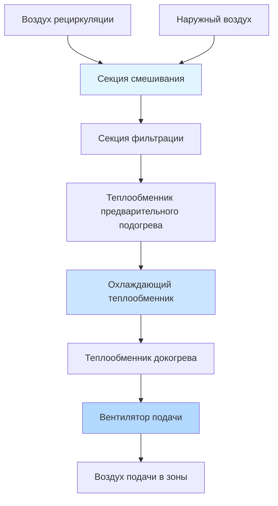
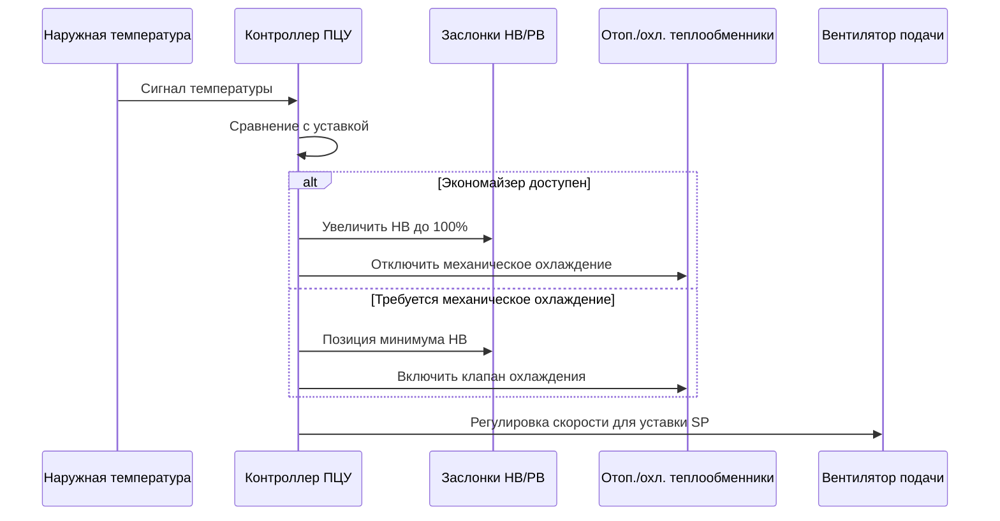

# Системы обработки воздуха

Установки обработки воздуха (АОВ) служат центральным оборудованием обработки в коммерческих HVAC системах, кондиционируя и распределяя воздух в занимаемые помещения. Эти системы интегрируют несколько компонентов—вентиляторы, теплообменники, фильтры, заслонки и средства управления—для достижения точного контроля окружающей среды при одновременной оптимизации энергопотребления.

## Фундаментальные психрометрические процессы

АОВ выполняют термодинамические процессы, которые изменяют свойства воздуха в соответствии с хорошо определёнными психрометрическими соотношениями. Коэффициент явного тепла (SHR) характеризует баланс между изменением температуры и контролем влажности:

$$
SHR = \frac{Q_s}{Q_s + Q_l} = \frac{Q_s}{Q_t}
$$

где $Q_s$ представляет передачу явного тепла (изменение температуры), $Q_l$ представляет передачу скрытого тепла (изменение влажности), а $Q_t$ — общая холодопроизводительность.

### Производительность охлаждающего теплообменника

Процесс охлаждения объединяет удаление явного и скрытого тепла. Точка росы аппарата (ADP) определяет эффективную температуру поверхности, где происходит взаимодействие воздуха и теплообменника:

$$
Q_t = \dot{m} \cdot (h_1 - h_2) = 1.89 \cdot CFM \cdot \Delta h
$$

где $\dot{m}$ — массовый расход, $h$ — энтальпия (кДж/кг), CFM — объёмный расход, а $\Delta h$ — разность энтальпий. Коэффициент обхода характеризует эффективность теплообменника:

$$
BF = \frac{t_{выходящий} - t_{ADP}}{t_{входящий} - t_{ADP}}
$$

Типичные коэффициенты обхода находятся в диапазоне от 0,05 до 0,30, при этом более низкие значения указывают на лучшую производительность теплопередачи.

## Производительность вентилятора и кривые системы

Выбор вентилятора требует согласования производительности оборудования с сопротивлением системы. Законы вентилятора управляют соотношениями производительности при изменениях скорости и диаметра:

**Закон вентилятора 1 (Расход):**
$$
\frac{CFM_2}{CFM_1} = \frac{N_2}{N_1} \cdot \left(\frac{D_2}{D_1}\right)^3
$$

**Закон вентилятора 2 (Давление):**
$$
\frac{SP_2}{SP_1} = \left(\frac{N_2}{N_1}\right)^2 \cdot \left(\frac{D_2}{D_1}\right)^2
$$

**Закон вентилятора 3 (Мощность):**
$$
\frac{BHP_2}{BHP_1} = \left(\frac{N_2}{N_1}\right)^3 \cdot \left(\frac{D_2}{D_1}\right)^5
$$

где $N$ — частота вращения (об/мин), $D$ — диаметр рабочего колеса, $SP$ — статическое давление, а $BHP$ — мощность на валу.

### Кривая сопротивления системы

Кривая системы следует квадратичному соотношению:

$$
SP_{система} = K \cdot CFM^2
$$

Точка операции возникает там, где кривая вентилятора пересекается с кривой системы. Частотные преобразователи (ЧП) обеспечивают эффективную работу при частичной нагрузке путём смещения кривой вентилятора.

## Сравнение конфигураций АОВ

| Конфигурация | Применение | Преимущества | Ограничения |
|--------------|-----------|------------|-----------|
| Вытяжная | Общее коммерческое | Однородная температура выхода, лучшее смешивание | Требует учёта тепла вентилятора |
| Нагнетающая | Системы с высоким статическим давлением | Более высокое доступное давление | Неоднородная скорость потока через теплообменник |
| Многозонная | Одновременное отопление/охлаждение | Управление на уровне зоны | Повышенное энергопотребление, сложное управление |
| Двухканальная | Требуется точный контроль | Отличное управление зоной | Высокая стоимость установки, требует много места |
| Переменный объём воздуха | Современное коммерческое | Энергоэффективность | Требует учёта минимального расхода |

## Проектирование секции фильтрации

Стандарт ASHRAE 52.2 устанавливает рейтинги Minimum Efficiency Reporting Value (MERV) для фильтрации твёрдых частиц. Падение давления на фильтрах увеличивается с накоплением частиц:

$$
\Delta P_{фильтр} = \frac{V^2 \cdot \rho \cdot f \cdot L}{2 \cdot D_h}
$$

где $V$ — скорость потока на входе фильтра (типично 1,5–2,5 м/с), $\rho$ — плотность воздуха, $f$ — коэффициент трения, $L$ — глубина фильтрующего материала, а $D_h$ — гидравлический диаметр.

**Руководство по применению рейтинга MERV:**

| Диапазон MERV | Размер частиц | Типичные применения |
|--------------|---------------|-------------------|
| 1-4 | >10 мкм | Жилые помещения, минимальная фильтрация |
| 5-8 | 3-10 мкм | Коммерческие здания, стандартные |
| 9-12 | 1-3 мкм | Здравоохранение, лаборатории |
| 13-16 | 0,3-1 мкм | Больницы, чистые комнаты |

## Размеры теплообменников отопления и охлаждения

Производительность теплообменника зависит от площади фронта, глубины рядов и температурного перепада теплоносителя. Уравнение передачи тепла:

$$
Q = U \cdot A \cdot LMTD
$$

где $U$ — общий коэффициент теплопередачи (кВт/м²·K), $A$ — площадь фронта теплообменника (м²), а LMTD — логарифмическая средняя разность температур:

$$
LMTD = \frac{(t_{теплоноситель,вход} - t_{воздух,выход}) - (t_{теплоноситель,выход} - t_{воздух,вход})}{\ln\left(\frac{t_{теплоноситель,вход} - t_{воздух,выход}}{t_{теплоноситель,выход} - t_{воздух,вход}}\right)}
$$

Падение давления на стороне воды должно оставаться ниже 45 кПа для типичных гидравлических систем, чтобы избежать избыточного энергопотребления насоса.

## Интеграция рекуперации энергии

Стандарт ASHRAE 90.1 требует рекуперации энергии при превышении наружным воздухом определённых пороговых значений. Эффективность характеризует производительность рекуперации:

$$
\varepsilon_{явная} = \frac{t_{подача} - t_{наружный}}{t_{выхлоп} - t_{наружный}}
$$

$$
\varepsilon_{скрытая} = \frac{W_{подача} - W_{наружный}}{W_{выхлоп} - W_{наружный}}
$$

где $W$ представляет коэффициент влагосодержания (г влаги/кг сухого воздуха).

## Бюджет статического давления

Общее статическое давление системы распределяется по отдельным компонентам:

$$
SP_{общее} = SP_{фильтр} + SP_{теплообменники} + SP_{заслонки} + SP_{воздуховоды} + SP_{диффузоры}
$$

Руководство ASHRAE 36 рекомендует логику обрезки и реагирования для систем VAV, сохраняя минимальное значение уставки статического давления при одновременном избежании одновременного отопления и охлаждения.

## Последовательности управления

Современные АОВ используют прямое цифровое управление (ПЦУ), реализующее последовательности согласно ASHRAE Guideline 36:

1. **Управление температурой смешанного воздуха**: модулировать заслонки наружного/рециркуляционного воздуха для достижения уставки
2. **Последовательность охлаждения**: включить охлаждающий клапан, когда смешанный воздух превышает уставку + мёртвая зона
3. **Последовательность отопления**: включить отопительный клапан, когда воздух подачи падает ниже уставки - мёртвая зона
4. **Управление вентилятором подачи**: поддерживать уставку статического давления в воздуховоде через ЧП
5. **Режим экономайзера**: максимизировать наружный воздух при благоприятных условиях

## Оптимизация производительности

Оптимизация производительности АОВ требует балансирования первоначальной стоимости, эксплуатационной стоимости и надёжности системы. Ключевые стратегии включают:

- **Приводы переменной скорости**: снизить энергию вентилятора пропорционально кубу снижения скорости
- **Теплообменники с низкой скоростью потока**: снизить падение давления, увеличить теплопередачу
- **Вентиляция, управляемая спросом**: снизить наружный воздух на основе занятости
- **Воздушный экономайзер**: использовать бесплатное охлаждение при благоприятных наружных условиях
- **Сброс температуры воздуха подачи**: повысить уставку охлаждения на основе спроса зоны

Правильный выбор и конфигурация АОВ создают основу для эффективной и надёжной работы HVAC системы во всех типах зданий и климатических условиях.
