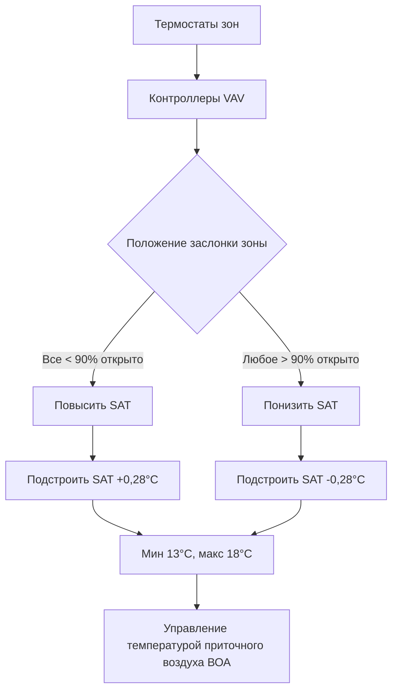

# Центральные системы HVAC

Центральные системы HVAC служат нескольким зонам или всему зданию с единого места расположения оборудования. В отличие от блочных систем, где оборудование обслуживает отдельные помещения, центральные системы распределяют кондиционированный воздух, воду или их комбинацию через сеть воздуховодов и трубопроводов. Такая архитектура обеспечивает экономию масштаба, превосходную эффективность и централизованное управление для средних и крупных зданий.

## Фундаментальная классификация систем

Центральные системы HVAC делятся на три основные категории в зависимости от теплоносителя, доставляющего отопление и охлаждение в занятые помещения.

### Системы с распределением только воздуха

Системы с распределением только воздуха транспортируют тепловую энергию исключительно через воздух. Центральный воздухообрабатывающий аппарат (ВОА) кондиционирует воздух до требуемых температуры и влажности, затем распределяет его по воздуховодам к терминальным устройствам в каждой зоне. Весь нагрев и охлаждающий нагрузка передается через чувствительный и скрытый теплообмен с приточным воздухом.

Энергетический баланс для кондиционируемого помещения, обслуживаемого системой распределения только воздуха, следует:

$$Q_{total} = \dot{m}_{air} \cdot c_p \cdot (T_{supply} - T_{return}) + \dot{m}_{air} \cdot h_{fg} \cdot (W_{supply} - W_{return})$$

Где $Q_{total}$ представляет общую охлаждающую нагрузку (чувствительная плюс скрытая), $\dot{m}_{air}$ — массовый расход воздуха, $c_p$ — удельная теплоемкость при постоянном давлении, $T$ — температура, $h_{fg}$ — скрытая теплота парообразования, а $W$ — влагосодержание.

Основные типы систем распределения только воздуха включают:

- **Однопроводная система с постоянным объемом (САВ)**: Фиксированный расход воздуха с варьирующейся температурой приточного воздуха
- **Однопроводная система с переменным объемом воздуха (VAV)**: Модулирующий расход воздуха при постоянной или переменной температуре приточного воздуха
- **Двухпроводные системы**: Отдельные потоки горячего и холодного воздуха, смешиваемые в терминалах зон
- **Многозонные системы**: Несколько зонных каналов на ВОА с отдельными воздуховодами

### Системы с распределением только воды

Системы с распределением только воды циркулируют охлажденную воду и горячую воду к терминальным устройствам, расположенным в каждой зоне. Фанкойлы, блочные вентиляторы или радиаторы обмениваются тепловой энергией между водой и воздухом помещения. Вентиляционный воздух обычно поступает через выделенные системы наружного воздуха (DOAS) или через инфильтрацию и открываемые окна.

Теплопередача в воздушно-водяном калорифере подчиняется:

$$Q_{coil} = \dot{m}_{water} \cdot c_{p,water} \cdot (T_{entering} - T_{leaving}) = UA \cdot LMTD$$

Где $U$ — общий коэффициент теплопередачи, $A$ — площадь поверхности калорифера, а LMTD представляет логарифмическую среднюю разность температур между потоками воды и воздуха.

Конфигурации систем распределения только воды включают:

- **Двухпроводные системы**: Единственные подающая и обратная трубопроводы, обслуживающие отопление ИЛИ охлаждение
- **Трехпроводные системы**: Отдельные подающие линии горячей и холодной воды с общей обраткой (редко используются из-за потерь при смешивании)
- **Четырехпроводные системы**: Отдельные подающая/обратная линии горячей воды и подающая/обратная линии охлажденной воды, обеспечивающие одновременную доступность отопления и охлаждения

### Системы воздух-вода

Системы воздух-вода объединяют оба метода распределения. Первичный воздух из центрального ВОА обеспечивает вентиляцию и частичное кондиционирование, в то время как вода, распределяемая к терминалам зон, обрабатывает большинство чувствительной нагрузки. Этот подход снижает размер воздуховодов при сохранении превосходного управления качеством воздуха в помещении.

Распространенные типы систем воздух-вода:

- **Индукционные системы**: Высокоскоростной первичный воздух индуцирует циркуляцию воздуха в помещении через водяные калориферы
- **Фанкойлы с DOAS**: Система наружного воздуха для вентиляции, фанкойлы для управления температурой зон
- **Лучистые панели с вентиляционным воздухом**: Гидравлические лучистые поверхности для чувствительных нагрузок, отдельная система вентиляции

## Сравнение производительности систем

Следующая таблица сравнивает ключевые характеристики производительности различных типов центральных систем:

| Тип системы | Энергоэффективность | Управление зоной | Требования к пространству | Первоначальная стоимость | Стоимость эксплуатации | Управление качеством воздуха |
|-------------|-------------------|--------------|-------------------|------------|----------------|-------------|
| VAV с распределением только воздуха | Высокая | Отличное | Высокие (большие воздуховоды) | Средняя | Низкая | Отличное |
| САВ с распределением только воздуха | Средняя | Слабое | Высокие | Низкая | Средняя | Отличное |
| 4-трубная система | Средняя-Высокая | Отличное | Низкие (малые трубопроводы) | Высокая | Средняя | Слабое (без DOAS) |
| 2-трубная система | Низкая-Средняя | Слабое | Низкие | Низкая | Средняя-Высокая | Слабое (без DOAS) |
| Фанкойлы + DOAS | Высокая | Отличное | Средние | Средняя-Высокая | Низкая | Отличное |
| Двухпроводная | Низкая | Отличное | Очень высокие | Средняя | Высокая | Отличное |

## Оборудование центральной установки

Центральные системы требуют существенного механического оборудования, расположенного в выделенных машинных отделениях или на крышах.

### Воздухообрабатывающие аппараты

ВОА служит сердцем систем распределения только воздуха и воздух-вода. Стандартные компоненты включают:

- **Смесительная секция**: Объединяет наружный и рециркуляционный воздух в соответствии с требованиями ASHRAE Standard 62.1 по вентиляции
- **Фильтровальная секция**: Удаляет твердые частицы до MERV 8-16 в зависимости от применения
- **Охлаждающий калорифер**: Охлажденная вода или калорифер с прямым расширением хладагента для чувствительного и скрытого охлаждения
- **Нагревающий калорифер**: Горячая вода, пар или электрическое сопротивление для отопления
- **Приточный вентилятор**: Обеспечивает статическое давление для преодоления сопротивления системы воздуховодов
- **Вытяжной вентилятор**: Поддерживает контроль давления в здании (опционально, требуется для систем >33,900 м³/ч)

Требования мощности вентилятора следуют законам подобия вентиляторов и падению давления в системе:

$$P_{fan} = \frac{\dot{V} \cdot \Delta P_{total}}{\eta_{fan}}$$

Где $\dot{V}$ — объемный расход, $\Delta P_{total}$ — общее статическое давление, а $\eta_{fan}$ — эффективность вентилятора.

### Охлаждающие установки

Центральные охлаждающие установки обычно работают с температурой подачи 6,7°C и температурой обратки 12,2-13,3°C, обеспечивая разность температур 5,6-6,7°C. Охлаждающая установка включает:

- **Холодильные машины**: Водяные центробежные, винтовые или абсорбционные установки (COP 5-10)
- **Градирни**: Отводят теплоту конденсатора в атмосферу посредством испарительного охлаждения
- **Насосы охлажденной воды**: Конфигурации первичного, вторичного или переменного первичного расхода
- **Насосы конденсаторной воды**: Циркулируют воду между конденсаторами холодильных машин и градирнями

Эффективность холодильной машины, выраженная как кВт/кВт охлаждения, связана с коэффициентом эффективности:

$$COP = \frac{3,517}{kW/kW}$$

Современные водяные центробежные холодильные машины достигают 0,45-0,65 кВт/кВт при условиях AHRI, что эквивалентно COP 5,4-7,8.

### Отопительные установки

Центральные отопительные установки подают горячую воду (49-82°C) или пар (14-104 кПа) к терминальным устройствам и нагревающим калориферам ВОА. Распространенные источники тепла включают:

- **Газовые котлы**: 80-95% тепловой КПД
- **Электрические котлы**: 100% КПД по входу, но выше стоимость эксплуатации
- **Холодильные машины с рекуперацией тепла**: Извлекают тепло из конденсатора холодильной машины для одновременного отопления
- **Комбинированное производство тепла и электроэнергии (CHP)**: Генерируют электроэнергию с рекуперацией отходящего тепла

## Проектирование распределительной системы

### Распределение воздушного потока

Системы воздуховодов должны доставлять проектный расход воздуха к каждому терминалу с приемлемыми уровнями шума и балансом давления. Потеря давления трения согласно ASHRAE Fundamentals Глава 21 следует уравнению Дарси-Вейсбаха:

$$\Delta P_f = f \cdot \frac{L}{D} \cdot \frac{\rho V^2}{2}$$

Где $f$ — коэффициент трения, $L$ — длина воздуховода, $D$ — гидравлический диаметр, $\rho$ — плотность воздуха, а $V$ — скорость воздуха.

Метод равного трения определяет размер воздуховодов для поддержания 0,02-0,04 кПа на 30 м, ограничивая скорость, чтобы предотвратить избыточный шум:

- Основные воздуховоды: 6,1-12,7 м/с
- Ответвления воздуховодов: 4,1-7,6 м/с
- Соединения терминалов: 2,5-4,1 м/с

### Гидравлическое распределение

Системы с водой транспортируют тепловую энергию намного эффективнее, чем воздух, благодаря превосходной объемной теплоемкости воды (в 3000 раз больше, чем у воздуха). Это обеспечивает меньшую распределительную инфраструктуру.

Падение давления в трубопроводной системе следует аналогичным принципам воздуха, с уравнением Хазена-Вильямса, обычно используемым для воды:

$$\Delta P = 4,52 \cdot \frac{L}{C^{1,85} \cdot D^{4,87}} \cdot Q^{1,85}$$

Где $C$ — коэффициент шероховатости (обычно 100-150 для стали/меди), а $Q$ — расход в л/мин.

Требования к напору насоса учитывают трение трубопроводов, падение давления в калорифере, авторитет регулирующего клапана и перепады высоты:

$$H_{pump} = \Delta P_{piping} + \Delta P_{coils} + \Delta P_{valve} + \Delta P_{elevation}$$

## Стратегии и последовательности управления

Управление центральной системой координирует работу оборудования для поддержания комфортных условий при минимизации энергопотребления.

### Управление системой с переменным объемом воздуха

Системы VAV модулируют расход воздуха в каждую зону на основе тепловой нагрузки. Температура приточного воздуха переустанавливается на основе зоны, требующей максимального охлаждения:

Эта стратегия переустановки снижает потребление энергии перегрева и нагрузку на холодильную машину в мягкую погоду.

### Переустановка температуры охлажденной воды

Температура подачи охлажденной воды переустанавливается вверх по мере уменьшения охлаждающей нагрузки, повышая эффективность холодильной машины. Расписание переустановки обычно следует:

$$T_{CHW,supply} = T_{design} + K \cdot (T_{outdoor,design} - T_{outdoor,actual})$$

Где $K$ варьируется от 0,1 до 0,3 в зависимости от характеристик системы. Типичный диапазон: 5,6-10°C.

Более высокие температуры охлажденной воды увеличивают COP холодильной машины за счет снижения подъема (разность температур между испарителем и конденсатором).

## Зонирование и разнообразие нагрузок

Центральные системы обслуживают несколько зон с различными профилями нагрузки. Правильное зонирование группирует помещения с аналогичными:

- Схемы тепловой нагрузки (ограждающая конструкция vs. внутренние помещения)
- Графики занятости (офис vs. переговорные комнаты)
- Требования технологического процесса (серверные vs. общий офис)
- Ориентация (северная vs. южная ориентация)

Емкость системы выигрывает от коэффициента разнообразия:

$$\text{Коэффициент разнообразия} = \frac{\text{Сумма пиковых нагрузок отдельных зон}}{\text{Совпадающий пиковый объем системы}}$$

Типичные коэффициенты разнообразия варьируются от 1,15 до 1,35, позволяя уменьшить размер центрального оборудования по сравнению с суммой пиков зон.

## Рассмотрения энергоэффективности

Эффективность центральной системы вытекает из:

1. **Эффективность оборудования**: Высокоэффективные холодильные машины, котлы, вентиляторы и насосы согласно ASHRAE Standard 90.1
2. **Эффективность распределения**: Минимизированные падения давления, сокращенные расстояния транспорта, надлежащая изоляция
3. **Оптимизация управления**: Оптимальный старт/остановка, работа экономайзера, управление спросом вентиляции
4. **Рекуперация тепла**: Рекуперация энергии воздух-воздух, экономайзеры со стороны воды, использование отходящего тепла

ASHRAE Standard 90.1 предусматривает минимальные эффективности оборудования и предписанные требования управления для центральных систем, включая:

- Пределы мощности вентилятора VAV: 1,2-1,4 Вт на м³/ч в зависимости от класса давления системы
- Минимальная производительность IPLV холодильной машины (интегрированное значение частичной нагрузки)
- Работа экономайзера, когда условия наружного воздуха обеспечивают свободное охлаждение
- Рекуперация энергии, когда наружный воздух превышает 70% приточного воздуха (в зависимости от климата)

## Критерии выбора системы

Оптимальный тип центральной системы зависит от специфических факторов проекта:

- **Размер и планировка здания**: Крупные этажи благоприятны для систем распределения только воздуха, вертикальные здания подходят для систем распределения только воды
- **Доступность пространства**: Ограничения машинного отделения и шахт
- **Характеристики нагрузки**: Высокие требования вентиляции благоприятны для систем распределения только воздуха, высокие чувствительные нагрузки подходят для гидравлических систем
- **Операционная гибкость**: Будущие изменения арендатора благоприятны для адаптируемых систем
- **Первоначальная стоимость vs. стоимость жизненного цикла**: Ограничения капитального бюджета vs. долгосрочные стоимости эксплуатации
- **Возможности технического обслуживания**: Опыт внутреннего персонала и доступ к оборудованию
- **Требования к акустике**: Критические помещения требуют систем с низкой скоростью и звукоподавления

Центральные системы превосходны в зданиях, превышающих 4,645 м², где преимущества централизованного оборудования компенсируют более высокие затраты на распределение. Превосходная эффективность, прецизионное управление и долговечность оборудования оправдывают первоначальные инвестиции в большинстве коммерческих, учебных и промышленных применений.
