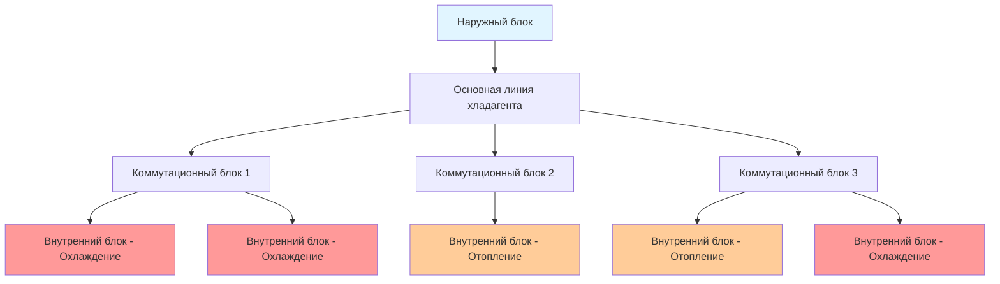
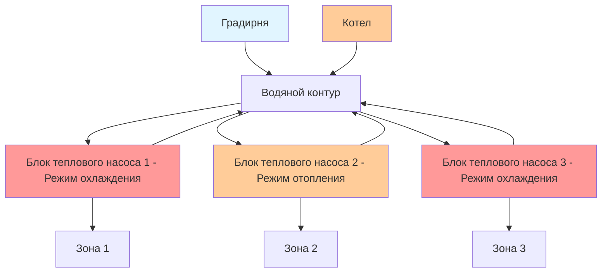
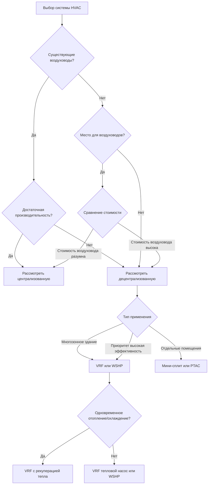

# Децентрализованные системы HVAC

Децентрализованные системы HVAC распределяют мощность отопления и охлаждения по всему зданию, используя несколько независимых или полунезависимых устройств вместо централизованных воздухообрабатывающих установок и обширной сети воздуховодов. Такая архитектура предлагает преимущества в управлении зонами, гибкость установки, энергоэффективность благодаря рекуперации тепла и снижение потерь при распределении. Применение варьируется от жилых модернизаций до крупных коммерческих зданий, где разнообразные тепловые зоны требуют независимого управления.

## Основные принципы

Децентрализованные системы исключают или минимизируют центральное распределение воздуха, размещая холодильное оборудование ближе к кондиционируемым помещениям. Передача тепла происходит через более короткие линии хладагента, гидравлические трубопроводы или минимальные воздуховоды, снижая энергию вентилятора и тепловые потери, присущие длинным воздуховодам.

**Ключевые характеристики:**

- Независимое управление зонами с отдельными термостатами
- Сокращенные или исключенные воздуховоды
- Несколько наружных блоков или распределенный отвод тепла
- Прямое расширение хладагента в занятые зоны
- Возможность одновременного отопления и охлаждения в многозонных конфигурациях

Тепловая эффективность децентрализованных систем вытекает из минимизации потерь при распределении. Централизованные системы обычно теряют 15-30% энергии отопления и охлаждения через утечки воздуховодов, теплопередачу через стенки воздуховодов и тепло вентилятора. Децентрализованные системы снижают эти потери до 5-10% благодаря более коротким линиям хладагента и минимальному распределению воздуха.

## Типы систем и конфигурации

### Системы с переменным расходом хладагента (VRF)

Системы VRF представляют наиболее совершенную архитектуру децентрализации, используя хладагент в качестве теплоносителя с электронными расширительными вентилями, управляющими потоком в несколько внутренних блоков.

**Принцип работы:**

Система VRF регулирует расход хладагента в соответствии с мгновенными нагрузками зоны посредством компрессоров с инвертором и электронных расширительных вентилей. Наружный блок изменяет производительность от 10-130% от номинального значения, в то время как внутренние блоки работают при 8-100% производительности на основе локальных требований термостата.

**VRF с рекуперацией тепла:**

Трёхтрубные системы рекуперации тепла позволяют одновременное отопление и охлаждение, передавая тепло из охлаждаемых зон в отапливаемые. Коммутационный блок (BS) у каждого внутреннего блока определяет, будет ли устройство работать в режиме отопления или охлаждения, направляя хладагент соответственно.

Энергетический баланс для работы с рекуперацией тепла:

$$
Q_{heating} = Q_{cooling} + W_{compressor} - Q_{losses}
$$

Где:
- $Q_{heating}$ = общая подаваемая мощность отопления (кДж/ч)
- $Q_{cooling}$ = общая мощность охлаждения из охлаждаемых зон (кДж/ч)
- $W_{compressor}$ = входная мощность компрессора (кДж/ч)
- $Q_{losses}$ = потери тепла системы (кДж/ч)

Эффективность рекуперации тепла достигает 60-80% при сбалансированности нагрузок отопления и охлаждения, значительно снижая чистое потребление энергии по сравнению с обычными системами.

**Характеристики производительности:**

| Параметр | VRF тепловой насос | VRF с рекуперацией тепла | Единицы |
|-----------|-------------------|----------------------|---------|
| EER охлаждения | 14-20 | 14-19 | кДж/Вт·ч |
| COP отопления | 3,5-4,8 | 3,8-5,2 | — |
| Диапазон модуляции | 10-130% | 10-130% | % номинального |
| Расстояние трубопровода | 152-305 | 152-305 | м |
| Разница высот | 50-110 | 50-110 | м |
| Внутренних блоков на наружный | 3-64 | 3-64 | блоков |

### Бесканальные мини-сплит системы

Мини-сплит системы состоят из одного наружного конденсационного блока, обслуживающего 1-8 внутренних воздухообрабатывающих установок через линии хладагента. Однозонные мини-сплиты обеспечивают управление отдельными комнатами, в то время как многозонные системы подключают несколько внутренних блоков к одному наружному блоку.

**Управление производительностью:**

Компрессоры с инвертором модулируют производительность в соответствии с нагрузками, обеспечивая более точное управление температурой, чем системы с фиксированной производительностью. Частота компрессора варьируется от 15-130 Гц, что соответствует диапазону производительности 30-120% от номинального значения.

Установившаяся производительность охлаждения как функция условий работы:

$$
Q_{cooling} = Q_{rated} \times CF_{temp} \times CF_{altitude}
$$

Где:
- $Q_{rated}$ = номинальная производительность при условиях AHRI (кДж/ч)
- $CF_{temp}$ = коэффициент коррекции по температуре (безразмерный)
- $CF_{altitude}$ = коэффициент коррекции по высоте (безразмерный)

При охлаждении при температуре наружного воздуха 35°C: $CF_{temp}$ = 0,90-1,00
При отоплении при температуре наружного воздуха 8°C: $CF_{temp}$ = 0,95-1,05

**Особенности установки:**

- Линии хладагента: 4,5-15 м типично, максимум 30-50 м в зависимости от модели
- Разница высот: максимум 4,5-15 м между внутренним и наружным блоками
- Изоляция трубопровода: минимум RSI 0,70 для линии всасывания, RSI 0,53 для жидкостной линии
- Дренаж конденсата: гравитационный или с насосом, минимальный уклон 1:12
- Расположение наружного блока: минимальные зазоры согласно спецификациям производителя

### Мобильные терминальные блоки

Мобильные терминальные кондиционеры (PTAC) и тепловые насосы (PTHP) интегрируют все холодильные компоненты в одном корпусе, установленном сквозь наружную стену. Распространены в отелях, общежитиях и жилых помещениях, где требуются управление отдельными комнатами и простота установки.

**Конфигурация:**

**Энергетические показатели:**

Эффективность PTAC ниже, чем у раздельных систем из-за ограничений компактного теплообменника и компрессоров с фиксированной скоростью. Стандарт ASHRAE 90.1 устанавливает минимальные требования к эффективности:

| Производительность (кДж/ч) | EER охлаждения | COP отопления (тепловой насос) |
|-----------------------|-------------|--------------------------|
| <20 500 | 11,9 | 3,2 |
| 20 500-44 000 | 11,3 | 3,2 |
| >44 000 | 10,0 | 2,9 |

Современные высокоэффективные PTAC с компрессорами-инверторами достигают EER 13-15 и COP 3,5-4,2, снижая потребление энергии на 20-35% по сравнению с единицами минимальной эффективности.

### Тепловые насосы с водяным источником

Системы тепловых насосов с водяным источником (WSHP) используют воду в качестве среды отвода и поглощения тепла, с отдельными тепловыми насосами, обслуживающими каждую зону. Центральный водяной контур (обычно 15-32°C) соединяет все устройства, при этом котел и охладитель поддерживают температуру контура.

**Схема системы:**

**Работа с рекуперацией тепла:**

При одновременном отоплении и охлаждении устройства в режиме охлаждения отводят тепло в водяной контур, в то время как устройства в режиме отопления поглощают тепло из контура. Эта внутренняя передача тепла снижает работу котла и градирни.

Чистый ввод энергии в контур:

$$
Q_{loop} = \sum Q_{cooling} - \sum Q_{heating} + \sum W_{compressor} \pm Q_{aux}
$$

Где:
- $Q_{loop}$ = чистое тепло в/из контура (кДж/ч)
- $\sum Q_{cooling}$ = общий отвод тепла из охлаждающих устройств (кДж/ч)
- $\sum Q_{heating}$ = общее поглощение тепла отапливающими устройствами (кДж/ч)
- $\sum W_{compressor}$ = общая мощность компрессора (кДж/ч)
- $Q_{aux}$ = вспомогательное отопление или охлаждение для поддержания температуры контура (кДж/ч)

Если $Q_{loop} > 0$, работает градирня; если $Q_{loop} < 0$, работает котел.

**Характеристики производительности:**

| Параметр | Значение | Примечания |
|-----------|---------|-----------|
| EER охлаждения (при 30°C EWT) | 11-17 | Выше при более низких температурах воды |
| COP отопления (при 20°C EWT) | 3,5-4,8 | Выше при более высоких температурах воды |
| Температура водяного контура | 15-32°C | Оптимальная 21-27°C для сбалансированной работы |
| Расход воды | 0,76-1,14 л/ч на кВт | На блок теплового насоса |
| Падение давления контура | 3-7,6 м | Зависит от разводки трубопровода |

## Сравнение с централизованными системами

Децентрализованные и централизованные системы представляют отличные преимущества в зависимости от применения, характеристик здания и требований к эксплуатации.

### Таблица сравнения производительности

| Критерий | Децентрализованная (VRF/Мини-сплит) | Централизованная (VAV/CAV) |
|-----------|--------------------------------------|---------------------------|
| Управление зонами | Отличное - отдельные термостаты | Хорошее - требует нескольких зон |
| Энергоэффективность | Высокая - снижены потери распределения | Средняя - значительные потери воздуховодов |
| Производительность при неполной нагрузке | Отличная - модуляция инвертором | Хорошая - требует правильного проектирования VAV |
| Рекуперация тепла | Отличная - внутренняя передача тепла | Справедливая - требует отдельного оборудования |
| Начальные затраты | Средние-высокие | Средние |
| Сложность установки | Низкая - минимум воздуховодов | Высокая - обширное распределение воздуховодов |
| Доступ при обслуживании | Распределенный - локальный доступ | Централизованный - доступ в механическое помещение |
| Фильтрация воздуха | Ограниченная - только фильтры блоков | Отличная - центральная фильтрация |
| Интеграция вентиляции | Сложная - требует отдельной системы | Простая - интегрирована с воздухообрабатывающей установкой |
| Акустические характеристики | Справедливые - расположение блоков имеет значение | Отличные - удаленное оборудование |

### Анализ потребления энергии

Годовое потребление энергии зависит от климата, нагрузок здания и графиков эксплуатации. Следующее сравнение предполагает здание офиса площадью 930 м² в смешанном климате (2778 HDD, 556 CDD):

| Тип системы | Годовое охлаждение (кВт·ч) | Годовое отопление (кВт·ч) | Энергия вентилятора (кВт·ч) | Всего (кВт·ч) | EUI (кДж/м²·год) |
|-------------|------------------------|----------------------|----------------------|------------|-----------------|
| VRF с рекуперацией тепла | 5,250 | 6,200 | 990 | 12,440 | 533 |
| Мини-сплит многозонный | 5,440 | 6,930 | 1,190 | 13,560 | 581 |
| WSHP с контуром | 5,890 | 6,730 | 1,560 | 14,180 | 608 |
| VAV с докритическим отопом | 6,260 | 8,100 | 2,520 | 16,880 | 721 |
| PTAC (стандартная эффективность) | 7,510 | 9,300 | Включено | 16,810 | 719 |

Энергосбережение 20-35% типично для систем VRF по сравнению с обычными системами VAV, в основном за счет снижения энергии вентилятора, рекуперации тепла и повышения эффективности при неполной нагрузке.

## Рассмотрения проектирования

### Проектирование трубопроводов хладагента

Надлежащая разводка хладагента обеспечивает адекватный возврат масла, предотвращает гидравлические удары и поддерживает эффективность системы.

**Критические параметры:**

- **Эквивалентная длина**: Сумма фактической длины плюс эквиваленты фитингов/высоты. Максимум варьируется по системе: 152-305 м для VRF, 30-50 м для мини-сплитов.
- **Вертикальные стояки**: Скорость в линии всасывания должна превышать минимум для уноса масла. Минимальная скорость обычно 5,08 м/с для систем R-410A.
- **Падение давления**: Ограничить 7-14 кПа эквивалента для поддержания производительности. Чрезмерное падение снижает эффективность и производительность системы.
- **Размер трубопровода**: Следуйте спецификациям производителя на основе производительности, длины и типа хладагента.

Требование скорости возврата масла:

$$
V_{min} = \sqrt{\frac{2 \times g \times \rho_L \times (\rho_L - \rho_V)}{\rho_V \times f}}
$$

Где:
- $V_{min}$ = минимальная скорость для уноса масла (м/мин)
- $g$ = ускорение свободного падения (9,81 м/с²)
- $\rho_L$ = плотность жидкости (кг/м³)
- $\rho_V$ = плотность пара (кг/м³)
- $f$ = коэффициент трения (безразмерный)

### Стратегии управления

Децентрализованные системы требуют координации между несколькими независимыми устройствами для оптимизации производительности всего здания.

**Подходы к управлению:**

1. **Управление отдельными зонами**: Каждое устройство работает на основе локального термостата без связи между устройствами. Просто, но может привести к одновременному отоплению/охлаждению в соседних зонах.

2. **Централизованное надзорное управление**: Система управления зданием отслеживает все устройства, реализуя стратегии такие как:
   - Ограничения заданных значений температуры зоны
   - Ограничение спроса в периоды пиковых нагрузок
   - Плановые снижения температуры в непредставленные часы
   - Оптимизация рекуперации тепла в системах VRF

3. **Распределенный интеллект**: Устройства обмениваются данными по сети, обмениваясь информацией для оптимизации общей производительности. Продвинутые системы VRF используют этот подход для максимизации рекуперации тепла и балансировки распределения производительности.

### Требования к вентиляции

Децентрализованные системы кондиционируют рециркулируемый воздух зон, но обычно не обеспечивают вентиляцию наружным воздухом. Стандарт ASHRAE 62.1 предусматривает минимальные нормы наружного воздуха на основе занятости и типа помещения.

**Варианты интеграции:**

- **Системы выделенного наружного воздуха (DOAS)**: Отдельная система подает 100% наружный воздух в каждую зону. Устройство DOAS предварительно подготавливает наружный воздух до нейтральных или слегка прохладных условий, при этом децентрализованная система обрабатывает оставшиеся чувствительные и скрытые нагрузки.

- **Вентилирующие внутренние блоки**: Специальные модели VRF и мини-сплитов включают соединения наружного воздуха с заслонками. Производительность обычно ограничена 10-30% от общего расхода воздуха.

- **Естественная вентиляция**: Откидывающиеся окна обеспечивают вентиляцию при благоприятных погодных условиях. Требует управления для отключения механического охлаждения при открытых окнах.

- **Блоки ERV/HRV**: Небольшие вентиляторы рекуперации энергии служат отдельным зонам или группам зон, восстанавливая энергию из вытяжного воздуха.

## Применение и критерии выбора

### Оптимальные применения децентрализованных систем

**Гостиницы и общежития:**
- Управление отдельными номерами и выставление счетов
- Разнообразные графики занятости
- Простая установка через наружные стены (PTAC)
- Минимум доступа персонала обслуживания в помещения гостей

**Офисные здания:**
- Разнообразные тепловые зоны (периметр vs. внутренние помещения, переменная занятость)
- Площади арендаторов, требующие отдельного учета
- Проекты реновации, где воздуховоды непрактичны
- Здания с высокой разнородностью охлаждения к отоплению для рекуперации тепла

**Розничные помещения:**
- Длительные часы работы, выгодные для высокоэффективного оборудования
- Освещение дисплеев, создающее локализованные охлаждающие нагрузки
- Гибкие разметки, требующие управления зоной за зоной

**Жилые помещения:**
- Отдельные дома без существующих воздуховодов
- Многоквартирные здания, требующие управления блоком за блоком
- Пристройки, где расширение центральной системы непрактично

### Граница выбора системы

**Критерии выбора:**

- Тип здания и режимы занятости
- Существующая инфраструктура (воздуховоды, трубопровод, электрическая мощность)
- Бюджетные ограничения (начальная стоимость vs. операционная стоимость)
- Способность обслуживания
- Требования к вентиляции и подход интеграции
- Акустические требования для занятых помещений
- Климат и сезонные профили нагрузки
- Будущая гибкость и потребности расширения

## Заключение

Децентрализованные системы HVAC обеспечивают эффективное и гибкое кондиционирование путем распределения оборудования по всему зданию и минимизации потерь при тепловом распределении. Системы VRF с рекуперацией тепла предлагают наивысшую эффективность для зданий с одновременными нагрузками отопления и охлаждения, в то время как мини-сплиты превосходны в жилых и легких коммерческих применениях, где требуется управление отдельными зонами. Системы тепловых насосов с водяным источником уравновешивают простоту центрального контура с распределенным управлением зонами. Надлежащее проектирование требует тщательного рассмотрения ограничений трубопроводов хладагента, интеграции вентиляции, стратегий управления и требований, специфических для применения. При надлежащем проектировании децентрализованные системы обеспечивают 20-35% энергосбережение по сравнению с обычными централизованными системами, при этом обеспечивая превосходное управление зонами и гибкость установки.
