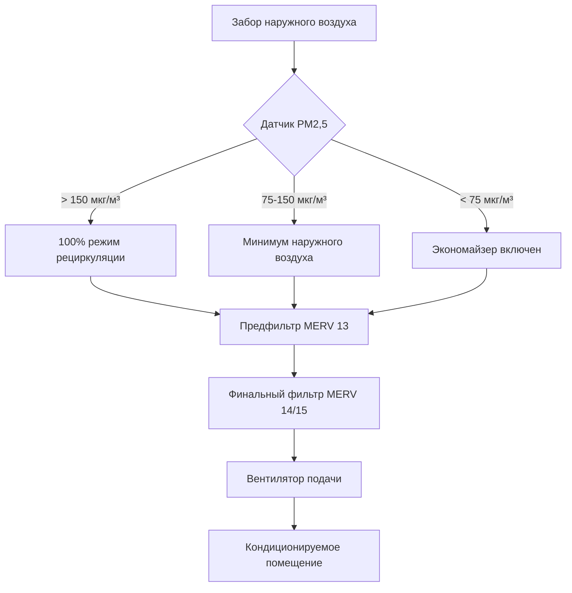
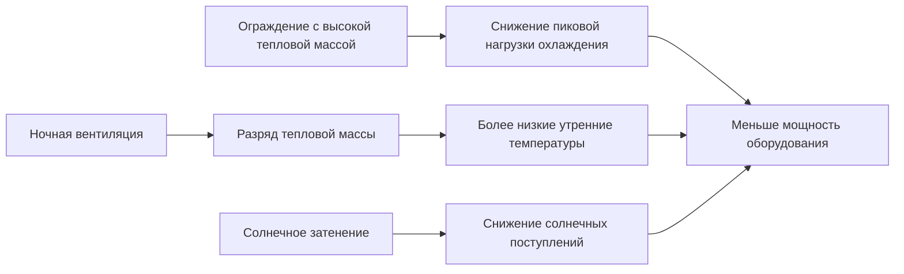

## Обзор азиатской практики проектирования HVAC

Азиатские стандарты HVAC отражают разнообразные климатические зоны, охватывающие арктические условия в северных регионах и тропическую среду вблизи экватора. Методологии проектирования объединяют традиционные западные стандарты с региональными адаптациями, решающими проблемы управления влажностью, устойчивости к тайфунам, сейсмических соображений и экстремальных проблем качества воздуха.

## Основные региональные организации по стандартизации

Азиатская практика HVAC регулируется несколькими национальными и региональными организациями, которые устанавливают критерии проектирования, протоколы тестирования и показатели эффективности, отличающиеся от стандартов ASHRAE.

### Первичные организации по стандартизации

| Организация | Регион | Основное направление | Международное соответствие |
|-------------|--------|----------------------|---------------------------|
| **SHASE** | Япония | Стандарты оборудования, сейсмическое проектирование | ISO, частичное ASHRAE |
| **CSSC** | Китай | GB стандарты, качество воздуха | ISO, региональные стандарты |
| **SAREK** | Южная Корея | Энергоэффективность, DDC системы | ISO, гибрид ASHRAE |
| **SIRIM** | Малайзия | HVAC тропического климата | MS стандарты, ISO |
| **ISHRAE** | Индия | Региональная адаптация климата | ASHRAE с модификациями |
| **TASEC** | Таиланд | Стандарты контроля влажности | Гармонизация АСЕАН |

## Климатические соображения при проектировании

Азиатские регионы требуют специализированных подходов HVAC из-за экстремального климатического разнообразия и факторов плотности населения.

### Требования к управлению влажностью

Регионы с высокой влажностью в Юго-Восточной Азии требуют управления скрытой нагрузкой, значительно превышающей типичные параметры проектирования ASHRAE. Коэффициент чувствительного тепла (SHR) становится критическим параметром проектирования:

$$\text{SHR} = \frac{Q_{\text{sensible}}}{Q_{\text{total}}} = \frac{Q_{\text{sensible}}}{Q_{\text{sensible}} + Q_{\text{latent}}}$$

Типичные значения SHR по регионам:

- **Умеренная Азия** (Япония, Корея): SHR = 0,75-0,85
- **Субтропическая Азия** (Южный Китай): SHR = 0,65-0,75
- **Тропическая Азия** (Юго-Восточная Азия): SHR = 0,55-0,70

Разница энтальпии определяет общие требования охлаждения:

$$Q_{\text{total}} = \dot{m}_{\text{air}} \times (h_{\text{outdoor}} - h_{\text{indoor}})$$

где значения энтальпии часто превышают 90 кДж/кг в тропических прибрежных городах в сезон муссонов.

### Интеграция качества воздуха

Азиатские стандарты все чаще требуют фильтрации дисперсных частиц (PM2,5, PM10) сверх спецификаций ASHRAE 52.2 из-за промышленных выбросов и пыльных бурь. Китайские стандарты GB требуют:

- **Минимальная эффективность фильтрации**: MERV 13 (85% для частиц размером 1-3 мкм)
- **PM2,5 подаваемого воздуха**: < 35 мкг/м³ для занятых помещений
- **Мониторинг наружного воздуха**: Непрерывный с автоматическим отключением экономайзера

## Показатели энергоэффективности

Азиатские рынки применяют разнообразные системы рейтинга эффективности, отличающиеся от требований ASHRAE Standard 90.1 и IECC.

### Сравнительные стандарты эффективности

**Метрики оборудования охлаждения:**

| Регион | Метрика | Типичное требование | Эквивалент ASHRAE |
|--------|---------|---------------------|-------------------|
| Китай | GB 19577 | EER ≥ 3,2 (Вт/Вт) | ~10,9 кДж/Втч |
| Япония | JIS C 9612 | APF ≥ 5,8 | Коэффициент годовой производительности |
| Корея | KEP | CSPF ≥ 4,5 | Сезонная производительность охлаждения |
| Индия | BEE Star Rating | ISEER ≥ 3,5-5,0 | Индийский сезонный EER |
| Сингапур | SS 530 | COP ≥ 3,0 | Стандартный COP на полной нагрузке |

Связь между входной мощностью и охлаждающей способностью следует:

$$\text{COP} = \frac{Q_{\text{cooling}}}{W_{\text{input}}} = \frac{\dot{m}_{\text{ref}} \times (h_1 - h_4)}{W_{\text{comp}}}$$

где индексы обозначают точки состояния цикла охлаждения в цикле компрессии пара.

## Требования к сейсмическому и противотайфунному проектированию

Японские и юго-восточноазиатские стандарты требуют структурной устойчивости, превышающей типичные приложения ASHRAE.

### Расчеты сейсмического крепления

Сейсмическая сила оборудования следует:

$$F_p = 0,4 \times a_p \times S_{DS} \times W_p \times \left(\frac{1 + 2\frac{z}{h}}{R_p/I_p}\right)$$

где:
- $a_p$ = коэффициент амплификации компонента (2,5 для механического оборудования)
- $S_{DS}$ = проектное спектральное ускорение отклика (до 1,5g в Японии)
- $W_p$ = рабочая масса компонента
- $z/h$ = коэффициент высоты в конструкции
- $R_p$ = коэффициент модификации отклика компонента
- $I_p$ = коэффициент важности компонента

Японский закон о строительных стандартах требует сейсмического крепления всего оборудования HVAC > 50 кг для 1,5-кратного проектного ускорения здания.

### Ветровая нагрузка от тайфунов

Прибрежные азиатские установки должны выдерживать ветровые давления, рассчитанные согласно региональным картам скорости ветра:

$$P = 0,00256 \times K_z \times K_{zt} \times K_d \times V^2 \times I$$

Проектные скорости ветра достигают 280 км/ч для регионов, подверженных супертайфунам, требуя усиленного крепления оборудования и конструкций защитных жалюзи.

## Проблемы отвода теплоты

Высокие температуры влажного термометра в Азии значительно снижают производительность градирен и конденсаторов с воздушным охлаждением ниже условий проектирования ASHRAE.

### Регулировки проектирования градирни

Температура подхода градирни увеличивается с повышением влажности окружающего воздуха:

$$\text{Approach} = T_{\text{CW,out}} - T_{\text{wb,ambient}}$$

Проектные температуры влажного термометра по регионам:

- **Гонконг**: 28,5°C 0,4% проектирования
- **Сингапур**: 27,8°C среднегодовая температура
- **Бангкок**: 28,0°C 0,4% проектирования
- **Мумбаи**: 28,2°C пик муссона

Эти условия требуют увеличенных градирен (на 15-25% больше базовой линии ASHRAE 90.1) или дополнительного испарительного предварительного охлаждения.

## Интеграция строительного ограждения

Азиатские стандарты уделяют особое внимание тепловой массе и интеграции естественной вентиляции, отсутствующей во многих западных протоколах проектирования.

Корейские и японские стандарты учитывают эффекты тепловой массы, используя:

$$Q_{\text{adjusted}} = Q_{\text{peak}} \times \left(1 - 0,15 \times \frac{M}{A}\right)$$

где $M/A$ представляет массу на единицу площади (кг/м²) для конструкции с высокой массой.

## Нормативы хладагентов

Азиатские рынки переходят на хладагенты с низким потенциалом глобального потепления с разными темпами, при этом Япония и Корея лидируют в внедрении R-32 и R-454B, тогда как другие регионы продолжают использовать R-410A.

### Региональные предпочтения хладагентов

- **Япония**: R-32 доминирует для сплит-систем/VRF (GWP = 675)
- **Китай**: Сокращение R-410A начиная с 2024 года, переход на R-32
- **Индия**: R-32 и R-290 (пропан) для систем меньшего размера
- **Юго-Восточная Азия**: Смешанное R-410A/R-32 с медленным переходом

Преимущество термодинамической эффективности R-32 вытекает из его объемной емкости:

$$\frac{Q_{\text{R-32}}}{Q_{\text{R-410A}}} \approx 1,05 \text{ (на 5% выше емкость на единицу объема)}$$

## Заключение

Азиатские стандарты HVAC отражают приоритеты, управляемые климатом, включая управление экстремальной влажностью, фильтрацию качества воздуха, сейсмическую устойчивость и приложения в городах с высокой плотностью. Инженеры-практики должны ориентироваться в разнообразных национальных стандартах при решении требований производительности, часто превышающих критерии базовой линии на Западе. Понимание региональных методологий расчета, показателей эффективности и требований к конструкции является необходимым условием для успешного проектирования систем на азиатских рынках.
